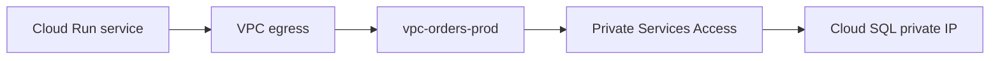

## Table of Contents

1. [The Problem](#the-problem)
2. [Managed Service Boundary](#managed-service-boundary)
3. [Cloud SQL Private IP](#cloud-sql-private-ip)
4. [Private Services Access](#private-services-access)
5. [Private Google Access](#private-google-access)
6. [Private Service Connect](#private-service-connect)
7. [DNS](#dns)
8. [IAM Still Applies](#iam-still-applies)
9. [Review Shape](#review-shape)
10. [Putting It All Together](#putting-it-all-together)

## The Problem

The Orders API is ready to use managed services. The team wants Cloud SQL for relational data, Cloud Storage for receipts, Secret Manager for sensitive values, and Cloud Logging for evidence. They also want private networking, so they say, "put the managed services in the VPC."

That sentence is understandable, but it is too simple.

- Cloud SQL can have a private IP, but the connection depends on a supported private service path.
- Google APIs such as Secret Manager and Cloud Storage are API services, not VMs in your subnet.
- Private Google Access, Private Services Access, and Private Service Connect sound similar but solve different access problems.
- A private network path does not grant permission to read a secret or query a database.

Private access is about how a workload reaches a managed service without pretending that every managed service is just another VM in your subnet.

## Managed Service Boundary

Managed services live behind a provider boundary. Google operates the service. You consume it through an API, endpoint, private address, or service attachment. Sometimes you see a private IP. Sometimes you see a DNS name. Sometimes you see an API hostname that resolves differently depending on your access design.

The boundary matters because it changes the review question. For a VM, you ask which subnet and firewall rule protect the network interface. For a managed service, you ask which private access pattern connects your VPC or workload to the service boundary.

| Destination | Good first question |
| --- | --- |
| Cloud SQL private IP | Which VPC and private services access path is attached? |
| Cloud Storage API | How does the workload reach Google APIs, and does IAM allow the call? |
| A producer service through Private Service Connect | Which endpoint or service attachment is being used? |
| Secret Manager | Is the API reachable, and does the runtime identity have permission? |

Private access starts by naming the kind of managed boundary you are crossing.

## Cloud SQL Private IP

Cloud SQL private IP lets clients connect to a database through a private address instead of a public database address. That is a strong design choice for production systems, but it is not magic. The client still needs a path to that private address, and the Cloud SQL instance must be configured for the right network.

For a Cloud Run service, the outbound path might be Direct VPC egress into the same VPC that has the private service connection. For a VM, the VM's subnet and route behavior matter directly. Either way, private IP is a network path plus database-level access, not merely a label on the instance.



If the app times out, start with path and DNS. If the app gets an authentication error from the database, the network path may be fine and the database credential or IAM-related connection setup may be wrong.

## Private Services Access

Private Services Access connects your VPC network to Google or third-party services that are offered through service networking. It uses an allocated private IP range and a private connection so services such as Cloud SQL private IP can be reachable from your VPC.

The allocated range is easy to overlook. It is address space you reserve for the service producer side of the connection. If the range overlaps with something important or is too small for future managed services, you can create a hidden growth problem.

For the Orders system, the review note might say:

```text
vpc: vpc-orders-prod
allocated range: range-orders-services 10.40.0.0/20
private connection: servicenetworking.googleapis.com
used by: Cloud SQL private IP
```

That evidence tells a future teammate why a mysterious reserved range exists. It also makes clear that the Cloud SQL private path depends on more than the app subnet.

## Private Google Access

Private Google Access helps VM instances without external IP addresses reach Google APIs and services through internal IP paths. It is a useful pattern when private VMs need to call services such as Cloud Storage or other Google APIs without using an external VM address.

This is where beginners often overgeneralize. Private Google Access is not the universal answer to every private service call from every runtime. Cloud Run has its own egress controls. Private Service Connect can provide endpoint-style access for selected services. Private Services Access supports private connectivity to services such as Cloud SQL. The right pattern depends on the workload and destination.

Use the name precisely:

| Pattern | Beginner use |
| --- | --- |
| Private Google Access | Private VM instances reaching Google APIs without external IPs |
| Private Services Access | VPC private connection to managed service producer ranges such as Cloud SQL private IP |
| Private Service Connect | Private endpoint/service attachment model for supported services and producers |

The names are similar because they all avoid simple public internet thinking. They are not interchangeable.

## Private Service Connect

Private Service Connect is a service-oriented private connectivity pattern. Instead of treating the destination as a broad network peer, consumers connect privately to a service endpoint or producer service. This can be useful for Google APIs, third-party services, or internal producer-consumer designs depending on the service.

The mental model is a private front door to a service, not a giant shared subnet. The consumer gets an endpoint in its network. The producer exposes a service attachment or Google exposes supported API access. Traffic uses private connectivity while the service boundary remains clear.

This is a good pattern when teams want private access to a service without broad network coupling. It also makes ownership clearer: the consumer owns its endpoint and routing choices; the producer owns the service behind the attachment.

## DNS

Private access often depends on names resolving to the intended private endpoint or API path. If DNS still returns a public address, the packet may leave through a path the team did not intend. If DNS returns a private address but the route or access pattern is missing, the request may time out.

For Cloud SQL and Google APIs, the exact DNS shape depends on the service and access pattern. Do not memorize one universal record. Ask what name the application uses, what address that name resolves to from the workload environment, and which route handles that address.

Useful DNS evidence is short:

```text
caller: Cloud Run revision orders-api-00042
name: database private connection target
resolved path: private service range
route: through vpc-orders-prod egress
```

When private access fails, DNS is often the quiet middle. The app may be calling the right hostname from the wrong network context.

## IAM Still Applies

Private networking does not grant Google Cloud permissions. A workload can reach a Google API endpoint and still receive `PERMISSION_DENIED`. A service account can have the right IAM role and still fail if the network path is missing.

For the Orders API, Secret Manager is the clean example. The runtime service account needs permission to access the secret version. The service also needs a path to the Secret Manager API. If all outbound traffic goes through the VPC, the VPC egress design must support Google API access. If IAM is missing, the best network path in the world still cannot read the secret.

Separate the evidence:

| Evidence | What it proves |
| --- | --- |
| Route and private access config | The workload can reach the service endpoint path |
| DNS result | The name points to the intended private or API endpoint |
| IAM policy | The runtime principal may perform the API action |
| Service logs or error code | The failure shape matches path, auth, quota, or app behavior |

This separation keeps teams from opening networks to fix permission errors.

## Review Shape

A private access review should name the workload, destination, access pattern, DNS behavior, and identity.

```text
workload: devpolaris-orders-api on Cloud Run
runtime identity: orders-api-runtime@orders-prod-123.iam.gserviceaccount.com
egress: Direct VPC egress through subnet-orders-app-us-central1
destination: Cloud SQL orders-prod private IP
private pattern: Private Services Access using range-orders-services
google APIs: Secret Manager and Cloud Storage reachable by approved API path
iam: runtime identity has only required secret and storage permissions
```

That note gives reviewers a complete sentence: this workload reaches this managed service through this private pattern using this identity. If one part changes, the review knows where to look.

## Putting It All Together

Return to the opening problems.

Cloud SQL private IP is a private path, not merely a comforting label. The VPC, private service connection, allocated range, DNS behavior, and workload egress path all matter.

Google APIs are not VMs in your subnet. Private Google Access, Private Service Connect, and normal API paths each fit different workload and destination shapes. Choose the pattern by asking what is calling what.

Similar names are not interchangeable. Private Services Access is the common Cloud SQL private IP pattern. Private Google Access helps private VMs reach Google APIs. Private Service Connect gives endpoint-style private access to supported services.

IAM still applies after the packet has a path. A private route cannot read a secret. A service account role cannot create a missing network path. Good GCP engineers keep both checks visible.

---

**References**

- [Google Cloud: Private services access](https://cloud.google.com/vpc/docs/private-services-access)
- [Google Cloud: Private Google Access](https://cloud.google.com/vpc/docs/private-google-access)
- [Google Cloud: Private Service Connect overview](https://cloud.google.com/vpc/docs/private-service-connect)
- [Google Cloud: Cloud SQL private IP](https://cloud.google.com/sql/docs/mysql/private-ip)
