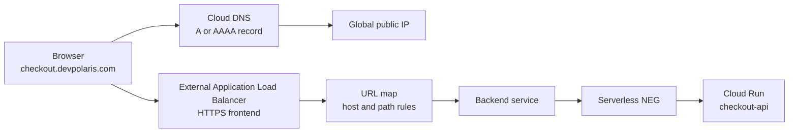

## Table of Contents

1. [The Public Path](#the-public-path)
2. [DNS and the Stable Name](#dns-and-the-stable-name)
3. [Public IPs and HTTPS Certificates](#public-ips-and-https-certificates)
4. [External Application Load Balancers](#external-application-load-balancers)
5. [URL Maps and Backend Services](#url-maps-and-backend-services)
6. [Serverless NEGs for Cloud Run](#serverless-negs-for-cloud-run)
7. [Health, Evidence, and Bypass Protection](#health-evidence-and-bypass-protection)
8. [Putting It All Together](#putting-it-all-together)
9. [What's Next](#whats-next)

## The Public Path
<!-- section-summary: A production public endpoint combines a name, an IP address, TLS, routing policy, and a backend target. -->

Let's say your team has a Cloud Run service called `checkout-api`. The service works. You can open the generated `run.app` URL, send a test request, and see a JSON response. That is a good first checkpoint, but it is still only the runtime endpoint Google Cloud gave to this one service.

A production customer path needs a more stable shape. Users should call `https://checkout.devpolaris.com`, the domain should survive service redeploys, HTTPS should use a trusted certificate, traffic should pass through one public entry layer, and reviewers should have a clear place to see routing, security policy, logs, and backend behavior.

That public entry path usually has five pieces:

| Piece | Simple definition | Production job |
|---|---|---|
| **Cloud DNS** | A managed DNS service that publishes records for your domain | Sends `checkout.devpolaris.com` to the load balancer IP |
| **Public IP address** | The internet-facing address clients connect to | Gives DNS one stable target |
| **HTTPS certificate** | The proof browsers use to trust encrypted traffic for a domain | Lets clients verify the domain and encrypt the request |
| **External Application Load Balancer** | A managed Layer 7 HTTP(S) proxy | Receives public requests and applies edge features |
| **URL map, backend service, and serverless NEG** | The routing rule, backend configuration, and Cloud Run adapter | Connects a hostname and path to the right Cloud Run service |

The generated Cloud Run URL still matters during development and debugging. It proves the container can serve traffic. The custom domain and load balancer prove the product entry path works. That difference matters when you want Cloud Armor rules, Identity-Aware Proxy, Cloud CDN, path-based routing, central logging, and one domain that can route to many services over time.

Here is the path we will build in words first. A browser asks DNS for `checkout.devpolaris.com`. DNS returns the load balancer's public IP address. The browser connects over HTTPS. The load balancer presents the certificate, accepts the request, reads the host and path, selects a backend service through the URL map, and sends the request to a serverless NEG that points at Cloud Run.



That path starts with the name people type and automation calls. So we start with DNS.

## DNS and the Stable Name
<!-- section-summary: DNS turns a human-friendly service name into the load balancer address clients can connect to. -->

**DNS**, or Domain Name System, is the distributed lookup system that maps names to data. The most familiar DNS record maps a name to an IP address. For example, an `A` record maps a name to an IPv4 address, and an `AAAA` record maps a name to an IPv6 address.

Cloud DNS is Google Cloud's managed DNS service. It lets you create public zones for internet-visible names and private zones for names visible only inside selected VPC networks. For a public web API such as `checkout.devpolaris.com`, you normally create or manage a **public zone** for `devpolaris.com`, then publish a record for `checkout`.

The important point is ownership. The Cloud Run service has its own generated URL, but the product owns `checkout.devpolaris.com`. That domain can keep pointing at the same public entry layer while you replace a backend service, split traffic between regions, add a static frontend later, or move one path from Cloud Run to another backend type.

A typical public DNS record for the checkout service might look like this:

```yaml
name: checkout.devpolaris.com.
type: A
ttl: 300
rrdatas:
  - 203.0.113.10
```

The `ttl` is the time-to-live value. It tells DNS resolvers how long they can cache the answer. During a migration, teams often use a shorter TTL such as 300 seconds so changes spread faster. For a steady production service, a longer TTL can reduce DNS query volume. The tradeoff is operational: shorter TTL values help during cutovers, and longer TTL values reduce repeated lookups.

Cloud DNS answers the name question and sends the client to an address. HTTPS termination, path inspection, service protection, and backend selection happen at the next layer that receives the secure HTTP request.

## Public IPs and HTTPS Certificates
<!-- section-summary: The public IP gives DNS a stable target, and the certificate lets browsers trust the encrypted connection. -->

A **public IP address** is the internet-routable address clients connect to. With a global external Application Load Balancer, Google Cloud can use a global external IP address as the frontend address. That address is the value you publish in DNS for your custom domain.

In production, teams usually reserve the public IP address instead of letting one appear as an incidental resource during a console setup. A reserved address gives the team a named object they can protect, review, and reuse during load balancer changes. It also keeps the DNS answer stable while backend services and URL maps change behind the frontend.

For HTTPS, the browser also needs a certificate for the domain. An **SSL/TLS certificate** is the public trust document used during the HTTPS handshake. It tells the browser that the endpoint presenting the certificate is allowed to serve traffic for `checkout.devpolaris.com`, and it helps create the encrypted session.

Google-managed SSL certificates reduce certificate operations for load balancer frontends. You list the domain names, attach the certificate to the target HTTPS proxy, and point DNS at the load balancer IP. Google Cloud provisions and renews the certificate after domain validation succeeds. The DNS record matters for that validation, because the domain has to resolve to the load balancer's forwarding rule IP address.

This is one of the first places where a raw service URL and a product domain diverge. The generated Cloud Run URL can prove the container responds, but the product domain proves the public trust path. Customers see your domain, browsers verify your certificate, and operations teams monitor one public frontend.

Here is a small setup sketch with `gcloud`. The names are examples, and the shape is the important part. In a real production repo, these resources usually live in Terraform or another infrastructure workflow so review and rollback happen through code:

```bash
gcloud compute addresses create checkout-public-ip \
  --global

gcloud compute ssl-certificates create checkout-cert \
  --domains=checkout.devpolaris.com \
  --global

gcloud compute addresses describe checkout-public-ip \
  --global \
  --format="get(address)"
```

After that, your DNS record points `checkout.devpolaris.com` to the address from the last command. Certificate provisioning can take time. During that window, `PROVISIONING` usually means Google Cloud is still validating and issuing the certificate. A good review checks both DNS and certificate state before blaming the application backend.

Now the name and HTTPS pieces exist. The next piece is the managed proxy that receives the request.

## External Application Load Balancers
<!-- section-summary: The external Application Load Balancer is the managed HTTP(S) entry point for public traffic. -->

An **external Application Load Balancer** is a managed Layer 7 proxy for HTTP and HTTPS traffic. Layer 7 means it understands application-level HTTP details such as hostnames, paths, headers, redirects, and request routing. Google Cloud documents the external Application Load Balancer as a proxy-based load balancer that can run and scale services behind a single external IP address.

For our checkout API, the load balancer is the public front door. It has a forwarding rule that listens on port 443, a target HTTPS proxy that uses the certificate, and a URL map that decides where the request goes. The backend might be Cloud Run today, a Cloud Storage backend bucket for static files tomorrow, and a second Cloud Run service for `/admin/*` later.

The load balancer also creates a natural place for shared edge controls. A security team can attach Cloud Armor policy at the backend service layer. A platform team can enable HTTP-to-HTTPS redirects. A web team can add Cloud CDN for cacheable assets. An identity team can use Identity-Aware Proxy where the backend and load balancer mode support it.

This matters in a real rollout. Imagine the checkout team ships a new `/api/v2/quote` endpoint while the existing `/api/v1/checkout` endpoint stays live. Without a central public entry layer, each service may expose its own domain or raw URL. With the load balancer, the public contract stays under one hostname:

| Public request | Load balancer decision | Backend target |
|---|---|---|
| `checkout.devpolaris.com/api/v1/*` | Match old API path | `checkout-api-v1` Cloud Run service |
| `checkout.devpolaris.com/api/v2/*` | Match new API path | `checkout-api-v2` Cloud Run service |
| `checkout.devpolaris.com/assets/*` | Match static path | Cloud Storage backend bucket |
| Any unmatched path | Default rule | Error service or main app service |

The load balancer can only make those choices because the URL map and backend services describe them. That is the next layer in the path.

## URL Maps and Backend Services
<!-- section-summary: URL maps choose the destination, while backend services describe how the load balancer uses that destination. -->

A **URL map** is the routing configuration for an Application Load Balancer. It reads the incoming HTTP(S) request and maps host and path patterns to backend services or backend buckets. The host is the domain name in the request, such as `checkout.devpolaris.com`. The path is the part after the domain, such as `/api/v1/checkout`.

A **backend service** is the load balancing configuration for a group of backends. It tells the load balancer which backend objects to use and which load balancer features apply to that backend path. Depending on the backend type and load balancer mode, the backend service can also carry settings related to timeouts, session affinity, Cloud Armor, Cloud CDN, IAP, and health checks.

For Cloud Run, the backend object attached to the backend service is usually a serverless NEG. For static assets, the destination might be a backend bucket. For VMs or GKE, it might be an instance group or a zonal NEG. The URL map lets those destinations live under one public address without forcing every backend to expose its own customer-facing domain.

A simplified URL map for the checkout platform might read like this:

```yaml
hostRules:
  - hosts:
      - checkout.devpolaris.com
    pathMatcher: checkout-paths
pathMatchers:
  - name: checkout-paths
    defaultService: backendServices/checkout-api-v1
    pathRules:
      - paths:
          - /api/v2/*
        service: backendServices/checkout-api-v2
      - paths:
          - /assets/*
        service: backendBuckets/checkout-assets
```

The public contract is clean: one host, a few paths, and clear routing. The private implementation can change behind each backend service. This is why the load balancer is often owned by a platform or networking team while application teams own the Cloud Run services behind it.

At this point, the load balancer knows that `/api/v2/*` should go to `checkout-api-v2`. It still needs a Google Cloud object that can represent a serverless service as a backend. That object is the serverless NEG.

## Serverless NEGs for Cloud Run
<!-- section-summary: A serverless NEG is the backend adapter that lets a load balancer target Cloud Run. -->

A **network endpoint group**, usually shortened to NEG, represents backend endpoints for a load balancer. A **serverless NEG** is a special backend type that points to a serverless resource such as Cloud Run, App Engine, Cloud Run functions, or API Gateway. For Cloud Run, the serverless NEG connects the load balancer backend service to a regional Cloud Run service.

This adapter matters because Cloud Run gives the load balancer a service target instead of a stable VM IP and port for each instance. Instances scale up and down, and the platform manages where containers run. The load balancer needs a durable configuration object, and the serverless NEG provides that object.

For the checkout API, a serverless NEG might point at the `checkout-api` service in `us-central1`. The NEG belongs in the same region as the Cloud Run service it targets.

```bash
gcloud compute network-endpoint-groups create checkout-api-neg \
  --region=us-central1 \
  --network-endpoint-type=serverless \
  --cloud-run-service=checkout-api
```

Then the backend service attaches that serverless NEG:

```bash
gcloud compute backend-services create checkout-api-backend \
  --global \
  --load-balancing-scheme=EXTERNAL_MANAGED

gcloud compute backend-services add-backend checkout-api-backend \
  --global \
  --network-endpoint-group=checkout-api-neg \
  --network-endpoint-group-region=us-central1
```

Serverless NEGs can also use URL masks for some designs. A URL mask is a template that lets one serverless NEG map parts of the URL to multiple serverless resources that share a common URL pattern. That can help when many services follow a predictable naming pattern. For a beginner setup, one serverless NEG per important Cloud Run backend is usually easier to review and debug.

There is one key limit to remember during reviews: backend services with serverless NEG backends rely on Cloud Run behavior, request logs, metrics, and load balancer response evidence instead of load balancer health checks. Google Cloud health checks probe VM or endpoint backends in many load balancer designs. Some outlier detection features exist for serverless NEGs, but serverless review usually centers on request evidence rather than a green health check.

That brings us to evidence. When a public request fails, teams need to know which layer answered and which layer never saw the request.

## Health, Evidence, and Bypass Protection
<!-- section-summary: Serverless public entry debugging uses DNS, certificate state, load balancer logs, Cloud Run logs, and ingress settings. -->

Public entry problems can look similar from the browser. A user sees a timeout, a certificate warning, a 404, a 403, or a 502. Those errors point to different layers, so the evidence should follow the same path as the request.

The first useful evidence is **DNS evidence**. A lookup for `checkout.devpolaris.com` should return the load balancer IP address. If it returns an old IP, the request might be going to an old frontend. If it returns no answer, the browser cannot even reach the load balancer.

```bash
dig checkout.devpolaris.com A
dig checkout.devpolaris.com AAAA
```

The next layer is **certificate evidence**. The certificate should be attached to the target HTTPS proxy, and its managed status should reach an active state after DNS validation completes. A certificate stuck in provisioning often points back to DNS records, domain authorization, CAA records, or a forwarding rule without the expected port 443 listener.

```bash
gcloud compute ssl-certificates describe checkout-cert \
  --global \
  --format="yaml(name,managed.status,managed.domainStatus)"
```

Next comes **load balancer evidence**. Load balancer request logs tell you whether the public entry layer received the request, which backend service it selected, and which status code it returned. If load balancer logs show a request while Cloud Run logs stay empty, the failure sits between the load balancer backend choice and the serverless handoff. If Cloud Run logs show the request and the application returns a 500, the public entry path did its job and the application needs attention.

The last access check is **bypass protection**. Cloud Run services have ingress settings that can stop users from calling the generated `run.app` URL directly. For a public service that should only receive internet traffic through the load balancer, teams commonly set Cloud Run ingress to `internal-and-cloud-load-balancing`. With that setting, internet clients can reach the service through the external Application Load Balancer, while direct internet calls to the generated `run.app` URL are rejected.

This gives operations a cleaner story. The product domain is the supported path. The raw service URL is useful for controlled testing only when ingress and IAM allow it. Security policy, logging, and routing live at the load balancer path users actually call.

## Putting It All Together
<!-- section-summary: The full request path starts with DNS and ends at Cloud Run through load balancer routing and a serverless NEG. -->

Let's trace one real request: `https://checkout.devpolaris.com/api/v2/quote`. This is the kind of path a frontend app might call when it needs a price estimate before the user confirms payment.

The browser first asks DNS for `checkout.devpolaris.com`. Cloud DNS publishes the public record, and the answer points to the reserved global public IP address on the load balancer frontend. The browser opens an HTTPS connection to that address on port 443.

The external Application Load Balancer presents the Google-managed certificate for `checkout.devpolaris.com`. After the HTTPS handshake succeeds, the load balancer reads the host and path. The URL map matches `/api/v2/*` and selects the `checkout-api-v2` backend service.

The backend service points to a serverless NEG in the same project and region as the Cloud Run service. The serverless NEG represents `checkout-api-v2` without requiring static VM endpoints. Cloud Run receives the request, records application logs, and sends the response back through the same public entry path.

The useful production checks line up with that path:

| Layer | Healthy evidence | Common failure signal |
|---|---|---|
| DNS | Domain resolves to the load balancer IP | No answer, old IP, wrong record type |
| Certificate | Managed certificate is active and attached | Browser warning, certificate stuck provisioning |
| Forwarding rule and proxy | Port 443 reaches the HTTPS proxy | Timeout before URL map selection |
| URL map | Host and path select the expected backend | Wrong service, 404, unexpected default backend |
| Backend service and serverless NEG | Load balancer logs show selected backend | Backend selection exists but Cloud Run sees no request |
| Cloud Run | Request logs and app metrics match traffic | Application 4xx or 5xx after delivery |

This is the reason stable public domains are treated as product infrastructure. The domain is the contract users call. The load balancer is the policy and routing layer. The serverless NEG is the adapter into Cloud Run. The generated Cloud Run URL is still useful, but the supported public path is the one with DNS, HTTPS, routing, evidence, and bypass controls around it.

## What's Next
<!-- section-summary: The next article separates Cloud Run inbound access from outbound VPC connectivity. -->

Now the checkout API has a public entry path. Users can reach the service through a custom domain, HTTPS, and the load balancer, and the platform team can prove each layer of the request.

The next question is inside the Cloud Run service. The container still has to decide who can invoke it, whether direct calls to the generated URL should work, and how outbound calls reach private databases or Google APIs. The next article separates Cloud Run ingress, IAM invocation, and egress so each choice stays reviewable.

---

**References**

- [Google Cloud: Cloud DNS overview](https://docs.cloud.google.com/dns/docs/overview) - Defines Cloud DNS, public zones, private zones, and DNS records.
- [Google Cloud: External Application Load Balancer overview](https://docs.cloud.google.com/load-balancing/docs/https) - Describes the external Application Load Balancer as a proxy-based Layer 7 load balancer with external IP options.
- [Google Cloud: Set up a global external Application Load Balancer with a serverless backend](https://docs.cloud.google.com/load-balancing/docs/https/setup-global-ext-https-serverless) - Shows the serverless NEG setup path for Cloud Run backends.
- [Google Cloud: URL maps overview](https://docs.cloud.google.com/load-balancing/docs/url-map-concepts) - Explains host and path routing to backend services and backend buckets.
- [Google Cloud: Backend services overview](https://docs.cloud.google.com/load-balancing/docs/backend-service) - Explains backend service behavior and supported backend types.
- [Google Cloud: Serverless network endpoint groups overview](https://docs.cloud.google.com/load-balancing/docs/negs/serverless-neg-concepts) - Defines serverless NEGs and documents key limitations for serverless backends.
- [Google Cloud: Use Google-managed SSL certificates](https://docs.cloud.google.com/load-balancing/docs/ssl-certificates/google-managed-certs) - Covers managed certificate provisioning, proxy association, renewal, and DNS requirements.
- [Google Cloud: Restrict network endpoint ingress for Cloud Run services](https://docs.cloud.google.com/run/docs/securing/ingress) - Documents ingress settings used to require load balancer entry for public Cloud Run services.
