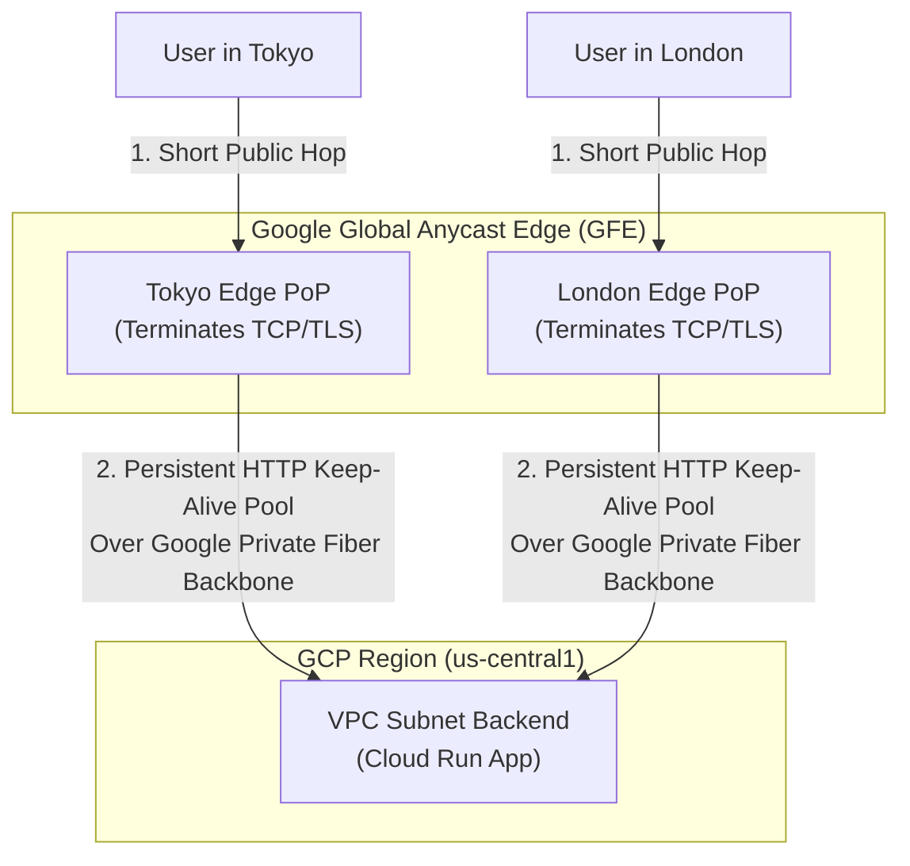

## Table of Contents

1. [Public Entry Points](#public-entry-points)
2. [HTTPS and Google-Managed SSL Certificates](#https-and-google-managed-ssl-certificates)
3. [Cloud Load Balancing and URL Maps](#cloud-load-balancing-and-url-maps)
4. [Serverless Network Endpoint Groups](#serverless-network-endpoint-groups)
5. [What the Load Balancer Can See](#what-the-load-balancer-can-see)
6. [Putting It All Together](#putting-it-all-together)
7. [What's Next](#whats-next)

## Public Entry Points

Public entry points are the managed DNS, TLS, proxy, and routing components that receive internet traffic before it reaches private application backends. For a GCP backend, that usually means a custom domain, a public IP, an HTTPS certificate, an external Application Load Balancer, a URL map, and a backend target such as a Serverless Network Endpoint Group.

*Public entry is a chain of routing decisions, not just a service URL.*

By decoupling traffic entry from runtime execution, your application backend can remain private while public clients use a stable HTTPS endpoint. When a user queries your website domain, DNS points them to the load balancer's public address. The external Application Load Balancer terminates TLS at Google's edge, applies routing policy, and sends the request to the configured backend path.

This secure public ingress pipeline is built by coordinating several layers. First, a naming system (Cloud DNS) translates your custom domain name into a public IP address. Second, a certificate service (Google-managed SSL) handles encrypting and decrypting the traffic. Third, an external load balancer evaluates your request URLs to route them to the right backend. Finally, a logical adapter (Serverless Network Endpoint Group) connects this load balancer directly to your serverless container runtimes.

:::expand[Under the Hood: GFE Edge Nodes and Anycast BGP Routing]{kind="design"}
To understand how GCP handles public requests, you must understand the **Google Edge Front End (GFE)** network architecture.

In traditional cloud routing, when you provision a public load balancer, it is assigned a regional IP address. A user in Tokyo calling a server in Virginia must initiate a TCP handshake that travels across the public internet, traversing multiple third-party ISP routers, resulting in high packet loss and latency.

GCP load balancers utilize **Global Anycast IP addresses**. Google advertises a single, unified public IP address from every physical Point of Presence (PoP) edge node worldwide using Border Gateway Protocol (BGP) routing.

This Anycast IP routing model is a unique GCP feature. In other clouds, a public load balancer is commonly assigned a regional IP address. To achieve a similar global footprint in AWS, you must pair an Application Load Balancer with Amazon CloudFront (CDN) for edge caching and global entry. In Azure, you commonly pair Azure Front Door with a regional Application Gateway. GCP's external Application Load Balancer terminates global traffic at the Anycast edge natively, removing the administrative complexity of multi-layered CDN and gateway integrations.

When a user in Tokyo requests `orders.devpolaris.com`, BGP routes the request to the physically closest Google Tokyo Edge PoP. The GFE edge node terminates the TCP session and SSL/TLS handshake locally within milliseconds.

Once terminated, the GFE proxies the HTTP payload over Google's private, dedicated fiber optic backbone directly to the active VPC region. By terminating the high-latency public handshake at the edge, GCP minimizes round-trip latency and insulates the backend from public transport jitter.
:::

## HTTPS and Google-Managed SSL Certificates

SSL/TLS certificates are the public key material that lets clients verify the domain and encrypt the HTTPS session. Public entry points require SSL/TLS encryption to protect data in transit. Google Cloud Load Balancing can manage the complexity of certificate provisioning, validation, and renewal automatically when you use Google-managed certificates.

When you configure a Google-managed certificate, Google obtains, manages, and renews a domain-validated certificate for the names you configure. Your job is to point DNS at the load balancer and wait for provisioning to complete.

Once issued, the certificate is served by the load balancer's frontend. TLS terminates at the frontend so your containers do not manage public private keys. Encryption from the load balancer to backends depends on the backend type and protocol you configure, so describe backend encryption as a configuration choice rather than automatic re-encryption for every path.

## Cloud Load Balancing and URL Maps

The external Application Load Balancer is the managed HTTP(S) proxy that receives public requests and applies routing policy. It operates at Layer 7 (HTTP/HTTPS) and uses a structured routing engine called a URL Map.

A URL Map evaluates the path and headers of incoming HTTP requests and directs them to the appropriate backend service. For example, you can configure a single URL Map to route traffic based on path rules:

*   **`orders.devpolaris.com/api/*`**: Routed to a containerized API running on Cloud Run.
*   **`orders.devpolaris.com/static/*`**: Routed directly to a static Cloud Storage bucket.
*   **`orders.devpolaris.com/legacy/*`**: Routed to an internal VM instance group.

By centralizing routing rules inside the URL Map, you avoid exposing separate domain endpoints for each service, presenting a clean, unified API contract to public users while maintaining architectural flexibility behind the scenes.

## Serverless Network Endpoint Groups

A Serverless Network Endpoint Group (Serverless NEG) is the logical backend object that lets a load balancer target a regional serverless service. A major challenge in serverless environments is that runtimes like Cloud Run do not expose stable VM backend IP addresses in your VPC subnets. To let an external Application Load Balancer target a serverless service, GCP uses **Serverless NEGs**.

*The NEG is the bridge between edge routing and Cloud Run capacity.*

A Serverless NEG is a logical backend object that points to a specific Cloud Run, Cloud Run Functions, or App Engine service. When the load balancer's URL Map selects that backend, Google Cloud routes the request to the regional serverless service behind the NEG.

The Serverless NEG lets the load balancer target the regional serverless service without registering static VM IPs. It preserves useful request metadata through standard proxy headers, such as `X-Forwarded-For`, so your application can still inspect the traffic's origin for security auditing.

The Serverless NEG functions as the logical adapter that allows the global load balancer to hand off requests to serverless backends without requiring VM target registrations. A key gotcha is health checking: Google Cloud health checks are not supported for serverless NEG backends, so use Cloud Run service health, logs, metrics, and load-balancer behavior such as outlier detection where applicable.

## What the Load Balancer Can See

The load balancer sees request metadata and backend routing state, not the internal health of the serverless process. One of the primary latency penalties in serverless computing is the "cold start," which occurs when a service must scale from zero instances to serve an incoming request. The external Application Load Balancer can route requests to the right regional serverless backend, apply URL map rules, serve the public certificate, and enforce frontend traffic policy.

The load balancer cannot inspect your Cloud Run process like a VM health check agent. It does not know whether your handler will open a database connection quickly or whether a new instance will have a cold start. For serverless backends, monitor Cloud Run request latency, instance startup behavior, error rates, and logs alongside load-balancer metrics. If you need to prevent users from bypassing the load balancer, pair the Serverless NEG with Cloud Run ingress settings that allow load-balancer traffic while blocking direct public calls to the raw service URL.

## Putting It All Together

Let's trace the physical path of a request calling `https://orders.devpolaris.com/api/v1/checkout`.

First, public DNS resolves the domain name to the load balancer's Global Anycast IP address. The user's browser initiates a connection, which is instantly routed to the nearest physical GFE edge node (e.g. in London).

The GFE terminates the TLS session using Google-managed certificates and evaluates the URL Map, identifying `/api/v1/checkout` as a serverless backend target. Google Cloud then forwards the request to the region where your Serverless NEG is provisioned.

The serverless backend receives the request with standard proxy metadata, such as forwarded client IP headers. The entire flow is terminated, validated, routed, and delivered securely, leaving your container to do one job: process the checkout logic.

## What's Next

Establishing the public entry path secures inbound traffic. However, the container running inside Cloud Run must also initiate outbound calls to databases and private services. In the next article, we detail Cloud Run networking, focusing on Direct VPC egress, ingress restriction settings, and runtime service identity.

*Use this summary as the quick mental checklist before designing or debugging the service.*

---

**References**

- [Google Cloud: Cloud DNS overview](https://cloud.google.com/dns/docs/overview) - Technical specification for GCP hosted DNS zones.
- [Google Cloud: Global external Application Load Balancer overview](https://cloud.google.com/load-balancing/docs/https) - Core guide to Anycast IP routing and GFE edge nodes.
- [Google Cloud: Serverless NEGs overview](https://cloud.google.com/load-balancing/docs/negs/serverless-neg-concepts) - Guide to bridging HTTP load balancers to serverless runtimes.
- [Google Cloud: Google-managed SSL certificates](https://cloud.google.com/load-balancing/docs/ssl-certificates/google-managed-certs) - Explains provisioning and renewal behavior for Google-managed certs.
- [Google Cloud: Encryption to the backends](https://cloud.google.com/load-balancing/docs/ssl-certificates/encryption-to-the-backends) - Explains frontend TLS and backend encryption options.
- [Google Cloud: URL map concepts](https://cloud.google.com/load-balancing/docs/url-map-concepts) - Documents URL map routing behavior.
