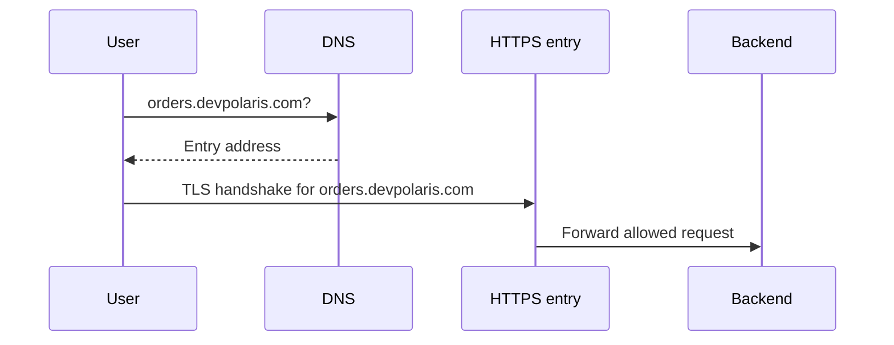
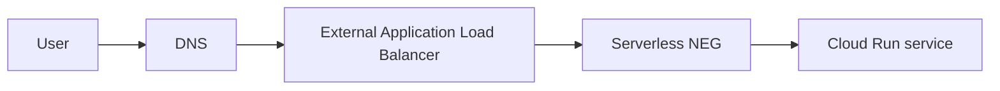

## Table of Contents

1. [The Problem](#the-problem)
2. [Public DNS](#public-dns)
3. [HTTPS](#https)
4. [Cloud Run URL](#cloud-run-url)
5. [Load Balancing](#load-balancing)
6. [Serverless Backends](#serverless-backends)
7. [Health](#health)
8. [Entry Evidence](#entry-evidence)
9. [Putting It All Together](#putting-it-all-together)
10. [What's Next](#whats-next)

## The Problem

The Orders API is deployed and healthy from the team's point of view. It responds when someone calls the generated service URL. Production users need a deliberate public entry path.

- Customers need a stable name such as `orders.devpolaris.com`, not a platform-generated URL.
- The browser needs a valid HTTPS certificate for that name.
- Traffic should reach the intended backend, not a stale test service.
- When a backend revision is unhealthy, the entry point should stop sending traffic to it or make the failure visible.

Public entry is the path from a user-facing name to the service that handles the request. In GCP, that path can be simple for Cloud Run, or it can include Cloud DNS, certificates, an external Application Load Balancer, serverless network endpoint groups, and health evidence. The design goal is not to collect products. It is to make the public request path stable, secure, and explainable.

## Public DNS

DNS gives a name an answer. When a user types `orders.devpolaris.com`, DNS tells the client where to send the next connection. That answer might point directly at a service-supported domain mapping, or it might point at a load balancer frontend.

DNS does not prove the backend is correct. It does not encrypt the request. It does not know whether the service is healthy. It only maps the name to the next destination. That narrow job is why DNS problems can look simple and still hurt production. A wrong record can send all users to the wrong entry point.

For public services, review DNS with three questions:

| Question | Why it matters |
| --- | --- |
| Which zone owns the name? | Prevents editing the wrong hosted zone or registrar record |
| What does the record point to? | Shows whether traffic goes to Cloud Run directly or to a load balancer |
| How long can caches keep the answer? | TTL affects rollout and rollback timing |

The first evidence for public entry is boring and valuable: the name resolves to the thing you intended.

## HTTPS

HTTPS does two jobs. It encrypts the request in transit, and it lets the client verify that the certificate belongs to the name it is calling. Without HTTPS, a public API is asking users to trust a path they cannot verify.

In GCP, certificates may be managed for you in some Cloud Run domain mapping paths, or attached to a load balancer frontend when you use a load balancer. The exact resource changes by design. The mental model does not: the certificate must cover the public name, be served by the public entry point, and be renewed before it expires.

The common mistake is to treat HTTPS as a backend setting only. A container can listen on an internal port while the public entry point terminates TLS. Users care about the certificate they receive at `orders.devpolaris.com`, not the private port the container uses behind the entry point.



If DNS points at the wrong entry point, the certificate may be wrong. If the certificate is right but the backend is wrong, users still get the wrong service. Public entry review needs both.

## Cloud Run URL

Every Cloud Run service has a service URL. For early development, that URL is useful because it proves the service can receive HTTPS requests through Cloud Run's managed entry path.

The generated URL is not always the public product URL you want users to bookmark. It exposes platform naming, may not match your brand or API domain, and may bypass the load balancer controls you want in front of production. Cloud Run can still be the backend. The question is whether users should call Cloud Run directly, a custom domain mapping, or a load balancer frontend.

Use the generated URL as evidence, not as the whole design:

| Use the Cloud Run URL for | Avoid using it as |
| --- | --- |
| Quick service smoke tests | The only production name when a stable domain is required |
| Checking service-level ingress and auth behavior | A substitute for DNS and certificate review |
| Internal team debugging | A public API contract that clients hardcode forever |

The URL proves Cloud Run can answer. It does not prove the public entry architecture is finished.

## Load Balancing

A load balancer receives traffic before the backend does. In GCP, an external Application Load Balancer can provide a public frontend, HTTPS certificate handling, routing rules, and backend integration. It is often the right shape when a team wants one stable public entry point across multiple backends, paths, or services.

For an Orders API, the load balancer might route `orders.devpolaris.com/api/*` to Cloud Run and another path to a static frontend or a different service. The user sees one domain. The backend design can evolve behind it.

A load balancer spreads traffic and acts as an entry policy boundary. It can centralize TLS, URL routing, logging, and security controls that would otherwise be scattered across services.

| Without a load balancer | With a load balancer |
| --- | --- |
| Each service exposes its own public entry choices | One frontend can route to multiple backends |
| Custom domain logic may be service-specific | DNS points to a shared entry point |
| Security and logging can be uneven | Entry evidence is centralized |

The tradeoff is more moving parts. For a small service, direct Cloud Run custom domain mapping may be enough. For a platform with multiple services and shared entry controls, the load balancer becomes easier to explain than many separate public edges.

## Serverless Backends

Cloud Run can sit behind an external Application Load Balancer through a serverless network endpoint group, often called a serverless NEG. The NEG is the load balancer backend object that points to the serverless service.

This is a different shape from a VM instance group. There are no backend VMs to patch or place in subnets. The load balancer still has a frontend and routing rules, but the backend target is the Cloud Run service through the serverless backend integration.

That distinction matters for health and troubleshooting. If a VM backend is unhealthy, you may inspect VM ports, firewall rules, and health check paths. If a Cloud Run backend is failing, you also need to inspect Cloud Run revision health, ingress settings, authentication, and service logs.



The backend is still a real backend. It is just not a group of machines you manage.

## Health

Public entry needs health evidence. A request can fail because DNS points to the wrong place, the certificate is invalid, the load balancer route is wrong, the backend service is unhealthy, or the Cloud Run revision is not ready.

Health checks are straightforward for many VM or container backends. Serverless backends have service-specific health behavior and logging. The practical lesson is that public entry review should include the frontend and the backend together.

Ask:

| Layer | Evidence |
| --- | --- |
| DNS | Name resolves to the intended entry |
| Certificate | Certificate covers the name and is not expired |
| Load balancer | Frontend, URL map, backend, and route point to the intended service |
| Cloud Run | Revision is ready, traffic allocation is correct, ingress allows the entry path |
| Logs | Request reached the entry point and, if forwarded, the backend |

When users say "the site is down," this table keeps the team from starting at the container every time.

## Entry Evidence

A healthy public entry review can fit in a small note:

```text
name: orders.devpolaris.com
dns target: external HTTPS load balancer frontend
certificate: managed certificate covers orders.devpolaris.com
route: /api/* -> orders-api serverless backend
backend: Cloud Run service devpolaris-orders-api
ingress: allows load balancer path
logs: load balancer and Cloud Run request logs enabled
```

This evidence does not replace automated monitoring. It gives humans the shared map. When production changes, reviewers can compare the new path to this expected shape and catch accidental public entry changes before users do.

## Putting It All Together

Return to the opening problems.

Customers need a stable name. DNS supplies the answer for `orders.devpolaris.com`, and the answer should point to the intended public entry.

Browsers need a valid certificate. HTTPS is served at the entry point the user reaches, so certificate review belongs with DNS, load balancer review, and backend code.

Traffic should reach the intended backend. A load balancer with a serverless NEG can route to Cloud Run while keeping the public entry stable.

Unhealthy backends should be visible. Health, readiness, routing, and logs show whether the request stopped at DNS, TLS, load balancing, Cloud Run ingress, or the service itself.

## What's Next

Public entry covers how users reach a service. The same Cloud Run service also has an outbound side: it calls databases, private services, and Google APIs. Next we look at Cloud Run networking through ingress, IAM, egress, Direct VPC egress, and private range choices.

---

**References**

- [Google Cloud: Cloud DNS overview](https://cloud.google.com/dns/docs/overview)
- [Google Cloud: Set up a global external Application Load Balancer with Cloud Run](https://cloud.google.com/load-balancing/docs/https/setup-global-ext-https-serverless)
- [Google Cloud: Serverless network endpoint groups overview](https://cloud.google.com/load-balancing/docs/negs/serverless-neg-concepts)
