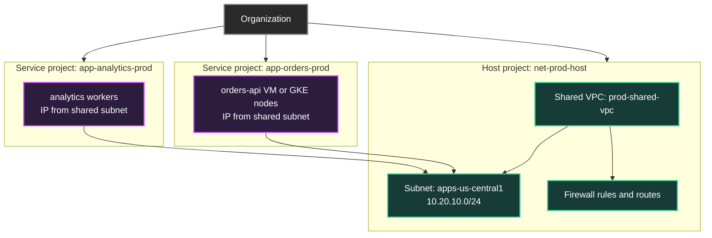
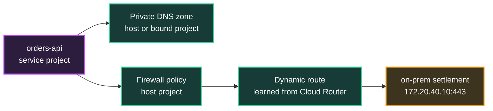
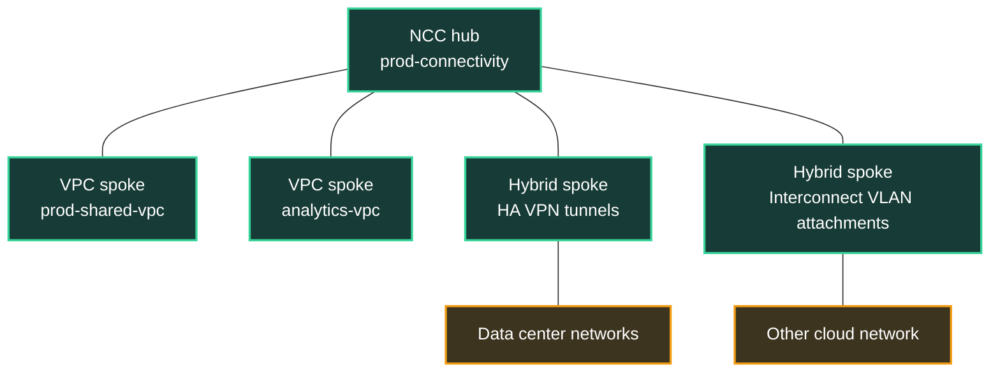

## Table of Contents

1. [Shared VPC, Hybrid Connectivity, and Troubleshooting](#shared-vpc-hybrid-connectivity-and-troubleshooting)
2. [Host Projects and Service Projects](#host-projects-and-service-projects)
3. [Subnet Delegation and Network User](#subnet-delegation-and-network-user)
4. [Centralized Firewalls, Routes, and DNS](#centralized-firewalls-routes-and-dns)
5. [Cloud VPN, Cloud Interconnect, and Cloud Router](#cloud-vpn-cloud-interconnect-and-cloud-router)
6. [Network Connectivity Center](#network-connectivity-center)
7. [A Practical Troubleshooting Ladder](#a-practical-troubleshooting-ladder)
8. [Putting It All Together](#putting-it-all-together)

## Shared VPC, Hybrid Connectivity, and Troubleshooting
<!-- section-summary: Shared VPC separates application ownership from network ownership, then hybrid connectivity extends the shared network beyond Google Cloud. -->

At small scale, a team can create one project, one VPC, a few subnets, and a couple of firewall rules. That design works for a learning account. A real company quickly needs more separation. The payments team, analytics team, identity team, and platform team should not all own the same project. They need separate billing, IAM, deployment pipelines, and release schedules. They also need a common private network so services can talk to each other without every team inventing its own VPC design.

**Shared VPC** is the Google Cloud feature that lets resources from multiple projects use subnets from a common VPC network. The network lives in a **host project**. Application resources live in **service projects**. Platform teams can keep central control over subnets, routes, and firewall policy while application teams create VMs, GKE clusters, Cloud Run services, load balancers, and managed services in their own projects.

Now add the second production pressure. The company still has a warehouse system in a data center, a payments processor reachable through a private partner network, and a reporting platform in another cloud. That is **hybrid connectivity**: private routing between Google Cloud and networks outside Google Cloud. Google Cloud usually builds that path with **Cloud VPN**, **Cloud Interconnect**, **Cloud Router**, and sometimes **Network Connectivity Center**.

The third pressure is troubleshooting. A failed connection in this environment can cross service-project IAM, host-project subnets, hierarchical firewall policy, custom routes, Cloud DNS, Cloud VPN tunnels, Interconnect VLAN attachments, BGP advertisements, load balancers, and managed service controls. The only sane way through it is a ladder: prove the endpoint, prove DNS, prove routes, prove firewalls, prove hybrid advertisements, then use Google Cloud evidence tools to confirm the path.

We will keep one scenario through the article. The `orders-api` service runs in service project `app-orders-prod`. It uses subnet `apps-us-central1` from host project `net-prod-host`. It calls a Cloud SQL private IP, receives traffic through an internal load balancer, and sends settlement files to an on-premises system at `172.20.40.10`. The network team owns the host project. The orders team owns the service project.

The project split comes first because every permission and troubleshooting step depends on knowing where the network actually lives.

## Host Projects and Service Projects
<!-- section-summary: A host project owns the shared network, while service projects run workloads that consume selected shared subnets. -->

A **host project** is a Google Cloud project that contains one or more Shared VPC networks. The host project owns the VPC networks, subnets, routes, firewall rules, Cloud NAT gateways, Cloud VPN gateways, Interconnect VLAN attachments, and many other network resources. In our scenario, `net-prod-host` is the host project because it contains the `prod-shared-vpc` network and the `apps-us-central1` subnet.

A **service project** is a project attached to a host project so its eligible resources can use the shared network. The orders team deploys into `app-orders-prod`, but its VM or GKE node can select a subnet from `net-prod-host`. The workload still belongs to the orders project for IAM, billing, deployment, logs, and ownership. Its network interface receives an IP address from the host project's subnet.

This structure gives each team a clean job. The platform network team can design IP ranges, firewall policy, hybrid links, and DNS in one place. The orders team can deploy application resources without being allowed to edit global network routes. Finance can still see that compute spend belongs to `app-orders-prod`, while network egress through a host-project VPN gateway can appear under the host project depending on the resource.

Google Cloud adds a few rules that matter in design reviews. A project has one Shared VPC role at a time, either host project or service project. A service project attaches to one host project. Existing resources in a project stay on their current networks when the project is attached; teams usually create new eligible resources that select the shared subnet. That matters during migrations from standalone VPCs into Shared VPC.

Shared VPC solves project separation. The next question is how the platform team gives an application team access to only the subnets it should use.

## Subnet Delegation and Network User
<!-- section-summary: Service project teams use shared subnets through delegated IAM, most commonly the Network User role at project or subnet scope. -->

**Subnet delegation** means the host-project network team allows a service-project team to attach resources to selected shared subnets. The most common IAM role in that delegation is **Compute Network User**, shown as `roles/compute.networkUser`. This role lets a principal use a VPC network or subnet for eligible resources without giving that principal full control over the network.

For the orders team, the network team might grant `roles/compute.networkUser` on only `apps-us-central1` and `apps-us-east1`. That allows the orders deployment pipeline to create GKE nodes, VM network interfaces, or load balancer resources that use those subnets. The same pipeline cannot use the analytics subnet unless the network team delegates that subnet too.

There are two common delegation scopes. **Project-level delegation** grants Network User on the host project, so the service-project team can use all current and future subnets in the host project. This is convenient for a trusted platform automation account, but it can be too broad for application teams. **Subnet-level delegation** grants Network User on specific subnets, which supports tighter separation between teams and environments.

The service project still needs roles inside the service project. A developer or CI/CD service account may need Compute Instance Admin, GKE permissions, Cloud Run permissions, or load balancer permissions in `app-orders-prod`. Shared VPC adds host-project network permission alongside normal application IAM, so the resource can attach to the shared network.

| Actor | Typical project | What they manage |
|---|---|---|
| Shared VPC Admin | Organization, folder, or host project | Enables host projects and attaches service projects |
| Network Admin | Host project | VPCs, subnets, routes, Cloud Router, Cloud NAT, hybrid network resources |
| Security Admin | Host project | Firewall rules, firewall policies, SSL certificates where applicable |
| Service Project Admin | Service project plus delegated subnets | Application resources that use approved shared subnets |

In production, this split prevents a common accident. The orders team can ship a new version of `orders-api` with no permission to add a broad firewall allow rule from the entire corporate network. The network team can change a subnet route while staying out of owner access to the orders application project. That separation is the whole point of Shared VPC.

Once teams can attach resources to shared subnets, the shared network controls need to stay centralized and reviewable.

## Centralized Firewalls, Routes, and DNS
<!-- section-summary: Shared VPC centralizes network controls, so traffic decisions often live in the host project even when workloads live elsewhere. -->

In a Shared VPC design, the most important network evidence usually lives in the host project. **Firewall rules and firewall policies** decide which traffic may enter or leave workloads. **Routes** decide where traffic goes for private ranges, internet egress, VPN tunnels, Interconnect attachments, and producer networks. **Cloud DNS private zones** decide how internal names resolve for resources using the shared network.

For `orders-api`, the VM or GKE node exists in `app-orders-prod`, but its network interface belongs to a subnet from `net-prod-host`. If a connection from `orders-api` to the on-premises settlement host fails, the route to `172.20.40.10` might be a dynamic route in the host project learned from Cloud Router. The firewall rule that allows egress from the orders service account or tag might also live in the host project. A private DNS zone for `corp.example.com` may be authorized against the Shared VPC network in the host project.

This creates a practical operating rule: the application team owns the app symptom, and the network team owns much of the path evidence. The app team can provide source IP, destination IP, port, protocol, timestamp, service account, and hostname. The network team can check route tables, firewall policies, DNS zones, and hybrid link state. Neither side has to guess if they share those details at the start.

DNS is worth calling out because it often hides as an application issue. If `settlement.internal.example.com` resolves to an old on-premises IP, the route and firewall checks may all look correct for the wrong destination. If the private zone is attached to one VPC but the workload uses another, the application may fall back to public DNS or fail resolution entirely. For Shared VPC, private zones can live in the host project or use cross-project binding, so the team should know which model it uses.

Routes are the next common source of confusion. A Shared VPC can have subnet routes, static routes, peering routes, and dynamic routes learned from Cloud Router. Route priority and specificity affect which next hop wins. A broad `10.0.0.0/8` static route to an appliance can steal traffic that should use a more specific hybrid route only if the route table and priorities allow it. During incidents, route evidence should include the destination prefix, next hop, priority, and whether the route is static, subnet, peering, policy-based, or dynamic.

Firewalls need the same precision. Ingress and egress rules may target network tags or service accounts. Hierarchical firewall policies may apply above the project. A deny rule with a higher priority can override the allow rule everyone remembers. In Shared VPC, the useful question changes from "is there a firewall rule?" to "which firewall rule applies to this source, destination, protocol, port, direction, and target?"

Those centralized controls are enough for Google Cloud to Google Cloud traffic. Hybrid connectivity adds VPNs, Interconnect, and BGP.

## Cloud VPN, Cloud Interconnect, and Cloud Router
<!-- section-summary: Cloud VPN and Cloud Interconnect provide private transport to external networks, while Cloud Router exchanges routes with BGP. -->

**Cloud VPN** connects a Google Cloud VPC to another network through IPsec VPN tunnels. It is a good fit for lower-cost connectivity, lower bandwidth needs, early migrations, backup paths, and encrypted tunnels over the public internet. In production, teams usually choose **HA VPN** rather than older Classic VPN patterns because HA VPN provides redundant interfaces and stronger availability options when configured correctly.

**Cloud Interconnect** provides dedicated connectivity between external networks and Google's network. Dedicated Interconnect uses a direct physical connection at a colocation facility. Partner Interconnect uses a supported service provider. Cross-Cloud Interconnect connects Google Cloud to another cloud provider network. Interconnect is usually the choice when the company needs higher throughput, lower latency, more predictable paths, or private transport that avoids the public internet.

**Cloud Router** is Google Cloud's managed BGP speaker. BGP, or Border Gateway Protocol, is the routing protocol that lets networks exchange reachable prefixes. Cloud Router works with HA VPN tunnels and Interconnect VLAN attachments so Google Cloud can learn on-premises routes and advertise VPC subnet ranges back to the external network. It is the part that turns a tunnel or VLAN attachment into usable dynamic routing.

Here is the beginner view. A VPN tunnel or Interconnect attachment is the transport. Cloud Router is the route conversation. Firewall rules decide which packets may use the resulting path. DNS gives applications the destination names. IAM decides who may configure or use the resources.

| Need | Common Google Cloud product | Practical meaning |
|---|---|---|
| Secure lower-cost private path to a data center | **HA VPN** | IPsec tunnels over the public internet with high availability design options |
| High-throughput private path to Google Cloud | **Dedicated or Partner Interconnect** | Dedicated transport through Google or a provider connection |
| Dynamic route exchange | **Cloud Router** | BGP sessions advertise and learn prefixes for VPN or Interconnect |
| Encrypted traffic over Interconnect | **HA VPN over Cloud Interconnect or MACsec where supported** | Extra encryption layer depending on the compliance and circuit design |

In the orders scenario, the settlement system lives at `172.20.40.10` in a data center. The network team creates HA VPN tunnels between `prod-shared-vpc` and the data center gateway. Cloud Router learns `172.20.0.0/16` from the on-premises router and advertises `10.20.10.0/24` back. The orders app sends traffic to `172.20.40.10`; the VPC route table selects the dynamic route learned from Cloud Router; the packet leaves through the VPN tunnel if firewalls allow it.

Hybrid bugs often come from route advertisements. The tunnel can be up while the prefix is missing. The prefix can be learned in Google Cloud while the on-premises side lacks the return route. Two peers can advertise overlapping prefixes, and a more specific route can win. BGP sessions can flap, route priorities can prefer a backup path, and asymmetric routing can confuse stateful firewalls outside Google Cloud. The first useful incident question is usually "which exact prefixes did each side learn and advertise?"

When a company has many VPCs, VPNs, Interconnect attachments, and sites, managing each connection pair by pair gets heavy. That is where Network Connectivity Center enters the story.

## Network Connectivity Center
<!-- section-summary: Network Connectivity Center organizes VPC, VPN, Interconnect, and appliance connectivity around hubs and spokes. -->

**Network Connectivity Center**, usually shortened to NCC, is an orchestration framework for connecting network resources through a central **hub**. A hub is the management resource. A **spoke** is a connected network resource, such as a VPC network, HA VPN tunnel, Cloud Interconnect VLAN attachment, Router appliance VM, or certain cross-cloud attachments.

For a small environment, the network team might manage routes directly between one Shared VPC and one data center. For a larger environment, the team may have production VPCs, analytics VPCs, security inspection VPCs, multiple data centers, and connections to other cloud providers. NCC helps organize that shape by representing the connected pieces as spokes attached to a hub and controlling route exchange between them.

NCC supports VPC spokes that exchange subnet routes, hybrid spokes based on HA VPN tunnels or Interconnect VLAN attachments, and router appliance spokes for more advanced designs. With the right design, it can support site-to-cloud connectivity, VPC-to-VPC connectivity, and site-to-site data transfer over Google's network. These are powerful patterns, so teams usually pair NCC with clear route ownership, route filters, naming standards, and review workflows.

For troubleshooting, NCC changes where some route evidence lives. A route may be imported through a hub route table instead of being learned only by one VPC. A VPC may receive subnet routes from another spoke. Hybrid routes learned through BGP can be exchanged depending on the hub and spoke configuration. During incidents, the network team should check the VPC route table and the NCC hub or spoke state rather than looking only at a local Cloud Router.

Now we can assemble a practical troubleshooting ladder that works across Shared VPC and hybrid designs.

## A Practical Troubleshooting Ladder
<!-- section-summary: Troubleshooting gets faster when the team climbs from endpoint facts through DNS, routes, firewalls, hybrid state, and evidence tools. -->

A troubleshooting ladder is an ordered set of checks that turns "the network is broken" into evidence. The exact tools change by service, but the order is stable enough for most GCP incidents. The first step records source and destination facts, and the later steps move through name resolution, routes, firewalls, hybrid advertisements, and runtime evidence from Google Cloud tools and service logs.

**Step 1: Flow facts.** The source project, source resource, source IP, destination hostname, destination IP, protocol, port, timestamp, and history of the connection define the flow. For `orders-api`, that might be `app-orders-prod`, source IP `10.20.10.18`, destination `settlement.internal.example.com`, resolved IP `172.20.40.10`, TCP 443, failing since 09:20 UTC. Without this, teams check broad settings and miss the actual path.

**Step 2: DNS evidence.** The hostname should be resolved from the same runtime environment if possible. A laptop result may use different DNS than a VM, GKE Pod, or Cloud Run revision. In Shared VPC, the relevant Cloud DNS private zone needs authorization for the shared network or a cross-project binding. If the app should call a Private Service Connect endpoint, the name should resolve to the PSC endpoint IP rather than an old public or private address.

**Step 3: Route evidence.** The selected route for the destination IP lives in the VPC that owns the workload interface. Useful evidence includes subnet routes, static routes, policy-based routes, peering routes, and dynamic routes. For hybrid destinations, Cloud Router or NCC should have learned the remote prefix, and the external network should have learned the return prefix for the source subnet. A one-way route can create timeouts that look like firewall drops.

**Step 4: Firewall evidence.** Egress from the source and ingress at the destination side both matter. In Google Cloud, useful evidence includes VPC firewall rules, hierarchical firewall policies, target tags, target service accounts, protocol, port, source ranges, destination ranges, and priorities. For hybrid traffic, on-premises firewalls, partner firewalls, and appliance rules join the same check. Stateful return traffic helps only after the first packet is allowed in the initiating direction.

**Step 5: Prove service readiness.** If the destination is a load balancer, check forwarding rule, backend service, health checks, backend endpoints, and logs. If the destination is Cloud Run, check ingress settings, authentication, revision health, and Direct VPC egress if the service is the source. If the destination is Cloud SQL private IP, check the private services connection, database private IP, database port, user authentication, and service limits. The route can be correct while the service rejects or never receives the request.

**Step 6: Connectivity Tests evidence.** Connectivity Tests can simulate the expected forwarding path for many Google Cloud resources and can include live data plane analysis for some scenarios. It helps separate VPC configuration issues from Google-managed service boundaries. For Cloud SQL and other Google-managed services, Connectivity Tests can show the customer-side route and firewall checks even when it cannot expose details inside Google's producer project.

**Step 7: Flow log evidence.** VPC Flow Logs samples traffic from supported resources such as VMs, Cloud Run resources with Direct VPC egress, Cloud VPN tunnels, and Interconnect VLAN attachments. Flow Analyzer gives a visual and query-driven way to inspect those flow logs without writing every query by hand. These tools answer questions such as "did packets leave this subnet?", "which destination received the most failed attempts?", and "did the tunnel see traffic around the incident time?"

**Step 8: Service evidence.** Load balancer logs, health check logs, Cloud Run request logs, GKE ingress logs, application logs, and database logs tell the service side of the story. A network trace that reaches the load balancer plus a backend health failure points to service readiness. No flow logs and no Connectivity Tests route points back to DNS, routes, or firewalls.

Here is the ladder as a compact reference:

| Check | Evidence to collect | Common finding |
|---|---|---|
| Flow facts | Source, destination, port, protocol, timestamp | Teams were testing different destinations |
| DNS | Runtime resolver answer and private zone attachment | Hostname resolves to old IP or wrong endpoint |
| Routes | Selected next hop, prefix, priority, route type | Missing remote prefix or wrong static route |
| Firewalls | Matching allow or deny rule in both directions | Higher-priority deny or wrong target service account |
| Hybrid state | Tunnel, VLAN attachment, BGP learned and advertised routes | Tunnel up but prefix missing |
| Connectivity Tests | Simulated path and reachability result | Drop at route or firewall step |
| Flow evidence | VPC Flow Logs and Flow Analyzer results | Packets leave source but no return traffic |
| Service evidence | Load balancer, Cloud Run, GKE, Cloud SQL, app logs | Backend unhealthy or app rejects request |

The ladder works because each step narrows the next question. It also keeps Shared VPC ownership clear: the service team can provide flow facts and service logs, while the network team can verify the host-project and hybrid path.

## Putting It All Together
<!-- section-summary: A mature GCP network uses Shared VPC for ownership, hybrid products for external reachability, and evidence tools for operations. -->

In the finished orders platform, the network team owns `net-prod-host`, the Shared VPC, subnets, firewall policy, private DNS zones, Cloud Router, HA VPN, Interconnect attachments, and NCC hub configuration. The orders team owns `app-orders-prod`, the application runtime, service account, deployment pipeline, and application logs. Shared VPC lets both teams work without handing every network permission to every application owner.

For normal traffic, `orders-api` uses a delegated shared subnet. It calls internal services in other service projects through private IPs, reaches Cloud SQL through the private service access pattern from the previous article, and sends settlement files to `172.20.40.10` through a hybrid route learned by Cloud Router. If the company adds more VPCs and external sites, NCC can help organize route exchange around hubs and spokes.

When something fails, the team uses evidence instead of guesswork. The incident starts with one named flow. DNS confirms the intended destination. Routes show the selected next hop. Firewalls show the matching rule. Hybrid checks show BGP learned and advertised prefixes. Connectivity Tests simulates the Google Cloud path. VPC Flow Logs and Flow Analyzer show sampled runtime traffic. Load balancer, Cloud Run, GKE, Cloud SQL, and application logs show whether the destination service received and handled the request.

That is the operating shape of GCP networking at scale: shared ownership, deliberate private connectivity, and a troubleshooting path that follows the packet and the service evidence together.

---

**References**

- [Shared VPC](https://docs.cloud.google.com/vpc/docs/shared-vpc) - Defines host projects, service projects, subnet sharing, IAM delegation, centralized network control, billing behavior, DNS, and load balancing notes.
- [Choosing a Network Connectivity product](https://docs.cloud.google.com/network-connectivity/docs/how-to/choose-product) - Compares Cloud VPN, Cloud Interconnect, and Cloud Router use cases.
- [Cloud Interconnect overview](https://docs.cloud.google.com/network-connectivity/docs/interconnect/concepts/overview) - Describes Dedicated Interconnect, Partner Interconnect, Cross-Cloud Interconnect, benefits, capacity, encryption considerations, and route-related considerations.
- [Network Connectivity Center overview](https://docs.cloud.google.com/network-connectivity/docs/network-connectivity-center/concepts/overview) - Explains NCC hubs, spokes, VPC spokes, hybrid spokes, route exchange, and site-to-site data transfer.
- [Connectivity Tests overview](https://docs.cloud.google.com/network-intelligence-center/docs/connectivity-tests/concepts/overview) - Documents path simulation, live data plane analysis, supported endpoints, and Google-managed service testing behavior.
- [Network Intelligence Center overview](https://docs.cloud.google.com/network-intelligence-center/docs/overview) - Summarizes Google Cloud network visibility, monitoring, and troubleshooting modules.
- [VPC Flow Logs](https://docs.cloud.google.com/vpc/docs/flow-logs) - Explains sampled flow logs, supported resources, use cases, scope, sampling behavior, and Shared VPC logging location.
- [Flow Analyzer overview](https://docs.cloud.google.com/network-intelligence-center/docs/flow-analyzer/overview) - Describes flow-log analysis, filtering, traffic aggregation, and troubleshooting views.
