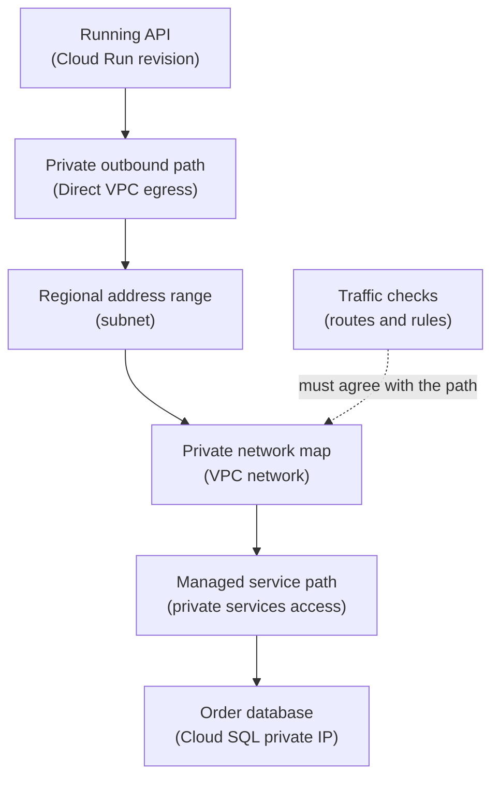

## Table of Contents

1. [Private Networking Needs More Than An IP Range](#private-networking-needs-more-than-an-ip-range)
2. [The Four Pieces To Keep Separate](#the-four-pieces-to-keep-separate)
3. [VPC Networks Are The Private Map](#vpc-networks-are-the-private-map)
4. [Subnets Place Resources In Regions](#subnets-place-resources-in-regions)
5. [Routes Tell Packets Where To Go Next](#routes-tell-packets-where-to-go-next)
6. [Firewall Rules Decide New Connection Access](#firewall-rules-decide-new-connection-access)
7. [Tags And Service Accounts Help Rules Find Targets](#tags-and-service-accounts-help-rules-find-targets)
8. [IAM Still Does A Different Job](#iam-still-does-a-different-job)
9. [The Orders API Private Path](#the-orders-api-private-path)
10. [What A Healthy Network Inventory Looks Like](#what-a-healthy-network-inventory-looks-like)
11. [Failure Modes And Fix Directions](#failure-modes-and-fix-directions)
12. [Tradeoffs For A First Design](#tradeoffs-for-a-first-design)
13. [The Review Habit](#the-review-habit)

## Private Networking Needs More Than An IP Range

Putting a service in a private address range is not enough. The packet still needs a path.
The destination still needs a rule that allows the connection. The app still needs the right
runtime configuration. The identity still needs permission for Google API calls. Beginners
often hear "put it in the VPC" and treat that as the whole network design.

In GCP, a VPC network is important, but it is only one part. You also need regional subnets,
routes, firewall rules, and service configuration. For `devpolaris-orders-api`, the team
wants the Cloud Run service to reach a Cloud SQL instance privately. That does not happen
because both names appear in the same project. The service needs egress into a VPC network.

The VPC needs the right subnet and private access pattern. The database path needs to be
configured. Firewall and service rules must allow the traffic where they apply. This article
keeps the pieces separate so debugging stays simple.

## The Four Pieces To Keep Separate

The four beginner pieces are VPC network, subnet, route, and firewall rule.

They answer different questions.

| Piece | Beginner question |
|---|---|
| VPC network | Which private network map are these resources using? |
| Subnet | Which regional IP range supplies addresses? |
| Route | Where should traffic for this destination go next? |
| Firewall rule | Is this new connection allowed or denied? |

These pieces work together. They are not the same. A subnet can exist while the route is
wrong. A route can exist while the firewall blocks traffic. A firewall rule can allow
traffic while the app points to the wrong hostname. IAM can allow a developer to edit a
resource while the resource is still unreachable on the network.

That is why network debugging should use small questions. Do not say "the VPC is broken."
Say which piece failed. The more specific sentence leads to the better fix.

## VPC Networks Are The Private Map

A VPC network is a private network area inside Google Cloud. It is global. That means the
VPC network is not tied to one region. The VPC network can contain subnets in many regions.
It can also have routes and firewall rules associated with it. For the orders service, the
production VPC might be:

```text
vpc-orders-prod
```

That name should tell you the network's job. It is the private traffic map for production
orders resources. The team might keep staging separate:

```text
vpc-orders-staging
```

That separation is a design choice. Some companies share VPC networks across many services.
Some use separate networks per environment or team. The right first lesson is not "always
one network" or "always many networks." The right first lesson is that the VPC network is
the map where routes and firewall rules are evaluated. If the app and dependency are not
connected to the same intended map or to a designed private connection between maps, the
path may not exist.

## Subnets Place Resources In Regions

A subnet is a regional IP range inside a VPC network. Subnets provide private addresses to
resources in that region. The terms subnet and subnetwork mean the same thing in GCP docs.
For `devpolaris-orders-api`, a simple first layout might be:

```text
vpc network: vpc-orders-prod

subnets:
  subnet-orders-run-us-central1       10.40.10.0/24
  subnet-orders-private-us-central1   10.40.20.0/24
```

The exact ranges are examples. The important part is that the subnet is in `us-central1`.
Cloud Run also runs in a region. Cloud SQL also lives in a region. If the service runs in
`us-central1`, the team should understand which regional subnet supplies private egress
addresses. Subnet size is not just bookkeeping. If a serverless service uses VPC egress, it
may consume IP addresses from a subnet while instances scale.

If the subnet is too small, new instances can fail to start or connect. That is a real
production failure, not a naming issue. For a beginner, the safe habit is: When a service
needs private networking, write down the region and the subnet together.

## Routes Tell Packets Where To Go Next

A route tells packets where to go next for a destination range. GCP creates system routes
for normal subnet communication. You can create custom routes when traffic needs a special
path. Routes answer a direction question. They do not prove the application accepts the
connection. They do not prove IAM allows an API call. They do not prove DNS points to the
intended address.

For a simple app path, the route question might be:

```text
from: Cloud Run egress through subnet-orders-run-us-central1
to: 10.50.3.8
question: is there a private path for this destination?
```

For a Google API path, the question may be different:

```text
from: private VM without external IP
to: Google APIs
question: is Private Google Access configured for this subnet?
```

For an on-premises path, the question may involve Cloud VPN or Interconnect, but those
belong in a later module. The key is that routes are about movement. If the packet has no
next hop for the destination, the connection fails before the app can answer.

## Firewall Rules Decide New Connection Access

VPC firewall rules allow or deny connections. They are defined at the network level, but
they apply to matching resources. GCP firewall rules are stateful for allowed connections,
which means the return traffic for an allowed connection is tracked. You do not usually
write a second rule for the response direction of the same connection.

The useful beginner shape is:

```text
direction: ingress or egress
action: allow or deny
source or destination: IP range or matching identity
protocol and port: tcp:443, tcp:5432, tcp:3306
target: which resources the rule applies to
```

Read the rule as a sentence.

```text
allow tcp:5432 from the app subnet to the database target
```

If the sentence is not specific, the rule may be too broad. If the sentence does not match
the traffic, the rule will not help. For HTTP service entry, the relevant rule might allow
traffic from a load balancer or proxy range to backend VMs. For Cloud Run, ingress and
egress settings have their own service-level meaning, and VPC firewall behavior depends on
the egress pattern.

Do not assume one firewall pattern applies to every GCP service. Use the official service
docs when the target is not a VM.

## Tags And Service Accounts Help Rules Find Targets

Firewall rules need to know which resources they apply to. For VM-based resources, GCP can
use network tags or service accounts to match targets. A network tag is a label-like string
attached to a VM or instance template. A service account target matches instances that use a
specific service account. Both patterns are better than hardcoding one IP address when the
workload can move or scale.

For example, a VM app tier might use:

```text
target network tag: orders-api
```

Or:

```text
target service account: orders-api-vm@devpolaris-orders-prod.iam.gserviceaccount.com
```

This is not the same as granting IAM permissions. Using a service account as a firewall
target means the rule matches network interfaces for instances using that service account.
Granting IAM roles to the service account controls what Google APIs the workload can call.
Same identity name. Different control plane. That difference matters. If you mix it up, you
might grant an IAM role when the actual missing piece is a firewall target.

## IAM Still Does A Different Job

Networking decides whether traffic can move. IAM decides whether a principal can perform an
API action. Both can be required for the same feature. For example, Cloud Run VPC egress can
require the Cloud Run service agent to have permission to use the network or subnet. That is
IAM. After the service is attached to the network path, firewall and routing still shape the
traffic.

For Cloud SQL, the runtime service account may need IAM-related access for supported
connection methods. The private network path may still need private IP or private service
access setup. When a connection fails, split the sentence:

```text
Can the service be configured to use this network?
Can packets travel from the runtime to the destination?
Can the destination accept the connection?
Can the principal authenticate or authorize at the service layer?
```

Those are different checks. Solving one does not automatically solve the others. This is why
"give it admin" is a poor network fix. It may hide an IAM setup issue. It will not create a
route or open a blocked port.

## The Orders API Private Path

The orders team wants Cloud Run to reach Cloud SQL privately. The app runs in `us-central1`.
The database runs in `us-central1`. The production VPC is `vpc-orders-prod`. The app uses
Direct VPC egress through:

```text
subnet-orders-run-us-central1
```

The database uses private IP through the configured private service access path.

The path the team expects is:

```text
Cloud Run revision
  -> VPC egress through subnet-orders-run-us-central1
  -> VPC network vpc-orders-prod
  -> private service access path
  -> Cloud SQL private address
```

Here is the diagram:



The diagram keeps one main path. That makes debugging easier. If the app cannot connect to
the database, check each box. Is the revision configured for VPC egress? Is the subnet in
the right region and large enough? Is private services access configured for the VPC? Does
Cloud SQL have a private IP? Does the app use the private connection target?

Do the logs show permission, DNS, timeout, or connection refused? Those are different
failure shapes.

## What A Healthy Network Inventory Looks Like

A small inventory makes a network review much easier.

For the orders API, write it like this:

```text
project: devpolaris-orders-prod
region: us-central1

network:
  vpc: vpc-orders-prod
  app subnet: subnet-orders-run-us-central1
  app range: 10.40.10.0/24

runtime:
  service: devpolaris-orders-api
  platform: Cloud Run
  egress: private-ranges-only through vpc-orders-prod

database:
  service: Cloud SQL
  access: private IP
  validation: /health/db
```

The inventory is not a full architecture document. It is enough to prevent the most common
confusion. Which project? Which region? Which VPC? Which subnet? Which runtime? Which
private dependency? Which validation proves it works? If the team cannot fill this out, the
design is not ready for a clean handoff.

## Failure Modes And Fix Directions

The first failure is subnet mismatch. Cloud Run runs in `us-central1`, but the chosen subnet
is in a different region. The fix direction is to use a subnet in the same intended region
for the runtime path. The second failure is subnet exhaustion. Traffic grows. Cloud Run
needs more private addresses for instances. The subnet has too little free space.

The fix direction is to plan a larger subnet or adjust the network design before production
traffic forces the issue. The third failure is wrong path to Cloud SQL. The database has
private IP, but the app still uses a public hostname or connection path. The fix direction
is to check the database connection setting and the private access setup together.

The fourth failure is firewall thinking applied to IAM. The app gets a broader IAM role, but
the network timeout remains. The fix direction is to inspect route, egress, DNS, and
firewall facts instead of adding roles. The fifth failure is an overbroad firewall rule. The
app works after opening a wide source range. The risk is that too many callers can reach the
port.

The fix direction is to narrow the source, target, protocol, and port to the real service
path.

## Tradeoffs For A First Design

Simple networks are easier to operate. Separated networks can reduce blast radius. Very
separated networks can create more routing, DNS, and access work. There is no free option.
For a first GCP design, a small team might choose one production VPC with clear regional
subnets. That is easier to explain and debug. A larger company might use Shared VPC,
centralized inspection, and more segmentation.

Those designs can be safer at scale, but they are harder for beginners to learn from. The
right choice depends on team size, compliance needs, traffic shape, and operational
maturity. For this module, keep the first design readable. One VPC. Named regional subnets.
Explicit Cloud Run egress. Private Cloud SQL access. Clear firewall rules. Evidence for each
hop.

That is enough to teach the important habits.

## The Review Habit

Before changing a GCP network, write the path in plain English.

For example:

```text
Cloud Run in us-central1 sends private traffic through
subnet-orders-run-us-central1 in vpc-orders-prod
to the Cloud SQL private address.
```

Then review the four pieces. Which VPC network? Which regional subnet? Which route or
private access pattern? Which firewall or service rule allows the connection? Then review
what is outside networking. Which service account is used? Which IAM role is needed for the
service setup? Which DNS name does the app use? Which health check proves the path works?

This habit is simple. It prevents vague fixes. GCP networking becomes much easier when every
change can be read as a path, not a pile of settings.

---

**References**

- [VPC networks](https://cloud.google.com/vpc/docs/vpc) - Explains VPC networks, global scope, routes, and firewall rules in Google Cloud.
- [Subnets](https://cloud.google.com/vpc/docs/subnets) - Documents regional subnet behavior and the relationship between networks and subnets.
- [VPC firewall rules](https://cloud.google.com/firewall/docs/firewalls) - Official reference for firewall rule behavior, targets, sources, and service-account matching.
- [Direct VPC egress with Cloud Run](https://cloud.google.com/run/docs/configuring/vpc-direct-vpc) - Describes Cloud Run outbound connectivity to VPC networks.
- [Cloud SQL private IP](https://cloud.google.com/sql/docs/mysql/private-ip) - Explains private IP connectivity and private services access for Cloud SQL.
