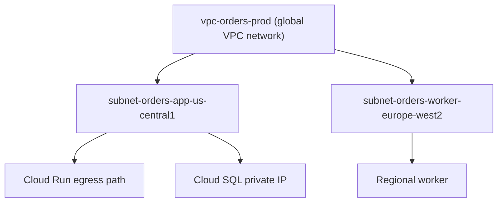

## Table of Contents

1. [The Problem](#the-problem)
2. [What Is a VPC](#what-is-a-vpc)
3. [Compared With AWS](#compared-with-aws)
4. [Global Network](#global-network)
5. [Regional Subnets](#regional-subnets)
6. [IP Ranges](#ip-ranges)
7. [Routes](#routes)
8. [Default Network](#default-network)
9. [Sample Topology](#sample-topology)
10. [Evidence](#evidence)
11. [Putting It All Together](#putting-it-all-together)
12. [What's Next](#whats-next)

## The Problem

A team deploys the Orders API to GCP. The first service works, the first database connects, and the first custom domain returns a page. Then someone asks a simple review question: where does private traffic actually live?

- The Cloud SQL instance has a private IP, but nobody can explain which network path reaches it.
- The app team says "it is in the VPC," but the Cloud Run service does not sit in a subnet the way a VM does.
- A new analytics worker needs private access in another region, and the team is not sure whether to create a second VPC.
- A firewall change looks correct, but the packet still has no route to the destination.

This article is the first map. A GCP VPC network gives resources a private network boundary and a route system. Subnets provide regional address ranges inside that network. Routes decide the next hop for traffic. Firewall rules decide whether a new connection is allowed after there is a path.

Keep one sentence in mind: in GCP, the VPC network is global, but each subnet is regional.

## What Is a VPC

A Virtual Private Cloud, usually called a VPC, is the private network you create inside Google Cloud. It is not a project, although a project owns it. It is not IAM, although identities control who may change it. It is the network map that gives resources private addresses, routes, firewall rules, and connectivity choices.

The VPC matters because cloud resources need a place to stand. A VM with a private address, a private Cloud SQL connection, a VPC connector, or a private service endpoint all depend on a network path. Without a deliberate VPC shape, teams often debug symptoms one service at a time: a database timeout here, a custom domain issue there, a private API call somewhere else.

The healthier habit is to name the traffic story first:

| Question | VPC concept that answers it |
| --- | --- |
| Where do private addresses come from? | Subnet IP ranges |
| Can this destination be reached at all? | Routes |
| Is the new connection allowed? | Firewall rules or service-level ingress controls |
| Is this managed service inside my subnet? | Private access pattern |
| Does identity allow the API call? | IAM, separate from networking |

A VPC does not automatically solve every row. It gives you the row labels so the review is not a blur.

## Compared With AWS

If you learned AWS first, the first GCP surprise is scope. An AWS VPC is regional. A GCP VPC network is global. That means one GCP VPC can contain subnets in multiple regions, such as `us-central1` and `europe-west2`, under the same network object.

The second surprise is that "same VPC" does not mean "same subnet shape." GCP subnets are regional. A subnet in `us-central1` does not place resources in `europe-west2`. If the Orders API later needs a regional worker in London, the team can keep the same VPC network but still create a regional subnet for that worker.

The third surprise is that serverless services do not behave like VMs. A Compute Engine VM attaches directly to a subnet through a network interface. Cloud Run uses service-level ingress for callers and a configured egress path when it needs to send traffic into a VPC. The network still matters, but the attachment point is different.

| Mental model | AWS starting point | GCP starting point |
| --- | --- | --- |
| Main network object | Regional VPC | Global VPC network |
| Subnet scope | Availability Zone | Region |
| VM placement | Subnet in an Availability Zone | Subnet in a region and zone placement for the VM |
| Serverless private egress | VPC connector or service-specific integration | Direct VPC egress or Serverless VPC Access |
| Public entry | Load balancer, DNS, certificate | Cloud Run URL or load balancer with DNS and certificate |

The point is to avoid importing the wrong scope into your design review.

## Global Network

A GCP VPC network is global. You create the network once, then add subnets in the regions where resources need private address space. That global scope is useful when a system grows across regions because routing and firewall policy can be reasoned about at the network level.

Global does not mean traffic is free, instant, or automatically resilient. Regional resources still live in regions. Latency, service availability, quotas, data residency, and cost still matter. The global VPC gives the private network a shared control plane, not a promise that every resource is equivalent everywhere.

For the Orders API, a first production design might use one VPC network named `vpc-orders-prod`. The web entry is global later, but the first app and database live in `us-central1`. If the team adds a worker in `europe-west2`, that worker can use a new regional subnet in the same VPC network instead of forcing a second network on day one.



The diagram is small on purpose. Before choosing firewall rules or private service options, the team should be able to point to the network object and the regional subnets that belong to it.

## Regional Subnets

A subnet is a regional IP range inside a VPC network. It is where many resources receive private addresses. A subnet named `subnet-orders-app-us-central1` should tell you three things: this is for the Orders app, it is in `us-central1`, and it belongs to the app tier.

Names help humans, but the range and region make the subnet real. If a VM or connector needs an address in `us-central1`, it needs a subnet in `us-central1`. If another resource lives in `europe-west2`, a `us-central1` subnet does not become regional just because the VPC is global.

This is the clean split:

| Layer | Scope | Example | What it answers |
| --- | --- | --- | --- |
| VPC network | Global | `vpc-orders-prod` | Which private network is this system using? |
| Subnet | Regional | `subnet-orders-app-us-central1` | Which regional address range can resources use? |
| Resource | Zonal, regional, or global depending on service | VM, Cloud Run service, Cloud SQL instance | Where does this workload or managed service live? |

The mistake to avoid is treating a subnet as a folder. It is not a folder for resources. It is an address range and placement boundary. Some resources attach directly to it. Others, like Cloud Run, use it through configured egress mechanisms.

## IP Ranges

Every subnet has a primary IP range. It may also have secondary ranges, often used by services such as GKE. The important beginner question is whether the range is large enough, non-overlapping, and reserved for the right purpose.

Private IP ranges are easy to type and hard to unwind. If `10.0.0.0/24` looks tidy for one demo, it may be too small once the team adds connectors, services, workers, and future regions. If the range overlaps with a VPN, another VPC, or an on-premises network, private connectivity becomes painful because routers cannot tell which side owns the same address.

For a teaching example, use a readable plan:

| Range | Use |
| --- | --- |
| `10.30.0.0/16` | Whole production VPC allocation |
| `10.30.10.0/24` | App subnet in `us-central1` |
| `10.30.20.0/24` | Data-facing private subnet in `us-central1` |
| `10.30.110.0/24` | Worker subnet in `europe-west2` |

The exact numbers matter less than the habit: reserve space by system, region, and tier before the network becomes a pile of one-off ranges.

## Routes

Routes decide where packets go next. A route has a destination range and a next hop. When traffic leaves a resource, GCP chooses the most specific matching route and sends the packet toward that next hop.

Every VPC includes routes that let resources reach subnet ranges in the network. Other routes may send traffic to the internet, a VPN tunnel, a peering connection, a Cloud NAT path, or another next hop. Firewall rules do not create a route. They only allow or deny traffic that already has a path.

That distinction helps with troubleshooting. If the Orders API cannot reach a private database address, asking only "is the firewall open?" is too narrow. First ask whether the destination is in a subnet or private service range the VPC can route to. Then ask whether the relevant rule or service setting allows the connection.

| Symptom | First network question |
| --- | --- |
| Private IP times out | Is the destination range routable from this network path? |
| Internet call fails from a private workload | Is there an egress route or NAT path for the destination? |
| Google API call fails | Is this a network path problem, an IAM problem, or both? |
| Another region cannot reach a service | Does the target have a regional subnet/path and service-level ingress that allows it? |

Routes are the map lines. Firewall rules are the gates on those lines. Keep them separate in your head.

## Default Network

Many projects have a default network, depending on organization policy and project setup. The default network can be useful for learning because it gives you a network quickly. It is not a production design by itself.

The risk is that defaults hide decisions. A team can launch resources, accept generated firewall rules, and end up with a network that nobody intentionally designed. Later, when security review asks why a rule exists or why a subnet range was chosen, the answer becomes "because it was already there."

For production learning, create the network shape on purpose:

| Default habit | Production habit |
| --- | --- |
| Use whatever network exists | Name the VPC for the system and environment |
| Accept broad starter rules | Add only the paths the app needs |
| Let ranges appear over time | Reserve non-overlapping ranges by region and tier |
| Debug per service | Review route, rule, service ingress, and IAM separately |

This does not mean every small project needs a huge network program. It means the network should be explainable before it becomes important.

## Sample Topology

Imagine the Orders API starts in one region. Users reach it over HTTPS. The app runs on Cloud Run. It needs private access to Cloud SQL, and it calls Google APIs for logs, secrets, and storage.

The first topology might look like this:

| Piece | Example | Why it exists |
| --- | --- | --- |
| Project | `orders-prod-123` | Owns the resources and billing boundary |
| VPC network | `vpc-orders-prod` | Shared private network map |
| App subnet | `subnet-orders-app-us-central1` | Regional private range for app egress paths and attached resources |
| Private service range | `range-orders-services` | Reserved range for managed service private access when needed |
| Public entry | Cloud Run URL or load balancer | Receives user traffic over HTTPS |
| Private dependency | Cloud SQL private IP | Keeps database traffic off a public database address |

The topology does not answer every security question yet. It does answer the first one: what is the map? Once that is clear, firewall rules, load balancer entry, Cloud Run ingress and egress, and managed service private access have somewhere to attach.

## Evidence

Good network review leaves evidence that a teammate can read later. The evidence should show scope, ranges, and paths.

For a VPC article, the useful artifacts are small:

```text
network: vpc-orders-prod
mode: custom
subnet: subnet-orders-app-us-central1
region: us-central1
primary range: 10.30.10.0/24
routes reviewed: local subnet routes, default egress route, private service route
```

The exact command output is less important than the questions it answers. Does the network exist? Which subnets are in it? Which region owns each subnet? Which ranges are reserved? Which routes will match the traffic?

When the answer is "the app is in the VPC," ask for this evidence. It turns a vague claim into a map.

## Putting It All Together

Return to the opening problems.

The Cloud SQL private IP needs a VPC path and, usually, a private access pattern that makes the managed database reachable from the right network. The next articles will unpack that path.

Cloud Run uses a service-specific network attachment model instead of sitting inside a subnet like a VM. It has ingress settings for callers and egress settings for outbound traffic. The VPC still matters, but the attachment mechanism is service-specific.

The worker in another region does not automatically need a second VPC. In GCP, a single VPC network can contain regional subnets in multiple regions. The team should add a regional subnet deliberately and review latency, data, and cost.

The firewall change cannot fix a missing route. Routes decide next hop. Rules decide allowed packets. IAM decides API permission. Keeping those three checks separate is the beginning of sane GCP networking.

## What's Next

The VPC gives the system a map, but the map does not say which new connections should be allowed. Next, we look at GCP firewall rules: direction, priority, targets, sources, implied defaults, and the difference between network access and IAM permission.

---

**References**

- [Google Cloud: Virtual Private Cloud overview](https://cloud.google.com/vpc/docs/vpc)
- [Google Cloud: Subnets](https://cloud.google.com/vpc/docs/subnets)
- [Google Cloud: Routes](https://cloud.google.com/vpc/docs/routes)
