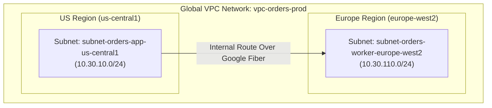

## Table of Contents

1. [What Is a VPC](#what-is-a-vpc)
2. [Global Network Scope vs. AWS and Azure](#global-network-scope-vs-aws-and-azure)
3. [Auto Mode and Custom Mode](#auto-mode-and-custom-mode)
4. [Regional Subnets](#regional-subnets)
5. [Subnet IP Space and Reserved Addresses](#subnet-ip-space-and-reserved-addresses)
6. [VPC Routing Mechanics](#vpc-routing-mechanics)
7. [Putting It All Together](#putting-it-all-together)
8. [What's Next](#whats-next)

## What Is a VPC

A GCP Virtual Private Cloud (VPC) is a software-defined private network boundary for cloud resources. It gives workloads private IP space, subnet placement, routing tables, firewall policy, and private connectivity patterns without requiring your team to operate physical routers.

When you build applications in the cloud, your virtual machines, databases, and containerized workloads need to communicate with one another. A VPC network gives your virtual machines private internal IP addresses, determines which paths traffic can take to reach different subnets, enforces firewall rules, and establishes private connections to managed databases. Without a deliberate VPC network, your resources would exist in a fragmented environment where they could not coordinate privately. A VPC network integrates these resources into a single network map so private requests follow defined routes instead of depending on public endpoints.

A VPC network in Google Cloud operates as a global virtual network. Although it belongs to a single Google Cloud project, its reach is worldwide. It acts as the shared virtual backbone upon which all regional subnets, routing rules, and security policies are evaluated.
## Global Network Scope vs. AWS and Azure

GCP VPC scope defines where the network object exists before you create subnets inside it. For engineers transitioning from Amazon Web Services (AWS) or Microsoft Azure, the most critical architectural difference is scope. In AWS, a VPC is strictly regional, meaning it is confined to a single AWS region. To connect resources in two different AWS regions privately, you must establish and maintain complex peering connections, VPN tunnels, or AWS Transit Gateways. Similarly, an Azure Virtual Network (VNet) is a regional resource, requiring VNet peering across regions.

*The network boundary spans regions, but IP ranges still belong to regions.*

In contrast, a GCP VPC network is natively global. A single VPC network object spans every physical region worldwide. You can provision a subnet in `us-central1` and another subnet in `europe-west2` inside the same VPC network without setting up any cross-region peering or transit brokers. Resources in these subnets can communicate privately out of the box, using their private internal IP addresses.

This global scope dramatically simplifies multi-region architectures, allowing teams to reason about routing, auditing, and firewall policies at the network level rather than managing separate regional gateways. However, this global control plane does not mean that cross-region traffic is free, instantaneous, or immune to latency. Packet transit between regions still travels physical distances over fiber optic cables, incurring latency and data transfer costs.

## Auto Mode and Custom Mode

Auto mode and custom mode decide whether GCP creates regional subnets for you or whether your team designs each subnet deliberately. Auto mode creates one subnet in each region using predefined IP ranges. This is convenient for quick experiments because you can launch a VM without designing subnet CIDR blocks first.

Production networks usually use custom mode. In custom mode, you create only the subnets you need and choose the IP ranges yourself. This makes the network easier to review, prevents accidental address overlap with VPNs and peer networks, and keeps unused regions from quietly receiving address space.

## Regional Subnets

A subnet is a regional IP address range inside the global VPC network. Although the VPC network is global, the subnets you create inside it are regional. A subnet represents a designated IP address range bound to a single GCP region, such as `us-central1`.

Resources like Compute Engine virtual machines attach directly to subnets and receive private IP addresses from the subnet's range. Other regional services, such as Cloud Run, interact with subnets using direct VPC egress interfaces.

A subnet cannot span multiple regions. If you have workloads in both Iowa (`us-central1`) and London (`europe-west2`), you must provision at least two distinct subnets—one in each region—and assign each subnet a non-overlapping CIDR block.

This regional scope aligns directly with Azure's subnet architecture but differs fundamentally from AWS subnets, which are zonal resources confined to a single Availability Zone. In AWS, you must manage and pair subnets across zones for high-availability; in GCP, a single subnet covers all zones within the region automatically, simplifying your IP planning.

## Subnet IP Space and Reserved Addresses

Subnet IP space is the finite private address pool that workloads consume when they attach to a subnet. Every subnet requires a primary IPv4 CIDR range, such as `10.30.10.0/24`, which provides 256 logical addresses. When planning subnet allocations, engineers must account for reserved IP addresses.

In GCP, every subnet reserves exactly four IP addresses for internal infrastructure services. For a subnet allocated with the CIDR block `10.30.10.0/24`, the reserved addresses are:

*   **`10.30.10.0`**: The network address, which identifies the subnet itself.
*   **`10.30.10.1`**: The default gateway, used to route traffic out of the subnet.
*   **`10.30.10.254`**: Reserved by Google Cloud for future use.
*   **`10.30.10.255`**: The broadcast address.

This differs from AWS, which reserves five IP addresses per subnet. Azure similarly reserves five IP addresses per subnet, including the first three and last two addresses. The metadata server is not one of the subnet's last usable addresses; Google Cloud metadata is reached at `169.254.169.254` or `metadata.google.internal`.

## VPC Routing Mechanics

VPC routing is the table-driven decision that selects the next hop for a packet based on its destination IP address. In GCP, routes are managed in a centralized, global routing table associated with the VPC network.

*Routing behavior is attached to the network plan, not hidden inside each server.*

When a subnet is created, the control plane automatically populates the routing table with system-generated local routes. These local routes allow all subnets inside the VPC network to communicate with each other globally by default, regardless of which region they sit in.

Custom routes can be added to direct traffic to external destinations, virtual appliances, VPN tunnels, or VPC peering gateways. The routing engine evaluates the global routing table using the longest prefix match (LPM) rule. If a packet's destination matches multiple routes, the router chooses the most specific route (the one with the largest CIDR prefix mask). If the masks are identical, the router evaluates the route priority (lower numbers have higher priority).

Google describes VPC routing as distributed virtual routing. System-generated subnet routes let resources in different subnets of the same VPC communicate by internal IP, and custom routes can override or extend paths when needed. BGP belongs to dynamic routing features such as Cloud Router, VPN, and hybrid network exchange, not to the basic explanation of how every subnet route appears.

Because the VPC is global, a VM in London can have an internal route to a subnet in Iowa without you creating a separate cross-region peering connection. However, cross-region transit is still physically bounded by distance, regional capacity, and data transfer pricing. A global network object simplifies route management; it does not make distant regions feel local.

Unlike AWS and Azure where routing tables are strictly regional and bound to individual networks, GCP's global routing table dynamically distributes local paths across all regions out of the box, removing the administrative overhead of cross-region routing maps.

## Putting It All Together

Let's return to the opening challenge: establishing a secure, multi-region private transit topology.

A global VPC network allows you to link all regions together under a single administrative and policy control plane. By provisioning non-overlapping regional subnets, you allocate clean address blocks for workloads in their respective geographic zones.

System-generated routes handle the basic private paths between subnets in the same VPC. Custom routes handle special cases such as VPNs, appliances, and alternate next hops. This leaves you to focus on address planning, route intent, and restricting access at the boundaries using firewall rules.

## What's Next

Once your VPC network has a defined map and routing tables, the next security gate is packet access control. In the next article, we will analyze GCP firewall rules, detailing direction, priority, stateful return traffic, and service account targets.

*Use this summary as the quick mental checklist before designing or debugging the service.*

---

**References**

- [Google Cloud: Virtual Private Cloud overview](https://cloud.google.com/vpc/docs/vpc) - Core architecture guide for GCP VPC networks.
- [Google Cloud: Subnets](https://cloud.google.com/vpc/docs/subnets) - Specification for subnet allocations and reserved IP addresses.
- [Google Cloud: Routes](https://cloud.google.com/vpc/docs/routes) - Explanation of dynamic routing tables and prefix matching mechanics.
