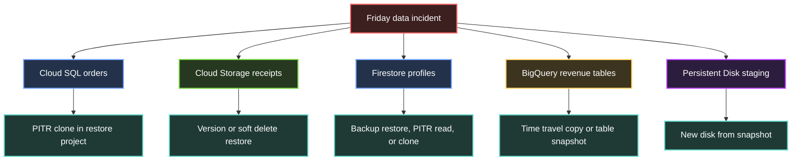

## Table of Contents

1. [The Recovery Story](#the-recovery-story)
2. [RPO, RTO, and Restore Targets](#rpo-rto-and-restore-targets)
3. [Cloud Storage Versions, Soft Delete, and Retention](#cloud-storage-versions-soft-delete-and-retention)
4. [Cloud SQL Backups, PITR, and Clones](#cloud-sql-backups-pitr-and-clones)
5. [Firestore Backups, PITR, and Exports](#firestore-backups-pitr-and-exports)
6. [BigQuery Time Travel, Snapshots, and Partitions](#bigquery-time-travel-snapshots-and-partitions)
7. [Persistent Disk Snapshots for VM Data](#persistent-disk-snapshots-for-vm-data)
8. [Restore Sandboxes and Validation](#restore-sandboxes-and-validation)
9. [Deletion Guardrails and Ownership](#deletion-guardrails-and-ownership)
10. [Restore Drills and Operating Rhythm](#restore-drills-and-operating-rhythm)
11. [Putting It All Together](#putting-it-all-together)

## The Recovery Story
<!-- section-summary: A good recovery plan names the data, the accident, the previous copy, and the place where the team proves the restore. -->

Imagine a small retail platform running on Google Cloud. The checkout service stores orders in a Cloud SQL for PostgreSQL instance called `orders-prod`. Receipt PDFs land in a Cloud Storage bucket called `orders-receipts-prod`. Customer support notes live in Firestore, analytics tables live in BigQuery, and an old worker VM still writes export batches to a Persistent Disk before another job uploads them.

One Friday afternoon, several mistakes arrive close together. A bad deployment writes `0.00` into the amount field for thousands of orders. A cleanup job deletes a folder of receipt PDFs. A support automation overwrites Firestore customer profiles with stale loyalty data. An analyst replaces a BigQuery revenue table with an incomplete query result. The VM worker also corrupts a local staging directory before the team notices the alert.

Replication and durability protect the platform from disk failures, machine failures, and some zone failures. They also copy valid writes and bad writes very quickly. If an application sends the wrong update, the storage system usually preserves that wrong update with excellent reliability, so the team needs separate previous copies that survive outside the active write path.

That is the job of **backups and retention**. A backup gives the team a copy from a previous point in time. A retention rule decides how long that copy survives. A restore process turns that copy into something usable again. A restore drill proves the process before customers, auditors, and incident commanders need it.

Here is the recovery map for the retail platform:



Notice the shape. Each data system has its own recovery tool because each system stores changes differently. Object storage has generations and soft-deleted objects. Databases have backups and transaction logs. Analytics tables have time travel and snapshots. VM disks have block snapshots. The senior engineering habit is matching the incident to the right previous copy.

## RPO, RTO, and Restore Targets
<!-- section-summary: RPO says how much data the business can lose, RTO says how long recovery can take, and the restore target keeps recovery away from production until validation passes. -->

Before choosing a Google Cloud feature, the team needs two simple numbers. **Recovery Point Objective**, usually called **RPO**, means the maximum amount of data change the business can lose. **Recovery Time Objective**, usually called **RTO**, means the maximum time the business can spend getting the service back into a usable state.

For the retail platform, the `orders-prod` database may need an RPO of five minutes because every paid order matters. The analytics aggregate table may tolerate an RPO of one day because the raw clickstream can rebuild it overnight. The receipt PDFs may need a retention window of months or years because customers, finance, and compliance teams ask for those files long after checkout.

RPO and RTO sound abstract until someone writes them next to real data. A practical recovery table might look like this:

| Data set | Main failure | Recovery tool | Example target |
|---|---|---|---|
| Cloud SQL orders | Bad write or dropped table | Automated backups plus PITR clone | RPO 5 minutes, RTO 1 hour |
| Cloud Storage receipts | Accidental overwrite or folder delete | Object Versioning, soft delete, retention policy | Recover files within 30 days, preserve locked receipts for 7 years |
| Firestore support profiles | Bad automation write | Scheduled backup, PITR read/export, or clone | Recover profile state from earlier today |
| BigQuery revenue tables | Bad replace query or expired table | Time travel copy, table snapshot, rebuild from raw facts | Restore dashboard table within 2 hours |
| Persistent Disk staging | VM script corrupts local files | Scheduled standard snapshot | Create a new disk from last good snapshot |

The third concept is the **restore target**. A restore target is the project, instance, bucket, dataset, or disk where recovered data lands first. In production teams, the first target should usually be a **restore sandbox**, such as a separate project named `commerce-restore`, because a restore can overwrite data, trigger jobs, or confuse applications if it lands directly in production.

So the team does three things before the incident. It names the RPO and RTO for each data set. It chooses the Google Cloud recovery feature that can meet those numbers. It defines a restore target where people can inspect recovered data without touching the live system.

## Cloud Storage Versions, Soft Delete, and Retention
<!-- section-summary: Cloud Storage protects objects with different layers: versions for overwrites, soft delete for recent deletes, lifecycle rules for cost control, and retention policies for delete prevention. -->

Cloud Storage stores objects such as PDFs, images, export files, raw event archives, and database dumps. An **object generation** is the unique version number Cloud Storage gives an object write. If the retail platform uploads `receipts/2026/06/order-90210.pdf` twice, the object name stays familiar, but the generation number lets Cloud Storage distinguish the older bytes from the newer bytes.

**Object Versioning** keeps old object generations as noncurrent versions after a live object gets replaced or deleted. This helps with a common mistake: an application uploads a broken receipt PDF over a good one. With versioning turned on, the team can copy the previous generation back to the live object name after it identifies the generation it wants.

A production setup can turn on versioning and inspect older generations with commands like these:

```bash
gcloud storage buckets update gs://orders-receipts-prod --versioning

gcloud storage ls --all-versions gs://orders-receipts-prod/receipts/2026/06/

gcloud storage cp \
  gs://orders-receipts-prod/receipts/2026/06/order-90210.pdf#GENERATION_NUMBER \
  gs://orders-receipts-prod/receipts/2026/06/order-90210.pdf
```

Versioning protects against many overwrites, but Cloud Storage also gives teams **soft delete** for recent object and bucket deletes. Google Cloud creates new buckets with soft delete turned on by default, and the default duration is seven days unless a user or organization policy changes it. During the soft delete window, Cloud Storage keeps deleted objects or buckets in a recoverable state, then permanently deletes them after the window ends.

The receipt bucket may use a 30-day soft delete window because support teams often notice accidental deletes within a month. The team can configure and verify that policy like this:

```bash
gcloud storage buckets update \
  gs://orders-receipts-prod \
  --soft-delete-duration=30d

gcloud storage buckets describe \
  gs://orders-receipts-prod \
  --format="default(soft_delete_policy)"
```

During the Friday incident, the cleanup job deletes `receipts/2026/06/order-90210.pdf`. The recovery runbook lists soft-deleted versions for that object and restores the generation that matches the incident timeline:

```bash
gcloud storage ls \
  gs://orders-receipts-prod/receipts/2026/06/order-90210.pdf \
  --soft-deleted

gcloud storage restore \
  gs://orders-receipts-prod/receipts/2026/06/order-90210.pdf#GENERATION_NUMBER
```

The bucket also needs cost control. Object Versioning can keep many noncurrent generations, so production teams pair it with **Object Lifecycle Management**. A lifecycle rule can delete noncurrent versions after a chosen age, while soft delete still gives an additional recent-deletion recovery window.

```json
{
  "rule": [
    {
      "action": {
        "type": "Delete"
      },
      "condition": {
        "isLive": false,
        "age": 90
      }
    }
  ]
}
```

```bash
gcloud storage buckets update \
  gs://orders-receipts-prod \
  --lifecycle-file=receipt-lifecycle.json
```

Some receipt files also have legal retention requirements. A **retention policy** stops objects from deletion or replacement until they reach the required age. A **locked retention policy** gives stronger compliance protection because, after the team locks it, nobody can remove the policy or shorten the retention period.

The lock deserves a careful change process. Teams usually test the policy on a non-production bucket, confirm lifecycle behavior, confirm application uploads, and confirm restore drills before locking the production bucket. The command exists for the final step, but the human process around it matters because Google Cloud treats the lock as irreversible:

```bash
gcloud storage buckets update \
  gs://orders-receipts-prod \
  --retention-period=2555d

gcloud storage buckets update \
  gs://orders-receipts-prod \
  --lock-retention-period
```

The simple rule for Cloud Storage is this: **versions recover older object contents, soft delete recovers recent deletes, retention policies prevent early removal, and lifecycle rules keep old generations from growing forever**. A real receipt bucket often needs all four, with separate IAM roles for people who upload, people who restore, and people who approve retention changes.

## Cloud SQL Backups, PITR, and Clones
<!-- section-summary: Cloud SQL recovery uses backups for base copies, transaction logs for PITR, and clones or restored instances for sandbox validation. -->

Cloud SQL runs managed MySQL, PostgreSQL, and SQL Server. For the retail platform, the most important failure is a logical database mistake: a migration, admin script, or application release writes the wrong values into valid tables. High availability can keep the database online during infrastructure failures, yet it still accepts application writes, including bad ones.

**Automated backups** give Cloud SQL regular database copies. **Point-in-time recovery**, usually shortened to **PITR**, uses retained transaction logs so the team can recover to a specific timestamp inside the log retention window. The base backup gives Cloud SQL a starting point, and the logs move the database forward to the requested recovery time.

For PostgreSQL, a team might enable automated backups and PITR on `orders-prod`, then set retained transaction log days according to the business RPO:

```bash
gcloud sql instances patch orders-prod \
  --backup-start-time=03:00

gcloud sql instances patch orders-prod \
  --enable-point-in-time-recovery

gcloud sql instances patch orders-prod \
  --retained-transaction-log-days=7
```

Cloud SQL editions and backup options affect the exact retention range. The important production habit is documenting the chosen window next to the application risk. A five-minute RPO on orders has little value if the instance keeps too few logs or if nobody has tested a restore to the timestamp format the runbook uses.

During the Friday incident, logs show the bad deployment began writing corrupted rows at `2026-06-12T14:18:30Z`. The database team chooses `2026-06-12T14:18:00Z` as the recovery point and creates a new target instance in the agreed restore target. The exact project and network belong in the runbook because Cloud SQL target options depend on the backup option and organization design.

```bash
gcloud sql instances clone orders-prod orders-restore-20260612 \
  --point-in-time="2026-06-12T14:18:00Z"
```

That clone gives the team a safe place to query the recovered orders. The team can compare row counts, inspect a sample of paid orders, and export selected rows back into production if the live database only needs a narrow data repair. If the production database needs a full rollback, the team still validates the clone first, then plans the application cutover, connection string update, traffic pause, and rollback path.

Here is a small validation query set that belongs in the restore runbook:

```sql
SELECT COUNT(*) AS zero_amount_orders
FROM orders
WHERE amount = 0.00
  AND created_at >= TIMESTAMP '2026-06-12 14:18:00+00';

SELECT status, COUNT(*) AS orders
FROM orders
WHERE created_at >= TIMESTAMP '2026-06-12 00:00:00+00'
GROUP BY status
ORDER BY status;

SELECT order_id, amount, status, updated_at
FROM orders
WHERE order_id IN ('90210', '90211', '90212')
ORDER BY order_id;
```

Notice how Cloud SQL recovery combines engineering and operations. The Google Cloud feature gives the previous database state, while the team supplies the timestamp, the sandbox, the validation queries, and the application cutover plan. That is the difference between "we have backups" and "we can restore this service under pressure."

## Firestore Backups, PITR, and Exports
<!-- section-summary: Firestore has scheduled backups for database-level restore, PITR for recent historical reads or clones, and exports for long-lived portability. -->

Firestore stores documents rather than relational rows. The retail platform uses it for customer support profiles because the support UI needs flexible fields such as loyalty notes, contact preferences, and recent case summaries. The Friday incident changes thousands of `customers/{id}` documents with stale loyalty data, so the team needs a previous version of those documents.

Firestore gives teams several recovery paths. **Scheduled backups** create consistent database copies on a daily or weekly schedule, and a restore creates a new database from a backup. The backup includes data and index configurations at that point in time, while Google documents separate exclusions such as TTL policies and Firebase Security Rules.

A team can configure a daily backup schedule with a retention period like this:

```bash
gcloud firestore backups schedules create \
  --database='(default)' \
  --recurrence=daily \
  --retention=14w
```

Firestore also supports **point-in-time recovery**. With PITR enabled, Firestore keeps older versions for seven days; without PITR, the older-version window is one hour. Teams can use PITR for historical reads, exports, and clone-style recovery flows, depending on the operation they need and the permissions their operators hold.

For the retail platform, the response may use two paths. If the team needs to recover the whole profile database from the previous night, a scheduled backup restore into a new database gives a clean inspection target. If the team only needs the values from one hour before the bad automation, PITR can read or export data at that point and let the team repair only affected documents.

The first runbook question is scope. Whole database recovery usually points at a backup restore. Narrow document repair usually points at PITR reads or an export from a historical timestamp. Long-term migration or audit copies often use Firestore export to Cloud Storage because export files can live under a separate bucket retention strategy.

Here is a production-style Firestore recovery checklist for the support profile incident:

| Question | Why it matters |
|---|---|
| Which collection paths changed? | Narrowing to `customers/*/supportProfile` may avoid a full database rollback. |
| Which timestamp marks the last good profile state? | PITR and backup restore both need a precise recovery point or backup name. |
| Which database receives the restore or clone? | The restored data needs isolation before engineers compare it with live data. |
| Which fields can merge safely into production? | Profile repair may update loyalty fields while preserving new support notes. |
| Which job caused the write? | Recovery without disabling the bad writer can corrupt the repaired documents again. |

Firestore recovery has one practical wrinkle that junior engineers often miss. Restoring or cloning data can give the team the old documents, but the application still needs a careful merge plan if production received valid writes after the incident. A support note added after the bad loyalty update may be real customer history, so the recovery script should target the corrupted fields rather than blindly copying whole documents over live ones.

## BigQuery Time Travel, Snapshots, and Partitions
<!-- section-summary: BigQuery recovery usually copies historical table data, restores snapshots, or rebuilds derived tables from protected raw facts. -->

BigQuery stores analytical data, so its recovery path differs from application database recovery. The retail platform stores raw checkout events in `commerce_raw.events`, modeled tables in `commerce_mart`, and dashboard aggregates in `commerce_reporting`. When the analyst replaces `commerce_reporting.daily_revenue` with an incomplete query result, customers can still place orders, but executives and finance teams now see wrong numbers.

**Time travel** lets BigQuery query or restore table data that changed or disappeared within the dataset's time travel window. Google documents seven days as the default window, and teams can use GoogleSQL `FOR SYSTEM_TIME AS OF` to query a historical table version. This is excellent for asking, "What did the table contain one hour before the bad query?"

```sql
SELECT order_date, gross_revenue, order_count
FROM `commerce_reporting.daily_revenue`
  FOR SYSTEM_TIME AS OF TIMESTAMP_SUB(CURRENT_TIMESTAMP(), INTERVAL 2 HOUR)
WHERE order_date >= DATE '2026-06-01'
ORDER BY order_date;
```

For restore, the team usually copies historical table data into a new table first. That keeps the inspection step clear and gives analysts a stable table name for validation:

```bash
bq cp \
  commerce_reporting.daily_revenue@-7200000 \
  commerce_restore.daily_revenue_before_incident
```

**Table snapshots** help with planned protection. A BigQuery table snapshot is a read-only table that preserves a table at a specific time. Google recommends creating snapshots in a different dataset from the base table so a dataset deletion leaves a separate restore path for the base table.

```sql
CREATE SNAPSHOT TABLE `commerce_recovery_snapshots.daily_revenue_20260612`
CLONE `commerce_reporting.daily_revenue`
OPTIONS (
  expiration_timestamp = TIMESTAMP_ADD(CURRENT_TIMESTAMP(), INTERVAL 30 DAY)
);
```

BigQuery teams also think about **partitions**. A partitioned table stores data in date, timestamp, integer-range, or ingestion-time slices. If a bad job only changed `2026-06-12`, the recovery might copy one partition or rebuild one date range rather than replacing the entire table.

The strongest analytics recovery plan keeps raw facts safer than derived tables. Raw event tables can use narrow write paths, careful IAM, dataset-level controls, and export or snapshot policies. Derived tables can then rebuild from raw facts with versioned SQL, scheduled pipelines, and validation queries. This keeps the expensive recovery work focused on the business source of truth.

For the Friday incident, the team first queries `daily_revenue` from two hours earlier, copies that historical data into `commerce_restore`, and compares totals against raw events. If the raw event tables survived, the team can rebuild the aggregate cleanly. If the raw tables changed too, table snapshots and dataset restore procedures give the team the next recovery path.

## Persistent Disk Snapshots for VM Data
<!-- section-summary: Persistent Disk snapshots protect VM disks by creating restorable block-level backups, and the restore creates a new disk rather than changing the source disk. -->

Modern application data should usually live in managed databases, object stores, or analytics systems, but real platforms often keep a few VM disks around. The retail platform has an export worker that stages files on a Persistent Disk before uploading them to Cloud Storage. A script bug can corrupt that staging directory or delete files before the upload step runs.

A **Persistent Disk snapshot** captures disk data so Compute Engine can create a new disk from that snapshot later. Standard snapshots and archive snapshots live separately from the source disk and continue to exist after the source disk disappears. Google documents standard snapshots as incremental, which makes regular schedules more practical than full disk copies every time.

Snapshot type matters for recovery expectations. Instant snapshots help with fast local rollback from user error or application corruption, but they stay tied to the source disk location and lifecycle. Standard snapshots and archive snapshots provide remote backup copies; standard snapshots suit regular restore needs, and archive snapshots suit long retention where access happens rarely.

A VM disk runbook might create a scheduled snapshot policy for the staging disk:

```bash
gcloud compute resource-policies create snapshot-schedule worker-daily \
  --region=us-central1 \
  --daily-schedule \
  --start-time=03:00 \
  --max-retention-days=14

gcloud compute disks add-resource-policies worker-staging-disk \
  --zone=us-central1-a \
  --resource-policies=worker-daily
```

During restore, Compute Engine creates a new disk from the snapshot. The source disk stays as it was, which is exactly what the team wants during incident investigation. The recovered disk can attach to a quarantine VM where engineers inspect files without mounting it into the production worker.

```bash
gcloud compute snapshots list \
  --filter="sourceDisk~worker-staging-disk"

gcloud compute disks create worker-staging-restore-20260612 \
  --zone=us-central1-a \
  --source-snapshot=SNAPSHOT_NAME \
  --type=pd-balanced
```

Disk snapshots have a boundary that every team should say out loud. They capture blocks, so an application may still need database-level or filesystem-level steps for a clean, application-consistent recovery. For the staging disk, a crash-consistent snapshot may be fine because files either exist or the upload job retries. For a self-managed database on a VM, the team should use database-native backup procedures or carefully coordinate snapshots with the database.

## Restore Sandboxes and Validation
<!-- section-summary: A restore sandbox gives recovered data a safe landing zone where engineers can test integrity, permissions, and application behavior before production changes. -->

A **restore sandbox** is an isolated environment where restored data lands before it affects production. It can be a separate Google Cloud project, a separate VPC, a separate Cloud SQL instance, a separate BigQuery dataset, a different Firestore database, or a quarantine VM. The key idea is simple: recovered data needs inspection before the application trusts it.

For the retail platform, the sandbox project `commerce-restore` has its own IAM group, its own logging sink, and no production service account keys. Network rules block outbound calls to payment processors, email services, and customer webhooks. That prevents a restored application from sending old receipts, retrying old orders, or replaying support notifications.

The restore flow usually follows four steps:

| Step | What the team proves |
|---|---|
| Land the recovered copy | Cloud SQL clone, restored Firestore database, BigQuery copied table, Cloud Storage restored object, or new disk exists in the sandbox. |
| Validate data integrity | Counts, checksums, sample records, critical business invariants, and schema expectations match the last good point. |
| Validate application behavior | A read-only or isolated app version can load the data without calling external systems. |
| Choose the production repair | The team chooses targeted merge, full cutover, table replace, object restore, or rebuild from raw data. |

Validation should have commands, not just confidence. For Cloud SQL, the team can run SQL checks against the clone. For Cloud Storage, it can compare object sizes, checksums, and metadata. For BigQuery, it can compare aggregate totals between historical tables and raw events. For Firestore, it can sample repaired fields and compare write timestamps.

Here is a small mixed validation script that shows the idea:

```bash
gcloud storage objects describe \
  gs://orders-receipts-prod/receipts/2026/06/order-90210.pdf \
  --format="value(size,md5Hash)"

bq query --use_legacy_sql=false '
SELECT
  SUM(gross_revenue) AS revenue,
  SUM(order_count) AS orders
FROM `commerce_restore.daily_revenue_before_incident`
WHERE order_date = DATE "2026-06-12";
'
```

The team should record the result of each restore drill in an incident-style note. That note should include the source system, recovery point, target resource, operator, duration, validation evidence, and cleanup steps. A backup without a recent restore record leaves too much guessing for the real incident.

## Deletion Guardrails and Ownership
<!-- section-summary: Recovery improves when IAM, org policies, project liens, retention locks, and approval paths reduce who can delete the recovery path. -->

Backups help after damage, and guardrails reduce the chance that one person or one script destroys both production data and the recovery path. On Google Cloud, the most important guardrail is ownership separation. The account that writes receipts should not also control bucket retention locks. The data pipeline that writes BigQuery aggregates should not also delete raw event tables and recovery snapshots.

Cloud Storage gives several guardrail layers. Soft delete protects recent object and bucket deletes. Retention policies prevent early object deletion or replacement. Locked retention policies protect compliance buckets from later policy removal. IAM controls decide which humans and service accounts can update those settings, restore objects, delete versions, or manage lifecycle policies.

Project-level deletion also deserves attention. Cloud Storage soft delete cannot recover buckets and objects after the entire project disappears. For business-critical data, teams often limit project deletion permissions tightly, use project liens where appropriate, and keep recovery copies in a different project with a different owner group.

The IAM split can look like this:

| Role group | Normal permissions | Approval expectation |
|---|---|---|
| App writers | Write live objects, write database rows, run analytics pipelines | Normal deployment review |
| Data restorers | Restore soft-deleted objects, clone databases, create restore datasets | Incident commander or data owner approval |
| Retention admins | Change bucket retention, lifecycle, backup retention, snapshot policies | Change advisory review and audit ticket |
| Break-glass admins | Emergency access to projects and recovery controls | MFA, logging, short session, post-incident review |

The key habit is protecting the recovery path from the same mistake that damages production. A cleanup job that can delete live objects should have no permission to shorten soft delete duration. A BigQuery transformation job that replaces dashboard tables should have no permission to delete recovery snapshots. A CI/CD service account that deploys code should have no permission to remove Cloud SQL backups.

Guardrails also need audit. Cloud Audit Logs, Cloud Logging sinks, Monitoring alerts, and Security Command Center findings can alert on changes to backup policies, retention policies, snapshot schedules, and project deletion risk. The alert should tell the owner which recovery objective the change affects, because "backup policy changed" matters more when it means "orders RPO no longer meets five minutes."

## Restore Drills and Operating Rhythm
<!-- section-summary: Restore drills turn recovery settings into a practiced runbook with measured RPO, measured RTO, validation evidence, and cleanup. -->

A **restore drill** is a rehearsal where the team restores real or representative data into a safe target and measures the result. Google Cloud's reliability guidance recommends judging recovery tests by data integrity, RTO, and RPO. That matches how incident commanders think during a real data loss event: did we recover the right data, how much did we lose, and how long did it take?

For the retail platform, a quarterly drill can choose one data system each month and rotate through the full set over the quarter. January restores a Cloud SQL clone to a timestamp. February restores a receipt from Cloud Storage soft delete and a noncurrent generation. March creates a BigQuery table from time travel and validates it against raw events. April creates a disk from a snapshot and attaches it to a quarantine VM.

A useful drill record might use this format:

| Field | Example |
|---|---|
| Drill name | Cloud SQL orders PITR drill |
| Source | `orders-prod` |
| Recovery point | `2026-06-12T14:18:00Z` |
| Restore target | `commerce-restore:orders-restore-20260612` |
| Measured RPO | 30 seconds from last good order update |
| Measured RTO | 43 minutes to validated clone |
| Validation | Zero corrupted rows, status counts match expected range, sample orders verified |
| Cleanup | Clone deleted after export, temporary IAM access removed, runbook updated |

Teams should treat failed drills as useful findings. A failed drill may reveal missing IAM permissions, expired backups, slow clone times, unknown dataset owners, untested lifecycle rules, or queries that no longer match the schema. Every one of those findings is cheaper during a calm drill than during a customer-impacting incident.

The operating rhythm should also include policy review. Backup retention, soft delete duration, lifecycle rules, BigQuery snapshot expiration, Firestore backup schedules, and snapshot policies drift as products grow. A new marketplace integration may require longer receipt retention. A new analytics dataset may need snapshots because finance now uses it for reporting. A new privacy rule may require shorter retention for a different class of data.

Good recovery work combines platform settings with team habits. The platform keeps previous copies. The team keeps the runbooks, owners, access reviews, validation queries, and drill records current.

## Putting It All Together
<!-- section-summary: The complete recovery plan maps each data system to a protected previous copy, an isolated restore target, deletion guardrails, and a practiced restore drill. -->

The Friday incident gives the team five different recovery motions. Cloud SQL gets a PITR clone in `commerce-restore` at the timestamp before the bad deployment. Cloud Storage recovers deleted receipt PDFs from soft delete and older overwritten files from object generations. Firestore uses scheduled backups or PITR paths depending on whether the team needs whole-database recovery or targeted profile repair. BigQuery copies historical table data or restores snapshots, then rebuilds derived aggregates from protected raw facts. Persistent Disk creates a new disk from a snapshot and mounts it on a quarantine VM.

Those actions only work because the team prepared the recovery path before the incident. It gave the order database a small RPO and tested PITR. It gave receipts versioning, soft delete, lifecycle rules, and retention protection. It configured Firestore backups and understood the PITR window. It protected BigQuery raw data and created snapshots for important reporting tables. It scheduled disk snapshots for the VM that still holds local state.

The practical lesson is simple enough to carry into every storage design review. For each data set, ask which previous copy survives, how long it survives, who can delete it, where the restore lands first, and how the team proves the restored data. If nobody can answer those questions, the system has storage, but the team still lacks recovery.

Backups and retention close the storage and database module because they connect every earlier design choice to operational reality. A bucket, database, analytics table, or disk only protects the business when the team can recover from human mistakes, bad code, malicious deletion, and messy incidents with a practiced path back to valid data.

---

**References**

- [Cloud Storage soft delete](https://cloud.google.com/storage/docs/soft-delete) - Explains soft delete behavior, default retention, retention limits, propagation timing, and project deletion limits.
- [Set and manage Cloud Storage soft delete policies](https://cloud.google.com/storage/docs/use-soft-delete) - Documents the `--soft-delete-duration` command and soft delete policy management.
- [Restore soft-deleted Cloud Storage objects](https://cloud.google.com/storage/docs/use-soft-deleted-objects) - Shows how to list and restore soft-deleted objects and object generations.
- [Cloud Storage Object Versioning](https://cloud.google.com/storage/docs/object-versioning) - Explains object generations, noncurrent versions, and how versioning interacts with soft delete.
- [Use Cloud Storage versioned objects](https://cloud.google.com/storage/docs/using-versioned-objects) - Documents listing noncurrent versions and copying a generation back as the live object.
- [Cloud Storage lifecycle management](https://cloud.google.com/storage/docs/managing-lifecycles) - Shows lifecycle configuration for deleting noncurrent versions and managing object cost.
- [Use and lock Cloud Storage retention policies](https://cloud.google.com/storage/docs/using-bucket-lock) - Documents bucket retention periods, retention policy locks, and the irreversible lock behavior.
- [Cloud SQL backups overview for PostgreSQL](https://cloud.google.com/sql/docs/postgres/backup-recovery/backups) - Explains automated backups, on-demand backups, backup retention, and backup use in PITR.
- [Configure Cloud SQL PITR for PostgreSQL](https://cloud.google.com/sql/docs/postgres/backup-recovery/configure-pitr) - Documents enabling PITR and setting retained transaction log days.
- [Perform Cloud SQL PITR for PostgreSQL](https://cloud.google.com/sql/docs/postgres/backup-recovery/pitr) - Shows point-in-time clone and restore behavior for Cloud SQL instances.
- [Firestore backups](https://cloud.google.com/firestore/docs/backups) - Documents scheduled backups, retention, restore-to-new-database behavior, and backup schedule commands.
- [Firestore point-in-time recovery](https://cloud.google.com/firestore/native/docs/use-pitr) - Documents PITR permissions, retention windows, historical reads, exports, and clone permissions.
- [Firestore export and import](https://cloud.google.com/firestore/docs/manage-data/export-import) - Explains export and import workflows for Firestore data.
- [BigQuery time travel and fail-safe](https://cloud.google.com/bigquery/docs/time-travel) - Explains BigQuery time travel windows, fail-safe storage, and historical data retention.
- [BigQuery access historical data](https://cloud.google.com/bigquery/docs/access-historical-data) - Shows `FOR SYSTEM_TIME AS OF` queries and restoring historical table data.
- [BigQuery table snapshots](https://cloud.google.com/bigquery/docs/table-snapshots-intro) - Explains read-only table snapshots and restoring standard tables from snapshots.
- [Create BigQuery table snapshots](https://cloud.google.com/bigquery/docs/table-snapshots-create) - Documents snapshot creation and the recommendation to store snapshots in a different dataset.
- [Managing BigQuery partitioned tables](https://cloud.google.com/bigquery/docs/managing-partitioned-tables) - Documents partition metadata and partition management practices.
- [Compute Engine disk snapshots](https://cloud.google.com/compute/docs/disks/snapshots) - Explains standard, archive, and instant snapshots, incremental behavior, retention after source deletion, and restore boundaries.
- [Restore Compute Engine snapshots](https://cloud.google.com/compute/docs/disks/restore-snapshot) - Shows how snapshots create new disks for recovery.
- [Disaster recovery planning guide](https://cloud.google.com/architecture/dr-scenarios-planning-guide) - Explains end-to-end recovery planning from backup through restore and cleanup.
- [Testing recovery from data loss](https://cloud.google.com/architecture/framework/reliability/perform-testing-for-recovery-from-data-loss) - Recommends judging recovery tests by data integrity, RTO, and RPO.
