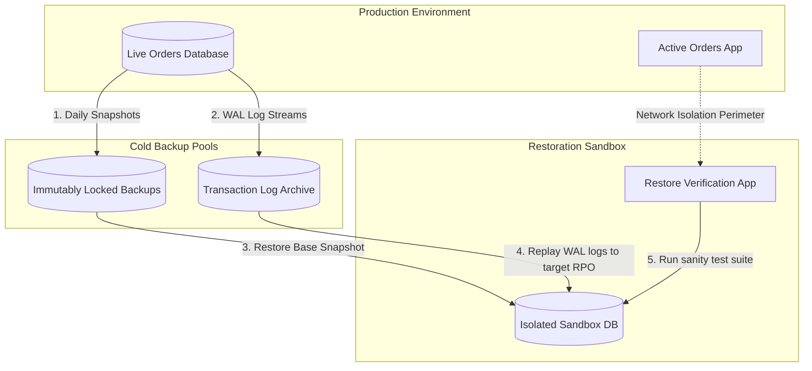

## Table of Contents

1. [Data Recovery Perimeters](#data-recovery-perimeters)
2. [Sandbox Recovery: Reversing Logical Database and Object Deletions](#sandbox-recovery-reversing-logical-database-and-object-deletions)
3. [Recovery Objectives and Snapshot Mechanics](#recovery-objectives-and-snapshot-mechanics)
4. [Cloud Storage Versioning and Retention Policies](#cloud-storage-versioning-and-retention-policies)
5. [Database Point-in-Time Recovery and Log Replay](#database-point-in-time-recovery-and-log-replay)
6. [BigQuery Time Travel and Analytics Partitions](#bigquery-time-travel-and-analytics-partitions)
7. [The Restoration Sandbox Model](#the-restoration-sandbox-model)
8. [Putting It All Together](#putting-it-all-together)
9. [What's Next](#whats-next)

## Data Recovery Perimeters

A recovery perimeter is the protected set of historical copies, versions, logs, snapshots, or restore targets that survive outside the active write path. When you store critical business data in the cloud, you are often told that your systems are highly durable and resilient. Durability refers to the physical preservation of your data against hardware failures, power outages, or physical disasters in a datacenter. Availability is a separate design choice. For example, Cloud SQL needs a high availability regional configuration before it uses a standby in another zone, and failover reduces downtime rather than making disruption invisible.


*A replica helps availability. A backup gives you a past version to restore.*

However, physical durability does not protect your business from mistakes, software bugs, or malicious actions. Because cloud replication is extremely fast and faithful, it replicates deletes and corruptions instantly. If an application update contains a bug that accidentally marks thousands of orders as paid with a zero-dollar amount, or if a clean-up script is run with a typo that deletes millions of customer receipt files, your durable storage infrastructure will execute those commands perfectly in milliseconds, deleting or corrupting the files across all of your datacenter replicas at the same time. In these scenarios, having multiple physical copies of your data does not save you; it simply means your data was corrupted in multiple places simultaneously.

This is why you need a separate backup and recovery architecture. Backups, versions, snapshots, and retained logs function as historical restore points that let operations teams recover a valid data state from before an accident occurred. This article explores how to design a comprehensive recovery strategy, comparing copy-on-write snapshots, continuous write-ahead log database rollbacks, soft-delete perimeters, and systematic restore drills. We will trace how these systems recover from real-world failures, mapping them directly to equivalent services across AWS and Azure, and examine under the hood how physical storage controllers track changes incrementally.

Architectural data failures commonly present as distinct recovery scenarios:
- An application release containing a logical bug writes incorrect transaction statuses across millions of active SQL rows, corrupting state history.
- A scheduled cleanup script with an improperly configured path wild-card deletes essential receipt PDF objects in a storage bucket.
- A misconfigured streaming pipeline overwrites real-time customer profile documents under identical primary keys in a document database.
- An analyst executes a bulk update on an analytics partition, replacing historical sales aggregates with incomplete data.

## Sandbox Recovery: Reversing Logical Database and Object Deletions

A recovery sandbox is an isolated environment where restored data can be inspected before anything touches production. To see these backup and soft-delete perimeters in action, consider a sandbox recovery scenario: on `2026-05-28` at `23:45:00 UTC`, a developer mistakenly runs an administrative SQL script in production that overwrites orders (`UPDATE orders SET amount = 0.00;`). Simultaneously, a support agent accidentally deletes a customer's critical receipt PDF (`invoice_user99.pdf`) from our `invoices-prod` bucket. We must restore our database to exactly one second before the corruption (`23:44:59 UTC`) and recover the deleted invoice.

First, we initiate a Point-in-Time Recovery (PITR) to restore the relational database state to an isolated sandbox instance (`orders-restore-sandbox`). This prevents overwriting the active production database, ensuring we can verify data integrity before performing a connection string swap:

```bash
gcloud sql instances clone orders-prod orders-restore-sandbox \
  --point-in-time="2026-05-28T23:44:59Z"
```

Cloud SQL creates a new instance at the requested recovery point, leaving production untouched while the team validates the restored data.

Next, we address the deleted PDF receipt. Because we enabled soft delete on our bucket, Cloud Storage can keep the deleted object in a recoverable soft-deleted state for the configured retention period. We run a query using the `gcloud` storage utility to locate the soft-deleted file and retrieve its unique generation ID:

```bash
gcloud storage ls gs://invoices-prod/drafts/ --soft-deleted
```

The terminal prints the soft-deleted object including its unique, immutable generation tag:

```text
gs://invoices-prod/drafts/invoice_user99.pdf#1716912345678901 (Soft-deleted, Restorable until: 2026-06-27)
```

We execute the restore command using this exact generation tag to pull the object out of the logical trash can and make it active again:

```bash
gcloud storage restore gs://invoices-prod/drafts/invoice_user99.pdf#1716912345678901
```

The storage control plane updates the object metadata in place, returning a successful confirmation. To ensure absolute recovery success before declaring the sandbox dry-run complete, we run diagnostic validation queries against our new `orders-restore-sandbox` instance to prove database integrity, alongside a size check on our recovered storage object:

```sql
-- Ensure the corrupted zero-value orders are gone
SELECT COUNT(*) FROM orders WHERE amount = 0.00;
```

The database returns a count of zero, confirming that the zero-amount corruption has been reverted. Simultaneously, we verify that the restored invoice is fully readable and matches its original 5MB file size:

```bash
gcloud storage objects describe gs://invoices-prod/drafts/invoice_user99.pdf --format="value(size)"
```

The terminal prints the verified byte count (`5242880`), proving the PDF receipt has been restored in full. The validation suite is successful, and we can safely update our application connection string to point to the restored database instance.

## Recovery Objectives and Snapshot Mechanics

Recovery objectives are the service-level targets for how much data loss and downtime the business can tolerate. Establishing a robust recovery strategy requires defining explicit threshold metrics for data loss and operational downtime. The Recovery Point Objective defines the maximum age of data that must be recovered from backup storage when a failure occurs, directly dictating how frequently backups are captured. The Recovery Time Objective defines the maximum duration allowed to restore the data back to a functional state. While high-frequency snapshots reduce the data loss window, they demand sophisticated system orchestration to prevent block-level overhead on active systems.

GCP handles disk backups via Persistent Disk snapshots, which can be managed natively or orchestrated using Backup and DR. This model matches AWS Backup, which manages EBS snapshots, and Azure Backup, which protects Azure Managed Disks. Persistent Disk snapshots are incremental after the first snapshot. The operational lesson is to coordinate snapshots with the application or filesystem when you need more than crash-consistent recovery.

:::expand[Under the Hood: Copy-on-Write Snapshot Pointers and Transaction Log Replay]{kind="design"}
Recovery mechanisms combine product-level backups, logs, snapshots, versioning, and retention policies. The useful beginner detail is what each tool can restore and what it cannot restore.

**Copy-on-Write Snapshot Mechanics**
Persistent Disk snapshots are incremental. After the first snapshot, later snapshots store changed blocks. This saves storage and makes repeated snapshot schedules practical. A snapshot still captures disk state, not the business meaning of an in-flight database transaction, so application-consistent backups may require filesystem freeze or database-native backup steps.

**Transaction Log Replay and Point-in-Time Recovery**
For active databases like Cloud SQL, achieving a recovery point objective measured in seconds requires continuous write-ahead logging. During database operations, every transactional state change is serialized and appended to sequential log files before the change is applied to the main tablespace blocks. When a Point-in-Time Recovery is initiated, the engine performs the following low-level steps:
1. It provisions a new physical instance and mounts a restored base snapshot from the nearest daily backup pool.
2. It initiates a low-level log roll-forward process, streaming the serialized write-ahead log records over high-bandwidth internal TCP connections.
3. The database engine executes each transaction sequentially, tracking transaction IDs.
4. The restore stops at the requested recovery point, allowing the team to validate the new instance before moving any production traffic.

**Soft-Delete and Logical Trash Cans**
Cloud Storage soft delete keeps deleted objects recoverable for the configured retention duration. During that window, standard object access behaves as though the object is deleted, but restore commands can recover a specific soft-deleted object generation.

**Bucket Lock Controls**
For regulatory retention, Cloud Storage Bucket Lock lets you lock a retention policy on a bucket. After a retention policy is locked, it cannot be removed or shortened. This is powerful and irreversible enough that teams should test the policy carefully before locking it.
:::

## Cloud Storage Versioning and Retention Policies

Cloud Storage versioning and retention policies preserve object history so overwrite or delete operations do not become immediate permanent loss. Object storage recovery hinges on separating write operations from delete privileges and establishing lifecycle perimeters. In Google Cloud Storage, Object Versioning and Soft Delete serve as the primary defensive layers. Object Versioning assigns a unique, immutable generation number to every new object written to a bucket. When an application overwrites a file under an existing name, Cloud Storage does not delete the old block; it updates the live metadata pointer to the new generation while preserving the historical generation as a noncurrent version. This behavior directly mirrors AWS S3 Versioning and Azure Blob Versioning, where objects are versioned automatically upon replacement.

To guard against malicious or accidental administrative deletion, Google Cloud implements Soft Delete. When an object is deleted, it can remain recoverable for a configured retention duration. For regulatory WORM compliance, GCP provides Bucket Lock policies. Once a retention policy is locked, administrators cannot remove it or reduce the retention period.

To design an effective recovery perimeter, a standardized storage plan must define clear retention boundaries:
- **Bucket Name**: `orders-invoices-prod`
- **Object Versioning**: Enabled, with lifecycle rules deciding how long noncurrent generations remain
- **Soft Delete Window**: Configured for 30 days to allow administrative audit and recovery
- **Bucket Lock Policy**: Configured WORM duration set to 7 years, locked only after a tested policy review

## Database Point-in-Time Recovery and Log Replay

Point-in-time recovery is database restoration to a selected timestamp inside a retained log window. Relational database engines such as Cloud SQL require more granular recovery mechanisms than block-level disk snapshots due to active transactional states. Cloud SQL achieves this through managed backups combined with transaction logs when point-in-time recovery is enabled. If an application release writes corrupted data into the active Orders tables, Point-in-Time Recovery allows administrators to clone or restore to a chosen point within the configured recovery window. This capability is comparable to AWS RDS Backups and Azure SQL Database PITR, which rely on similar continuous logging to protect databases from logical corruption.

Document-oriented stores like Firestore use separate recovery patterns. Firestore provides scheduled backups as a managed backup feature, and restores create a new database from a backup. Treat Firestore backups as database-level recovery points, not just loose exports sitting in a bucket.

**Database Recovery Readiness Checklist**
- Are automated daily backups configured to retain at least 7 days of historical instance states?
- Is Point-in-Time Recovery enabled, generating transaction logs required to reduce the data-loss window to seconds?
- Has the recovery flow been validated by restoring the database state to a separate, isolated network environment?
- Does the application deployment workflow include a verified rollback plan for bad schema migrations?

## BigQuery Time Travel and Analytics Partitions

BigQuery recovery is centered on retained table history and table snapshots rather than restoring a request-time application database. Analytical storage systems require a distinct recovery paradigm due to the massive scale of their partitions and the computational cost of database re-hydration. Google Cloud BigQuery provides two native recovery mechanisms: Time Travel and Table Snapshots. Time Travel allows users to query any table as it existed at any point within a 7-day historical window. When a query is run with time travel parameters, BigQuery uses retained table history to read the table as it existed at the requested time. This mirrors the automated retention query features found in AWS Redshift and Azure Synapse Analytics, which similarly expose historical analytical snapshots.

For long-term preservation, BigQuery table snapshots freeze a table's state at a specific time without duplicating the underlying storage blocks. BigQuery only incurs additional storage costs when the original table is modified or deleted, as it begins tracking delta changes between the live table and the snapshot. Beyond native table-level recovery, analytical architectures should separate raw ingest queues from aggregated layers. If raw event tables are locked immutably, modeled tables and aggregates can be fully recomputed from source facts, eliminating the need to maintain expensive daily backups of derivative tables.

**BigQuery Recovery Matrix**
- **Raw Event Tables**: Protected by bucket locks or table locks, retained indefinitely as the immutable source of truth.
- **Modeled Analytics Tables**: Snapshot-protected weekly, with pipeline definitions configured to run full historical replays.
- **Dashboard Aggregates**: Short-term time travel access, designed to be fully recomputed from raw event tables when required.

## The Restoration Sandbox Model

A restoration sandbox is the isolated target where teams prove a backup can become usable data. Proving that backups are usable requires a systematic restoration sandbox model that guarantees production data isolation. Restoring a backup directly into an active, running production database creates an immediate risk of accidental resource overwrite, schema collisions, and networking loopbacks. An architectural sandbox isolates the production system from the recovery process by establishing an entirely distinct restoration perimeter, using cold backup pools and isolated non-production verification nodes.


*The sandbox proves the backup works without risking the live system.*



A restoration sandbox model operates through distinct verification steps. First, a backup or clone is restored to an isolated sandbox instance. Second, point-in-time recovery is applied when the product supports it, and network isolation controls prevent the sandbox database from executing outbound API calls or triggering external webhooks. Finally, a validation application runs a verification test suite to check record count parity, execute sample queries, and validate representative records before declaring the recovery successful.

**Orders Restoration Test Run**
- **Data Source**: Orders Cloud SQL Instance Backup
- **Recovery Point**: 2026-05-17 09:00 UTC
- **Target Instance**: `orders-restore-sandbox`
- **Verification Criteria**: Record count parity, representative record validation, read-write test suite completion
- **Restoration Duration**: 42 minutes to full service readiness

## Putting It All Together

Returning to the initial recovery challenges of the Orders platform, the architecture successfully recovers valid records by leveraging this multi-tiered recovery perimeter. Rather than relying on simple service durability, the platform uses specific, targeted restoration workflows to undo logical and administrative errors.

The recovery workflows resolve each failure scenario systematically:
- The corrupted database rows are recovered using Cloud SQL Point-in-Time Recovery, provisioning the `orders-restore-sandbox` instance at the chosen recovery timestamp before the bad release.
- The deleted invoice files are restored instantly using Cloud Storage Soft Delete, pulling the soft-deleted objects back into active status before the 30-day window closes.
- The overwritten Firestore profile documents are restored by creating a new Firestore database from a scheduled backup, then validating and migrating the recovered data carefully.
- The corrupted BigQuery analytics aggregates are rebuilt by executing the analytics pipeline over the protected raw events, verifying calculations against historical snapshots.

Ultimately, backups are not a set of administrative settings but an active engineering discipline. By defining precise recovery objectives, isolating restoration environments from production, and testing retention controls before locking them, the platform keeps a usable path back from logical corruption and accidental deletion.

## What's Next

Now that the data recovery and backup perimeters are secure, the next architectural challenge is ensuring high availability and geographical resilience. In the next article, we will examine disaster recovery, cross-region replication, and read replicas to design storage systems that survive physical datacenter outages and support global workloads.


*Use this summary as the quick mental checklist before designing or debugging the service.*


---

**References**

- [Google Cloud: Cloud Storage Object Versioning](https://cloud.google.com/storage/docs/object-versioning) - Explains object versioning properties, generations, and lifecycle rules.
- [Google Cloud: Cloud SQL HA](https://cloud.google.com/sql/docs/postgres/high-availability) - Explains high availability, standby instances, and failover behavior.
- [Google Cloud: Cloud SQL PITR](https://cloud.google.com/sql/docs/postgres/backup-recovery/pitr) - Covers point-in-time recovery clone and restore behavior.
- [Google Cloud: Restore soft-deleted objects](https://cloud.google.com/storage/docs/use-soft-deleted-objects) - Explains soft-deleted object lookup and recovery.
- [Google Cloud: gcloud storage restore](https://cloud.google.com/sdk/gcloud/reference/storage/restore) - Documents the Cloud Storage restore command.
- [Google Cloud: Bucket Lock](https://cloud.google.com/storage/docs/bucket-lock) - Explains locked retention policy behavior and irreversibility.
- [Google Cloud: Firestore backups](https://cloud.google.com/firestore/docs/backups) - Documents scheduled backups and restore-to-new-database behavior.
- [Google Cloud: BigQuery time travel](https://cloud.google.com/bigquery/docs/time-travel) - Documents historical data querying using time travel syntax and snapshot tables.
- [Google Cloud: Persistent Disk snapshots](https://cloud.google.com/compute/docs/disks/create-snapshots) - Details copy-on-write snapshot mechanics and scheduling policies.
