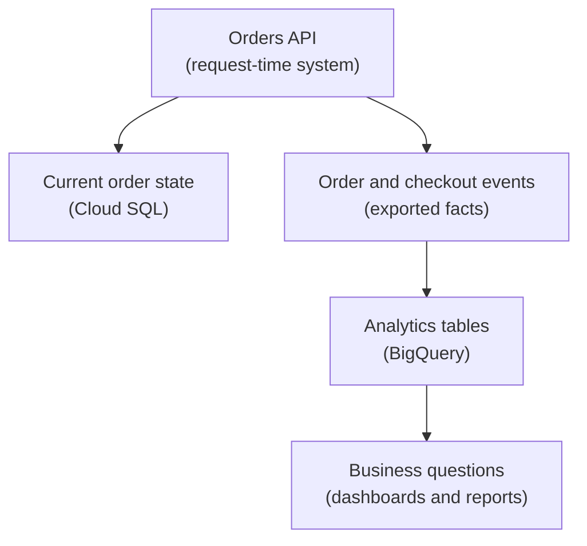

## Table of Contents

1. [Analytics Data Has A Different Job](#analytics-data-has-a-different-job)
2. [What BigQuery Is For](#what-bigquery-is-for)
3. [If Redshift, Athena, Synapse, Or Fabric Are Familiar](#if-redshift-athena-synapse-or-fabric-are-familiar)
4. [The Orders API Analytics Story](#the-orders-api-analytics-story)
5. [Datasets, Tables, And Columns](#datasets-tables-and-columns)
6. [BigQuery Is Not The Checkout Database](#bigquery-is-not-the-checkout-database)
7. [Getting Data Into BigQuery](#getting-data-into-bigquery)
8. [Queries Answer Business Questions](#queries-answer-business-questions)
9. [Data Quality Is Part Of The Pipeline](#data-quality-is-part-of-the-pipeline)
10. [Cost And Performance Need Query Habits](#cost-and-performance-need-query-habits)
11. [Failure Modes And First Checks](#failure-modes-and-first-checks)
12. [A Practical BigQuery Review](#a-practical-bigquery-review)

## Analytics Data Has A Different Job

The orders API has request-time data. When a customer opens an order history page, the app
needs the current state of that customer's orders. When checkout completes, the app needs to
write reliable order and payment records. That kind of data belongs in the operational
store, such as Cloud SQL.

Analytics data has a different job. It helps the team understand patterns across many
events. How many checkouts failed last week? Which payment method has the highest failure
rate? Did the new release increase receipt-generation latency? Which countries are growing
fastest? Those questions scan and group many rows. They are not part of one customer's
checkout request.

BigQuery is one of the most common GCP services for that analytical shape. Data engineers,
analysts, and backend teams use it to store large tables and ask SQL questions over them.
The service is common because GCP's data tooling often centers around BigQuery for
warehouse-style analysis.

For this roadmap, the main warning is that BigQuery is for analysis, not the request-time
source of truth for the orders API.



The same business domain appears in both places. The job is different.

## What BigQuery Is For

BigQuery is Google Cloud's analytics data warehouse. A data warehouse is a place designed
for analytical queries over large amounts of data. BigQuery lets teams store tables and use
SQL to analyze them without operating database servers in the same way they would operate a
VM-based database.

That definition is useful, but it can still feel abstract. Think about the question shape.
Cloud SQL asks, "what should the app do for this order right now?" BigQuery asks, "what
patterns exist across many orders?" Firestore asks, "what document does this feature need?"
Cloud Storage asks, "where are the bytes for this file?"

BigQuery is a good fit for:

| Analytical Need | Example |
|---|---|
| Business reporting | Paid orders by week and plan |
| Product analytics | Checkout drop-off by step |
| Operational analysis | Error rate by app version |
| Data engineering | Transform raw events into curated reporting tables |
| Finance or growth questions | Revenue trends, refunds, and cohorts |

Those questions should not slow down checkout. They can run after events are collected and
loaded into analytical tables.

## If Redshift, Athena, Synapse, Or Fabric Are Familiar

If you know AWS, BigQuery may remind you of Redshift, Athena, or a mix of warehouse and
query-service ideas. If you know Azure, BigQuery may remind you of Synapse, Fabric
warehouse, or analytical SQL surfaces. Those comparisons help you place it in the mental
map.

Do not assume operational details are the same. BigQuery has datasets, tables, jobs,
GoogleSQL, partitioning, clustering, IAM, pricing models, quotas, load jobs, streaming
inserts, and integrations that are specific to GCP. A team that understands Redshift still
needs to learn BigQuery's query and cost habits.

The useful shared idea is this: analytical data belongs in a system designed for analytical
questions. Do not force the production orders database to answer every dashboard and data
science question if that load and query shape does not belong there.

## The Orders API Analytics Story

The orders team wants to answer a product question:

> Did the new checkout flow reduce failed payments for mobile users?

The request-time API can answer one user's current order state. Scanning every checkout
event from the last month belongs in the analytics path, so the system can export events
into BigQuery.

A checkout event might look like this:

```json
{
  "event_time": "2026-05-04T10:20:11Z",
  "event_name": "checkout_payment_failed",
  "order_id": "ord_9281",
  "customer_country": "US",
  "device_type": "mobile",
  "payment_method": "card",
  "app_version": "2026.05.04",
  "failure_code": "issuer_declined"
}
```

One event becomes useful when it joins many other events for grouping, filtering, and
comparison. BigQuery is where those event rows can become dashboard numbers and
investigation queries.

The source of truth still matters. If the BigQuery table says an order failed but Cloud SQL
says it was later paid, the team needs to understand whether the event stream is late,
missing an update event, or being interpreted incorrectly. Analytics tables are evidence for investigation, not the source system.

## Datasets, Tables, And Columns

BigQuery organizes data into datasets and tables. A dataset is a grouping and access
boundary. A table holds rows and columns. Columns have types. This feels familiar if you
have used SQL databases, but the use case is analytical rather than request-time
transaction processing.

For the orders system:

```text
project: devpolaris-orders-prod
dataset: orders_analytics
tables:
  checkout_events
  order_facts_daily
  payment_failures
```

The raw event table might store event-level records. A curated daily fact table might store
cleaned and aggregated data for dashboards. Data engineers often create several layers
because raw events and trusted reporting tables have different jobs.

An analytical schema should make common questions easier:

| Column | Why It Helps |
|---|---|
| `event_time` | Filter and group by time |
| `event_name` | Separate checkout start, success, failure, and refund events |
| `order_id` | Connect event evidence to app records when needed |
| `customer_country` | Analyze geography |
| `device_type` | Compare mobile and desktop behavior |
| `app_version` | Compare releases |
| `result` | Count success and failure outcomes |

The table design should follow the questions the team actually asks.

## BigQuery Is Not The Checkout Database

This section prevents a common misunderstanding. BigQuery belongs in the analytics path. The
orders API needs a request-time operational database to decide whether checkout succeeds and
to update one order row during a user request.

The contrast is practical:

| Question | Better Place |
|---|---|
| What is the current status of order `ord_9281`? | Cloud SQL |
| Can checkout commit this order and payment attempt together? | Cloud SQL |
| How many payments failed by provider last week? | BigQuery |
| Which app version caused more errors? | BigQuery |
| Where is the receipt PDF stored? | Cloud Storage plus metadata |

BigQuery can receive data from operational systems. It can help the team understand the
business. It should not become the only system the app depends on to serve one customer
request.

This split protects users. Analytics queries can be large, exploratory, and sometimes
expensive. Checkout should be small, bounded, and reliable.

## Getting Data Into BigQuery

Data can reach BigQuery through several paths. A backend can publish events that a pipeline
loads. Scheduled jobs can export data. Dataflow or other processing tools can transform
streams. Batch files in Cloud Storage can be loaded into tables. The right path depends on
latency, reliability, cost, and team skill.

For a beginner system, a simple path might be:

```text
orders API emits checkout event
  -> event lands in Pub/Sub or log pipeline
  -> ingestion job writes to BigQuery checkout_events
  -> scheduled query builds daily reporting table
  -> dashboard reads trusted table
```

The important idea is separation. The orders API should not block the customer while a
dashboard table is updated. The app records the operational fact, emits or exports the event,
and lets the analytics path process it.

This also gives the team places to debug. If a dashboard is wrong, check whether the event
was emitted, ingested, transformed, and queried correctly.

## Queries Answer Business Questions

BigQuery uses SQL for analysis. A query should answer a business or operational question,
not merely prove that the table exists.

For failed payments by app version:

```sql
SELECT
  app_version,
  payment_method,
  COUNT(*) AS failed_payments
FROM `devpolaris-orders-prod.orders_analytics.checkout_events`
WHERE event_name = 'checkout_payment_failed'
  AND event_time >= TIMESTAMP('2026-05-01')
  AND event_time < TIMESTAMP('2026-06-01')
GROUP BY app_version, payment_method
ORDER BY failed_payments DESC;
```

This query is useful because it connects product behavior to release evidence. If version
`2026.05.04` has more failures, the team can inspect the release, payment provider logs, and
frontend changes.

A query result might look like this:

```text
app_version   payment_method   failed_payments
2026.05.04    card             842
2026.05.03    card             231
2026.05.04    wallet           119
```

The result is a signal that points to the next investigation.

## Data Quality Is Part Of The Pipeline

Analytics is only as useful as the data quality. If events are missing, duplicated, late, or
inconsistently named, BigQuery can still query them, but the answers may mislead the team.

For checkout events, define a small contract:

| Event Field | Quality Check |
|---|---|
| `event_time` | Present and in expected range |
| `event_name` | Uses approved event names |
| `order_id` | Present when an order exists |
| `app_version` | Present for release comparison |
| `result` | Uses a small vocabulary such as success, failed, abandoned |
| `event_id` | Supports duplicate detection |

Backend developers share responsibility for data quality because they create many of the
events. If the backend emits unclear or inconsistent fields, the warehouse becomes harder to
trust.

When the dashboard looks wrong, do not immediately blame BigQuery. Check the event contract
and the pipeline.

## Cost And Performance Need Query Habits

Analytical queries can scan a lot of data. That is the point, but it also means query habits
matter. The team should learn to filter by time, select only useful columns, understand
partitioning and clustering when used, and avoid running broad exploratory queries without a
reason.

Include time filters when the table is time-based. Most event analysis has a natural time
window. If you are asking about last week, query last week instead of scanning every event
since launch.

Good review questions:

| Question | Why It Matters |
|---|---|
| Is the table partitioned by time? | Time filters can reduce scanned data |
| Does the query select only needed columns? | Less unnecessary scanning and cleaner output |
| Is this raw or curated data? | Raw events may need cleaning before reporting |
| Who owns expensive scheduled queries? | Cost needs an owner |
| Does the dashboard query trusted tables? | Dashboards should avoid fragile ad hoc logic |

BigQuery is very useful when teams use it with care. The care is mostly about data modeling,
query habits, and ownership.

## Failure Modes And First Checks

BigQuery problems often show up as wrong answers, missing rows, or expensive queries.

The dashboard is missing recent orders:

```text
symptom: dashboard stops at yesterday
first checks:
  ingestion job status
  event pipeline delay
  table partition for current date
  scheduled query status
```

The query count does not match Cloud SQL:

```text
symptom: BigQuery paid order count differs from operational database
first checks:
  source-of-truth definition
  event types included
  late or duplicate events
  time zone filter
```

The query is unexpectedly expensive:

```text
symptom: high bytes processed
first checks:
  time filter
  selected columns
  partition use
  broad wildcard tables
```

The pipeline writes bad event names:

```text
symptom: dashboard has unknown event_name values
first checks:
  backend event contract
  deploy version that emitted events
  transformation validation
  dead-letter or rejected records if used
```

These failures are different from app database failures. Do not debug a dashboard mismatch
as if checkout is broken until you know which source of truth is wrong.

## A Practical BigQuery Review

Before sending production analytics data into BigQuery, fill out a review:

| Review Item | Example Answer |
|---|---|
| Dataset | `orders_analytics` |
| Raw table | `checkout_events` |
| Curated table | `order_facts_daily` |
| Main questions | Failure rate, revenue trend, app version comparison |
| Source systems | Orders API events and Cloud SQL exports |
| Ingestion path | Pub/Sub or batch export pipeline |
| Data quality checks | Required fields, event names, duplicate handling |
| Time strategy | Event-time column and partition review |
| Access | Analysts can query curated tables, limited raw access |
| Not for | Request-time checkout writes |

This review gives BigQuery a clear job. It helps the product and data teams ask better
questions without putting analytical load on the operational database. BigQuery is common in
GCP data engineering because it is very good at this job. The key is to keep the job clear:
analyze many facts, do not become the checkout transaction path.

---

**References**

- [BigQuery documentation](https://cloud.google.com/bigquery/docs) - Introduces BigQuery as Google Cloud's analytics data warehouse.
- [BigQuery datasets](https://cloud.google.com/bigquery/docs/datasets-intro) - Explains datasets as BigQuery containers and access boundaries.
- [BigQuery tables](https://cloud.google.com/bigquery/docs/tables) - Documents table concepts used for analytical data.
- [Introduction to loading data](https://cloud.google.com/bigquery/docs/loading-data) - Covers common ways data enters BigQuery.
- [Introduction to optimizing query performance](https://cloud.google.com/bigquery/docs/best-practices-performance-overview) - Gives query performance practices that shape cost and speed.
