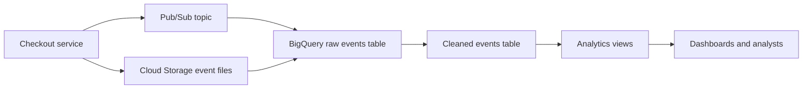

## Table of Contents

1. [Why Checkout Events Need BigQuery](#why-checkout-events-need-bigquery)
2. [Projects, Datasets, and Tables](#projects-datasets-and-tables)
3. [From Events to Rows](#from-events-to-rows)
4. [Partitioning and Clustering](#partitioning-and-clustering)
5. [Query Cost, Slots, and Guardrails](#query-cost-slots-and-guardrails)
6. [Schemas, Quality, and Late Data](#schemas-quality-and-late-data)
7. [Views, IAM, and Shared Analytics](#views-iam-and-shared-analytics)
8. [Time Travel and Recovery](#time-travel-and-recovery)
9. [Putting It All Together](#putting-it-all-together)
10. [What's Next](#whats-next)

## Why Checkout Events Need BigQuery
<!-- section-summary: BigQuery answers analytical questions over many records, while the checkout database stays focused on live customer requests. -->

**BigQuery** is Google Cloud's managed analytics warehouse. A warehouse stores historical records and runs analytical SQL over many rows, often millions or billions of them. A checkout database has a different job: it must answer small live requests quickly, such as "create this order," "read this cart," or "mark this payment attempt as failed."

Imagine a store called Northstar Shop. Its checkout service writes the current order state to Cloud SQL because the website needs fast, transactional behavior. The same service also emits a checkout event for analytics. That event might say that user `u_4921` attempted order `o_7818`, used card brand `visa`, saw payment provider `stripe-eu`, and ended with status `payment_failed`.

The finance team asks a broader question than one order row: "Which payment provider had the highest failure rate by region during the last 30 days?" The product team asks, "Did free shipping increase average order value for mobile users?" The operations team asks, "Did payment failures spike during the launch window?" Each question scans many events, groups them, and calculates totals. The live checkout database should keep serving customers while BigQuery handles those wider reads.

BigQuery fits this work because it separates storage and compute. BigQuery stores table data in a column-oriented layout, then the query engine distributes SQL work across many workers. If a query only needs `event_timestamp`, `region`, `payment_provider`, and `status`, BigQuery can avoid reading the rest of the columns. That one detail matters because on-demand query cost depends heavily on bytes read, and analytical tables often grow quickly.

Here is the flow we will follow through the article:



The picture starts with one checkout event. Before the team can ingest it, they need a place to put it and a table contract that says what each row contains.

## Projects, Datasets, and Tables
<!-- section-summary: A practical BigQuery layout starts with datasets for location and access, then tables for raw events, cleaned facts, and reporting views. -->

A **project** is the Google Cloud billing and ownership boundary. A **dataset** is the top-level BigQuery container inside a project. Datasets hold tables, views, routines, and access rules, and they also carry a location such as `US`, `EU`, or a specific region. A **table** is where BigQuery stores structured rows under a schema.

For Northstar Shop, the team creates two datasets. `analytics_raw` stores events close to the shape emitted by the application. `analytics_marts` stores cleaned, modeled, and analyst-friendly data. This separation helps because raw data usually needs tighter service-account write access, while business users usually need read access to curated tables and views.

The first setup step looks like this:

```bash
bq --location=US mk \
  --dataset \
  --description="Raw checkout and business events" \
  northstar-prod:analytics_raw

bq --location=US mk \
  --dataset \
  --description="Curated analytics tables and views" \
  northstar-prod:analytics_marts
```

The location choice deserves real attention. A dataset's location affects where BigQuery stores and runs work for that data. Real teams choose locations for latency, data residency, and governance. A European customer-events dataset often belongs in `EU` or a European region, while a United States analytics dataset might live in `US`. Mixing locations casually leads to awkward query and transfer work later.

Now the team needs a table. A good event table stores business fields plus pipeline fields that help with debugging and deduplication. `event_id` gives every event a stable identity. `event_timestamp` records when the checkout action happened. `ingested_at` records when the row arrived in BigQuery. Those two times differ when mobile clients reconnect late or a backfill runs after an incident.

```sql
CREATE TABLE `northstar-prod.analytics_raw.checkout_events` (
  event_id STRING NOT NULL,
  event_timestamp TIMESTAMP NOT NULL,
  ingested_at TIMESTAMP NOT NULL,
  order_id STRING,
  user_id STRING,
  session_id STRING,
  platform STRING,
  region STRING,
  payment_provider STRING,
  card_brand STRING,
  status STRING,
  order_total NUMERIC,
  currency STRING,
  attributes JSON
)
PARTITION BY DATE(event_timestamp)
CLUSTER BY payment_provider, region, status;
```

The table already includes two layout decisions: partitioning and clustering. We will come back to those after ingestion, because table layout matters most after rows start piling up. For now, the important point is that the table gives every incoming event a predictable shape.

## From Events to Rows
<!-- section-summary: BigQuery can receive data from batch files, direct Pub/Sub exports, Dataflow pipelines, or custom Storage Write API clients. -->

**Ingestion** means moving data from the place where it happens into the warehouse. Northstar Shop has two paths. The checkout service publishes live events through Pub/Sub, and the data team also receives nightly export files in Cloud Storage from payment providers, marketing tools, and older systems.

Batch loading works well for files. A batch load job can load Avro, Parquet, ORC, CSV, or newline-delimited JSON into BigQuery. Teams often prefer Parquet or Avro for production pipelines because those formats carry schema information and compress efficiently. A nightly payment-provider export might land at `gs://northstar-analytics-drop/payment_provider_events/dt=2026-06-14/`.

```bash
bq load \
  --source_format=PARQUET \
  --schema_update_option=ALLOW_FIELD_ADDITION \
  northstar-prod:analytics_raw.payment_provider_events \
  "gs://northstar-analytics-drop/payment_provider_events/dt=2026-06-14/*.parquet"
```

Batch loading also gives the team a clean backfill path. If the application missed events during a deploy, the team can replay files into a specific date partition and compare counts against the source system. That matters in production because analytics bugs often show up as quiet number drift during a business review.

For live events, Pub/Sub gives the checkout service a durable event stream. BigQuery can receive Pub/Sub messages through a **BigQuery subscription** when the messages already match the destination table and need little transformation. This removes the need to run a separate subscriber application for simple export cases.

```bash
gcloud pubsub subscriptions create checkout-events-to-bigquery \
  --topic=checkout-events \
  --bigquery-table=northstar-prod:analytics_raw.checkout_events \
  --use-topic-schema \
  --write-metadata
```

When the data needs richer processing, Dataflow usually enters the story. Dataflow can read from Pub/Sub, validate payloads, add lookup data, window events by event time, route bad records to a dead-letter topic, and write clean rows to BigQuery. This helps when the checkout event needs enrichment from a merchant table or when the team wants an hourly aggregate table for dashboards.

Custom services can use the BigQuery Storage Write API for high-throughput streaming. The default stream makes rows available quickly and has at-least-once behavior, so the warehouse design still needs `event_id` and deduplication. Application-created committed streams can use offsets for exactly-once writes within a stream, but they also require more careful client code. A senior engineer usually tells a junior engineer this part plainly: strong write semantics help, and stable event IDs still save the day during retries, migrations, and backfills.

By this point, rows have arrived. The next question is how BigQuery reads those rows without scanning years of history for every dashboard refresh.

## Partitioning and Clustering
<!-- section-summary: Partitioning skips whole time slices, and clustering skips storage blocks inside those slices when queries filter on common columns. -->

**Partitioning** divides a large BigQuery table into smaller segments. For event data, the most common choice is a date or timestamp column. Northstar Shop partitions checkout events by `DATE(event_timestamp)` because analysts usually ask questions by day, week, launch window, or incident period.

When a query filters the partition column, BigQuery can scan matching partitions and skip the rest. That process controls both performance and cost because BigQuery reads fewer bytes. A dashboard query for yesterday's payment failures should read yesterday's partition instead of four years of checkout history.

```sql
SELECT
  payment_provider,
  region,
  COUNT(*) AS attempts,
  COUNTIF(status = 'payment_failed') AS failures,
  SAFE_DIVIDE(COUNTIF(status = 'payment_failed'), COUNT(*)) AS failure_rate
FROM `northstar-prod.analytics_raw.checkout_events`
WHERE event_timestamp >= TIMESTAMP('2026-06-14 00:00:00+00')
  AND event_timestamp < TIMESTAMP('2026-06-15 00:00:00+00')
GROUP BY payment_provider, region
ORDER BY failure_rate DESC;
```

The `WHERE` clause does real work here. It gives the query planner a partition range. A query that wraps the partition column in awkward expressions or forgets the date filter can scan far more data than the analyst expected. Many teams protect large event tables by requiring partition filters, especially for raw tables.

**Clustering** sorts storage blocks by selected columns. BigQuery supports up to four clustering columns. The order matters because BigQuery sorts and groups blocks using the first clustered column before the next ones. For Northstar Shop, `payment_provider`, `region`, and `status` match the most common incident and business questions, so the table uses those columns.

Partitioning and clustering solve different parts of the same problem. Partitioning narrows the time slice. Clustering narrows the useful blocks inside that slice. If an analyst filters yesterday's events to `payment_provider = 'stripe-eu'`, BigQuery can combine the date partition filter with clustered block pruning.

A healthy event table design usually follows this pattern:

| Design choice | Northstar example | Why the team chooses it |
|---|---|---|
| Partition column | `event_timestamp` | Most reports and incidents use time windows |
| Clustering columns | `payment_provider`, `region`, `status` | Payment operations filter and group by these fields |
| Raw table retention | 180 days in raw, longer in curated tables | Raw payloads help debugging, while curated tables support long-term trends |
| Partition filter habit | Every large query includes a bounded time range | Cost and latency stay predictable |

Good layout helps, but a warehouse still needs budget guardrails. The next section follows the same query into BigQuery's cost and compute controls.

## Query Cost, Slots, and Guardrails
<!-- section-summary: BigQuery costs and speed depend on bytes read, query shape, and available slots, so production teams add limits before analysts make mistakes. -->

BigQuery queries use **slots**, which are virtual compute units for SQL and other jobs. With on-demand pricing, BigQuery charges for the amount of data processed by each query. With capacity-based pricing, teams allocate slot capacity through reservations and pay for that capacity over time. Either way, the query still runs faster and cheaper when it reads less data.

The first guardrail is a dry run. A dry run validates the SQL and estimates bytes before BigQuery executes the query. This is a small habit that prevents expensive accidents during exploration.

```bash
bq query \
  --use_legacy_sql=false \
  --dry_run \
  'SELECT COUNT(*)
   FROM `northstar-prod.analytics_raw.checkout_events`
   WHERE event_timestamp >= TIMESTAMP("2026-06-14 00:00:00+00")
     AND event_timestamp < TIMESTAMP("2026-06-15 00:00:00+00")'
```

The second guardrail is a maximum bytes billed limit. This tells BigQuery to fail the job if it would exceed the configured limit. Analysts can still explore, and one missing filter fails before it quietly scans a huge table.

```bash
bq query \
  --use_legacy_sql=false \
  --maximum_bytes_billed=5000000000 \
  'SELECT payment_provider, COUNT(*) AS attempts
   FROM `northstar-prod.analytics_raw.checkout_events`
   WHERE event_timestamp >= TIMESTAMP("2026-06-14 00:00:00+00")
     AND event_timestamp < TIMESTAMP("2026-06-15 00:00:00+00")
   GROUP BY payment_provider'
```

The third guardrail is a curated layer. Dashboards should rarely hit the raw event firehose directly. A scheduled query can build a smaller hourly table, and a dashboard can read that table instead of recalculating from raw rows every minute.

```sql
CREATE OR REPLACE TABLE `northstar-prod.analytics_marts.checkout_failures_hourly`
PARTITION BY DATE(hour_start)
CLUSTER BY payment_provider, region AS
SELECT
  TIMESTAMP_TRUNC(event_timestamp, HOUR) AS hour_start,
  payment_provider,
  region,
  COUNT(*) AS attempts,
  COUNTIF(status = 'payment_failed') AS failures,
  SAFE_DIVIDE(COUNTIF(status = 'payment_failed'), COUNT(*)) AS failure_rate
FROM `northstar-prod.analytics_raw.checkout_events`
WHERE event_timestamp >= TIMESTAMP_SUB(CURRENT_TIMESTAMP(), INTERVAL 2 DAY)
GROUP BY hour_start, payment_provider, region;
```

For steady production analytics, teams also separate workloads. Finance month-end jobs, BI dashboards, data science experiments, and ingestion transforms need capacity boundaries when they run at the same time. Reservations help a platform team allocate slots to different projects or workloads, while project-level controls and budgets catch runaway usage.

Cost controls protect the bill. Data quality rules protect the meaning of the data. The pipeline also needs schema rules so every number means what the team thinks it means.

## Schemas, Quality, and Late Data
<!-- section-summary: A useful warehouse keeps event fields stable, handles schema evolution deliberately, and treats retries and late arrivals as normal production behavior. -->

A **schema** names the columns in a table and defines their data types. BigQuery can infer schemas for some load formats, but production event tables usually deserve an explicit schema. The schema acts like a contract between application engineers, data engineers, and analysts.

Northstar Shop starts with required fields for identity and time, then leaves room for changing product details in the `attributes` JSON column. This gives the team a stable core while the checkout app evolves. A new nullable column such as `coupon_code` can arrive later through a schema update. A breaking type change, such as changing `order_total` from `NUMERIC` to `STRING`, needs a planned migration because historical queries and dashboards depend on the old type.

```sql
ALTER TABLE `northstar-prod.analytics_raw.checkout_events`
ADD COLUMN coupon_code STRING;
```

Data quality starts before the row reaches BigQuery. The checkout service should generate one `event_id` per business event and reuse it on retry. Pub/Sub schemas can enforce message shape at the topic level. Dataflow can send malformed messages to a dead-letter topic instead of dropping them quietly. The warehouse can keep an `_ingestion_errors` table so the data team sees which fields failed validation and which release created the problem.

Duplicates deserve special attention. A mobile client may retry a checkout event after a network drop. A streaming writer may retry after a timeout. A backfill may replay data that already arrived live. The raw table can keep every arrival for audit, while the curated table chooses one row per `event_id`.

```sql
CREATE OR REPLACE TABLE `northstar-prod.analytics_marts.checkout_events_clean`
PARTITION BY DATE(event_timestamp)
CLUSTER BY payment_provider, region, status AS
SELECT * EXCEPT(row_number)
FROM (
  SELECT
    *,
    ROW_NUMBER() OVER (
      PARTITION BY event_id
      ORDER BY ingested_at DESC
    ) AS row_number
  FROM `northstar-prod.analytics_raw.checkout_events`
)
WHERE row_number = 1;
```

Late data also needs an explicit rule. If the mobile app sends an event two days late, the table partition should still follow `event_timestamp`, because the business question cares when the checkout happened. The pipeline can reprocess recent partitions, such as the last three days, on every scheduled transform. Older late data can trigger a targeted backfill job and a short note in the data incident log.

Now the warehouse contains trustworthy tables. The next job is sharing those tables without handing every analyst raw customer data.

## Views, IAM, and Shared Analytics
<!-- section-summary: Views and IAM let teams expose useful answers while keeping raw tables, sensitive columns, and write paths restricted. -->

A **view** is a virtual table defined by a SQL query. BigQuery runs the view query when someone reads from it. Views help teams publish a smaller, safer, and friendlier interface over raw tables. For example, analysts may need failure rates by region, and they can work without raw user IDs or every event attribute.

```sql
CREATE OR REPLACE VIEW `northstar-prod.analytics_marts.checkout_failure_rates` AS
SELECT
  DATE(event_timestamp) AS event_date,
  payment_provider,
  region,
  COUNT(*) AS attempts,
  COUNTIF(status = 'payment_failed') AS failures,
  SAFE_DIVIDE(COUNTIF(status = 'payment_failed'), COUNT(*)) AS failure_rate
FROM `northstar-prod.analytics_marts.checkout_events_clean`
GROUP BY event_date, payment_provider, region;
```

Materialized views and aggregate tables can help when the same expensive calculation runs again and again. A logical view gives a clean SQL interface, while a materialized view or scheduled aggregate stores precomputed results. The team chooses based on freshness, cost, complexity, and dashboard speed.

Access follows the same layered approach. The ingestion service account needs permission to append data to raw tables. Data engineers need permission to manage schemas and transforms. Analysts need read access to curated datasets or views. BigQuery IAM roles such as Data Viewer, Data Editor, and Job User help express those responsibilities, but teams should grant them at the smallest practical resource level.

Sensitive fields need extra care. A raw checkout event might contain user identifiers, device metadata, or fraud signals. A curated view can remove those fields. Row-level security can restrict rows, and column-level access control can restrict sensitive columns. Authorized views can let a team query a view without granting direct access to the underlying source table. The exact choice depends on the data and the audience, but the production rule stays simple: raw data access should feel rare and reviewed.

Sharing finishes the reporting path. Recovery finishes the operational path. BigQuery gives the team a short correction window when someone changes or deletes the wrong data.

## Time Travel and Recovery
<!-- section-summary: BigQuery time travel helps recover recent table states, while snapshots, exports, and raw replay protect longer recovery needs. -->

**Time travel** lets BigQuery query table data from a previous point in time within the supported retention window. Google Cloud documents a seven-day time travel window for recovery from accidental deletion or corruption. This helps when someone runs a bad update, deletes a table, or needs to compare today's data with yesterday's table state.

Here is a practical recovery query. The team checks what the clean checkout table looked like one hour before a broken transform ran:

```sql
SELECT
  COUNT(*) AS rows_before_bad_job
FROM `northstar-prod.analytics_marts.checkout_events_clean`
FOR SYSTEM_TIME AS OF TIMESTAMP_SUB(CURRENT_TIMESTAMP(), INTERVAL 1 HOUR);
```

If the team needs to restore data into a replacement table, it can create a new table from the older state:

```sql
CREATE OR REPLACE TABLE `northstar-prod.analytics_marts.checkout_events_clean_recovered` AS
SELECT *
FROM `northstar-prod.analytics_marts.checkout_events_clean`
FOR SYSTEM_TIME AS OF TIMESTAMP('2026-06-14 10:30:00+00');
```

Time travel is a short recovery tool. Long-term recovery usually comes from stronger habits: immutable raw files in Cloud Storage, table snapshots for important cutovers, scheduled exports for compliance, and tested replay jobs. Northstar Shop keeps raw event files for the retention period required by policy, then rebuilds curated tables from raw events when a transform bug affects more than the time travel window.

Recovery also includes ownership. Every important dataset should have labels, documented owners, and alerting for failed scheduled queries or failed ingestion jobs. Data incidents often start quietly: a dashboard number drops to zero, a partition stops receiving rows, or a schema update silently sends records to an error table. The warehouse needs the same operational care as application services.

## Putting It All Together
<!-- section-summary: A production BigQuery design connects ingestion, table layout, quality controls, access, and recovery into one maintainable analytics path. -->

Northstar Shop started with one checkout event and one business question. The finished design now has a full path. The checkout service writes live order state to the operational database, then publishes business events for analytics. Simple events can flow from Pub/Sub to BigQuery directly. More complex events can pass through Dataflow for validation, enrichment, and dead-letter handling. Historical files can load from Cloud Storage for backfills and partner data.

Datasets separate raw and curated work. Tables carry explicit schemas, pipeline timestamps, and stable event IDs. Partitioning narrows time windows. Clustering helps payment-provider and region filters scan fewer blocks. Dry runs, maximum bytes billed, scheduled aggregates, and reservations keep query cost and capacity under control.

The data layer also has a safety story. Deduplication chooses one curated row per event. Late-arrival rules reprocess recent partitions. Views publish useful business answers without exposing raw customer fields. IAM grants write access to services, transform access to data engineers, and read access to analysts. Time travel, snapshots, raw-file retention, and replay jobs give the team recovery options when the numbers go wrong.

That is the BigQuery pattern in practical terms: keep customer-facing requests fast in the operational database, then send durable business facts into BigQuery so the organization can ask large historical questions safely. The warehouse earns its place when the team can trust both the numbers and the operating path that produced them.

## What's Next
<!-- section-summary: The next storage article moves from analytical tables to attached disks and shared filesystems for VM-based workloads. -->

BigQuery handles analytical tables and SQL over historical events. Some workloads still need operating-system paths such as `/var/lib/app`, `/mnt/cache`, or `/shared/incoming`. A VM-hosted database, a media renderer, or a legacy file processor expects block devices or shared file mounts, and the next article follows that operating-system path.

The next article covers Persistent Disk, Hyperdisk, and Filestore, which are the Google Cloud storage choices for attached disks and shared filesystems. It uses the same production style, but the workload moves from SQL tables to Linux mount points.

---

**References**

- [Google Cloud: BigQuery overview](https://cloud.google.com/bigquery/docs/introduction)
- [Google Cloud: Overview of BigQuery storage](https://cloud.google.com/bigquery/docs/storage_overview)
- [Google Cloud: Create datasets](https://cloud.google.com/bigquery/docs/datasets)
- [Google Cloud: Specifying a schema](https://cloud.google.com/bigquery/docs/schemas)
- [Google Cloud: Modifying table schemas](https://cloud.google.com/bigquery/docs/managing-table-schemas)
- [Google Cloud: Introduction to loading data](https://cloud.google.com/bigquery/docs/loading-data)
- [Google Cloud: BigQuery subscriptions for Pub/Sub](https://cloud.google.com/pubsub/docs/bigquery)
- [Google Cloud: BigQuery Storage Write API](https://cloud.google.com/bigquery/docs/write-api)
- [Google Cloud: Introduction to partitioned tables](https://cloud.google.com/bigquery/docs/partitioned-tables)
- [Google Cloud: Introduction to clustered tables](https://cloud.google.com/bigquery/docs/clustered-tables)
- [Google Cloud: Estimate and control BigQuery costs](https://cloud.google.com/bigquery/docs/best-practices-costs)
- [Google Cloud: Understand BigQuery slots](https://cloud.google.com/bigquery/docs/slots)
- [Google Cloud: Introduction to logical views](https://cloud.google.com/bigquery/docs/views-intro)
- [Google Cloud: BigQuery IAM roles and permissions](https://cloud.google.com/bigquery/docs/access-control)
- [Google Cloud: BigQuery reliability and time travel](https://cloud.google.com/bigquery/docs/reliability-intro)
