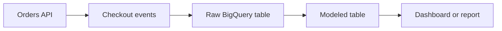

## Table of Contents

1. [The Problem](#the-problem)
2. [What Is BigQuery](#what-is-bigquery)
3. [Datasets](#datasets)
4. [Tables](#tables)
5. [Loading Data](#loading-data)
6. [Partitioning](#partitioning)
7. [Clustering](#clustering)
8. [Queries](#queries)
9. [Cost Habits](#cost-habits)
10. [Data Quality](#data-quality)
11. [Sample Warehouse Shape](#sample-warehouse-shape)
12. [Putting It All Together](#putting-it-all-together)
13. [What's Next](#whats-next)

## The Problem

The Orders API has request-time data in Cloud SQL and document-shaped state in Firestore. Now the business asks broader questions:

- How many checkouts failed last week by region?
- Which payment provider has the highest retry rate?
- Did the new Cloud Run revision increase checkout latency?
- Which product bundles lead to refunds over a quarter?

Those questions scan and group many facts. They are not part of one customer's checkout request. Running them against the request-time database can slow the app and still produce awkward analysis.

BigQuery is the GCP home for this analytical shape.

## What Is BigQuery

BigQuery is a managed analytics data warehouse. It stores datasets and tables and lets teams use SQL to analyze large amounts of data without operating database servers in the same way they would operate an application database.

The important split is operational versus analytical.

| Question | Better home |
| --- | --- |
| What is the current state of order `9281`? | Cloud SQL |
| How many checkouts failed by region last week? | BigQuery |
| What receipt object belongs to this order? | Cloud SQL record pointing to Cloud Storage |
| Which release changed conversion rate? | BigQuery |

BigQuery is excellent for questions over many records. It should not be the place the checkout request waits to decide one order's state.

## Datasets

A dataset is a container for BigQuery tables and related controls. It gives analysts and engineers a boundary for location, access, and organization.

For the Orders system, a dataset might be `orders_analytics_prod`. It could contain checkout events, payment attempts, receipt generation events, and denormalized reporting tables.

The dataset boundary should make ownership visible. Mixing unrelated domains into one dataset can make access and retention harder to explain later.

## Tables

Tables hold rows and columns. Some tables are raw event tables. Some are cleaned and modeled tables. Some are aggregates built for dashboards.

The schema should match the question. An event table might include event time, order ID, region, release version, payment provider, status, latency, and correlation ID. That does not replace the Cloud SQL order table. It gives analytics a fact history.



BigQuery works best when the pipeline makes raw facts and modeled facts easy to distinguish.

## Loading Data

Data can reach BigQuery through batch loads, streaming, Dataflow, Pub/Sub pipelines, exports from other systems, or scheduled transformations. The right path depends on freshness, cost, complexity, and reliability.

For a beginner Orders system, a simple pattern is to emit checkout events, land them reliably, and load or stream them into BigQuery. Later, a data pipeline can clean and model the events for reporting.

The gotcha is that ingestion is part of the data product. If events are missing, duplicated, late, or malformed, the SQL query may be correct and the answer still wrong.

## Partitioning

Partitioning divides a table into segments, often by date or timestamp. This helps queries scan less data when they filter by the partition column.

For checkout events, partitioning by event date is a natural starting point. Most reports ask about a time window: yesterday, last week, this quarter. If the query filters on the partition, BigQuery can avoid scanning unrelated partitions.

Partitioning is not only performance. It is a cost habit. BigQuery charges by work performed in common usage patterns, so scanning less data matters.

## Clustering

Clustering organizes table data by selected columns within partitions. It can improve query performance and cost when queries often filter or group by those columns.

For checkout events, useful clustering candidates might be region, payment provider, or status, depending on the most common questions. Do not cluster randomly. Cluster because query patterns repeat.

Partitioning asks "which time slice?" Clustering asks "which values inside that slice?"

## Queries

BigQuery queries use SQL. That is friendly for many engineers and analysts, but query power can hide cost and quality problems.

A query that joins clean modeled tables over the last seven days is different from a query that scans raw events across five years. A dashboard that updates every minute can create ongoing cost. A query that ignores late-arriving events can publish a misleading metric.

Good query review names:

```text
question: checkout failures by region last week
tables: modeled checkout events
filters: event_date between 2026-05-10 and 2026-05-17
grouping: region, failure_reason
owner: product analytics
```

The question should come before the SQL.

## Cost Habits

BigQuery cost is strongly shaped by storage, query volume, scanned data, and pipeline behavior. Beginners often treat SQL as free because there is no database server to size.

Healthy habits include filtering by partition, selecting only needed columns, using modeled tables for common dashboards, and reviewing scheduled query frequency. Cost control is not separate from schema and query design.

The warning sign is a dashboard or notebook that scans far more data than the question needs.

## Data Quality

Analytics is only useful if the data means what people think it means. Event names, timestamps, release versions, user regions, retry flags, and failure reasons need consistency.

For the Orders system, a checkout failure event should mean the same thing across releases. If one version logs provider timeouts as `failed` and another logs them as `retryable`, trend analysis becomes muddy.

Data quality belongs in the pipeline and review:

| Quality check | Why it matters |
| --- | --- |
| Required fields | Prevent empty facts from becoming official metrics |
| Duplicate handling | Avoid counting one checkout twice |
| Late event handling | Keep time-window reports honest |
| Schema change review | Protect dashboards and downstream jobs |

BigQuery can answer the question. The pipeline has to make the answer trustworthy.

## Sample Warehouse Shape

A simple Orders analytics shape might be:

| Part | Example |
| --- | --- |
| Dataset | `orders_analytics_prod` |
| Raw table | `checkout_events_raw` |
| Modeled table | `checkout_events_daily` |
| Partition | Event date |
| Cluster | Region, payment provider, status |
| Source | Pub/Sub or batch export from application events |
| Consumers | Dashboards, analysts, finance reports |
| Recovery | Time travel, snapshots, source replay where possible |

This shape keeps analytics separate from the checkout database while still tying facts back to the same business domain.

## Putting It All Together

Return to the opening questions.

Checkout failures by region, payment retry rates, release impact, and refund patterns are analytical questions. BigQuery fits because the team needs SQL over many facts.

Datasets and tables make ownership and structure visible. Raw events and modeled tables should not be confused.

Partitioning and clustering are not decorative performance tricks. They reflect repeated query patterns and cost habits.

Data quality decides whether the answer is useful. A wrong or inconsistent event stream can make a correct query misleading.

## What's Next

Cloud Storage, Cloud SQL, Firestore, and BigQuery cover many application data shapes. Some compute workloads still need storage that behaves like a disk or shared filesystem. Next, we look at Persistent Disk and Filestore.

---

**References**

- [Google Cloud: BigQuery overview](https://cloud.google.com/bigquery/docs/introduction)
- [Google Cloud: Introduction to partitioned tables](https://cloud.google.com/bigquery/docs/partitioned-tables)
- [Google Cloud: Introduction to clustered tables](https://cloud.google.com/bigquery/docs/clustered-tables)
- [Google Cloud: BigQuery time travel](https://cloud.google.com/bigquery/docs/time-travel)
