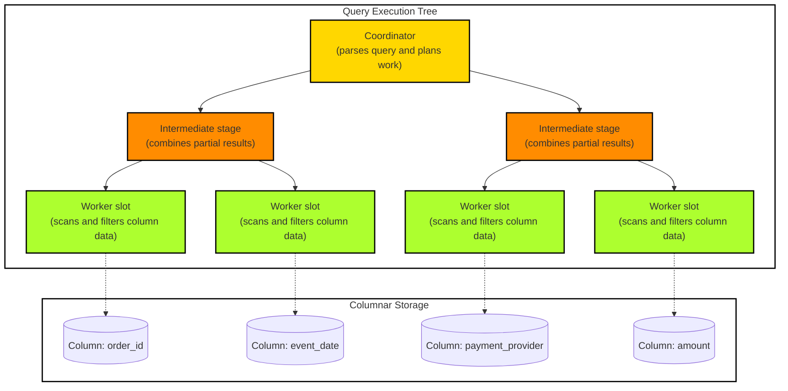

## Table of Contents

1. [Analytical Warehousing and BigQuery Architecture](#analytical-warehousing-and-bigquery-architecture)
2. [Real-World Analytics: Flash-Sale Ingestion and Aggregation Pipeline](#real-world-analytics-flash-sale-ingestion-and-aggregation-pipeline)
3. [Datasets and Resource Organization](#datasets-and-resource-organization)
4. [Ingestion Pipelines and Loading Strategies](#ingestion-pipelines-and-loading-strategies)
5. [Partitioning Slices and Clustering Filters](#partitioning-slices-and-clustering-filters)
6. [Query Execution and Cost Controls](#query-execution-and-cost-controls)
7. [Data Quality and Schema Evolution](#data-quality-and-schema-evolution)
8. [Design Detail: Query Trees and Time Travel](#design-detail-query-trees-and-time-travel)
9. [Putting It All Together](#putting-it-all-together)
10. [What's Next](#whats-next)

## Analytical Warehousing and BigQuery Architecture

BigQuery is GCP's managed analytical data warehouse: it stores large historical datasets and runs SQL queries that scan, filter, group, and aggregate many records without competing with the application's request-time database.

When you operate a high-traffic application, your primary database is designed to handle request-time operations as quickly as possible. For instance, when a customer purchases an item, your transactional database must instantly write a single row in an orders table. This style of database is optimized to process thousands of individual read and write requests per second with extremely low latency. However, if a business analyst wants to run a complex report, such as calculating checkout failure rates grouped by payment provider and user region over the past five years, executing that query on your active application database can be catastrophic. The query must scan and aggregate billions of historical rows, consuming available CPU and memory resources, which blocks incoming checkouts and causes your website to freeze.

To solve this problem, you need to separate your request-time transactional database from your analytical reporting system. This is where an analytical data warehouse is used. Instead of processing single-row updates, a data warehouse is designed to store massive event logs and execute heavy aggregate queries over billions of rows without competing for resources with your live checkout system. In the cloud, this division of labor is represented by Online Transaction Processing (OLTP) engines like Cloud SQL on the transactional side, and Online Analytical Processing (OLAP) data warehouses on the reporting side.

Google Cloud BigQuery is a fully managed, serverless analytical data warehouse designed to solve this massive scale challenge. BigQuery separates compute resources (the processors that run your SQL queries) from storage resources (the disks where your data resides). In physical GCP datacenters, these two layers communicate over Google's high-speed internal fiber network, which can stream compressed data blocks from remote storage arrays to active processors in fractions of a second. This decoupled compute-and-storage architecture allows BigQuery to scale up thousands of processors on demand to execute a query, then immediately turn them off once the result is returned, ensuring you only pay for the exact volume of data scanned rather than maintaining expensive, idle server clusters.

This model is standard across cloud ecosystems. In Amazon Web Services (AWS), the equivalent service is Amazon Redshift, which organizes data inside managed clusters or serverless workgroups, and in Microsoft Azure, it is Azure Synapse Analytics, which coordinates serverless or dedicated SQL pools. While AWS Redshift historically relied on tightly coupled local storage drives, and Azure Synapse utilizes separate logical pools, BigQuery delivers a fully serverless, zero-infrastructure experience where your streaming checkout events land directly in secure, optimized storage arrays ready for multi-terabyte queries.

## Real-World Analytics: Flash-Sale Ingestion and Aggregation Pipeline

An ingestion and aggregation pipeline is the path that moves operational events into BigQuery and turns them into reporting rows. To see these warehouse-scale mechanics in action, consider a real-world scenario: during a high-traffic flash sale, our Orders API publishes checkout event payloads to a Pub/Sub topic. We must stream these events in real time into BigQuery to calculate hourly checkout failure rates grouped by payment card brand and user region, allowing our operations team to detect network dropouts quickly.

To maximize query speed and minimize scan costs, we first define a partitioned and clustered destination table using a SQL DDL statement:

```sql
CREATE TABLE my_project.analytics_prod.checkout_events (
  event_id STRING NOT NULL,
  user_id STRING,
  card_brand STRING,
  region STRING,
  event_timestamp TIMESTAMP NOT NULL,
  order_total NUMERIC,
  status STRING
)
PARTITION BY DATE(event_timestamp)
CLUSTER BY card_brand, region;
```

This configuration partitions data daily based on the event timestamp and clusters records physically by card brand and geographic region. For historical backfills, developers run an optimized batch load job using the `bq` CLI tool to load NDJSON (Newline Delimited JSON) files from Cloud Storage directly into our table without incurring compute fees:

```bash
bq load \
  --source_format=NEWLINE_DELIMITED_JSON \
  --time_partitioning_field=event_timestamp \
  --clustering_fields=card_brand,region \
  analytics_prod.checkout_events \
  gs://invoices-prod/backups/events_20260528.json
```

For real-time ingestion, the Pub/Sub subscription utilizes the Storage Write API, serializing live events into binary Protocol Buffers and pushing them over persistent gRPC channels directly into the table. Once the data lands, analysts execute a SQL query to generate our hourly operations report. We apply an explicit date range filter to the partitioned `event_timestamp` column. This forces the query planner to perform partition pruning, scanning only the single physical block corresponding to today's date rather than scanning terabytes of historical years:

```sql
SELECT
  TIMESTAMP_TRUNC(event_timestamp, HOUR) AS hourly_window,
  card_brand,
  region,
  COUNT(event_id) AS total_checkouts,
  SUM(CASE WHEN status = 'failed' THEN 1 ELSE 0 END) AS failed_checkouts,
  ROUND(SUM(CASE WHEN status = 'failed' THEN 1 ELSE 0 END) / COUNT(event_id) * 100, 2) AS failure_percentage
FROM
  my_project.analytics_prod.checkout_events
WHERE
  -- Partition Pruning: limits the scan to a single daily physical partition
  event_timestamp >= '2026-05-28T00:00:00'
  AND event_timestamp <= '2026-05-28T23:59:59'
GROUP BY
  hourly_window, card_brand, region
ORDER BY
  failure_percentage DESC;
```

BigQuery can distribute this query across parallel execution resources and read only the columns and partitions needed by the query. A representative result looks like this:

| hourly_window | card_brand | region | total_checkouts | failed_checkouts | failure_percentage |
| :--- | :--- | :--- | :--- | :--- | :--- |
| 2026-05-28 22:00:00 | VISA | us-east1 | 15000 | 750 | 5.00 |
| 2026-05-28 22:00:00 | AMEX | europe-west3 | 8000 | 240 | 3.00 |
| 2026-05-28 23:00:00 | VISA | us-east1 | 18000 | 180 | 1.00 |

The operations dashboard surfaces the 5% VISA failure spike in `us-east1` at 22:00, allowing the network team to pinpoint a local payment gateway latency regression immediately. This decoupled real-time analytical pipeline provides immediate visibility without impacting live transactional checkout databases.

## Datasets and Resource Organization

A dataset is the BigQuery container for tables, views, location, and access policy. Within BigQuery, resources are structured hierarchically using datasets as the primary logical containers for tables, views, and access controls. A dataset acts as a boundary for both geographic data residency, such as enforcing storage in the European Union or specific United States multi-regions, and Identity and Access Management policies. In a production environment, an Orders system segregates raw transactional events into a dedicated analytics dataset, keeping them isolated from processed business intelligence views.

This logical layout contrasts with other cloud-native data warehouses. For example, AWS Redshift organizes resources within clusters or serverless workgroups containing database and schema structures, while Azure Synapse Analytics coordinates data assets within a unified Synapse workspace containing dedicated or serverless SQL pools. For beginners, the important BigQuery rule is simple: datasets are the container you use for table organization, location, and access boundaries.

## Ingestion Pipelines and Loading Strategies

An ingestion strategy is how data enters the warehouse: as periodic bulk files, streaming writes, or managed transfers. Moving checkout event streams into the data warehouse requires choosing between batch loading and real-time streaming ingestion. Batch loading involves landing raw events into Cloud Storage buckets in columnar formats like Apache Parquet or structured JSON lines, then triggering an asynchronous load job to ingest the files. This batch approach does not incur query or load compute charges, making it highly cost-effective for historical backfills or nightly aggregations. In comparison, AWS Redshift utilizes the `COPY` command to pull bulk files from Amazon S3, and Azure Synapse Analytics leverages Azure Data Factory or PolyBase to load files from Azure Data Lake Storage Gen2.

For real-time scenarios, such as tracking immediate checkout failures, BigQuery provides the Storage Write API, which supports high-throughput streaming ingestion. The exact delivery semantics depend on which stream type you use. The default stream is convenient but should be treated as at-least-once for duplicate-handling design. Exactly-once behavior requires application-created committed streams and correct use of stream offsets. This means the ingestion pipeline should still carry stable event IDs and deduplication logic instead of assuming every retry is harmless automatically.

## Partitioning Slices and Clustering Filters

Partitioning and clustering are table layout tools that help BigQuery skip data the query does not need. As data lands in storage, organizing tables through partitioning and clustering is critical to maintaining query performance and controlling costs. Partitioning divides a table into smaller segments based on a time-based column, such as the checkout timestamp, or an ingestion date. When an analytical query filters events by a specific date window, the query optimizer performs partition pruning, instructing compute slots to read only the storage segments matching that window. This prevents the system from scanning terabytes of historical data, which drastically reduces both latency and query costs.


*Cost control starts with reducing the bytes the query has to read.*

Clustering builds upon partitioning by physically sorting the data within each partition block based on up to four user-defined columns, such as the payment provider, the customer region, or the transaction status. When data is written, BigQuery dynamically groups records with identical cluster keys within the same storage blocks. When a query filters by a clustered column, the execution engine skips entire storage blocks that do not contain matching keys. This block-skipping mechanism acts as a highly efficient clustered index filter. While AWS Redshift uses sort keys and distribution styles to manage data placement across physical nodes, and Azure Synapse SQL pools rely on clustered columnstore indexes, BigQuery handles clustering automatically and continuously in the background, reorganizing blocks as new streaming events arrive without requiring manual database maintenance.

## Query Execution and Cost Controls

BigQuery query cost is driven by how much data the query reads and how much compute capacity is available to process it. Executing queries against multi-terabyte datasets requires an understanding of BigQuery's resource allocation and pricing models. BigQuery primarily charges on-demand based on the total bytes scanned by each query, meaning that inefficient habits like writing `SELECT *` force the engine to read every selected table column in storage, rapidly inflating costs. In contrast, AWS Redshift and Azure Synapse Analytics charge for provisioned cluster nodes or dedicated Data Warehouse Units, where costs are fixed regardless of query structure but idle resources are paid for.

To enforce cost control in BigQuery, developers must leverage partition-pruning filters and explicitly select only the columns necessary for the analysis. For continuous reporting and dashboarding, teams should avoid querying raw transaction tables directly, instead utilizing scheduled SQL transformations, materialized views, or incremental datasets to pre-aggregate metrics. Concurrency and query execution scale are governed by compute slots, which are virtual worker units that process SQL operations. If a dashboard refreshes too frequently or queries are poorly written, slot exhaustion can occur, causing query execution queues to stall. Implementing cost safeguards, such as maximum bytes billed limits per query and centralized slot reservation pools, prevents runaway scans from starving operational analytics or exceeding cloud budgets.

## Data Quality and Schema Evolution

Data quality and schema evolution are the contracts that keep analytical rows interpretable as the application changes. The value of analytical reporting is directly tied to the consistency and quality of the ingested data. In a fast-moving checkout ecosystem, software deployments can introduce schema changes, missing fields, or duplicate payloads due to network retries. BigQuery tables enforce a schema at the write boundary, ensuring that incoming records conform to expected data types. However, to support schema evolution, BigQuery allows developers to add nullable fields or relax constraints without rebuilding the underlying storage tables.

Managing data quality requires implementing deduplication logic within the data pipeline or through analytical queries. When network failures cause the client to retry a checkout request, duplicate events may land in the raw data tables. To resolve this, analytical transformations use window functions, such as `ROW_NUMBER() OVER (PARTITION BY order_id ORDER BY event_timestamp DESC)`, to isolate the latest state of each transaction. Additionally, the ingestion pipeline must handle out-of-order event arrivals and late-arriving data by buffering streams or processing late partitions dynamically, ensuring that time-window metrics remain accurate even when mobile networks delay event delivery.

## Design Detail: Query Trees and Time Travel

:::expand[Design Detail: Query Trees and Time Travel]{kind="design"}
You do not need to memorize internal system names to use BigQuery well. The beginner mechanism is that a large SQL query is split into parallel work, filters and selected columns reduce the bytes read, and intermediate results are combined into a final answer.


*The tree makes analytical scans wide, parallel, and sensitive to bytes read.*



#### Query Execution Trees
When a client submits an SQL query, BigQuery does not execute it on one server you manage. The service breaks the work into stages. Some workers read and filter data, other workers combine partial results, and the final stage returns the answer. This is why selecting only needed columns and filtering partitions early can make a dramatic difference.

The slots perform the heavy lifting: they read columnar data, apply filters, and compute partial aggregates. Partitioning and clustering help BigQuery skip data that is not relevant to the query. As worker stages finish, BigQuery combines intermediate results until it can return the final answer.

#### Column-Oriented Storage Layout
Traditional transactional databases often optimize for reading or writing a whole row. BigQuery optimizes for analytical queries that read selected columns across many rows. If a table contains one hundred columns, but a query only selects three, BigQuery can avoid reading the remaining columns. Partitioning and clustering give the query planner more ways to skip irrelevant storage.

#### Pricing and Capacity
BigQuery supports on-demand pricing based on bytes processed and capacity-based pricing through reservations. On-demand mode makes inefficient queries expensive because bytes scanned matter directly. Reservations let teams buy and manage slot capacity for predictable workloads. Both modes still reward good table design, clear date filters, selected columns, partitioning, and clustering.

#### Table Time-Travel and Metadata Log Retention
To provide disaster recovery and historical auditing, BigQuery maintains a comprehensive ledger of table metadata changes, enabling table time-travel capabilities. The system retains historical log metadata for up to seven days. Within this retention boundary, developers can query the exact state of any table at any specific point in time using the `FOR SYSTEM_TIME AS OF` clause in their SQL statements.

The recovery lesson is simple: Time Travel is useful for short-term correction, but it is not a long-term backup strategy. For longer retention, use table snapshots, exports, or protected raw data pipelines.
:::

## Putting It All Together

Decoupling analytical event scans from the primary operational database is an essential design pattern for high-throughput transactional services. By evaluating our flash-sale aggregation pipeline, we have seen how BigQuery's columnar storage and parallel execution model execute queries safely without competing for resources with live checkout engines. Datasets define geographical residency and IAM boundaries. Storage Write API pipelines can provide strong streaming semantics when configured with committed streams and offsets, while raw event IDs still give you a practical deduplication layer.

Furthermore, partitioning and clustering reorganize data on disk continuously, enabling partition pruning that reduces query costs and execution times to seconds. When paired with data quality validations and deduplication layers, the data warehouse becomes a highly consistent, scale-safe analytical backend that delivers immediate business analytics across petabytes of operational metrics.

## What's Next

Analytical warehousing is optimized to answer complex, aggregate business questions over petabytes of events. However, operational systems also require low-latency file and block access directly attached to host virtual machine operating systems. In the next chapter, we explore Compute Engine storage, comparing Persistent Disk block arrays with Filestore NFS mount shared networks to select the optimal tier for legacy binaries and cooperative filesystems.


*Use this summary as the quick mental checklist before designing or debugging the service.*


---

**References**

- [Google Cloud: BigQuery overview](https://cloud.google.com/bigquery/docs/introduction)
- [Google Cloud: Introduction to partitioned tables](https://cloud.google.com/bigquery/docs/partitioned-tables)
- [Google Cloud: Introduction to clustered tables](https://cloud.google.com/bigquery/docs/clustered-tables)
- [Google Cloud: Storage Write API](https://cloud.google.com/bigquery/docs/write-api)
- [Google Cloud: Streaming with exactly-once semantics](https://cloud.google.com/bigquery/docs/write-api-streaming)
- [Google Cloud: BigQuery reservations](https://cloud.google.com/bigquery/docs/reservations-intro)
- [Google Cloud: BigQuery time travel](https://cloud.google.com/bigquery/docs/time-travel)
