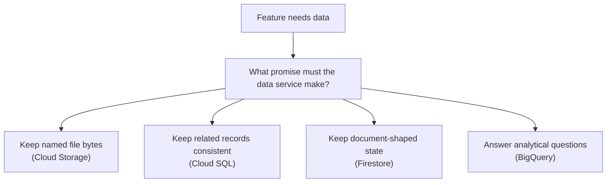

## Table of Contents

1. [A Data Choice Is A Promise](#a-data-choice-is-a-promise)
2. [Start With The Question The App Will Ask](#start-with-the-question-the-app-will-ask)
3. [The Orders API Decision Map](#the-orders-api-decision-map)
4. [Choose Cloud Storage For File-Like Objects](#choose-cloud-storage-for-file-like-objects)
5. [Choose Cloud SQL For Relational App Records](#choose-cloud-sql-for-relational-app-records)
6. [Choose Firestore For Document-Shaped App State](#choose-firestore-for-document-shaped-app-state)
7. [Choose BigQuery For Analytics](#choose-bigquery-for-analytics)
8. [Use Attached Storage Only When Compute Needs It](#use-attached-storage-only-when-compute-needs-it)
9. [Avoid Mixed Signals](#avoid-mixed-signals)
10. [Failure Scenarios That Reveal The Wrong Choice](#failure-scenarios-that-reveal-the-wrong-choice)
11. [A Data Service Review Template](#a-data-service-review-template)
12. [The Operating Habit](#the-operating-habit)

## A Data Choice Is A Promise

Choosing a data service is not just choosing where bytes sit. It is choosing a promise. The
promise might be "this order record stays consistent." It might be "this receipt file can be
downloaded later." It might be "this checkout draft can be found by user ID." It might be
"this table can answer analytics questions over millions of events."

Those promises are different. They should not all become "put it in the database" or "just
upload it to a bucket." A good data choice makes the next read, write, restore, and incident
easier to explain. A bad data choice may work for the first demo and become painful when the
feature gets real users.

For GCP beginner systems, start with four main services. Cloud Storage stores file-like
objects. Cloud SQL stores relational application records. Firestore stores document-shaped
app data when the access pattern fits. BigQuery stores analytical data for reporting and
data engineering. Persistent Disk and Filestore matter too, but usually as storage attached
to compute rather than the main data model for a Cloud Run API.



This diagram is intentionally small. If the first map is too complex, the decision is
probably starting from service names instead of data behavior.

## Start With The Question The App Will Ask

The fastest way to choose poorly is to ask, "which database is best?" The better question is
"what question will the app or team ask this data?" That wording keeps the decision close to
the feature.

Here are four different questions:

| Question | Data Shape | First GCP Service |
|---|---|---|
| Can the customer download receipt `rcp_9281`? | File bytes by object name | Cloud Storage |
| Can checkout create an order and payment attempt together? | Related records and transaction | Cloud SQL |
| What checkout draft should user `user_9138` continue? | Document by known path | Firestore |
| How many card payments failed by app version last week? | Analytical aggregation over many events | BigQuery |

Each question points to a different data promise. That does not mean a system uses only one
service. It means each piece of data should have a reason for where it lives.

For `devpolaris-orders-api`, the answer is a small set of services with clear jobs, not a
single storage bucket pretending to be an app database or one SQL database storing every
receipt PDF and analytics event forever.

## The Orders API Decision Map

The orders system has request-time data, file data, document state, and analytics data.
Write the decision map before writing the code:

```text
order records:
  shape: relational business records
  service: Cloud SQL
  reason: transactions, constraints, support queries

receipt PDFs:
  shape: file-like objects
  service: Cloud Storage
  reason: durable named bytes, signed download path

checkout drafts:
  shape: document state
  service: Firestore
  reason: read and write by user or cart path

checkout events:
  shape: analytics facts
  service: BigQuery
  reason: reporting and data-engineering queries
```

This record is more useful than a diagram with every GCP data product. It says what the
system believes. Later, if the dashboard is wrong or a receipt is missing, support can ask
which promise failed.

The map can change as the product grows. Maybe the checkout draft does not need Firestore
yet and can live in Cloud SQL. Maybe analytics starts as a daily export before it becomes a
streaming pipeline. That is fine. A clear first map is not a prison. It is a starting point
you can review.

## Choose Cloud Storage For File-Like Objects

Choose Cloud Storage when the data behaves like a file or object. You write the bytes,
usually read the bytes as a whole, and identify them by bucket and object name. Receipt PDFs,
CSV exports, uploaded images, support attachments, and generated artifacts fit this shape.

Cloud Storage is a weaker fit when the app needs relational queries across the content. If
the support team asks for all paid orders with failed payment attempts, do not scan object
names and parse files. Put business records in Cloud SQL or send analytical facts to
BigQuery.

Good Cloud Storage decision:

```text
data: receipt PDF
bucket: devpolaris-orders-receipts-prod
object pattern: receipts/YYYY/MM/order_ID.pdf
metadata: Cloud SQL receipt table
access: app checks order ownership, then creates signed URL
cleanup: retention reviewed by product and support
```

The object storage decision is strongest when the database stores meaning and Cloud Storage
stores bytes. Keep that split visible.

## Choose Cloud SQL For Relational App Records

Choose Cloud SQL when the app needs relational records, SQL queries, constraints, and
transactions. Orders, line items, payment attempts, customer account records, receipt
metadata, and support lookup data often belong here.

Cloud SQL is not only for old-fashioned applications. Relational records remain one of the
clearest ways to protect business state. Checkout needs consistency. Support needs queries.
Finance needs reliable records. Those needs are not solved by putting every order into one
object file.

Good Cloud SQL decision:

```text
data: order and payment records
database: orders
reason: transaction protects order, items, and payment attempt
connection path: private Cloud Run to Cloud SQL path
secret: database URL in Secret Manager
backup: restore path reviewed
```

The tradeoff is that the team owns schema, migrations, connection behavior, query
performance, and restore thinking. Cloud SQL manages the database platform. It does not
manage your data model for you.

## Choose Firestore For Document-Shaped App State

Choose Firestore when the data naturally fits documents and predictable access paths. It can
be a good fit for checkout drafts, user preferences, lightweight status documents, or
mobile-friendly app records. The app should be able to describe how it reads and writes the
documents before choosing Firestore.

Good Firestore decision:

```text
data: checkout draft
collection: checkoutDrafts
document key: user ID
reads: load current draft by user ID
writes: update selected plan and last completed step
cleanup: query expired drafts by status and expiresAt
```

Firestore is a weaker fit when the team expects many relational joins or unknown future
reports. If the feature keeps asking relational questions, use Cloud SQL. If the feature
keeps asking analytical questions across large history, use BigQuery.

The tradeoff is access-pattern discipline. Firestore can feel flexible, but production
queries, indexes, security, and state transitions still need design.

## Choose BigQuery For Analytics

Choose BigQuery when the team needs analytical questions over many rows. Data engineers and
analysts commonly use BigQuery in GCP because it is built for warehouse-style analysis and
SQL over large tables. It is excellent for reporting, dashboards, product analytics, event
analysis, and transformed data sets.

Good BigQuery decision:

```text
data: checkout events
dataset: orders_analytics
raw table: checkout_events
curated table: order_facts_daily
questions:
  failed payments by app version
  checkout conversion by country
  daily paid order count
not for:
  committing one checkout transaction
```

The last line matters. BigQuery is not the request-time source of truth for a single order.
Use it to analyze many facts. Keep operational writes and customer-facing lookups in the
operational stores designed for that path.

The tradeoff is pipeline and query ownership. Someone must define event contracts, ingestion
paths, data quality checks, time filters, access, and cost habits.

## Use Attached Storage Only When Compute Needs It

Persistent Disk and Filestore are real GCP storage services, but in this simplified module
they appear as attached-storage choices. Persistent Disk gives disk storage for Compute
Engine VMs. Filestore gives managed file shares for workloads that need a shared filesystem
path.

Use them when the compute shape asks for them:

| Need | Attached Storage To Consider |
|---|---|
| VM boot disk | Persistent Disk |
| VM scratch space for processing | Persistent Disk |
| Several VM-based workers need a shared mounted folder | Filestore |
| Legacy app expects a filesystem path | Filestore or VM-attached design |

Do not put Cloud Run product data into attached storage because it feels familiar. Cloud Run
instances are meant to be replaceable. Durable application data belongs in the proper data
service: Cloud SQL, Cloud Storage, Firestore, BigQuery, or another service chosen for the
data shape.

## Avoid Mixed Signals

Mixed signals show that the data choice and the feature shape do not agree.

| Mixed Signal | What It Suggests |
|---|---|
| Receipt PDFs are stored as database blobs | Cloud Storage may be a better file home |
| Final order records are scattered across object files | Cloud SQL may be needed for relational consistency |
| BigQuery is queried during checkout | Operational database and analytics warehouse are being confused |
| Firestore stores data that support wants to join across many tables | The feature may be relational |
| VM local disk holds product data nobody can restore | Data service and recovery plan are missing |

Mixed signals are not moral failures. They are design clues. If the current choice makes
every new requirement harder to explain, stop and review the data shape.

## Failure Scenarios That Reveal The Wrong Choice

Wrong data choices often show up as awkward failures.

Object storage used like a database:

```text
symptom: support needs all paid orders for one customer
current design: one JSON file per order in Cloud Storage
pain: app scans object prefixes and parses files
better question: should these be relational records in Cloud SQL?
```

Operational database used for analytics load:

```text
symptom: checkout database slows during dashboard refresh
current design: heavy reporting query runs against Cloud SQL
pain: customer path and analytics path compete
better question: should events or facts be exported to BigQuery?
```

Document store used for relational ledger:

```text
symptom: payment and order status disagree
current design: separate Firestore documents with weak transition rules
pain: support cannot trust checkout state
better question: should this state live in Cloud SQL transactions?
```

Local disk used for durable files:

```text
symptom: receipt files vanish after VM replacement
current design: receipts written under /var/app/receipts
pain: one machine held product data
better question: should files live in Cloud Storage?
```

These failures are uncomfortable, but they are useful. They show which promise the current
service did not make.

## A Data Service Review Template

Use this template for each new data feature:

```text
feature:
  receipt download

data:
  receipt PDF plus receipt metadata

shape:
  file bytes plus relational ownership record

first service:
  Cloud Storage for PDF bytes
  Cloud SQL for metadata

main read:
  customer requests receipt for order ID

main write:
  receipt worker uploads PDF and marks metadata ready

access control:
  app checks order ownership before generating signed URL

recovery:
  know whether receipt can be regenerated or must be restored

cleanup:
  lifecycle and retention reviewed by object prefix

first failure check:
  metadata row, object path, bucket IAM, signed URL expiration
```

This template is intentionally plain. If the team cannot fill it out, the service choice is
probably not ready. A good data decision should be explainable by a junior engineer during a
review.

## The Operating Habit

Choose data services by the shape of the data and the promise the feature needs. Use Cloud
Storage for file-like objects. Use Cloud SQL for relational operational records. Use
Firestore for document-shaped app state with clear access patterns. Use BigQuery for
analytics and data-engineering questions. Use attached storage when the compute design
requires a disk or shared filesystem.

The mature system is not the one with the most services. It is the one where each service
has a clear job. When checkout fails, receipts vanish, drafts go stale, or dashboards look
wrong, the team should know which data promise to inspect first.

---

**References**

- [Cloud Storage objects](https://cloud.google.com/storage/docs/objects) - Explains the object model used for file-like data.
- [Cloud SQL overview](https://docs.cloud.google.com/sql/docs/introduction) - Introduces managed relational database concepts.
- [Firestore data model](https://cloud.google.com/firestore/docs/data-model) - Documents collections, documents, and document paths.
- [BigQuery documentation](https://cloud.google.com/bigquery/docs) - Covers BigQuery for analytics and data warehousing.
- [Persistent Disk overview](https://cloud.google.com/compute/docs/disks) - Explains disk storage attached to Compute Engine.
- [Filestore documentation](https://cloud.google.com/filestore/docs) - Documents managed file shares for filesystem-oriented workloads.
