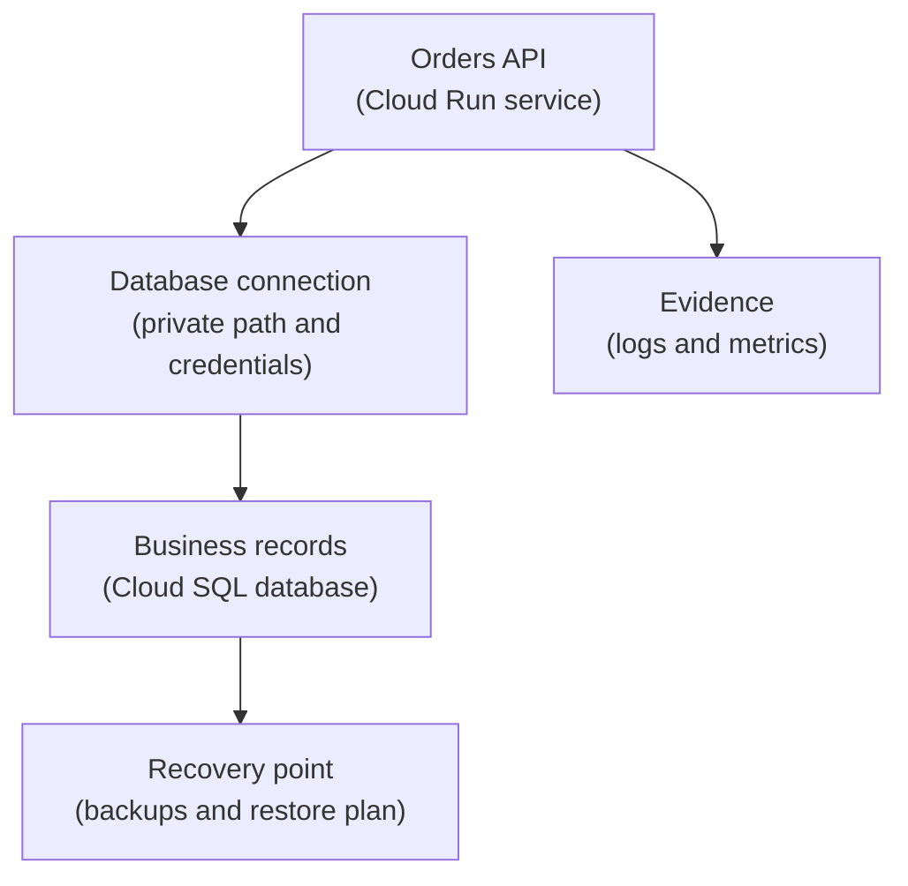

## Table of Contents

1. [Some Data Needs Rules Between Records](#some-data-needs-rules-between-records)
2. [What Cloud SQL Provides](#what-cloud-sql-provides)
3. [If RDS Or Azure SQL Is Familiar](#if-rds-or-azure-sql-is-familiar)
4. [The Orders API Relational Shape](#the-orders-api-relational-shape)
5. [Instances, Databases, And Schemas](#instances-databases-and-schemas)
6. [Transactions Protect Checkout Consistency](#transactions-protect-checkout-consistency)
7. [Connections Are A Runtime Concern](#connections-are-a-runtime-concern)
8. [Private Access Is Part Of The Database Design](#private-access-is-part-of-the-database-design)
9. [Migrations Need Release Discipline](#migrations-need-release-discipline)
10. [Backups Matter Only If Restore Is Understood](#backups-matter-only-if-restore-is-understood)
11. [Failure Modes And First Checks](#failure-modes-and-first-checks)
12. [A Practical Cloud SQL Review](#a-practical-cloud-sql-review)

## Some Data Needs Rules Between Records

An order is not just one blob of data. It belongs to a customer. It has line items. It has a
payment state. It may have refunds, receipts, and support notes. Those pieces need to agree
with each other. If the payment is marked paid but the order row is missing, support cannot
explain what happened. If an order item points at a product snapshot that does not exist,
reporting becomes unreliable.

Relational databases exist for this kind of application state. They let you model related
records, use SQL queries, define constraints, and update several pieces of data together in
a transaction. A transaction is a unit of work that should fully succeed or fully fail. For
checkout, that matters a lot.

Cloud SQL is GCP's managed relational database service for MySQL, PostgreSQL, and SQL
Server. In this article, the running example uses a PostgreSQL-shaped database because the
concepts are familiar to many backend developers. The same mental model applies to the other
supported engines, but engine-specific details still matter in real projects.



The database is not only a place to write rows. It is part of the runtime path, the release
path, and the recovery plan.

## What Cloud SQL Provides

Cloud SQL gives you a managed database instance. Managed means Google Cloud handles many
database administration chores around the service, such as infrastructure operation,
maintenance features, backups, high availability options, monitoring, logging, and network
connectivity choices. It does not mean the app can ignore database design.

Your team still owns the data model. You decide tables, indexes, migrations, query patterns,
database users, connection behavior, backup expectations, and how the app handles database
failure. Cloud SQL reduces infrastructure work, but it does not make relational thinking
optional.

The useful beginner split is:

| Cloud SQL Helps With | Your Team Still Owns |
|---|---|
| Managed database infrastructure | Schema design and migrations |
| Backup features | Restore testing and recovery decisions |
| Connectivity options | Choosing and configuring the app path |
| Monitoring and logs | Knowing which signals matter |
| High availability options | Deciding what failure target the product needs |

That split prevents two bad assumptions. Cloud SQL is not "just a VM with Postgres" that
you operate entirely yourself. It is also not "a database that designs itself." It sits in
the middle: managed service, real database responsibility.

## If RDS Or Azure SQL Is Familiar

If you know AWS RDS, Cloud SQL will feel familiar. Both are managed relational database
services. If you know Azure SQL Database, the broad idea also transfers: the provider
operates much of the database platform, and your app connects to a managed endpoint.

The GCP details differ. Cloud SQL has its own instance model, networking options, service
agents, IAM-adjacent access patterns, database user configuration, Cloud SQL Auth Proxy
option, private IP behavior, maintenance settings, backups, and metrics. Treat the provider
comparison as a map, not a promise that every knob is in the same place.

For `devpolaris-orders-api`, the main transferable idea is this: the request-time source of
truth for orders should be a database that can protect relationships and transactions. On
GCP, Cloud SQL is the natural beginner service for that shape.

## The Orders API Relational Shape

The orders API needs to remember business facts that agree with each other. A simplified
schema might start with customers, orders, order items, and payment attempts:

```text
customers
  id
  email
  created_at

orders
  id
  customer_id
  status
  total_cents
  created_at

order_items
  order_id
  sku
  quantity
  unit_price_cents

payment_attempts
  id
  order_id
  provider
  status
  created_at
```

This shape is relational because the records point at each other. The app wants questions
across those relationships:

| Question | Why SQL Helps |
|---|---|
| Which orders belong to this customer? | Query by customer and order state |
| Which payment attempts failed yesterday? | Filter and join payment and order context |
| What is the total value of paid orders this month? | Aggregate over reliable order rows |
| Can an order item exist without an order? | Constraint can protect the relationship |

You could store one large JSON document per order somewhere else. Sometimes that is fine.
But when the business needs flexible questions, constraints, and transaction safety, a
relational database earns its place.

## Instances, Databases, And Schemas

Cloud SQL has an instance. The instance is the managed database server resource. Inside it,
you can have databases depending on engine and design. Inside the database, you define
schemas, tables, indexes, users, and permissions.

For a beginner, the hierarchy might look like this:

```text
project: devpolaris-orders-prod
Cloud SQL instance: sql-orders-prod
database: orders
schema: public
tables: customers, orders, order_items, payment_attempts
```

The names matter because failure messages often name only one layer. A connection string may
point at the instance. A migration may fail inside one database. A query may fail because a
table or column does not exist. Support needs enough naming discipline to know which layer
is being discussed.

Do not hide every environment behind the same names. A production instance and staging
instance should be easy to distinguish in logs, dashboards, and release records.

## Transactions Protect Checkout Consistency

Checkout is a good place to understand transactions. The app may need to create an order,
insert order items, record a payment attempt, and update status. If one step fails halfway,
the database should not keep a confusing partial state.

A simplified transaction story looks like this:

```text
begin transaction
  insert order row
  insert order item rows
  insert payment attempt row
  update order status to pending_payment
commit transaction
```

If the payment attempt insert fails, the transaction can roll back. Rollback means the
database returns to the state before the transaction began. That protects the app from
half-created orders.

This does not solve every business problem. Payment providers, retries, idempotency, and
external events still need careful design. But database transactions give the app one
important local guarantee: the records inside the database can move together.

## Connections Are A Runtime Concern

Cloud SQL is a managed database, but the app still needs to connect to it. That connection
depends on networking, credentials, database user setup, connection limits, and runtime
behavior. A Cloud Run service that creates too many database connections can harm the
database even if every individual query is valid.

For the orders API, the runtime record should name the connection path:

```text
app: devpolaris-orders-api
runtime: Cloud Run
database instance: sql-orders-prod
database: orders
connection path: private IP or approved Cloud SQL connection pattern
secret: ORDERS_DB_URL in Secret Manager
connection pool: bounded per instance
```

The phrase "bounded per instance" matters. Cloud Run may run more than one instance. If each
instance opens too many database connections, total connections can grow quickly. The app
should use a reasonable pool size and the team should monitor connection count.

Connection failures are not always database failures. They can be wrong credentials, wrong
database name, missing network path, exhausted connections, migration mismatch, or a service
account problem in the secret-read path.

## Private Access Is Part Of The Database Design

The networking module already introduced private access. Cloud SQL can be configured with
public or private access patterns. For a production backend, the team often wants a private
path from the runtime to the database. That path must be designed, not assumed.

For `devpolaris-orders-api`, a first private path review might be:

```text
runtime: Cloud Run service in us-central1
database: Cloud SQL instance in us-central1
network path: approved private path through VPC design
secret path: Secret Manager value read by runtime service account
```

If the app times out connecting to a private address, the database password may be fine. The
network path may be wrong. If the app gets authentication errors, the network path may be
fine and credentials may be wrong. These errors need different fixes.

Do not make the database public only because the private path was confusing. A public path
may be appropriate in some designs, but it should be a reviewed decision with access
controls, not a shortcut.

## Migrations Need Release Discipline

A migration changes the database structure or data. It might add a column, create an index,
rename a field, or backfill values. Migrations are part of deployment because application
code and database shape must agree.

A safe migration plan asks:

| Question | Why It Matters |
|---|---|
| Is the change backward compatible? | Old and new app versions may overlap during rollout |
| Does the migration lock large tables? | Long locks can break checkout |
| Can the app handle missing values during rollout? | Backfills may take time |
| What is the rollback plan? | Code rollback may not undo schema changes |
| What evidence proves success? | Release needs migration status, not hope |

For example, adding a nullable `receipt_status` column is usually easier than renaming a
required column used by running code. The first change can support a gradual rollout. The
second can break every instance that still expects the old name.

Database migrations deserve the same calm review as application deploys. They change the
system of record.

## Backups Matter Only If Restore Is Understood

Cloud SQL has backup features, but a backup is only useful if the team understands restore.
A backup that exists somewhere is not the same as a working recovery plan. The app must know
where restored data would live, how to point services at it, and what time the team is
trying to recover to.

For the orders database, ask:

```text
what is protected:
  Cloud SQL orders database

what could go wrong:
  bad migration, accidental deletion, corrupted write, operator mistake

restore target:
  new Cloud SQL instance or database from a known recovery point

app change after restore:
  update runtime configuration only after validation

validation:
  sample order lookup, checkout smoke test, support query
```

This is not overthinking. A restore is a production change. It can save the business during
a bad incident, but only if the team has practiced the path and understands the tradeoffs.

## Failure Modes And First Checks

Cloud SQL failures often look like app failures at first.

The app cannot connect:

```text
symptom: connection timeout
first checks:
  Cloud SQL instance status
  private access path
  Cloud Run VPC egress
  database address and port
```

The app connects but login fails:

```text
symptom: authentication failed
first checks:
  Secret Manager value
  database user and password
  database name
  recent secret rotation
```

Checkout fails after deployment:

```text
symptom: column does not exist
first checks:
  migration ran in production
  app revision expects new schema
  rollback compatibility
  migration logs
```

Database gets slow:

```text
symptom: checkout latency rises
first checks:
  slow queries
  missing index
  connection count
  CPU and storage metrics
```

The goal is to name the layer. A timeout, login failure, schema mismatch, and slow query are
not the same problem.

## A Practical Cloud SQL Review

Before using Cloud SQL as the orders database, the team should fill out a review:

| Review Item | Example Answer |
|---|---|
| Instance | `sql-orders-prod` |
| Database engine | PostgreSQL for orders API |
| Database | `orders` |
| Primary data | Orders, line items, payment attempts, receipt metadata |
| Runtime caller | `devpolaris-orders-api` on Cloud Run |
| Connection path | Reviewed private path in `us-central1` |
| Secret source | `ORDERS_DB_URL` in Secret Manager |
| Migration owner | Orders backend team |
| Backup expectation | Recovery point and restore validation documented |
| First health signal | Connection count, query latency, app error logs |

This review helps during the first serious database problem. The team knows what the
database stores, how the app reaches it, how schema changes are controlled, and what restore
would mean. Cloud SQL gives the managed relational home. The team still owns the relational
promise.

---

**References**

- [Cloud SQL overview](https://docs.cloud.google.com/sql/docs/introduction) - Introduces Cloud SQL concepts, managed features, and connection options.
- [Cloud SQL backups](https://cloud.google.com/sql/docs/postgres/backup-recovery/backups) - Documents backups and recovery behavior for PostgreSQL instances.
- [Connect from Cloud Run to Cloud SQL](https://cloud.google.com/sql/docs/postgres/connect-run) - Explains common Cloud Run to Cloud SQL connection patterns.
- [Cloud SQL private IP](https://cloud.google.com/sql/docs/postgres/private-ip) - Covers private IP connectivity for Cloud SQL.
