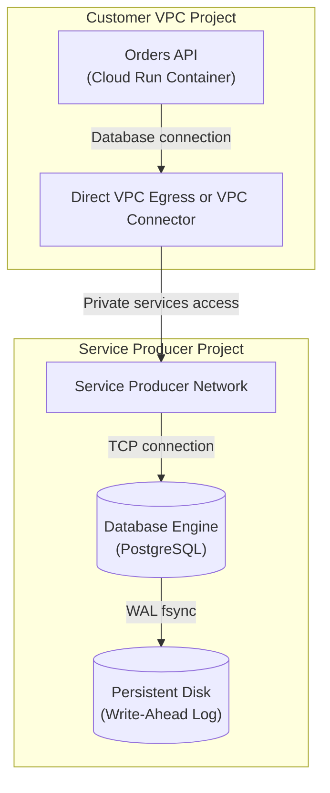

## Table of Contents

1. [Managed Relational Database Instances](#managed-relational-database-instances)
2. [Relational Shape and ACID Transactions](#relational-shape-and-acid-transactions)
3. [Private IP Connectivity and VPC Peering](#private-ip-connectivity-and-vpc-peering)
4. [Connection Management and Serverless Scaling](#connection-management-and-serverless-scaling)
5. [Schema Migrations and Zero-Downtime Releases](#schema-migrations-and-zero-downtime-releases)
6. [Under the Hood: Write-Ahead Logging and Zonal Replication](#under-the-hood-write-ahead-logging-and-zonal-replication)
7. [Putting It All Together](#putting-it-all-together)
8. [What's Next](#whats-next)

## Managed Relational Database Instances

When you build applications that handle critical business records—like tracking customer checkouts, managing library catalogs, or processing bank transfers—you need a way to organize data into strict, predictable structures. Relational databases solve this by arranging data in tables that look and behave like highly structured spreadsheets. Each row in a table represents a single item, and each column defines a specific detail, such as an order number, a price, or an email address. Crucially, these tables are designed to relate to one another. For example, an order record in an orders table can point directly to a specific row in a customers table, ensuring that you can easily join these sheets together to reconstruct the full context of a purchase.

The power of a relational database lies in its ability to protect transactions from partial success. In a standard checkout process, saving an order requires updating multiple separate sheets: you must subtract one item from the inventory table, create a new line in the orders table, and record a payment token in a payment attempts table. If your application crashes halfway through, or if a network glitch halts the database write, you cannot afford to have the inventory reduced without a matching order record. A relational database coordinates these related writes, ensuring that either all the updates succeed together or they are completely wiped out, returning your data to its original, safe state.

Google Cloud SQL is a fully managed database service that provides this structured storage. Instead of requiring you to rent a virtual server, install database software, configure operating system updates, and manually manage backups, Cloud SQL delivers a fully operational database engine—such as PostgreSQL, MySQL, or SQL Server—ready to use out of the box. This managed approach is common across all major clouds. In Amazon Web Services (AWS), the equivalent service is Amazon Relational Database Service (RDS), and in Microsoft Azure, it is Azure Database for PostgreSQL or Azure SQL Database. While the physical implementation differs—such as how the cloud providers sync disks across datacenters—the architectural role is identical: giving your application a private, highly consistent ledger that preserves your structured relationships even when thousands of users complete transactions simultaneously.

## Relational Shape and ACID Transactions

A typical checkout transaction in an e-commerce Orders API showcases why we need structured relational tables. When a customer completes a purchase, the application must perform several distinct database updates that represent a single business event. The system must update the stock count in an inventory table, insert an order metadata row containing order totals and timestamps, write individual product details to a line items table, and record a payment gateway token in a payment attempts table. If any of these writes fail due to an out-of-stock item, a processing timeout, or a network disruption, the entire write sequence must revert. Without relational transactions, the system risks creating orphaned balance updates or payments that do not point to a valid order, resulting in disjointed records that are difficult to reconcile.

To maintain absolute data integrity under a high volume of transactions, the database enforces four key guarantees, commonly referred to as the ACID principles. First, the write sequence must be atomic, meaning it behaves as a single unit—either everything succeeds or the entire sequence is rolled back. Second, it must be consistent, verifying that all schema rules, like preventing negative inventory values, are strictly followed. Third, it must run in isolation, ensuring that concurrent checkout requests do not see each other's partial, uncommitted changes. Finally, it must be durable, meaning once a commit succeeds, the data is permanently written to physical disk. To prevent race conditions where two users attempt to purchase the last physical item simultaneously, the SQL script locks the inventory row during the read phase before updating it. The following sequence demonstrates how a transactional orders ledger is updated safely in production:

```sql
BEGIN;

-- 1. Query stock and acquire a row-level write lock
SELECT stock_count
FROM inventory
WHERE product_id = 'prod_sku_9981'
FOR UPDATE;

-- 2. Decrement the inventory stock count
UPDATE inventory
SET stock_count = stock_count - 1
WHERE product_id = 'prod_sku_9981';

-- 3. Insert the transactional order record
INSERT INTO orders (order_id, user_id, amount, status)
VALUES ('ord_checkout_77261', 'user_id_4401', 89.99, 'processing');

COMMIT;
```

This write appends sequentially to the database's physical Write-Ahead Log buffer in memory and forces a physical flush to disk blocks before returning success. Under the hood, the engine coordinates concurrent reads and writes by keeping multiple versions of the active records in memory, a strategy known as Multi-Version Concurrency Control, which allows read operations to proceed smoothly without waiting for active write locks to clear.

## Private IP Connectivity and VPC Peering

Securing the communication channel between the application and the Cloud SQL instance is a primary architectural requirement. Exposing a database engine directly to the public internet using a public IP address increases the attack surface, exposing the instance to brute-force authentication attempts and potential zero-day vulnerabilities in the database daemon. To prevent this, enterprise architectures isolate the database instance within a private network boundary, utilizing private IP addresses and virtual private cloud (VPC) peering to establish connectivity.


*Private reachability and database authentication remain separate protections.*

The Cloud SQL instance resides in Google-managed service infrastructure, separate from the customer's application resources. To bridge this boundary for private IP, you configure private services access. Private services access uses VPC Network Peering between your VPC network and a Google-managed service producer network, after you allocate a private address range for the producer side. Private Service Connect is a separate Cloud SQL connectivity option that provides a private endpoint pattern.

When an application service, such as a containerized Orders API running on Cloud Run, initiates a database connection to a private IP, the network path depends on how that runtime reaches the VPC. Cloud Run can use Direct VPC egress or a Serverless VPC Access connector for outbound private addresses. From the VPC side, the database private IP is reached through the private services access connection.



Beyond network layer routing, the application must authenticate secure sessions. Cloud SQL supports the Cloud SQL Auth Proxy, language connectors, and IAM database authentication for supported engines and configurations. The Auth Proxy authorizes and encrypts the connection and uses IAM to verify whether the caller can connect to the instance. It does not automatically remove all database authentication concerns by itself; your database user model, IAM database authentication choice, and secret handling still matter.

## Connection Management and Serverless Scaling

Serverless platforms like Cloud Run scale horizontally in response to immediate request concurrency, introducing unique challenges for database connection management. When traffic surges, the container fabric can rapidly scale from a few instances to hundreds of concurrent sandboxes. If the application's configuration defaults to establishing a large, static connection pool per container instance, the cumulative number of concurrent socket connections will quickly overwhelm the database host. Relational database engines like PostgreSQL allocate a dedicated operating system process and memory buffer for each client connection, while MySQL allocates an execution thread. When the aggregate connection count hits the database engine's hard limit, the host experiences connection socket starvation, causing incoming checkouts to time out during the initial TCP handshake.


*The pool is a pressure valve between elastic compute and finite database connections.*

To shield our PostgreSQL instance from connection starvation during serverless autoscaling, use a pooling layer. Cloud SQL now offers Managed Connection Pooling for supported PostgreSQL configurations, and teams can also run PgBouncer themselves when they need direct control. PgBouncer acts as a socket multiplexer, accepting many incoming client connections while using a smaller, stable pool of server connections to the database engine. In our self-managed setup, PgBouncer is configured using `pgbouncer.ini` to enforce transaction pooling:

```ini
[databases]
orders = host=10.128.0.5 port=5432 dbname=orders_prod

[pgbouncer]
listen_port = 6432
listen_addr = *
auth_type = md5
auth_file = /etc/pgbouncer/userlist.txt
pool_mode = transaction
max_client_conn = 10000
default_pool_size = 20
```

The specific numbers must be sized for the database tier, workload, and pool mode. The principle is stable: serverless compute can scale faster than a relational database can accept new sessions, so the application needs connection limits and pooling before traffic spikes arrive.

## Schema Migrations and Zero-Downtime Releases

Schema migrations represent another major operational risk where database state and application code can diverge. Unlike stateless application containers, which can be deployed in a rolling blue-green fashion where old and new versions run concurrently, the database schema is a single, shared state. If a developer deploys a code update that relies on a new column before the migration has executed, the new containers will crash when attempting to write to the missing field. Conversely, if a migration drops an old column while old container revisions are still active and serving traffic, those old containers will fail immediately. Achieving zero-downtime schema migrations requires an incremental expand-and-contract engineering pattern.

Crucially, migrations must be designed to avoid catastrophic table locks. Executing an `ALTER TABLE` statement (such as adding a column or changing a constraint) requires an exclusive lock on the entire table. In PostgreSQL, this is an `AccessExclusiveLock`, which blocks all other read and write queries. Under heavy checkout traffic, if a migration script requests an exclusive lock, it must wait in the lock queue until all active transactions complete. While the migration waits, it blocks all incoming read and write transactions that attempt to access the table, quickly causing connection pool exhaustion and bringing the entire Orders API to a halt.

To prevent this, rolling migrations must execute with strict lock timeouts. We apply this strict timeout boundary to our migration transaction:

```sql
-- Safeguard: abort if the exclusive lock cannot be acquired within 2 seconds
SET lock_timeout = '2s';

-- Expand schema
ALTER TABLE orders ADD COLUMN loyalty_tier VARCHAR(20) DEFAULT 'bronze';
```

If the `orders` table is heavily loaded with active select and insert transactions (which hold `AccessShareLock`), the migration's request for an `AccessExclusiveLock` is queued. Under this configuration, two paths dictate the outcome:

*   **Path A: Migration Aborts Safely on Lock Timeout**: If the lock cannot be acquired within two seconds, PostgreSQL aborts the command and clears the FIFO queue instantly. Incoming checkout transactions continue processing smoothly without dropping connections or timing out, allowing the migration tool to retry during a low-traffic window.
*   **Path B: Migration Succeeds During a Low-Traffic Window**: When the migration runner retries during a brief dip in active transactions, it immediately acquires the exclusive lock, executes the column metadata change, and returns successfully in under 50 milliseconds.

This expand-and-contract discipline prevents runaway migration locks from starving active checkout lines.

## Under the Hood: Write-Ahead Logging and Zonal Replication

:::expand[Under the Hood: Write-Ahead Logging and High Availability Replication Networks]{kind="design"}
Operating a highly consistent database at scale requires understanding the low-level physical realities of disk hardware and network transport. The database guarantees Durability and High Availability through coordinated write-ahead logging and synchronous block-level replication across physical availability zones.

#### Write-Ahead Logging and Disk Flush Guarantees
Durability relies on a sequence of append-only operations known as the Write-Ahead Log (WAL). When an application executes a SQL insert for a checkout transaction, the database engine does not perform costly, random disk writes to modify the database's actual data tables on disk. Instead, the engine processes the change in memory and appends the transaction details sequentially to a WAL buffer in RAM. A transaction is not legally committed until this WAL buffer is physically flushed to persistent storage. This flush is executed via the `fsync` operating system system call, which bypasses kernel file caches and forces the disk controller to write the log blocks to non-volatile physical storage blocks. Once the storage controller acknowledges the physical write, the transaction is marked as committed. The database engine can then safely delay flushing the modified data pages from RAM to the permanent tables on disk, a process handled asynchronously during checkpoints. In the event of a sudden power loss, the database engine simply replays the sequential WAL blocks to reconstruct the accurate state.

#### Zonal High Availability and Synchronous Replication Networks
To protect against the physical failure of an entire datacenter zone, Cloud SQL instances can be deployed in a High Availability (HA) configuration. This architecture provisions a primary database instance in a primary availability zone and a standby instance in a secondary zone. Under the hood, these instances run on separate virtual machines with independent network-attached persistent disks. When the application issues a write, the block storage layer of the primary VM intercepts the write and replicates the raw disk blocks synchronously over the high-speed regional fiber optic network to the standby VM's persistent disk. The transaction commit remains blocked, and the application's connection is held open, until the block write is physically flushed and acknowledged on both the primary and the standby storage volumes. This guarantees a Recovery Point Objective (RPO) of zero, ensuring that no data is lost during a failover. In contrast, read replicas use database-level asynchronous replication, where the primary engine returns success immediately after flushing the WAL locally, and streams the log updates asynchronously across the network. If the primary zone fails, any log packets still in transit are lost, resulting in potential data loss.

Synchronous replication introduces a performance tradeoff because the write must be protected outside the primary location before the system can treat the HA copy as current. The exact latency depends on the region, instance, storage, workload, and network conditions. The beginner-safe lesson is that HA reduces recovery time and data-loss risk for zonal failures, while read replicas use asynchronous replication and can lag behind the primary.

#### Connection Starvation under Serverless Scaling Concurrency
The mismatch between the scaling mechanics of stateless serverless platforms and the process-oriented architecture of relational databases is a frequent cause of production crashes. When a platform like Cloud Run detects a spike in traffic, its orchestration layer automatically launches new sandboxed container instances. Relational database engines, particularly PostgreSQL, operate on a process-per-connection model. Each new connection demands a dedicated virtual memory workspace and thread scheduling overhead on the database VM. As hundreds of serverless sandboxes scale out, they consume available file descriptors and trigger thread scheduling thrashing on the database host. When the database engine reaches its maximum allowed concurrent connection count, it rejects new TCP connection requests. PgBouncer mitigates this at the protocol level. It establishes a fixed, highly optimized pool of permanent connections to the database engine, intercepting incoming application requests, queuing and multiplexing them over the active database sockets. This decouples connection scaling from compute scaling.

#### Zero-Downtime Rolling Schema Migrations Systems Mechanics
Executing schema migrations under continuous, high-concurrency traffic exposes severe lock starvation risks within the database's query planner. Under normal operation, every standard SELECT, INSERT, or UPDATE query acquires a shared metadata lock (`AccessShareLock` in PostgreSQL) on the target table, allowing many transactions to access the table concurrently. When a migration script attempts to alter a table (such as adding a column or changing a constraint), it requests an exclusive metadata lock (`AccessExclusiveLock`). This exclusive lock requires absolute isolation and cannot be granted until every active query currently holding a shared metadata lock has completed. However, the database engine maintains a strict first-in, first-out (FIFO) lock queue. Once the migration's exclusive lock request enters the queue, it blocks all subsequent incoming queries that request shared metadata locks. Even if the migration itself is waiting for a single long-running query to finish, every incoming user request is blocked in the queue, creating a massive query pile-up that exhausts the application's connection pools within seconds. To safeguard application availability, engineers must employ a lock timeout (`SET lock_timeout = '2s'`) inside the migration transaction, ensuring that the migration aborts immediately and clears the lock queue if it cannot acquire the lock, preventing a cascading system outage.
:::

## Putting It All Together

Securing application records requires a unified approach across multiple operational layers. By reviewing the transaction lifecycle of the Orders API, we can trace how each architectural decision contributes to system stability and consistency. Relational integrity begins with ACID-compliant transaction blocks that protect multi-table checkout states from partial commit failures. Under high query volume, these transactions rely on internal locking serialization and Multi-Version Concurrency Control to prevent race conditions without blocking concurrent reads.

At the networking layer, the database engine is reached through a private connectivity option such as private services access or Private Service Connect, preventing direct public database exposure when configured without public IP. This transport security is paired with the Cloud SQL Auth Proxy, connectors, IAM database authentication where appropriate, and careful database user management.

To prevent high scaling events from causing connection starvation, client-side pool limits and intermediate PgBouncer multiplexing are employed to protect server threads from resource exhaustion. Finally, the schema structure changes through expand-and-contract deployments with strict lock timeouts, avoiding exclusive table locks that could trigger cascading outages. Zonal high availability and write-ahead logging complete the reliability loop, guaranteeing that block changes are synced across low-latency intra-region fiber loops to standby instances before transaction commit acknowledgements are sent, providing physical durability and failover resilience.

## What's Next

Managed relational instances in Cloud SQL excel at structured, consistent transactions where relationship constraints are strict. However, modern applications also require horizontal scaling patterns for semi-structured documents that demand low-latency lookups without joint relational schemas. In the next chapter, we will shift focus from SQL relational engines to Cloud Firestore, exploring how document-oriented databases partition, index, and query application records at massive scale.


*Use this summary as the quick mental checklist before designing or debugging the service.*


---

**References**

- [Google Cloud: Cloud SQL Overview](https://cloud.google.com/sql/docs/introduction) - Introduces managed database features, supported engines, and configuration paths.
- [Google Cloud: Connect to Cloud SQL](https://cloud.google.com/sql/docs/connect-overview) - Explains networking pathways, private IP configurations, connectors, and the Cloud SQL Auth Proxy.
- [Google Cloud: Private services access for Cloud SQL](https://cloud.google.com/sql/docs/postgres/configure-private-services-access) - Documents private IP connectivity through private services access.
- [Google Cloud: Private Service Connect for Cloud SQL](https://cloud.google.com/sql/docs/postgres/about-private-service-connect) - Explains the separate PSC private endpoint option.
- [Google Cloud: Managed Connection Pooling](https://cloud.google.com/sql/docs/postgres/managed-connection-pooling) - Documents the first-party pooling option for Cloud SQL PostgreSQL.
- [Google Cloud: Cloud SQL Backups](https://cloud.google.com/sql/docs/mysql/backup-recovery/backups) - Documents backup structures, point-in-time recovery, and restore operations.
- [Google Cloud: High Availability Overview](https://cloud.google.com/sql/docs/mysql/high-availability) - Details block-level synchronous replication, multi-zonal deployments, and failover mechanics.
