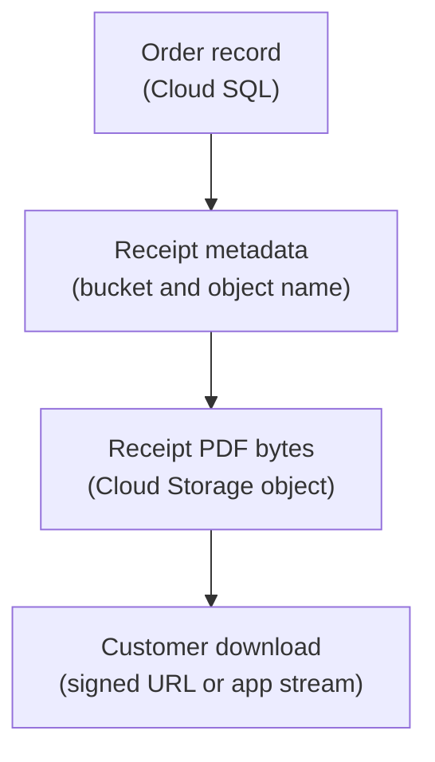

## Table of Contents

1. [Some Data Is A File, Even If The App Creates It](#some-data-is-a-file-even-if-the-app-creates-it)
2. [What A Bucket And Object Mean](#what-a-bucket-and-object-mean)
3. [If S3 Or Blob Storage Is Familiar](#if-s3-or-blob-storage-is-familiar)
4. [The Orders API Receipt Path](#the-orders-api-receipt-path)
5. [Object Names Are Part Of The Design](#object-names-are-part-of-the-design)
6. [Keep Business Meaning In The Database](#keep-business-meaning-in-the-database)
7. [Private Objects And Signed URLs](#private-objects-and-signed-urls)
8. [Lifecycle Rules Are Cleanup Decisions](#lifecycle-rules-are-cleanup-decisions)
9. [Versioning, Retention, And Safe Deletion](#versioning-retention-and-safe-deletion)
10. [Failure Modes And First Checks](#failure-modes-and-first-checks)
11. [A Practical Bucket Review](#a-practical-bucket-review)

## Some Data Is A File, Even If The App Creates It

Backend developers sometimes think files are only things users upload. In production apps,
files are also generated by the system. A receipt PDF is a file. A CSV export is a file. A
support screenshot is a file. A product image is a file. The app may create it, but the data
still behaves like an object: write the bytes, read the bytes, replace the bytes, or delete
the bytes.

Cloud Storage is GCP object storage. It is a good first home for file-like application data.
It gives the app durable buckets, named objects, access controls, signed URLs, lifecycle
rules, and integration with the rest of Google Cloud. Use it for object bytes, not for
relational records that need joins, constraints, and transactions.

For `devpolaris-orders-api`, Cloud Storage fits receipt PDFs and order exports. The orders
database can remember which receipt belongs to which order. Cloud Storage can hold the PDF
bytes. That split is small, but it prevents a lot of trouble.



The database gives the object meaning. Cloud Storage keeps the bytes. The app connects the
two.

## What A Bucket And Object Mean

A bucket is a named container for objects. An object is the stored data plus metadata. The
object name is the key used to identify it inside the bucket. Object names often contain
slashes, such as `receipts/2026/05/order_9281.pdf`, but that does not mean Cloud Storage is
a normal filesystem. The slash is part of the object name.

For beginners, the useful model is:

```text
bucket: devpolaris-orders-receipts-prod
object: receipts/2026/05/order_9281.pdf
content type: application/pdf
owner: orders team
environment: production
```

The bucket is a resource with IAM policies, location, lifecycle configuration, retention
settings, and billing behavior. The object is stored in Cloud Storage rather than on one
server, and systems with the right access can read it.

That distinction matters when the app runs on Cloud Run. A Cloud Run instance can disappear.
Anything important written only to the instance filesystem should be treated as temporary.
An object written to Cloud Storage is meant to outlive one running container.

## If S3 Or Blob Storage Is Familiar

If you know AWS S3, Cloud Storage will feel familiar. A bucket holds objects, and access is
controlled by IAM and policies. If you know Azure Blob Storage, compare the object path with
a storage account, container, and blob. The mental shape transfers: store bytes by name and
let the app or users fetch them later.

The GCP details are still important. Bucket names, IAM roles, signed URL behavior, lifecycle
rules, object versioning, retention policies, and location choices use Google Cloud's
surface. Do not copy an S3 bucket policy design and assume it maps directly.

For this module, the bridge is enough: Cloud Storage is where the orders system stores
receipt files, export files, and uploaded artifacts. Cloud SQL or Firestore stores the app
meaning around those files. BigQuery analyzes facts about many events. Each service has a
different job.

## The Orders API Receipt Path

When checkout succeeds, the orders API may generate a receipt. The receipt has two parts:
the business record and the file bytes. The business record says which order, customer, and
receipt status exist. The file bytes are the PDF a customer can download.

A simple flow looks like this:

```text
checkout succeeds
  -> order row committed in Cloud SQL
  -> receipt job creates PDF
  -> PDF written to Cloud Storage
  -> receipt metadata row updated with bucket and object name
  -> customer gets a download path
```

This flow separates the commit of the order from the generation of the file. That is useful
because the receipt job can retry without creating another paid order. It also means support
can inspect the order record and see whether the receipt file is missing, delayed, or ready.

A receipt metadata record might look like this:

```text
receipt_id: rcp_9281
order_id: ord_9281
status: ready
bucket: devpolaris-orders-receipts-prod
object: receipts/2026/05/order_9281.pdf
content_type: application/pdf
created_at: 2026-05-04T09:43:00Z
```

The object path points to the bytes. The database or application record still carries the
business meaning.

## Object Names Are Part Of The Design

Object names should help humans and systems reason about the data. They should not include
private customer information, and they should not be random in a way that makes support work
harder. A good object naming pattern reveals environment, data type, date, and stable ID
without leaking sensitive details.

For receipts, this pattern is reasonable:

```text
receipts/2026/05/order_9281.pdf
```

For exports, a prefix can group by export type and date:

```text
exports/orders/2026/05/orders-paid-2026-05-04.csv
exports/orders/2026/05/orders-paid-2026-05-04.jsonl
```

These names are easy to inspect. They also make lifecycle rules and support searches more
predictable. If every object is named `file.pdf` under a random folder, the app may still
work, but humans lose the ability to reason about the bucket.

Object names help organization, but they do not control access. Use IAM, signed URLs, and
application authorization to protect private files.

## Keep Business Meaning In The Database

Cloud Storage stores objects well. It does not answer relational business questions well.
If the support team asks, "show me all receipts for customer `cus_9138` in May," the app
should not scan object names and guess. The database should store receipt metadata connected
to customers and orders.

The clean split looks like this:

| Question | Better Place To Answer |
|---|---|
| Which order owns this receipt? | Cloud SQL receipt metadata |
| What bytes should the user download? | Cloud Storage object |
| Who is allowed to see this receipt? | Application authorization plus IAM design |
| When should old exports be cleaned up? | Lifecycle rules plus product retention policy |
| Was the file created successfully? | Metadata status plus object existence |

This split also helps recovery. If the metadata row exists but the object is missing, you
know the receipt generation or upload step failed. If the object exists but no metadata row
points to it, you may have an orphaned object. Those are different cleanup paths.

## Private Objects And Signed URLs

Most production receipt files should be private by default. The customer should not browse
the whole bucket. The app should decide whether a user is allowed to download a specific
receipt. After that check, the app can stream the object itself or create a signed URL.

A signed URL is a time-limited URL that grants access to a specific Cloud Storage resource.
The useful beginner model is: the app checks the user's business permission first, then
creates a short-lived download path for the object.

```text
request: GET /orders/ord_9281/receipt
app checks:
  user owns order ord_9281
  receipt status is ready
  object path is receipts/2026/05/order_9281.pdf
result:
  short-lived signed URL for that object
```

Do not use signed URLs as a replacement for application authorization. A signed URL grants
access to whoever has it while it is valid. That is useful after the app has made the access
decision. It is risky if the URL is logged, shared, or valid longer than the product needs.

## Lifecycle Rules Are Cleanup Decisions

Generated files need cleanup. Export files may only be useful for 30 days. Temporary
processing objects may only be useful for a few hours. Receipt files may need a longer
retention policy because customers and compliance processes depend on them.

Cloud Storage lifecycle rules can act on objects when conditions are met. Write down the
product decision first: which objects should remain, for how long, and what happens
afterward?

A simple review might be:

| Object Type | Example Prefix | Retention Idea |
|---|---|---|
| Receipt PDFs | `receipts/` | Keep according to product and legal needs |
| Admin CSV exports | `exports/orders/` | Delete after short operational window |
| Temporary processing files | `tmp/` | Delete quickly after job completion |
| Support attachments | `support-attachments/` | Keep according to support policy |

Lifecycle actions may not happen at the exact second a condition becomes true. Design the
app so it does not depend on lifecycle timing as a precise scheduler. Use lifecycle for
storage hygiene and cost control, not for request-time business logic.

## Versioning, Retention, And Safe Deletion

Deletion needs care because object storage often holds user-visible artifacts. If a receipt
object is deleted by mistake, the database row may still point to it. If an export is
replaced accidentally, support may download the wrong file. If retention rules are too
aggressive, the team may lose data it promised to keep.

Cloud Storage has features such as object versioning and retention policies that can help in
specific designs. Decide what must be recoverable before enabling safety features by habit.

For production receipts, ask:

| Question | Why It Matters |
|---|---|
| Can this object be regenerated? | Regenerable files need different recovery than original uploads |
| Who can delete it? | Delete access should be narrower than read access |
| How long must it remain? | Product, support, finance, or legal needs may differ |
| Is replacement safe? | Replacing a receipt may create trust and audit problems |
| How do we prove recovery works? | A policy is not enough without a tested path |

Safe deletion belongs in the feature design as well as the bucket settings.

## Failure Modes And First Checks

Cloud Storage failures are usually clear if logs include the bucket and object name.

The receipt file is missing:

```text
symptom: receipt metadata says ready, object returns not found
first checks:
  object name in metadata
  receipt generation job logs
  bucket name and project
  accidental cleanup rule
```

The app cannot upload an export:

```text
symptom: PermissionDenied storage.objects.create
first checks:
  Cloud Run runtime service account
  bucket IAM
  object prefix if policy uses conditions
  project and bucket name
```

The customer gets a forbidden download:

```text
symptom: signed URL returns access error
first checks:
  URL expiration
  signing identity permissions
  object exists
  object name matches metadata
```

The bucket grows faster than expected:

```text
symptom: storage cost rises
first checks:
  object count by prefix
  export cleanup policy
  lifecycle rules
  unexpected temporary files
```

These checks keep the team focused. Do not change the database schema to fix an object
permission problem. Do not grant broad bucket access to fix a missing object name.

## A Practical Bucket Review

Before using a production bucket, the orders team should fill out a short review:

| Review Item | Example Answer |
|---|---|
| Bucket name | `devpolaris-orders-receipts-prod` |
| Main object types | Receipt PDFs and export files |
| Location choice | Aligned with production data and access needs |
| Writer identity | `orders-api-prod` or receipt worker service account |
| Reader path | App authorization followed by signed URL or app stream |
| Object naming pattern | Prefix by type and date, no private customer data in names |
| Metadata owner | Cloud SQL receipt or export table |
| Cleanup policy | Different rules for receipts, exports, and temporary files |
| Recovery question | Which objects can be regenerated and which must be restored? |
| First evidence | Metadata row, object path, upload log, access log if enabled |

This review is a support tool. When a customer cannot download a receipt, the team can
inspect the record, object, access path, and lifecycle policy without guessing. Cloud
Storage is simple when its job is clear: keep named bytes durable and private until the app
decides how to use them.

---

**References**

- [Cloud Storage objects](https://cloud.google.com/storage/docs/objects) - Explains objects, object names, and replacement behavior.
- [Cloud Storage buckets](https://cloud.google.com/storage/docs/buckets) - Describes buckets as Cloud Storage containers with configuration and location.
- [Signed URLs](https://cloud.google.com/storage/docs/access-control/signed-urls) - Documents time-limited access to specific Cloud Storage resources.
- [Object Lifecycle Management](https://cloud.google.com/storage/docs/lifecycle) - Explains lifecycle rules for automatic object actions.
