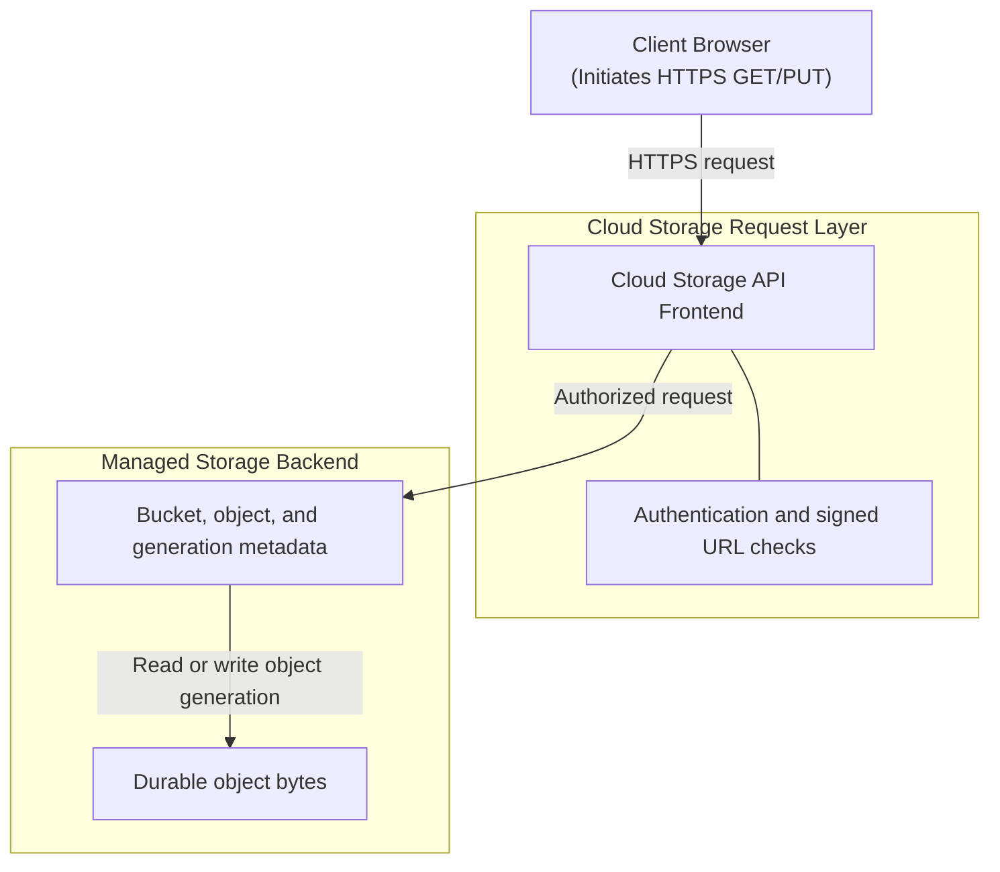

## Table of Contents

1. [The Object Storage Architecture](#the-object-storage-architecture)
2. [Google Cloud Storage Buckets](#google-cloud-storage-buckets)
3. [Immutable Objects and Naming Strategies](#immutable-objects-and-naming-strategies)
4. [Uniform Bucket-Level Access and IAM Security](#uniform-bucket-level-access-and-iam-security)
5. [Short-Lived Signed URLs](#short-lived-signed-urls)
6. [Object Lifecycle Management](#object-lifecycle-management)
7. [Request Path and Upload Mechanics](#request-path-and-upload-mechanics)
8. [Putting It All Together](#putting-it-all-together)
9. [What's Next](#whats-next)

## The Object Storage Architecture

Google Cloud Storage is a service designed to store and serve files over the web. When your application generates a PDF invoice, accepts a user profile photo, or exports a spreadsheet, you need a safe place to put those files. Keeping files directly on your application server's local disk makes the server slow, heavy, and difficult to scale. Cloud Storage solves this by providing a separate, virtual home for files where you can upload and download them securely using web requests. In the cloud, files stored this way are called objects, and the containers they live in are called buckets.

In this architecture, the application database remains the source of truth for relationships and business meaning, such as order status, customer identity, payment state, and the exact path of the invoice. The object store is optimized for storing and delivering the raw bytes. This decoupling keeps large files out of the transactional database, makes backups smaller, and lets the storage layer grow independently from the app database.

## Google Cloud Storage Buckets

A bucket is a fundamental, globally unique container in Google Cloud Storage that acts as the administrative and configuration boundary for all objects stored within it. When our application generates an invoice PDF, the very first architectural decision is determining which bucket will host the file. Because bucket names share a single global namespace across the entire cloud platform, the bucket name must be globally unique, similar to how AWS S3 buckets require unique names worldwide. In contrast, Azure Blob Storage structures its namespace around storage accounts, where container names only need to be unique within a specific storage account. A well-designed bucket name like `devpolaris-billing-invoices-prod` clearly communicates the environment, the service domain, and the resource type. This clarity is crucial because the bucket serves as the boundary for physical data location, storage classes, data access policies, and compliance settings.


*Changing object names changes lookup paths, not folders on a disk.*

Choosing the location of a bucket is a critical physical and systems engineering decision. A regional bucket stores data across multiple redundant zones in a single geographical area, offering low-latency access for applications running in the same region. For global applications or disaster recovery scenarios, dual-region or multi-region options automatically replicate data across geographically separated datacenters. This replication is managed asynchronously by the storage control plane, ensuring high durability even in the event of a catastrophic regional outage. Crucially, the bucket boundary must be treated as a hard security and logical isolation wall. We should avoid the anti-pattern of mixing development, staging, and production files in a single bucket simply because object names can be prefixed.

To establish this administrative boundary in production, developers provision the private storage bucket with Uniform Bucket-Level Access (UBLA) and Public Access Prevention enabled using the `gcloud` command:

```bash
gcloud storage buckets create gs://devpolaris-billing-invoices-prod \
  --location=us-central1 \
  --uniform-bucket-level-access \
  --public-access-prevention
```

Running this command registers the bucket in the regional metadata catalog, configures the control plane to block all public access paths by default, and sets the stage for uniform role-based access controls.

## Immutable Objects and Naming Strategies

An object in Cloud Storage is a discrete packet of data comprised of raw file-like bytes coupled with a set of metadata key-value pairs, uniquely identified by a combination of the bucket name and the object key. Unlike traditional local filesystems where applications can open a file descriptor to modify a few bytes in the middle of a file, object storage is strictly transactional and write-once. If an application needs to update a customer invoice PDF, it must upload the entire file again, replacing the existing object in its entirety. This overwrite behavior presents an operational risk: a bug in the application or an accidental administrative action could overwrite a critical document or delete it forever. To mitigate this, system designers rely on immutable object naming strategies. By embedding unique, high-entropy identifiers or date structures directly into the object name—such as `invoices/2026/05/28/inv_9821a3fc.pdf`—we ensure that each generated file has a permanently unique address that is never overwritten.

Although object names frequently contain slashes to mimic a traditional directory structure, the underlying storage engine treats the entire name as a single flat string. There are no physical directories or folders within a standard bucket. When tools like the Google Cloud Console or command-line utilities show nested folder structures, they are performing a logical string-prefix search on the flat namespace, grouping objects dynamically by splitting them on the slash character. This model is identical to AWS S3, where objects are addressed via key strings, whereas Azure Blob Storage offers a choice between a flat namespace and a true hierarchical namespace with atomic directory operations. Alongside the object name, key-value metadata helps define how clients interact with the stored bytes. For our invoice PDF, the application must set specific metadata headers during the upload transaction to control client behavior.

| Metadata Field | Value | Practical Purpose |
| --- | --- | --- |
| `Content-Type` | `application/pdf` | Instructs browser clients to render the invoice directly in the browser viewport instead of forcing a file download. |
| `Cache-Control` | `private, max-age=0, no-transform` | Prevents public edge caches and CDNs from storing sensitive financial data, ensuring each request hits the backend. |
| `custom:invoice-id` | `9821a3fc` | A custom key-value pair linking the object to the primary key of the billing record in the transactional database. |

This metadata travel-along ensures that downstream systems can process the object correctly. However, we must never treat object metadata as a primary search index or database. Metadata lookups require listing operations, which are expensive, high-latency, and rate-limited. The application's relational database remains the ultimate source of truth for querying, indexing, and managing metadata associations.

## Uniform Bucket-Level Access and IAM Security

Access control in modern Cloud Storage architectures is governed by Uniform Bucket-Level Access, which enforces a single, centralized identity and access management policy across all objects within a bucket. Historically, cloud object storage relied on complex Access Control Lists (ACLs) applied directly to individual objects, allowing fine-grained permissions at the cost of operational obscurity and security risks. Uniform Bucket-Level Access (UBLA) disables these individual object ACLs entirely, forcing all access decisions to be evaluated against Identity and Access Management (IAM) policies defined at the bucket level. In AWS S3, this is analogous to disabling ACLs and relying on S3 Bucket Policies and IAM; in Azure, Role-Based Access Control (RBAC) acts as the primary governance model. Enforcing UBLA is a production best practice because it eliminates the hidden security risks of public or mismatched objects hidden deep within a bucket. With UBLA active, we can guarantee that permissions are uniform, auditable, and controlled purely through IAM roles.

For our billing system, the application's runtime service account is granted a narrow IAM role, such as `roles/storage.objectCreator`, allowing it to write invoice files. The end-user browser or customer client is never given direct IAM permissions to the bucket. Instead, the application acts as an authenticated mediator. By ensuring that the bucket itself blocks all public access through GCP's public access prevention settings, we protect sensitive invoices from direct internet scans. We apply this strict binding to our billing service account using the following CLI call:

```bash
gcloud storage buckets add-iam-policy-binding gs://devpolaris-billing-invoices-prod \
  --member="serviceAccount:billing-app-sa@my-project.iam.gserviceaccount.com" \
  --role="roles/storage.objectCreator"
```

Once bound, this service account is authorized exclusively to initiate upload write streams; it lacks permissions to list, read, or delete existing objects, enforcing a zero-trust model on our application servers.

## Short-Lived Signed URLs

A signed URL is a time-bounded address that delegates temporary access to a specific object and operation without requiring the caller to possess Google Cloud credentials. When a customer clicks the download button for their invoice PDF, the application should not download the file to its own memory and proxy the bytes to the client, because that would use the application's network bandwidth and CPU. Instead, the application generates a short-lived signed URL. The application server signs a request that includes the target object path, the allowed HTTP method, and an expiration timestamp. When the browser requests this URL, Cloud Storage checks the signature and expiration before allowing that one operation.


*The URL carries one narrow, temporary permission for one object action.*

This delegation pattern is efficient and secure, matching AWS S3 presigned URLs and Azure Blob Storage Shared Access Signatures. The URL is typically configured with an expiration window of only a few minutes, reducing the risk of a leaked link being abused. Because the signature is bound to a specific HTTP method, a URL signed for a GET request cannot be used to overwrite the file via a PUT request. If the application needs to accept a file upload from a user, such as a receipt scan, it can generate a signed URL using the PUT method. The client browser then uploads the bytes directly to the Cloud Storage bucket.

To generate a write-enabled upload target locally for our user, the billing service account signs a 15-minute write URL for a specific invoice path:

```bash
gcloud storage sign-url gs://devpolaris-billing-invoices-prod/invoices/2026/05/28/inv_9821a3fc.pdf \
  --duration=15m \
  --private-key-file=billing-sa-key.json \
  --http-method=PUT
```

The resulting signed URL is returned to the client browser, which executes a direct HTTP `PUT` request to upload the 5MB file directly to Cloud Storage:

```bash
curl -X PUT \
  -H "Content-Type: application/pdf" \
  --data-binary "@invoice_draft.pdf" \
  "https://storage.googleapis.com/devpolaris-billing-invoices-prod/invoices/2026/05/28/inv_9821a3fc.pdf?GoogleAccessId=uploader-sa%40my-project.iam.gserviceaccount.com&Expires=1780000000&Signature=zP4fT9..."
```

Cloud Storage validates the signature and writes the object generation, returning a successful `200 OK` response to the client:

```http
HTTP/2 200 OK
content-length: 0
date: Thu, 28 May 2026 23:53:10 GMT
x-goog-generation: 1716912345678901
x-goog-metageneration: 1
x-goog-hash: crc32c=r4bB1w==,md5=chfh+uX7Z9/5L1...==
x-goog-stored-content-length: 5242880
server: UploadServer
```

This direct handoff isolates our stateless backend compute resources from the network and disk I/O of large object transfers, keeping API latencies minimal.

## Object Lifecycle Management

Object Lifecycle Management is an automated policy engine that periodically scans a bucket to transition or delete objects based on a set of user-defined age, version, or storage class conditions. As our application generates millions of invoice PDFs, the cost of storing these files in high-performance regional storage can accumulate. Fortunately, object lifecycle rules allow us to automate the cost-security tradeoff. A typical lifecycle policy might state that any invoice PDF older than ninety days should be transitioned from the Standard storage class to Nearline, Coldline, or Archive storage. These colder storage classes offer significantly lower storage costs per gigabyte, though they carry higher retrieval fees and minimum storage duration commitments. For transient data, such as nightly database backups or temporary CSV exports, lifecycle policies can be configured to delete the objects automatically after a short period, preventing digital hoarding and reducing overall cloud spend.

Implementing lifecycle policies requires operational care. When Object Versioning is enabled, replacing or deleting a live object can leave older object generations behind as noncurrent versions. Cloud Storage does not use the S3 term "delete marker" for this model. Older generations are useful for recovery, but if no lifecycle rule cleans them up, they accumulate and increase storage cost. Separately, Cloud Storage soft delete can retain deleted objects in a recoverable soft-deleted state for a configurable period.

To prevent infinite accumulation of draft invoice copies, we configure a policy file named `lifecycle.json` that automatically purges noncurrent object versions 30 days after they are replaced by a newer upload:

```json
{
  "rule": [
    {
      "action": {
        "type": "Delete"
      },
      "condition": {
        "age": 30,
        "isLive": false
      }
    }
  ]
}
```

We apply this policy to our production bucket using the `update` command:

```bash
gcloud storage buckets update gs://devpolaris-billing-invoices-prod --lifecycle-file=lifecycle.json
```

The storage control plane registers the rules, executing background sweep passes every 24 hours to garbage-collect expired object bytes across the physical clusters.

## Request Path and Upload Mechanics

Behind the simple HTTP interface of Cloud Storage is a managed request path. A browser, service, or command-line tool sends an HTTPS request to a bucket and object name. Cloud Storage checks authentication, IAM, signed URL rules, retention settings, and object state before it allows a read or write. Beginners do not need to memorize Google's internal storage systems. The useful design idea is simpler: your application talks to a durable object API, and Google Cloud manages the storage backend behind that API.



:::expand[Design Detail: Signed URLs and Resumable Uploads]{kind="design"}
When an application initiates an upload or a client downloads an invoice PDF, Cloud Storage evaluates the request at the API boundary. If the client is presenting a signed URL, Cloud Storage verifies that the signature, method, object path, and expiration match the URL that the application generated. If the signed URL is valid, the client can perform that one temporary operation without receiving broad bucket credentials.

For large or unreliable uploads, prefer resumable uploads. A resumable upload creates an upload session URI and lets the client continue an interrupted transfer without starting the whole file again. This is the beginner-safe large-file model to teach before discussing more specialized upload strategies.
:::

## Putting It All Together

Storing file-like bytes securely on the web requires decoupling object storage from the transactional database while maintaining tight security and cost controls. By walking through our invoice PDF lifecycle, we have seen how each component in the architecture plays a specific, critical role. The database acts as the relational brain, tracking order records and object names, while Cloud Storage acts as the muscle, durably persisting the raw bytes in global, highly available buckets. By implementing Uniform Bucket-Level Access, we eliminate the operational risks of individual object ACLs, ensuring all permissions are managed through auditable IAM policies.

When a client requests access, the application delegates temporary authority using signed, short-lived URLs, allowing the client browser to stream files without exposing permanent credentials or overloading application servers. Finally, automated lifecycle management policies ensure that as data ages, it is transitioned to cheaper storage tiers or deleted, protecting the organization from spiraling cloud costs.

## What's Next

While Cloud Storage is optimized for flat, highly scalable object delivery, modern applications also require relational databases that can handle complex transactions, ACID compliance, and schema transitions. To understand how Google Cloud manages transactional and relational data at scale, we next explore Cloud SQL.


*Use this summary as the quick mental checklist before designing or debugging the service.*


---

**References**

- [Google Cloud Storage Documentation](https://cloud.google.com/storage/docs) - The official developer guide covering buckets, objects, and access control.
- [Object Lifecycle Management](https://cloud.google.com/storage/docs/lifecycle) - Details on storage classes, transition rules, and retention policies.
- [Object Versioning](https://cloud.google.com/storage/docs/object-versioning) - Explains live objects, noncurrent generations, and restore behavior.
- [Soft delete](https://cloud.google.com/storage/docs/soft-delete) - Documents recoverable soft-deleted object states.
- [Signed URLs](https://cloud.google.com/storage/docs/access-control/signed-urls) - Technical specifications for cryptographic delegation and time-limited access.
- [Resumable uploads](https://cloud.google.com/storage/docs/resumable-uploads) - Explains upload sessions for large or interrupted transfers.
