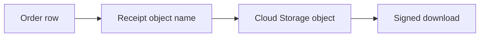

## Table of Contents

1. [The Problem](#the-problem)
2. [What Is Cloud Storage](#what-is-cloud-storage)
3. [Buckets](#buckets)
4. [Objects](#objects)
5. [Names](#names)
6. [Metadata](#metadata)
7. [Access](#access)
8. [Signed URLs](#signed-urls)
9. [Lifecycle](#lifecycle)
10. [Versioning](#versioning)
11. [Sample Object Map](#sample-object-map)
12. [Putting It All Together](#putting-it-all-together)
13. [What's Next](#whats-next)

## The Problem

The Orders API creates files. A customer receives a receipt PDF. Finance downloads a nightly CSV export. Support attaches screenshots to a ticket. Product images need a stable home.

These are file-like bytes:

- The app writes the whole receipt PDF and later reads it by name.
- Support needs a safe temporary link to one attachment.
- Finance exports should expire after a short window.
- Some receipt files should survive accidental overwrite or deletion.

Cloud Storage is the GCP service for this object-shaped data. It gives the team buckets, objects, names, metadata, access control, lifecycle rules, and recovery options around stored bytes.

## What Is Cloud Storage

Cloud Storage is object storage. You store objects in buckets. An object contains data plus metadata. The bucket provides the larger container for location, access, lifecycle, and policy choices.

The important beginner habit is to keep business meaning out of the object store when it belongs in the database. Cloud Storage can hold `receipts/2026/05/order_9281.pdf`. Cloud SQL can remember that order `9281` belongs to customer `9138`, was paid, and has that receipt object name.



The database gives the object meaning. Cloud Storage keeps the bytes.

## Buckets

A bucket is a named container for objects. Bucket choices matter because they affect location, access model, lifecycle policy, logging, retention, and sometimes compliance expectations.

For the Orders API, a production bucket might be `devpolaris-orders-receipts-prod`. The name tells humans the system, purpose, and environment. The bucket location should match the data and latency needs. A regional bucket may be right for app-local data. Multi-region or dual-region choices can fit other durability, availability, or access patterns.

The bucket is also a policy boundary. Avoid mixing unrelated environments or teams in one bucket just because object names can be prefixed. A clear bucket boundary makes access review and lifecycle cleanup easier.

## Objects

An object is stored data plus metadata. The data might be a PDF, image, CSV, JSON export, archive, or any other file-like payload. The object is addressed by bucket and object name.

Objects are usually replaced as a whole. That is different from editing a row in a database. If the app overwrites the same object name, the visible current object changes. If versioning or another protection is enabled, older generations may still be recoverable. If not, an overwrite can hide or destroy the previous bytes.

This is one of the first practical gotchas: if overwrites are possible, decide whether object names should be immutable, whether versioning should be enabled, and who can delete or replace objects.

## Names

Object names are part of the design. A name like `receipts/2026/05/order_9281.pdf` looks like a path, and tools may show it with folder-like grouping. In many bucket designs, the slash is still part of the object name. GCP also has folder and hierarchical namespace features for specific bucket modes, so the exact behavior depends on how the bucket is configured.

The safe beginner rule is: do not assume Cloud Storage behaves like a normal local filesystem. Design object names for lookup, lifecycle, access review, and humans reading logs.

Good object names make intent visible:

| Data | Example name |
| --- | --- |
| Receipt | `receipts/2026/05/order_9281.pdf` |
| Export | `exports/daily/2026-05-17/orders.csv` |
| Support attachment | `support/ticket_7742/photo_01.jpg` |
| Temporary report | `tmp/reports/user_9138/2026-05-17.json` |

Names should also avoid secrets. A URL or log line may reveal object names even when object data is private.

## Metadata

Object metadata describes the object. Content type tells clients how to interpret bytes. Cache settings can affect browser and CDN behavior. Custom metadata can carry small operational facts, but it should not become a second database.

For a receipt PDF, metadata might include:

```text
content type: application/pdf
cache control: private, max-age=0
business owner: orders
retention class: receipt
```

The app database should still own order status, customer identity, payment state, and the relationship between an order and its receipt object. Metadata supports object handling; it should not become the source of truth for business relationships.

## Access

Cloud Storage access is usually controlled with IAM at the bucket or managed-folder level, along with organization policies and public access controls where applicable. Older object ACL patterns exist, but many production designs prefer uniform bucket-level access so IAM is the main control model.

For the Orders API, the runtime service account may need permission to write receipts and read them later. Support users may not need direct bucket access if the app can generate controlled links. Public access should be deliberate, not a side effect of a broad role or shared bucket.

The review sentence should be concrete:

```text
orders-api-runtime can create receipt objects in devpolaris-orders-receipts-prod.
Support users receive app-mediated links, not broad bucket write access.
Temporary export objects expire by lifecycle rule.
```

Access is part of the object design, not a cleanup task after upload works.

## Signed URLs

A signed URL gives temporary access to a specific object operation without giving the user GCP credentials. This is useful when a customer needs to download one receipt or upload one attachment through a browser.

The URL should be scoped to the specific object, method, and expiration window. A signed URL is powerful while it is valid. If the URL lives too long or points to the wrong object, the access mistake travels with the link.

Signed URLs are a good bridge between private objects and user workflows:

| Need | Pattern |
| --- | --- |
| Customer downloads one receipt | Short-lived signed GET URL |
| Browser uploads one support file | Short-lived signed PUT/POST pattern |
| Support views an attachment | App checks authorization, then creates a narrow link |

The user gets the file operation. The user does not get bucket credentials.

## Lifecycle

Lifecycle rules automate what happens as objects age or match conditions. A bucket can move objects to another storage class, delete temporary files, or clean up old versions according to rules.

Lifecycle is where cost and data policy meet. A nightly finance export may be useful for 30 days and then disposable. Receipts may need a much longer retention period. Temporary upload chunks may need aggressive cleanup.

Do not make one lifecycle rule for every object in a mixed bucket without thinking about the data. Prefixes, labels, object names, and bucket boundaries should support different retention needs.

## Versioning

Object versioning can keep older versions of an object when a new generation is written. This helps with accidental overwrite, but it also increases storage footprint and needs lifecycle policy. Soft delete and retention features can also affect deletion and recovery behavior depending on bucket configuration.

The key idea is that "durable" and "recoverable after a bad write" are not the same promise. Cloud Storage can durably store the latest bad object. Versioning and retention choices decide whether an earlier good copy is available.

For receipts, immutable object names may be the simplest protection. For exports, versioning may help recover from accidental overwrite. For temporary files, lifecycle cleanup may matter more than keeping every version.

## Sample Object Map

A useful object review can fit in a small table:

| Part | Example |
| --- | --- |
| Bucket | `devpolaris-orders-receipts-prod` |
| Location | Same region family as the Orders app and policy requires |
| Object name | `receipts/2026/05/order_9281.pdf` |
| Owner record | Cloud SQL `orders.receipt_object` |
| Access | Runtime service account writes; customers use signed URLs |
| Lifecycle | Temporary exports deleted after 30 days |
| Recovery | Versioning or immutable names for protected objects |

This map tells a teammate what the bucket is for and how the app should use it.

## Putting It All Together

Return to the opening problems.

Receipt PDFs and exports are object-shaped data. Cloud Storage fits because the app stores and retrieves named bytes.

Safe links come from signed URLs or app-mediated access, not from handing users bucket credentials.

Lifecycle rules handle cleanup when object age and purpose are predictable. Temporary exports and long-lived receipts should not share a careless retention policy.

Versioning, soft delete, immutable naming, and retention choices decide whether an accidental overwrite or deletion can be recovered.

## What's Next

Cloud Storage handles file-like bytes. Checkout itself needs related records, transactions, schema changes, connections, and backups. Next, we look at Cloud SQL.

---

**References**

- [Google Cloud: About Cloud Storage objects](https://cloud.google.com/storage/docs/objects)
- [Google Cloud: About buckets](https://cloud.google.com/storage/docs/buckets)
- [Google Cloud: Signed URLs](https://cloud.google.com/storage/docs/access-control/signed-urls)
- [Google Cloud: Object Lifecycle Management](https://cloud.google.com/storage/docs/lifecycle)
