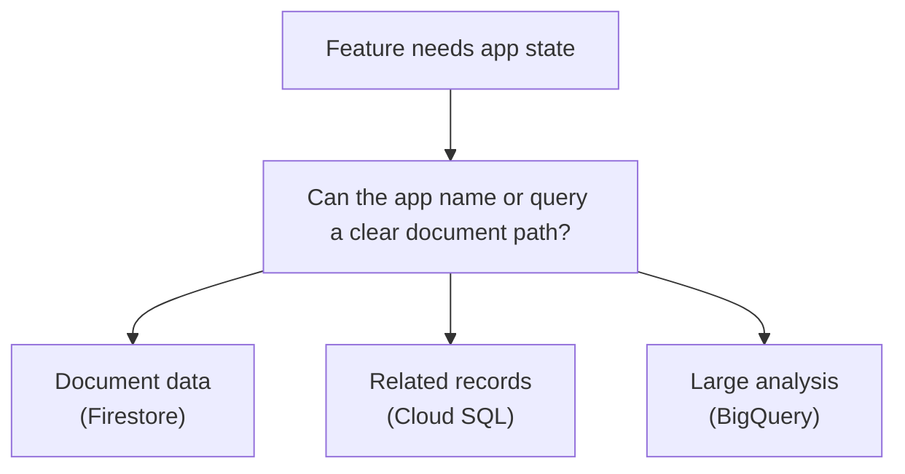

## Table of Contents

1. [Documents Are Not Just Rows With Braces](#documents-are-not-just-rows-with-braces)
2. [What Firestore Stores](#what-firestore-stores)
3. [If DynamoDB Or Cosmos DB Is Familiar](#if-dynamodb-or-cosmos-db-is-familiar)
4. [The Orders API Firestore Use Case](#the-orders-api-firestore-use-case)
5. [Collections, Documents, And Paths](#collections-documents-and-paths)
6. [Access Patterns Come Before Structure](#access-patterns-come-before-structure)
7. [Indexes Are Part Of The Query Design](#indexes-are-part-of-the-query-design)
8. [Consistency, Transactions, And Boundaries](#consistency-transactions-and-boundaries)
9. [Security And Server-Side Access](#security-and-server-side-access)
10. [When Firestore Is The Wrong Shape](#when-firestore-is-the-wrong-shape)
11. [Failure Modes And First Checks](#failure-modes-and-first-checks)
12. [A Practical Firestore Review](#a-practical-firestore-review)

## Documents Are Not Just Rows With Braces

Firestore is a document database. That sounds friendly because many developers already work
with JavaScript objects and JSON. A cart draft can look like an object. A user preference
record can look like an object. It is tempting to think Firestore is simply "a place to put
objects."

That is too loose for production. Firestore documents live in collections. They are read and
queried through Firestore's model. Indexes matter. Document paths matter. Transactions have
boundaries. Security and server-side access need a plan. If you treat Firestore like a
relational database with prettier syntax, the design will become painful.

Firestore is useful when the data naturally fits document-shaped access. The app knows the
document path, or the app queries a collection in a predictable way. It is less useful when
the team needs flexible joins, many ad hoc reports, or strong relational constraints across
many tables.



The diagram is a reminder: document storage is one shape, not the universal answer.

## What Firestore Stores

Firestore stores documents inside collections. A document contains fields. A field can hold
values such as strings, numbers, booleans, timestamps, arrays, maps, and references,
depending on the model and SDK. A collection groups documents. A document can also contain
subcollections.

For a beginner, this structure is enough:

```text
collection: checkoutDrafts
document: user_9138
fields:
  cartId: cart_44d2
  selectedPlan: pro
  lastStep: payment
  updatedAt: 2026-05-04T10:14:00Z
```

This document holds temporary or operational app state rather than the final order record.
If the user returns to checkout, the app can read the draft and continue the flow.

Firestore becomes easier when you write down the document's job. Is it a draft? A
preference? A status record? A collaborative document? A mobile-friendly app record? If the
job is vague, the model will be vague too.

## If DynamoDB Or Cosmos DB Is Familiar

If you know AWS DynamoDB, Firestore may feel related because both are NoSQL services where
access patterns matter. If you know Azure Cosmos DB, Firestore may feel related because both
can store document-shaped data. Use those comparisons for orientation, then learn the
Firestore model directly.

DynamoDB pushes key design and table access patterns into the conversation early. Cosmos DB
has containers, partition keys, request units, and multiple API models. Firestore has
collections, documents, queries, indexes, and its own transaction and security model. Do not
copy a DynamoDB single-table pattern or a Cosmos DB partition strategy into Firestore
without rethinking it.

The shared habit is useful: design around how the app reads and writes the data. The
provider-specific details decide the final shape.

## The Orders API Firestore Use Case

The orders system should probably keep final order records in Cloud SQL. Those records need
transactions, constraints, and relational queries. Firestore can still be useful around the
edges of the product.

One good use case is a checkout draft. The user starts checkout, chooses a plan, adds a
coupon, and pauses before payment. The app wants to remember the draft quickly and retrieve
it by user or cart ID.

A draft document might look like this:

```json
{
  "cartId": "cart_44d2",
  "userId": "user_9138",
  "selectedPlan": "pro",
  "couponCode": "SPRING26",
  "lastStep": "payment",
  "updatedAt": "2026-05-04T10:14:00Z",
  "expiresAt": "2026-05-05T10:14:00Z"
}
```

The app usually reads this by a known user or cart path. It does not need to join it to
payment attempts and order items for financial reporting. That makes Firestore a reasonable
candidate.

Another use case is user preference state:

```text
collection: userPreferences
document: user_9138
fields:
  defaultCurrency: USD
  emailReceipt: true
  dashboardLayout: compact
```

Again, the access pattern is simple. Read the document for this user. Update a few fields.
Do not turn it into the source of truth for paid orders.

## Collections, Documents, And Paths

A Firestore path should help the app find the data it needs. For checkout drafts, the team
could choose:

```text
checkoutDrafts/user_9138
```

That path is easy if the app always loads one draft per user. If the app needs many drafts
per user, the path may need a different shape:

```text
users/user_9138/checkoutDrafts/cart_44d2
```

Neither path is automatically right. The better path is the one that matches the access
pattern. Ask what the app does most often:

| Access Need | Path Shape To Consider |
|---|---|
| One draft per user | `checkoutDrafts/{userId}` |
| Many drafts under one user | `users/{userId}/checkoutDrafts/{cartId}` |
| Query recent drafts across users | Collection with indexed `updatedAt` and status fields |
| Admin support lookup by cart ID | Document ID or indexed field that supports the lookup |

Changing document paths later can be awkward because application code, security rules,
indexes, and data migration may all be involved. Spend a little time on the path before
shipping the feature.

## Access Patterns Come Before Structure

Firestore design starts with access patterns. An access pattern is a specific read or write
the app must perform. For example, "load the current checkout draft for this user" is an
access pattern. "List abandoned drafts updated more than 24 hours ago" is another.

Write access patterns before the document model:

```text
feature: checkout draft
reads:
  load draft by user ID
  load draft by cart ID for support
  find expired drafts for cleanup
writes:
  update selected plan
  update last completed step
  mark draft converted after order creation
```

This record tells you which fields need to be present and which queries need to be
supported. It also reveals when Firestore may be the wrong fit. If the list of access
patterns starts to sound like many joins and reports, Cloud SQL or BigQuery may belong in
the conversation.

Firestore can query, but the model works best when you design for the reads the app already
knows it needs.

## Indexes Are Part Of The Query Design

Firestore uses indexes to support queries. For beginners, the important connection is query
shape and index design. If the app needs to query by `status` and order by `updatedAt`,
Firestore may require the right index to serve that query.

A cleanup job might need this query shape:

```text
collection: checkoutDrafts
where status == "open"
where expiresAt < now
order by expiresAt
```

If the index is missing, the app may fail with an error that points to the required index.
That is a helpful failure. It tells you the data model and query plan were not complete.

Treat indexes as part of the feature. A feature that depends on a query should include the
index needed to make that query reliable.

## Consistency, Transactions, And Boundaries

Firestore supports transactions, but that does not mean it should replace every relational
transaction in the system. The final order creation path still has strong reasons to live in
Cloud SQL if the business needs relational consistency across orders, payment attempts, and
line items.

For Firestore, use transactions where the document-shaped feature needs them. A checkout
draft update may need to prevent two processes from changing the same draft in conflicting
ways. A job-status document may need a safe state transition from `pending` to `processing`.

A state transition can be written as a small promise:

```text
current state: pending
allowed next state: processing
worker: receipt-export-worker
write: claim job only if state is still pending
```

This kind of promise can fit Firestore. A multi-table payment reconciliation process may
not. Boundaries matter. Use the service whose guarantees match the feature.

## Security And Server-Side Access

Firestore is often used by client apps, but this roadmap focuses on backend systems. When
`devpolaris-orders-api` reads or writes Firestore, it uses a server-side identity, usually a
service account. That means IAM and application authorization both matter.

For a backend-only checkout draft, the runtime service account might be:

```text
orders-api-prod@devpolaris-orders-prod.iam.gserviceaccount.com
```

That identity should have the access needed by the app, not broad project ownership. The
application should still check whether the user is allowed to act on the draft. IAM says the
backend service can call Firestore. Application logic says this customer can read this
draft.

Do not confuse these layers. Giving the backend service account database access does not
mean every user should see every document.

## When Firestore Is The Wrong Shape

Firestore is a poor fit when the feature really wants relational constraints, ad hoc SQL
reports, or large analytical scans. It is also a poor fit when the team cannot name the
access patterns and hopes to decide later.

For the orders system, these are warning signs:

| Requirement | Better First Direction |
|---|---|
| Join orders, line items, payments, and customers for checkout state | Cloud SQL |
| Analyze millions of checkout events by country and version | BigQuery |
| Store receipt PDFs or CSV exports | Cloud Storage |
| Query unknown future reports across many fields | Cloud SQL or BigQuery, depending on purpose |

Use Firestore where document storage makes the feature simpler. If Firestore makes every new
question feel like a workaround, the data shape may be wrong.

## Failure Modes And First Checks

Firestore failures often reveal a missing access pattern, missing permission, or stale data
assumption.

The app cannot read a draft:

```text
symptom: document not found
first checks:
  document path
  user ID or cart ID used in path
  environment project
  whether draft expired or was converted
```

The cleanup job query fails:

```text
symptom: query requires index
first checks:
  query filters
  order by field
  Firestore index configuration
  deployment of required index
```

The backend gets permission denied:

```text
symptom: PermissionDenied from Firestore
first checks:
  Cloud Run runtime service account
  IAM role or database access setting
  project ID
  application authorization layer
```

Support sees stale draft state:

```text
symptom: user says checkout moved on, document still says payment
first checks:
  last writer
  updatedAt field
  conversion path after order creation
  retry or duplicate write behavior
```

These failures need different fixes: path problems, index problems, permission problems, and
state-transition problems point to different layers.

## A Practical Firestore Review

Before using Firestore for a production feature, fill out this review:

| Review Item | Example Answer |
|---|---|
| Feature | Checkout draft state |
| Collection | `checkoutDrafts` |
| Document ID | User ID for one active draft per user |
| Main reads | Load by user ID, support lookup by cart ID |
| Main writes | Update selected plan, update step, mark converted |
| Required query | Find expired open drafts for cleanup |
| Required index | `status` plus `expiresAt` for cleanup query |
| Runtime identity | `orders-api-prod` service account |
| App authorization | User can read only their own draft |
| Wrong use warning | Do not store final order ledger here |

The review is short because the feature should be clear. Firestore is a good choice when
the document path and access pattern are easy to explain. If the explanation becomes a maze,
pause before putting production data into it.

---

**References**

- [Firestore overview](https://cloud.google.com/firestore/docs/overview) - Introduces Firestore as a managed document database.
- [Firestore data model](https://cloud.google.com/firestore/docs/data-model) - Explains collections, documents, fields, and paths.
- [Firestore queries](https://cloud.google.com/firestore/docs/query-data/queries) - Documents query behavior and common query patterns.
- [Firestore indexes](https://cloud.google.com/firestore/docs/query-data/indexing) - Explains how Firestore indexes support queries.
