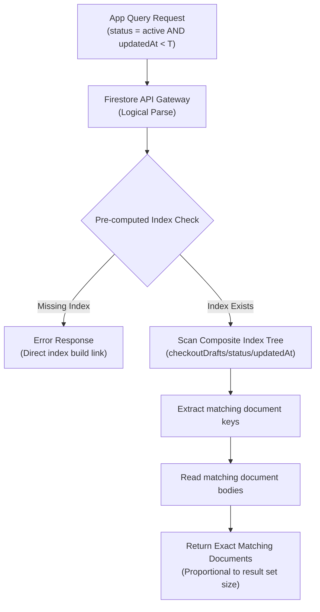

## Table of Contents

1. [Document-Oriented NoSQL Fundamentals](#document-oriented-nosql-fundamentals)
2. [Structuring Data with Collections and Paths](#structuring-data-with-collections-and-paths)
3. [Pre-Computed Indexes and Query Execution Pipelines](#pre-computed-indexes-and-query-execution-pipelines)
4. [Write Concurrency and Transactional Boundaries](#write-concurrency-and-transactional-boundaries)
5. [Managing System Limits and Anti-Patterns](#managing-system-limits-and-anti-patterns)
6. [Putting It All Together](#putting-it-all-together)
7. [What's Next](#whats-next)

## Document-Oriented NoSQL Fundamentals

When you build applications that handle highly dynamic, unpredictable data—like keeping track of a customer's active shopping cart, storing customizable user preferences, or caching transient forms—forcing every record into a rigid grid of database tables can slow down your team. Relational databases require you to define every column in advance, and changing that structure later requires coordinating complex database migrations. Document-oriented NoSQL databases solve this by storing data as flexible, self-contained files called documents. Instead of tabular rows and columns, a document holds data as simple key-value pairs, which are formatted exactly like the nested objects used directly in your application code.

Think of a document-oriented database like a digital filing cabinet. The cabinet contains drawers, which we call collections. Each collection holds individual folders, which we call documents. For example, a collection named `checkoutDrafts` might contain a document for each active user. Inside that document, the user's cart is represented by dynamic fields listing their product IDs, quantities, and timestamps. This structure is highly flexible because one user's document can contain different fields from another user's document without breaking the database. Furthermore, because a document holds the entire state of a cart in one place, your application can fetch or update the whole object in a single fast read, avoiding the need to execute costly relational database joins across separate tables for users and items.

Google Cloud Firestore is a fully managed, serverless document database built to handle these workloads. Rather than requiring you to configure and partition servers as your data grows, Firestore scales automatically while guaranteeing low-latency lookups. This style of database is highly popular across cloud providers. In Amazon Web Services (AWS), the closest equivalent is Amazon DynamoDB, which uses a flat table design, and in Microsoft Azure, it is Azure Cosmos DB, which stores data as collections of documents. While the physical implementation differs across clouds, they all share a common purpose: allowing developers to retrieve and update rich, nested application states at scale without being constrained by a rigid database schema. This article traces the lifecycle of a draft shopping cart payload through Firestore, demonstrating how collections, composite index trees, and optimistic write concurrency controls protect data access under heavy traffic.

## Structuring Data with Collections and Paths

Structuring document-oriented data requires shifting our mental paradigm from tabular rows and columns to a rigid resource hierarchy. In Firestore, data is structured into documents—which are lightweight records containing key-value pairs—and collections, which serve as direct containers for documents. A document cannot contain another document directly, nor can a collection contain another collection directly; instead, hierarchy is achieved by alternating between collections and documents. The physical address of any piece of data is expressed as a slash-separated resource path. If a draft checkout cart is modeled within this system, the active session is represented by a document residing at a path like `/checkoutDrafts/draft_usr_99812`. Inside this document, fields represent the state of the cart, including product selections, user preferences, and metadata timestamps.


*The path is the data model, so nesting choices shape every query later.*

This hierarchical approach differs fundamentally from alternative cloud databases. For instance, Amazon Web Services DynamoDB utilizes a flat table model where hierarchical relationships must be simulated using partition and sort keys inside a single-table design pattern, which often requires complex prefix schemes. Microsoft Azure Cosmos DB models data as flat containers of JSON items partitioned by a logical key path, requiring developers to manage indexing and queries within partition boundaries. Firestore makes the hierarchy explicit in the resource path itself, allowing developers to represent sub-resources natively. For example, if individual cart items need to be addressed as distinct entities, they can be nested within a subcollection, resulting in a path like `/checkoutDrafts/draft_usr_99812/items/item_8842`. This clear path structuring guarantees that the application can bypass query parsers and target the exact resource using a direct, ultra-low-latency physical key lookup.

A representative draft checkout cart document demonstrates this clean data organization. It captures the user's active selections, metadata timestamps, and status fields without requiring rigid columns:

```json
{
  "userId": "usr_99812",
  "status": "pending",
  "itemCount": 3,
  "updatedAt": "2026-05-28T23:54:10Z",
  "items": [
    {
      "productId": "prod_8492",
      "quantity": 1,
      "price": 29.99
    },
    {
      "productId": "prod_1038",
      "quantity": 2,
      "price": 14.50
    }
  ]
}
```

By structuring the draft cart in this manner, the application avoids the overhead of executing SQL table joins across separate tables for users, carts, and items. The entire state of the user's active checkout session is loaded or saved in a single network round-trip, optimizing the user experience during checkout transitions.

## Pre-Computed Indexes and Query Execution Pipelines

Firestore answers queries through indexes. When an application requests all draft checkout carts with an `active` status that were updated before a specific timestamp, Firestore does not work like a spreadsheet scan over every document in the collection. It uses indexes that match the query shape, and the work is strongly influenced by the index entries scanned and the result set returned. This is why Firestore can scale very well for planned access patterns, but it rejects or warns about query shapes that do not have the right index.


*Fast reads depend on indexes that match the query shape.*

To maintain this guarantee, every query must be backed by an index. Firestore automatically generates single-field indexes for every basic field within a document. However, when a query combines multiple fields or incorporates sorting, such as filtering by `userId`, checking if `status == "pending"`, and sorting by `updatedAt` in descending order, a composite index must be defined. If the application attempts this multi-field query without a supporting composite index, the control plane intercepts the request and rejects it, returning a `FAILED_PRECONDITION` error. We configure this composite index within our project's index configuration file, `firestore.indexes.json`:

```json
{
  "indexes": [
    {
      "collectionGroup": "checkoutDrafts",
      "queryScope": "COLLECTION",
      "fields": [
        { "fieldPath": "userId", "order": "ASCENDING" },
        { "fieldPath": "status", "order": "ASCENDING" },
        { "fieldPath": "updatedAt", "order": "DESCENDING" }
      ]
    }
  ]
}
```

We deploy this composite index to GCP using the Firebase CLI:

```bash
firebase deploy --only firestore:indexes
```

Once the index is pre-computed and deployed by the control plane, the database engine can safely execute our range-scan query over the B-Tree leaf nodes, completely avoiding expensive full table scans:

```javascript
const query = db.collection('checkoutDrafts')
  .where('userId', '==', 'usr_99812')
  .where('status', '==', 'pending')
  .orderBy('updatedAt', 'desc');

const querySnapshot = await query.get();
querySnapshot.forEach(doc => {
  console.log(`[Found Draft] ID: ${doc.id}, Updated: ${doc.data().updatedAt.toDate().toISOString()}`);
});
```

The terminal prints only matching documents, ordered by the deployed index. In a real application, each result contains the document ID and the `updatedAt` timestamp your query requested.

This request execution pipeline shows how the Firestore gateway screens incoming requests. By validating the index availability before attempting storage access, the system completely avoids table-scan operations, protecting both application latency and database compute resources from unexpected spikes.



This design provides a sharp contrast to other cloud providers. In Amazon Web Services DynamoDB, indexing is highly rigid; querying attributes outside the primary key requires the developer to pre-plan and provision Global Secondary Indexes or Local Secondary Indexes, which physically replicate the data to new virtual tables and incur additional write costs. In Microsoft Azure Cosmos DB, all properties are indexed automatically by default via an internal inverted index tree, but complex sorting or multi-property filters still require explicit composite index policies to prevent query latency degradation. Firestore balances these models by automating single-field indexing while enforcing strict, link-driven creation for composite paths.

## Write Concurrency and Transactional Boundaries

Managing state transitions in a distributed document database requires strict transactional control, especially when multiple client sessions or serverless functions attempt to modify the same draft checkout cart simultaneously. Firestore provides atomic transactions and batched writes to ensure consistency across multiple documents. The concurrency behavior depends on the client library and database mode. Mobile and web SDKs emulate optimistic transactions, while server client libraries such as Node.js use the database's configured concurrency mode. In Standard edition, the default concurrency mode is pessimistic, which can involve document locks on the server side.

To ensure consistency and avoid corrupted states when updating our cart drafts concurrently, the backend Node.js API executes a transaction. The transaction reads the document to verify status locks before writing the update:

```javascript
import { Firestore } from '@google-cloud/firestore';

const db = new Firestore();
const draftRef = db.collection('checkoutDrafts').doc('draft_usr_99812');

await db.runTransaction(async (transaction) => {
  const snapshot = await transaction.get(draftRef);

  if (snapshot.exists && snapshot.data().status === 'submitted') {
    throw new Error('Checkout draft has already been submitted and locked.');
  }

  transaction.set(draftRef, {
    userId: "usr_99812",
    status: "pending",
    updatedAt: Firestore.FieldValue.serverTimestamp()
  }, { merge: true });
});
```

Because transactions can be retried, the transaction function must be side-effect free. Do not send emails, charge cards, or call external APIs from inside the transaction block. When the transaction succeeds, Firestore commits the document changes according to the database's consistency model.

Comparing transactional boundaries reveals different structural constraints across cloud ecosystems. Amazon Web Services DynamoDB offers transactional operations via its `TransactWriteItems` and `TransactGetItems` APIs, which support ACID guarantees across multiple tables but are structurally restricted to a single partition key boundary. Microsoft Azure Cosmos DB handles transactions by executing JavaScript-based stored procedures and triggers directly on the database engine, but these transactions are structurally restricted to a single logical partition key boundary. Firestore, by contrast, supports multi-document transactions that span arbitrary collections and documents within the database, providing a highly flexible model for orchestrating complex state changes across unrelated entities.

## Managing System Limits and Anti-Patterns

While Firestore offers massive scalability and low-latency document access, developers must respect its physical constraints and architectural boundaries to prevent performance degradation. The most fundamental limit is the maximum document size of one megabyte, which restricts how much data can be embedded within a single document. If a draft checkout cart is designed to embed thousands of historical update logs inside a single document array, it will eventually hit this hard physical barrier. In such scenarios, developers must refactor their data model, extracting the fast-growing arrays into separate subcollections where each log entry becomes an independent document, thereby bypassing the single-document size limit.

Another critical system constraint is the hot document. Google does not give a universal single-document writes-per-second number because the exact maximum update rate depends on the workload. If an application increments a global counter inside one document on every user click, or if many backend processes update the same popular cart document at the same time, Firestore must coordinate those updates and contention increases. Developers avoid these hot document scenarios by distributing high-frequency writes across multiple documents, using techniques like distributed counters where increments are written to randomized shard documents and aggregated at read time.

These limits and operational characteristics align closely with comparable offerings in other cloud environments. Amazon Web Services DynamoDB enforces a smaller maximum item size of four hundred kilobytes, compared to Firestore's one megabyte. Additionally, DynamoDB allocates throughput to physical partitions, capping individual partition throughput at one thousand write capacity units and three thousand read capacity units, which can cause hot partition throttling if partition keys are poorly distributed. Microsoft Azure Cosmos DB caps individual document items at two megabytes and manages throughput via provisioned Request Units, which throttle application requests instantly if the configured limits are breached. Firestore simplifies this by scaling the overall database throughput automatically, leaving developers to focus exclusively on avoiding single-document serial write bottlenecks.

:::expand[Under the Hood: Spanner Paxos Consensus and B-Tree Index Splits]{kind="design"}
Under the hood, Firestore is not a monolithic database server. Google documents Firestore as a distributed document database with strong consistency and automatic scaling behavior. For a beginner article, the safest useful detail is how reads, writes, indexes, and contention interact, not unsupported storage-node sizes or hidden routing hashes.

Firestore stores document data and index data so queries can be answered through planned access paths. A write to a document may also update several index entries. This is why a seemingly small document write can become more expensive when the document has many indexed fields or participates in several composite indexes.

Firestore also has to coordinate concurrent updates. If many clients update the same document or a narrow range of indexed values at once, the system experiences contention. The practical symptom is not data corruption; it is higher latency, transaction retries, and eventual failures if the application keeps pushing the same hotspot.

The design answer is to model high-write data so it spreads out. A distributed counter uses many shard documents instead of one global counter document. A busy event stream writes many event documents instead of repeatedly editing one summary document. A cart model keeps the user's active draft small and moves historical audit records to a subcollection or an analytics stream.

To execute queries efficiently, Firestore relies on automatic query plan execution paths. When a query is received, the Firestore execution engine analyzes the filter clauses and maps them directly to the pre-computed B-Tree index paths. The engine performs a range scan over the index, extracting only the document keys that match the search criteria. It then performs parallel point lookups to retrieve the full document bodies from the underlying Spanner storage nodes. Because the index scan resolves the exact keys first, the database engine never performs full table scans, completely bypassing the expensive CPU and memory search cycles that plague traditional relational query execution engines under high load.
:::

## Putting It All Together

Designing a successful Firestore implementation requires aligning your application's access patterns with document paths and indexes. A draft checkout shopping cart can reside as a self-contained document inside a predictable path, such as `/checkoutDrafts/{userId}`, enabling direct lookup without relational joins. Complex multi-field filtering is backed by explicitly defined composite indexes. Transaction code stays side-effect free because the database may retry it. High-write counters and busy shared records are spread across multiple documents to avoid contention.

## What's Next

While Firestore is optimized for transactional document retrieval and real-time state synchronization, it is not built for running heavy, ad-hoc analytical workloads across entire datasets. If an application needs to run complex business intelligence reports, aggregate user behaviors over several years, or train machine learning models, querying Firestore will quickly hit system limits and incur massive read costs. To handle large-scale, analytical scans, we must move from document databases to high-performance data warehouses. In the next article, we will explore Google Cloud's BigQuery to understand how columnar storage engines accelerate multi-terabyte analytical queries.


*Use this summary as the quick mental checklist before designing or debugging the service.*


---

**References**

- [Firestore overview](https://cloud.google.com/firestore/docs/overview) - Official Google Cloud documentation providing a high-level explanation of Firestore's serverless NoSQL capabilities.
- [Firestore data model](https://cloud.google.com/firestore/docs/data-model) - Official guide on collections, documents, subcollections, and path-based routing.
- [Firestore indexes](https://cloud.google.com/firestore/docs/query-data/indexing) - Detailed documentation explaining automatic single-field indexes, composite index requirements, and query behavior.
- [Firestore transactions](https://cloud.google.com/firestore/docs/manage-data/transactions) - Deep dive into optimistic concurrency control, ACID compliance, and multi-document transaction retries.
- [Firestore transaction contention](https://cloud.google.com/firestore/docs/transaction-data-contention) - Explains concurrency modes, locks, retries, and contention behavior.
- [Firestore best practices](https://cloud.google.com/firestore/native/docs/best-practices) - Documents hotspot avoidance and workload-dependent write limits.
- [Distributed counters](https://cloud.google.com/firestore/native/docs/solutions/counters) - Shows how to spread high-frequency increments across shard documents.
