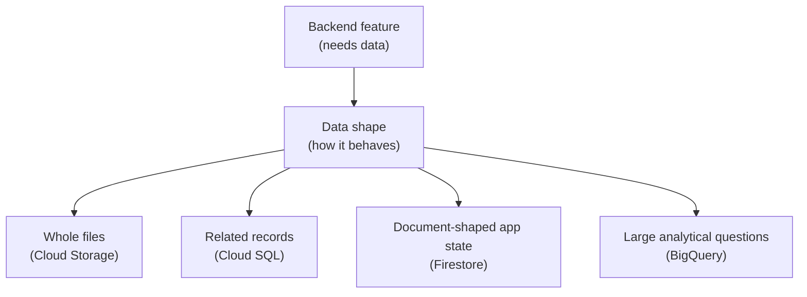

## Table of Contents

1. [Start With What The App Needs To Remember](#start-with-what-the-app-needs-to-remember)
2. [If AWS Or Azure Storage Is Familiar](#if-aws-or-azure-storage-is-familiar)
3. [The Orders API Has Several Data Shapes](#the-orders-api-has-several-data-shapes)
4. [Files Point Toward Cloud Storage](#files-point-toward-cloud-storage)
5. [Business Records Point Toward Cloud SQL](#business-records-point-toward-cloud-sql)
6. [Document Data Points Toward Firestore](#document-data-points-toward-firestore)
7. [Analytics Questions Point Toward BigQuery](#analytics-questions-point-toward-bigquery)
8. [Attached Storage Is A Compute Detail](#attached-storage-is-a-compute-detail)
9. [The First Data Review](#the-first-data-review)
10. [Failure Modes That Reveal The Data Layer](#failure-modes-that-reveal-the-data-layer)
11. [The Tradeoffs You Are Really Choosing](#the-tradeoffs-you-are-really-choosing)

## Start With What The App Needs To Remember

Most storage confusion starts when service names arrive before the data problem. Cloud
Storage. Cloud SQL. Firestore. BigQuery. Persistent Disk. Filestore. Those names matter, but
memorizing them first makes the choice harder. The better first question is: what does the
app need to remember, and how will it ask for that data later?

Some data is a file. A receipt PDF is a file. A CSV export is a file. A product image is a
file. You usually write it as a whole object, read it as a whole object, replace it, or
delete it. That shape points toward object storage, which in GCP usually means Cloud
Storage.

Some data is a set of related business records. An order belongs to a customer. An order has
line items. A payment attempt belongs to an order. The team wants transactions, constraints,
and SQL queries. That shape points toward a relational database, which in GCP usually means
Cloud SQL for a beginner backend.

Some data is document-shaped. A cart draft, user preference record, lightweight app state,
or mobile-friendly document may not need joins. The app may read and write a whole document
by path or query a collection. That shape can point toward Firestore.

Some data exists for analysis. The product team asks how many checkouts failed by region
last week. Support wants trends. Finance wants revenue by plan. Data engineers want event
tables they can transform. That shape points toward BigQuery, not the request-time orders
database.

This article uses one system, `devpolaris-orders-api`, to keep the service list grounded.
Sort data by behavior before the GCP details get loud, instead of trying to pick one
database for everything.



Read the diagram from top to bottom. The plain-English shape comes first. The GCP service
name comes second. That order matters because service-first thinking turns every feature
into a product comparison. Shape-first thinking keeps you close to the application.

## If AWS Or Azure Storage Is Familiar

If you know AWS or Azure, you already have useful mental hooks. Treat them as orientation,
not as a perfect dictionary. GCP has its own naming, IAM, networking, backup, and billing
surfaces.

| Data Shape | GCP Service To Consider First | AWS Bridge | Azure Bridge | Careful Difference |
|---|---|---|---|---|
| Whole files and generated artifacts | Cloud Storage | S3 | Blob Storage | Bucket names, object paths, IAM, signed URLs, and lifecycle rules have GCP-specific behavior |
| Relational app records | Cloud SQL | RDS | Azure SQL Database | Cloud SQL supports managed MySQL, PostgreSQL, and SQL Server with GCP connection patterns |
| Document-shaped operational data | Firestore | DynamoDB is a partial bridge | Cosmos DB is a partial bridge | Firestore collections, documents, queries, and indexes have their own model |
| Analytics tables and reporting | BigQuery | Redshift or Athena can help orient | Synapse or Fabric warehouse ideas can help orient | BigQuery is central in GCP data engineering and is not the app's request-time database |

The useful provider-to-provider habit is asking what promise the data service must make. If
the app needs a durable file, think Cloud Storage the same way you might first think S3 or
Blob Storage. If the app needs SQL transactions, think Cloud SQL the same way you might
first think RDS or Azure SQL Database. If the team needs warehouse-style analysis, BigQuery
should enter the conversation early.

Then slow down and learn the GCP surface. Cloud Storage has bucket names, object paths, IAM,
signed URLs, and lifecycle rules that behave in GCP-specific ways. Firestore has its own
collection, document, query, index, transaction, and security model. BigQuery belongs in the
analytics path, not in the checkout request waiting for one order row to be written. The
comparison gets you oriented. The GCP details keep you from making confident mistakes.

## The Orders API Has Several Data Shapes

Real backends rarely have one kind of data. That is normal. The mistake is forcing every
storage problem into the first service the team learned.

Imagine the checkout path in `devpolaris-orders-api`. A customer places an order. The API
needs to create an order record, record line items, update payment state, and show order
history later. That data has relationships. A relational database is the natural first
direction because the app wants consistent business records.

Now imagine the same order creates a receipt PDF. The PDF behaves like a file, while the
database should know who owns it and where it lives. The bytes belong in object storage. The
same is true for monthly CSV exports, product image uploads, and support attachments.

Now imagine the frontend stores a checkout draft or user interface preference. The app may
read and write a document-like record by user ID or cart ID. That might fit Firestore if the
access pattern is document-shaped and the team understands its query model.

Finally, imagine the product team asks:

> How many checkout attempts failed by country, payment method, and app version last week?

That question scans many facts across time, so BigQuery is built for that kind of table
scanning, aggregation, and reporting.

Here is a first sorting table:

| Data In The Orders System | What It Behaves Like | GCP Service To Consider First |
|---|---|---|
| Orders, line items, payment attempts | Related records with transactions | Cloud SQL |
| Receipt PDFs and CSV exports | Whole files stored by name | Cloud Storage |
| Cart drafts or user preferences | Document-shaped state | Firestore |
| Checkout events and reporting tables | Analytical data | BigQuery |
| VM boot disks or scratch directories | Storage attached to compute | Persistent Disk or Filestore |

Use this table for the first review conversation. After this, the team still checks access,
network path, backup, retention, restore, cost, and how the app will fail.

## Files Point Toward Cloud Storage

Cloud Storage is object storage. Object storage means you store bytes as named objects
inside buckets. A bucket is the container. An object is the file-like thing inside it. The
object name can contain slashes, so it can look like a folder path, but the important model
is bucket plus object name.

For `devpolaris-orders-api`, Cloud Storage is a good fit for generated and uploaded files:

```text
bucket: devpolaris-orders-receipts-prod
objects:
  receipts/2026/05/order_9281.pdf
  exports/2026/05/orders-paid-2026-05-04.csv
  support-attachments/case_771/image_01.png
```

The database can store a pointer to the object. The file bytes stay in Cloud Storage. That
split keeps the database focused on business meaning and keeps large file bytes in the
storage service designed for objects.

A useful metadata row might look like this:

```text
receipt_id: rcp_9281
order_id: ord_9281
bucket: devpolaris-orders-receipts-prod
object: receipts/2026/05/order_9281.pdf
created_at: 2026-05-04T09:43:00Z
```

That row answers "which receipt belongs to which order?" Cloud Storage answers "where are
the bytes?" The app needs both.

## Business Records Point Toward Cloud SQL

Cloud SQL is GCP's managed relational database service for MySQL, PostgreSQL, and SQL
Server. Relational databases are a good fit when the application has related records,
constraints, transactions, and SQL queries.

An order is a good example. The order has a customer. The order has line items. The payment
state should agree with the order state. Support may need to query paid orders for one
customer. Finance may need orders grouped by month. These are business records with
relationships, not files with names.

A small relational shape might look like this:

```text
customers
  id
  email

orders
  id
  customer_id
  status
  total_cents
  created_at

order_items
  order_id
  sku
  quantity
  unit_price_cents
```

This small schema sketch shows why SQL belongs in the conversation. The app wants rules and
questions across related records. Cloud SQL can be a good first GCP home for that shape.

## Document Data Points Toward Firestore

Firestore is a document database. It stores data in documents organized into collections.
That model can feel friendly to JavaScript developers because a document looks like a JSON
object with fields. Firestore also has its own query, index, transaction, security, and
scaling model.

Firestore can fit data where the app naturally thinks in documents. A user preference
record, a checkout draft, a lightweight status document, or a mobile app document can be a
good fit when the access paths are clear.

For example:

```text
collection: checkoutDrafts
document: user_9138
fields:
  cartId: cart_44d2
  lastStep: payment
  updatedAt: 2026-05-04T09:40:00Z
  selectedPlan: pro
```

That does not automatically mean orders should move from Cloud SQL to Firestore. If the
team needs joins, relational constraints, and flexible reporting queries over order records,
Cloud SQL may still be the better operational shape. Firestore is useful when the document
model matches the app's access pattern. It becomes frustrating when the team tries to force
relational questions into document paths.

## Analytics Questions Point Toward BigQuery

BigQuery is a common GCP choice for analytics and data engineering. It is where teams put
large tables of events, exports, logs, and business facts so they can ask analytical
questions with SQL. The orders API should use an operational store for request-time work
and BigQuery for studying what happened across many orders.

The split is practical. Cloud SQL might answer, "what is the current state of order
`ord_9281`?" BigQuery might answer, "what percentage of checkout attempts failed by country
and payment method last week?" Those are different questions.

A BigQuery table might receive order events:

```text
dataset: orders_analytics
table: checkout_events
columns:
  event_time
  order_id
  customer_country
  payment_method
  app_version
  result
```

The product team can query that table without adding heavy analytical work to the request
path. Data engineers can transform it into dashboards or reporting tables. The backend can
keep serving customers while analytics work happens in the warehouse.

## Attached Storage Is A Compute Detail

GCP also has storage attached to compute, such as Persistent Disk and Filestore. Persistent
Disk is commonly attached to Compute Engine VMs. Filestore provides managed file shares for
workloads that need a shared filesystem path.

These services matter, but they are not usually the first home for product data in a Cloud
Run-based orders API. A VM needs a boot disk. A legacy worker might need a mounted folder. A
special processing job may need temporary disk. That is compute-attached storage, not the
main application data model.

For the simplified GCP storage module, we will mention attached storage in the decision
article instead of giving it a full standalone article. That keeps the learner focused on
the four data shapes they will meet most often: objects, relational records, documents, and
analytics tables.

## The First Data Review

Before choosing a storage service, the orders team should write a small review. The review
should name how the data behaves, who reads it, who writes it, and what recovery means.

| Question | Example Answer |
|---|---|
| What is the data? | Receipt PDF |
| How is it written? | Generated after payment succeeds |
| How is it read? | Downloaded later by customer or support |
| Does it need SQL-style queries? | No, metadata lives in Cloud SQL |
| What service fits first? | Cloud Storage |
| What protects it? | Bucket IAM, signed URL rules, lifecycle and retention review |
| What proves it exists? | Metadata row plus object path |

The same review for order records gives a different answer:

```text
data: order and payment records
shape: related business records
reads: order history, support lookup, payment reconciliation
writes: checkout path and payment callbacks
first service: Cloud SQL
recovery concern: backups and tested restore path
```

This is the habit to build. Do not ask "which database is best?" Ask what promise the data
needs.

## Failure Modes That Reveal The Data Layer

Data-service failures often tell you which layer is wrong if the app logs enough context.

The receipt download fails:

```text
symptom: customer cannot download receipt
first checks:
  object bucket and name
  metadata row points to correct object
  signed URL generation identity
  object IAM or retention state
```

Checkout cannot create an order:

```text
symptom: transaction rollback or connection failure
first checks:
  Cloud SQL instance health
  connection path from Cloud Run
  database credentials
  migration state
```

The cart draft is stale:

```text
symptom: user sees old checkout draft
first checks:
  Firestore document path
  update timestamp
  client or server write path
  query/index expectation
```

The weekly dashboard is wrong:

```text
symptom: BigQuery report count does not match production orders
first checks:
  event export pipeline
  late-arriving events
  query filter
  source-of-truth definition
```

Each failure points to a different surface. That is why sorting the data shape early helps
debugging later.

## The Tradeoffs You Are Really Choosing

Every data service gives you something and asks for something. Cloud Storage gives durable
object storage, but it does not behave like a relational database. Cloud SQL gives SQL and
transactions, but you must care about schema, connections, migrations, backups, and private
access. Firestore gives document-shaped development, but your access pattern and indexes
matter. BigQuery gives analytical SQL over large tables, but it is not the place to block a
checkout request waiting for a tiny operational lookup.

The mature choice is usually a small set of data services with clear jobs:

| Job | First GCP Service |
|---|---|
| Store order records | Cloud SQL |
| Store receipt and export files | Cloud Storage |
| Store document-shaped drafts or preferences | Firestore |
| Analyze events and business metrics | BigQuery |

This is enough for a beginner GCP backend. Later, advanced systems may bring in Spanner,
Bigtable, Memorystore, Dataflow, or specialized backup and archive tools. Those are real
services, but they do not need to enter the first storage conversation unless the data shape
asks for them.

---

**References**

- [Cloud Storage objects](https://cloud.google.com/storage/docs/objects) - Explains Cloud Storage objects and how object replacement works.
- [Cloud SQL overview](https://docs.cloud.google.com/sql/docs/introduction) - Introduces Cloud SQL as a managed relational database service.
- [Firestore overview](https://cloud.google.com/firestore/docs/overview) - Describes Firestore as a managed document database.
- [BigQuery documentation](https://cloud.google.com/bigquery/docs) - Covers BigQuery as Google Cloud's analytics data warehouse.
