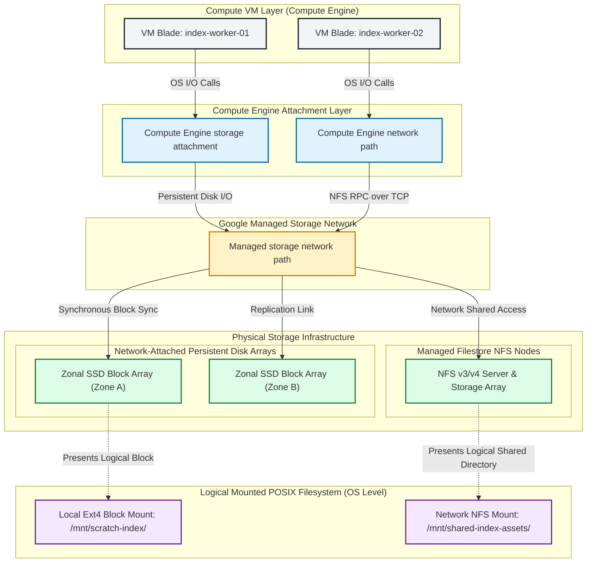

## Table of Contents

1. [Virtual Hardware and OS Path Access](#virtual-hardware-and-os-path-access)
2. [Hands-On Playbook: Provisioning, Formatting, and Mounting Storage Tiers](#hands-on-playbook-provisioning-formatting-and-mounting-storage-tiers)
3. [Persistent Disk Block Storage Mechanism](#persistent-disk-block-storage-mechanism)
4. [Filestore Shared Filesystem Architecture](#filestore-shared-filesystem-architecture)
5. [Designing Persistent Disk Snapshots and Consistency](#designing-persistent-disk-snapshots-and-consistency)
6. [The System Architecture Blueprint](#the-system-architecture-blueprint)
7. [Design Detail: Attachment, Mounts, and Locking](#design-detail-attachment-mounts-and-locking)
8. [What's Next](#whats-next)

## Virtual Hardware and OS Path Access

Persistent Disk and Filestore are GCP storage services for workloads that need operating-system storage paths instead of database drivers or object APIs. Persistent Disk presents block storage to a VM or supported workload, while Filestore presents a managed shared filesystem over NFS.

When you build and run applications in the cloud, you often interface with storage using web APIs or database drivers. For example, your code might fetch a document from Firestore or upload a PDF receipt to a Cloud Storage bucket using an HTTP request. However, there are many scenarios where your application code cannot use an API. Many compiled binaries, high-performance databases like PostgreSQL or MySQL, and legacy software applications are designed to read and write files directly from the local operating system's filesystem. They expect to open, write, and close files inside traditional paths such as `/var/data` or `/mnt/assets` using standard filesystem calls. Attempting to rewrite this software to use web APIs would require large, high-risk code changes, and wrapping low-level disk operations in web requests would introduce severe network latency penalties.


*Choose by whether the workload needs device blocks or shared files.*

To accommodate these workloads, cloud platforms provide storage through familiar operating-system interfaces. The first interface is an attached block device, which behaves like a virtual disk presented to one server's operating system. It is dedicated, fast, and controlled by that server's filesystem. The second interface is a shared network filesystem, which exposes one mounted directory tree to multiple clients over NFS so separate servers can coordinate file access.

Google Cloud offers both storage styles. For dedicated, high-performance virtual hard drives, you use Google Cloud Persistent Disk. For shared network folders that multiple servers can access simultaneously, you use Google Cloud Filestore. This managed division of labor mirrors equivalent services in other cloud environments. In Amazon Web Services (AWS), Persistent Disks are equivalent to Amazon Elastic Block Store (EBS) volumes, and Filestore shares are equivalent to Amazon Elastic File System (EFS). In Microsoft Azure, the equivalents are Azure Managed Disks and Azure Files. While the physical infrastructure differs, they all serve a common purpose: providing the standard filesystem paths, directory structures, and file locking behaviors that operating systems and legacy binaries expect to see.

## Hands-On Playbook: Provisioning, Formatting, and Mounting Storage Tiers

A provisioning playbook is the operational sequence that turns cloud storage resources into visible Linux devices and mount points. To see these virtual hardware mechanics in action, consider a hands-on systems engineering playbook: we must configure a background video rendering worker VM (`worker-vm-1`) in `us-central1-a`. The worker requires a high-performance 100GB Persistent SSD to act as a fast, local block-level cache for scratch frames. Additionally, it must mount a 1TB shared Filestore volume at `/mnt/media-shared` to read incoming raw videos and write completed assets.

### Creating and Attaching the Block Device

Creating and attaching a block device means provisioning the Persistent Disk resource, then presenting it to the VM's guest operating system. First, we create a 100GB SSD-backed Persistent Disk in the zone of our VM, and then attach it to the VM using the `gcloud` CLI:

```bash
# 1. Create a 100GB SSD Persistent Disk
gcloud compute disks create worker-scratch-disk \
  --size=100GB \
  --type=pd-ssd \
  --zone=us-central1-a

# 2. Attach the disk to the active VM instance
gcloud compute instances attach-disk worker-vm-1 \
  --disk=worker-scratch-disk \
  --zone=us-central1-a \
  --device-name=worker-scratch
```

Running this updates the instance attachment configuration. The guest operating system can then see the attached disk device and prepare it for use.

### Formatting and Mounting the Ext4 Filesystem

Formatting and mounting converts an attached block device into a filesystem path the application can use. We SSH into the guest operating system of `worker-vm-1` to initialize the virtual disk controller. The guest kernel detects the hot-plugged hardware under `/dev/disk/by-id/google-worker-scratch`. We format this device with an optimized `ext4` filesystem, mount the disk enabling SSD TRIM support to prevent cell wear latency, and persist the mount UUID to `/etc/fstab` to guarantee it survives VM restarts:

```bash
# 1. Verify the emulated hardware path exists
ls -l /dev/disk/by-id/google-worker-scratch

# 2. Format with ext4, optimizing write structures
sudo mkfs.ext4 -F -E lazy_itable_init=0,lazy_journal_init=0,discard /dev/disk/by-id/google-worker-scratch

# 3. Create the directory mount target
sudo mkdir -p /mnt/disks/worker-scratch

# 4. Mount with optimal options (discard enables background SSD trim wear leveling)
sudo mount -o discard,defaults /dev/disk/by-id/google-worker-scratch /mnt/disks/worker-scratch

# 5. Persist the mount inside fstab using its unique UUID
echo "UUID=$(sudo blkid -s UUID -o value /dev/disk/by-id/google-worker-scratch) /mnt/disks/worker-scratch ext4 discard,defaults,nofail 0 2" | sudo tee -a /etc/fstab
```

The disk is now available inside the guest OS as a mounted filesystem path.

### Mounting the Shared NFS Volume

Mounting Filestore means connecting the VM to a managed NFS export and exposing it as a local directory. We install standard Network File System (NFS) client packages, mount the managed regional NFS v4 volume located at IP `10.128.0.22` with shared mount path `/media_pool`, and update the static mount tables inside our fstab:

```bash
# 1. Install NFS client support
sudo apt-get update && sudo apt-get install nfs-common -y

# 2. Create the shared mount target directory
sudo mkdir -p /mnt/media-shared

# 3. Mount the shared NFS filesystem
  sudo mount -t nfs -o defaults,_netdev 10.128.0.22:/media_pool /mnt/media-shared

# 4. Persist the NFS mount inside fstab to guarantee auto-mount on boot
echo "10.128.0.22:/media_pool /mnt/media-shared nfs defaults,_netdev,nofail 0 0" | sudo tee -a /etc/fstab
```

This establishes network-mounted shared directory trees, allowing our application workers to coordinate file access concurrently.

### Verifying the Mounted Storage Layout

Mount verification confirms which filesystem paths map to which storage backends. To verify our active mount structure and storage tier boundaries inside the guest, we run the standard `df` filesystem utility:

```bash
df -h | grep -E 'worker-scratch|media-shared'
```

The terminal prints the active logical paths, storage capacities, and physical mount targets:

```text
/dev/sdb                 98G   24M   93G   1% /mnt/disks/worker-scratch
10.128.0.22:/media_pool  1.0T  120G  880G  12% /mnt/media-shared
```

The background worker is now fully configured: frame caches are written locally at block-device speeds, and media transcoding nodes read and write to the shared volume concurrently without data collision.

## Persistent Disk Block Storage Mechanism

Persistent Disk is managed block storage that appears to the operating system as a disk device. Google Cloud Persistent Disk presents virtual block devices to Compute Engine virtual machines and supported Google Kubernetes Engine workloads. Unlike local storage attached directly to a physical host, Persistent Disks are decoupled from the VM lifecycle. This means the disk can outlive the VM, can be snapshotted, and can be detached or attached within documented product limits.

The narrative spine of high-performance index building highlights the strength of this architecture: an indexing worker on Compute Engine can mount a zonal or regional Persistent Disk formatted with standard Linux filesystems, such as ext4 or XFS, for continuous write-heavy work. When choosing between zonal and regional configurations, systems architects must evaluate their failure-domain tolerance. A zonal Persistent Disk is tied to one zone. A Regional Persistent Disk synchronously replicates data between two zones in the same region, which can help with recovery from zonal failure when the application and failover process are designed for it.

This dual-zone replication mechanism provides a useful contrast to equivalent offerings in other cloud environments. In Amazon Web Services, Elastic Block Store (EBS) volumes are scoped to a single Availability Zone. Microsoft Azure Managed Disks offer several redundancy options, including zone-redundant choices in supported regions. GCP's Regional Persistent Disk gives teams a managed two-zone block-storage option, but the application still needs a tested failover procedure.

## Filestore Shared Filesystem Architecture

Filestore is managed NFS storage for workloads that need a shared directory tree across multiple clients. While Persistent Disks are designed to be mounted by a single virtual machine under standard read-write conditions, Filestore addresses the cooperative demands of distributed application servers that must access, modify, and append files in a unified directory tree. By provisioning a Filestore instance, administrators expose a centralized mount point that can be attached to multiple client machines, supporting multi-writer file sharing within the documented performance and locking behavior.

Consider a distributed ingestion pipeline where multiple regional worker nodes must process incoming vendor data files, extract raw text, and write indexed chunks to a shared staging area. Using supported NFS protocols, each worker mounts the Filestore share at a local directory path, such as `/mnt/shared-index-assets`. Client processes can execute standard file operations like directory scanning and coordinated file writes. If the application depends on file locking, use mount options and protocol behavior that preserve locking rather than disabling it.

This shared file storage paradigm maps directly to equivalent file services in other cloud portfolios, such as Amazon Elastic File System (EFS) and Azure Files. Current Filestore service tiers include Zonal, Regional, and Enterprise Multishares for GKE, while Basic HDD and Basic SSD are legacy tiers. Choosing the tier determines capacity, performance, and availability behavior. By removing the need to manage custom NFS servers, Filestore isolates the operational complexity of maintaining shared file service infrastructure.

## Designing Persistent Disk Snapshots and Consistency

A Persistent Disk snapshot is a point-in-time copy of block-device state, not proof that the application had flushed every logical write. Protecting block-level storage states requires an understanding of the difference between raw disk snapshotting and application-level data consistency. A Persistent Disk snapshot captures the state of the block storage device at a specific point in time, copying changed blocks incrementally to Google Cloud Storage for durable retention. However, because a running operating system heavily caches file writes in volatile RAM page caches, taking a snapshot of an active, un-quiesced disk can result in a crash-consistent state. If a restore is performed from such a snapshot, the database or indexing engine must go through the same recovery sequence as if it had suffered a sudden power loss, which risks file corruption or incomplete transactions.


*Crash-consistent snapshots are safer when the application cooperates.*

To achieve clean, application-consistent backups, systems engineers must coordinate the snapshot process with the operating system and database engines. This coordination can involve flushing pending writes, temporarily freezing filesystem writes, or using database-native backup tools. On Linux systems, tools like `fsfreeze` or database-specific backup commands can help create a cleaner recovery point. Once the snapshot request is accepted, writes can resume while Google Cloud manages the snapshot operation.

### Staging and Processing Directory Protocol

A staging directory protocol is a file naming and movement convention that lets multiple workers coordinate shared filesystem work safely. To maintain strict data consistency and avoid race conditions when multiple workers access a shared Filestore directory, workloads should adopt a clear, step-based staging directory convention:

- **Incoming Path (`/mnt/incoming`)**: Owned by the upload ingestion process, housing new raw source data awaiting indexing.
- **Processing Path (`/mnt/processing`)**: Owned by individual indexing workers that have actively claimed and locked specific files.
- **Complete Path (`/mnt/complete`)**: Owned by indexing workers to store successfully processed and validated index files.
- **Error Path (`/mnt/error`)**: Reserved for corrupted inputs that failed structural validation, allowing easy debugging.

### Target Snapshot Configuration

- **Source Disk Volume**: `orders-worker-index`
- **Active Attachment Target**: `orders-indexer-01`
- **Snapshot Scheduling Frequency**: Daily incremental backups
- **Recovery Restore Region**: A freshly provisioned target disk in `us-central1`
- **Consistency Enforcement**: Native filesystem freeze coupled with application-level index reconstruction fallback

## The System Architecture Blueprint

The system architecture blueprint maps the managed storage resources to the disk devices, mount points, and application paths that code actually uses. The following physical-to-logical topology demonstrates the separation between underlying network-attached storage infrastructure and the host-level directory mounts exposed to application software.



## Design Detail: Attachment, Mounts, and Locking

:::expand[Design Detail: Attachment, Mounts, and Locking]{kind="design"}
Persistent Disk and Filestore both make storage look familiar to the operating system, but they do it at different layers. Persistent Disk presents block storage to a VM, so the VM formats the disk with a filesystem such as ext4 or XFS. Filestore presents an already managed shared filesystem over NFS, so clients mount a network share.

#### Persistent Disk Attachment
When a persistent disk is attached to a VM, the guest operating system sees a block device path under `/dev/disk/by-id/`. The administrator formats that device, mounts it, and persists the mount in `/etc/fstab`. The important operational boundary is that a zonal disk belongs to a zone, while a regional disk replicates between two zones in a region.

#### Filestore Mounting
When a VM mounts a Filestore share, it uses the Filestore instance IP address and file share name. The NFS client and Filestore server coordinate file operations over the network. For multi-writer workloads, test locking behavior with your exact protocol, mount options, and application before production.

#### Snapshot Consistency
Persistent Disk snapshots are useful, but a snapshot of a busy filesystem may be only crash-consistent. For databases and indexing systems, coordinate snapshots with application flushes, filesystem freeze tools, or product-native backup features so restores are predictable.
:::

## What's Next

Having mapped out low-level storage primitives and their virtualized hardware interfaces, the final storage security layer requires establishing comprehensive backup strategies. The next logical module explores disaster recovery planning, analyzing how replication topologies, point-in-time database recoveries, and regional failovers guarantee long-term business continuity when underlying hardware layers suffer terminal failures.


*Use this summary as the quick mental checklist before designing or debugging the service.*


---

**References**

- [Google Cloud: Persistent Disk documentation](https://cloud.google.com/compute/docs/disks)
- [Google Cloud: Filestore overview](https://cloud.google.com/filestore/docs/overview)
- [Google Cloud: Filestore service tiers](https://cloud.google.com/filestore/docs/service-tiers)
- [Google Cloud: Mount Filestore file shares](https://cloud.google.com/filestore/docs/mounting-fileshares)
- [Google Cloud: Create and manage disk snapshots](https://cloud.google.com/compute/docs/disks/create-snapshots)
- [Google Cloud: Regional Persistent Disk](https://cloud.google.com/compute/docs/disks/about-regional-persistent-disk)
