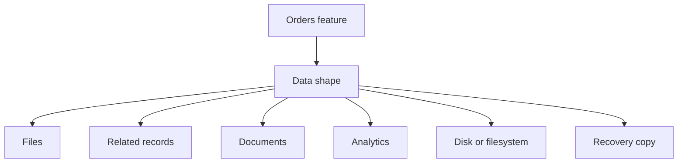

## Table of Contents

1. [The Problem](#the-problem)
2. [What Is Storage](#what-is-storage)
3. [Data Shapes](#data-shapes)
4. [Objects](#objects)
5. [Relational Data](#relational-data)
6. [Document Data](#document-data)
7. [Analytics Data](#analytics-data)
8. [Attached Storage](#attached-storage)
9. [Recovery Copies](#recovery-copies)
10. [Sample Data Map](#sample-data-map)
11. [Putting It All Together](#putting-it-all-together)
12. [What's Next](#whats-next)

## The Problem

The Orders API has moved from a laptop into GCP. The app can run on Cloud Run, reach private services, and use a runtime identity. Now it has a quieter but more permanent question: where should the data live?

At first, that sounds like one decision. Then the data starts behaving differently:

- Receipt PDFs need a durable home where the app can store and fetch whole files.
- Orders, customers, payments, and line items need relationships and transactions.
- Checkout drafts and preferences may fit document-shaped app state.
- Product managers want reports over millions of checkout events.
- A legacy worker still expects a mounted directory.
- A bad release may corrupt data, so the team needs a previous copy to restore.

Those are not one storage problem. They are different data shapes. The fastest way to choose poorly is to start with service names before you can describe how the data is used.

The working mental model is simple: describe what the data needs to do after it is written, then choose the GCP service whose behavior matches that shape.

## What Is Storage

Storage is where a system keeps state after a request, process, or job ends. Some state is a whole file. Some state is a set of related rows. Some state is a document the app reads by path. Some state is a large table for analysis. Some state is a disk or filesystem attached to compute. Some state is a recovery copy that exists for the day something goes wrong.

GCP has different services because those shapes make different promises.

| Data need | First service to consider | Promise the service is built around |
| --- | --- | --- |
| File-like bytes | Cloud Storage | Durable named objects in buckets |
| Relational app records | Cloud SQL | SQL, transactions, schemas, managed database operations |
| Document-shaped app state | Firestore | Documents, collections, indexes, app-friendly access paths |
| Analytics tables | BigQuery | SQL analysis over large datasets |
| Disk or file paths for compute | Persistent Disk or Filestore | Block storage or shared file storage attached to workloads |
| Previous copies | Service-specific backups and retention | Recovery after corruption, overwrite, or deletion |

This table is not a product catalog. It is a first filter. If you can explain the data shape, the service choice becomes much easier to defend.

## Data Shapes

Data shape means the way the app or team will read, write, update, query, protect, and recover the data. The same business domain can create several shapes.

An order creates business records in Cloud SQL. The receipt PDF for that order can live in Cloud Storage. A checkout draft can live in Firestore if the app reads it by user path. A data pipeline can copy checkout events into BigQuery for analysis. A VM worker may use Persistent Disk for local working space while rebuilding an index. A recovery plan may use backups, versions, snapshots, or time travel.

The diagram leaves out service names until the shape is clear. That is the habit to keep.

## Objects

Object-shaped data is stored and retrieved as named blobs of bytes. A receipt PDF, export CSV, profile image, log archive, or support attachment often behaves like an object. The app writes the whole thing, reads the whole thing or a range of it, controls access to it, and may delete it later.

Cloud Storage is the usual GCP home for this shape. A bucket is the container. An object is the data plus metadata. The object name is part of the design because it decides how humans and tools find related objects later.

Object storage is durable and scalable, but it is not a relational database. The database should keep the business meaning: order ID, customer ID, status, and which object name holds the receipt. Cloud Storage should keep the bytes.

## Relational Data

Relational data is made of records that need rules between them. Orders have line items. Payments belong to orders. Refunds refer to payments. A support query may need to join several tables. Checkout may need a transaction so several writes succeed together or fail together.

Cloud SQL is the beginner GCP home for that shape. It gives managed MySQL, PostgreSQL, or SQL Server. The team still owns schema design, migrations, indexes, query behavior, credentials, connection handling, and restore expectations.

The non-obvious truth is that a managed database does not remove database thinking. It reduces infrastructure work around the database. The app still needs a relational model that matches checkout.

## Document Data

Document data fits when the app can read or query records as documents with predictable paths and indexes. Checkout drafts, user preferences, lightweight app state, and mobile-friendly records can fit this model.

Firestore is the GCP document database to learn first. It stores documents in collections, supports indexes, and has its own transaction and consistency boundaries. It can feel natural to JavaScript developers because documents look like objects, but that familiarity can be dangerous. Documents are not a license to ignore access patterns.

Firestore is strongest when the app can name the document path or query a collection in known ways. It is weaker when the team needs flexible joins, many ad hoc reports, or relational constraints across many tables.

## Analytics Data

Analytics data exists so people can ask questions across many events and records. How many checkouts failed by region last week? Which payment provider has the highest retry rate? Did the latest release increase receipt latency?

BigQuery is the GCP service built for that analytical shape. It stores datasets and tables and lets teams use SQL to analyze large amounts of data without operating database servers. It is excellent for reports, dashboards, data engineering, and exploration over historical facts.

BigQuery should not become the request-time checkout database. The app should not wait on an analytical warehouse to decide one customer's order state. Use BigQuery for questions over many facts, not for the single transaction the customer is waiting on.

## Attached Storage

Some workloads ask for a path, not an API. A Compute Engine worker may need a durable block device. Several VMs may need a shared NFS-like file system. A vendor tool may expect `/mnt/incoming` and write results beside the input files.

Persistent Disk and Filestore are the GCP services to learn first for attached storage. Persistent Disk behaves like block storage attached to a VM or supported workload. Filestore provides managed file storage that clients can mount.

This shape is different from Cloud Storage. A bucket is great for object bytes and object APIs. A disk or mounted file system is for workloads that truly need disk or file semantics. Do not choose attached storage just because it feels familiar from a laptop.

## Recovery Copies

Storage is not finished when the first write succeeds. The team also needs to answer what happens after a bad write, mistaken deletion, corrupt import, or failed migration.

Recovery copies come in different forms:

| Data shape | Recovery mechanism to review |
| --- | --- |
| Cloud Storage objects | Versioning, soft delete, lifecycle, retention, backups where needed |
| Cloud SQL records | Automated backups, point-in-time recovery, exports, restore drills |
| Firestore data | Backup or export strategy, security rules, restore path |
| BigQuery tables | Time travel, table snapshots, restore or copy behavior |
| Disks and file shares | Snapshots, backups, replication, restore procedure |

The important question is not "is the service durable?" Durable services can preserve the wrong data very reliably. Recovery asks whether a previous good copy exists and whether the team can restore it.

## Sample Data Map

For the Orders system, a first data map might look like this:

| Work | Data shape | GCP home |
| --- | --- | --- |
| Receipt PDF | File-like object | Cloud Storage |
| Orders and payments | Relational records | Cloud SQL |
| Checkout draft | Document-shaped state | Firestore |
| Checkout event history | Analytical facts | BigQuery |
| Legacy worker scratch space | Attached disk | Persistent Disk |
| Shared import directory | Shared filesystem | Filestore |
| Bad release recovery | Previous copy | Backups, versions, snapshots, time travel |

The map is not frozen forever. It is a starting point that lets the team explain why each service exists.

## Putting It All Together

Return to the opening problems.

Receipt PDFs need a durable object home. Cloud Storage fits because the file bytes are the unit.

Orders, customers, payments, and line items need relationships and transactions. Cloud SQL fits because checkout data needs SQL-shaped rules.

Checkout drafts and preferences may fit Firestore when the app can read by document path or predictable collection query.

Reports over many checkout events belong in BigQuery because analytics and request-time state have different jobs.

Legacy tools that expect paths may need Persistent Disk or Filestore, but that is a compute-attached storage shape, not the default for app data.

Bad writes and deletion need recovery copies. Backups and retention are part of storage design, not an afterthought.

## What's Next

The most common first storage shape is object storage: receipts, exports, uploads, images, and generated artifacts. Next, we look at Cloud Storage buckets, objects, names, access, lifecycle, versioning, and signed URLs.

---

**References**

- [Google Cloud: About Cloud Storage objects](https://cloud.google.com/storage/docs/objects)
- [Google Cloud: Cloud SQL overview](https://cloud.google.com/sql/docs/introduction)
- [Google Cloud: Firestore overview](https://cloud.google.com/firestore/docs/overview)
- [Google Cloud: BigQuery overview](https://cloud.google.com/bigquery/docs/introduction)
