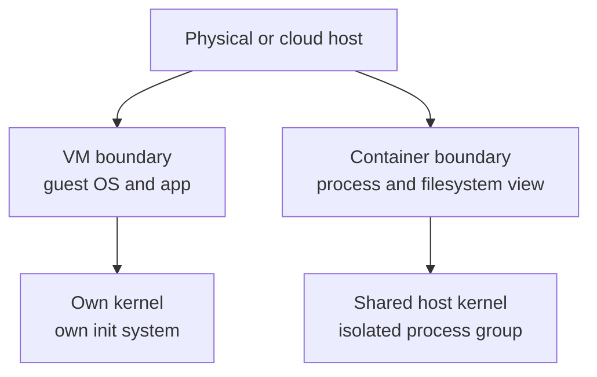

## Table of Contents

1. [Two Ways to Draw the Boundary](#two-ways-to-draw-the-boundary)
2. [What a Virtual Machine Contains](#what-a-virtual-machine-contains)
3. [What a Container Shares](#what-a-container-shares)
4. [The devpolaris-orders-api Decision](#the-devpolaris-orders-api-decision)
5. [Isolation, Security, and Blast Radius](#isolation-security-and-blast-radius)
6. [Startup, Density, and Operations](#startup-density-and-operations)
7. [Failure Mode: Kernel Assumption Mismatch](#failure-mode-kernel-assumption-mismatch)
8. [Choosing the Unit of Deployment](#choosing-the-unit-of-deployment)
9. [When Both Are Used Together](#when-both-are-used-together)
10. [A Decision Checklist for Beginners](#a-decision-checklist-for-beginners)

## Two Ways to Draw the Boundary

Teams use isolation so one workload does not accidentally depend on or damage another workload. A virtual machine draws the boundary around a whole guest operating system. A container draws the boundary around processes that share the host kernel but get scoped views of filesystems, process IDs, networking, users, and resource limits.

That difference explains most practical tradeoffs. A VM is heavier because it carries a full OS instance. It can run a different kernel from the host and has a stronger machine-shaped boundary. A container is lighter because it shares the host kernel. It starts faster and packs more densely, but it cannot pretend the host kernel is a different operating system kernel.

For a junior developer, the key is not "which is better." The key is "which boundary matches the thing I am trying to operate?" A single API process usually fits a container well. A whole legacy server with system services, custom kernel modules, and machine-level assumptions may fit a VM better.



This diagram is intentionally small. The boundary location is the idea that drives the rest of the article.

## What a Virtual Machine Contains

A virtual machine includes virtual hardware, a guest kernel, a guest operating system userland, system services, and the application. A hypervisor is the layer that creates and manages those virtual machines. In cloud platforms, EC2 instances, Azure VMs, and Compute Engine VMs all follow this broad model even though the provider details differ.

That machine-shaped boundary is useful when the workload expects to own the OS. A database appliance, a Windows service, a legacy app with systemd units, or a security lab that needs kernel-level experiments may need a VM. The VM can be patched, rebooted, snapshotted, and monitored as a machine.

The cost is operational weight. You manage OS updates, disk images, boot time, SSH access, package drift, and machine-level configuration. That weight is acceptable when the machine boundary is the right abstraction. It is unnecessary when you only need to run one stateless API process.

```text
Virtual machine stack:

Application:        devpolaris-orders-api
Runtime files:      Node, npm packages, OS packages
Guest services:     systemd, journald, sshd
Guest OS kernel:    Linux kernel inside the VM
Virtual hardware:   vCPU, memory, disk, network device
Hypervisor:         Provider or host virtualization layer
Physical host:      Real server hardware
```

The VM contains enough of the machine that many traditional server administration habits apply directly.

## What a Container Shares

A container usually packages application files and userland dependencies, then shares the host kernel. The runtime uses kernel features such as namespaces and cgroups. A cgroup, short for control group, is a Linux mechanism for limiting and accounting resources such as CPU and memory.

For `devpolaris-orders-api`, the container image can include Node, production npm dependencies, certificate bundles, and `/app/server.js`. It does not include its own Linux kernel. When the Node process opens a socket or reads a file, the host kernel is still doing the work, but the process sees the scoped environment prepared by the runtime.

```text
Container stack:

Application process:  node server.js
Image filesystem:     /app, Node runtime, OS userland files
Runtime isolation:    namespaces, cgroups, mounts, network setup
Host kernel:          shared Linux kernel
Host OS:              machine running the container runtime
Physical or VM host:  real server or cloud VM underneath
```

This sharing is why containers start quickly. The runtime does not boot a whole guest operating system for each API instance. It prepares isolation and starts a process.

## The devpolaris-orders-api Decision

Suppose the team needs to run three copies of `devpolaris-orders-api` behind a load balancer. The service is stateless, stores orders in Postgres, writes invoice PDFs to object storage, and exposes `/health`. That shape fits containers because each copy is one process with external state.

Running three VMs would work, but the team would manage three OS instances for one simple service. They would patch each guest OS, keep Node versions aligned, configure systemd for each copy, and make sure logs are collected consistently. Containers let the team build one image and run three instances from it.

```text
Service shape:

Repository:       devpolaris-orders-api
Runtime:          Node API process
State:            Postgres and object storage outside the process
Config:           DATABASE_URL and service credentials at runtime
Health check:     GET /health
Scale unit:       one container per API instance
```

This does not mean the host disappears. In many production systems, containers run on VMs. The VM is the node boundary. Containers are the application boundary inside that node. Kubernetes uses this model often: a cluster has worker nodes, and nodes run containers.

## Isolation, Security, and Blast Radius

VMs generally provide a stronger isolation boundary because each VM has its own guest kernel. A kernel vulnerability inside one guest is not automatically the host kernel. Containers share the host kernel, so kernel-level isolation and runtime hardening matter. That does not make containers unsafe by default. It means the boundary is different and must be treated honestly.

Container security depends on choices such as running as a non-root user, dropping unnecessary Linux capabilities, using read-only filesystems where possible, limiting CPU and memory, avoiding privileged containers, scanning images, and keeping the host patched. The image can be small and clear, but the runtime settings still matter.

| Concern | Container habit | VM habit |
|---------|-----------------|----------|
| Kernel boundary | Shared host kernel | Guest kernel per VM |
| Patch target | Image plus host | Guest OS plus host layer |
| Process privilege | Drop capabilities, non-root user | OS users, service accounts, firewall |
| Blast radius | Limit container permissions and mounts | Limit VM network and IAM permissions |

For `devpolaris-orders-api`, a good container setup runs the Node process as a non-root user and avoids mounting the Docker socket or host filesystem. A VM setup would focus more on SSH access, OS patching, host firewall rules, and systemd service permissions.

## Startup, Density, and Operations

Containers usually start faster than VMs because they start processes instead of booting full guest operating systems. That speed changes how teams deploy. Replacing a container can be routine. Starting a fresh VM for every small application instance is slower and more expensive.

Density means how many workload instances you can pack onto a host. Containers often achieve higher density because each instance does not carry a full guest OS. This is useful for stateless APIs, workers, preview environments, CI jobs, and short-lived tasks.

The operational cost moves rather than disappears. With containers, you need image build discipline, registry access, runtime configuration, health checks, logs, and resource limits. With VMs, you need OS image discipline, patching, bootstrapping, SSH or remote management, service supervision, and machine inventory.

```text
Typical replacement time:

Containerized API:
  pull image if needed
  create container
  start process
  pass health check

Virtual machine API:
  create or boot VM
  wait for guest OS
  install or verify runtime
  start service
  pass health check
```

The exact times depend on tools and infrastructure, but the shape is stable. Containers optimize for process-level replacement. VMs optimize for machine-level isolation.

## Failure Mode: Kernel Assumption Mismatch

A container can fail when an application assumes it controls the kernel or a full machine. For example, imagine a debug build of `devpolaris-orders-api` tries to change a kernel setting during startup:

```bash
$ docker run --rm ghcr.io/devpolaris/orders-api:debug
sysctl: permission denied on key "net.ipv4.ip_forward"
Error: startup preflight failed
```

That failure is not solved by rebuilding the image with more npm packages. The process is trying to change a host kernel setting from inside a container. The diagnostic path is to identify the failing operation, ask whether it belongs inside the application container, and move it to the right layer.

Possible fixes depend on intent. If the app does not truly need that kernel setting, remove the preflight. If the host needs the setting, configure it on the node or VM through infrastructure automation. If the workload genuinely requires deep kernel control, a VM or a specially designed privileged environment may be the right boundary.

Another common mismatch is assuming a container has systemd:

```bash
$ docker run --rm ghcr.io/devpolaris/orders-api:debug systemctl status orders-api
System has not been booted with systemd as init system (PID 1). Can't operate.
```

Most application containers should run one main process, not a full init system. If your deployment model requires managing many OS services together, you may be describing a VM-shaped workload.

## Choosing the Unit of Deployment

Choose containers when the workload can be described as one service process or a small process group with external state, clear config, and health checks. Choose VMs when the workload needs a full OS boundary, kernel differences, machine-level services, or stronger isolation between tenants.

For a new stateless API like `devpolaris-orders-api`, a container is usually the right deployment unit. The team can build one image, run it consistently, scale replicas, and replace failed instances. For a database, the answer is more careful. Databases can run in containers, but durable storage, backups, kernel tuning, and operational ownership become central. Many teams use managed databases or VM-backed database services instead of treating a database like a disposable API container.

The best engineers do not defend one abstraction everywhere. They match the boundary to the workload. Containers are excellent for packaging and running application processes. VMs are excellent for isolating and operating whole machines. Many production systems use both.

## When Both Are Used Together

The container versus VM question is not always a replacement question. Many production systems run containers on virtual machines. The cloud provider gives the team VMs as worker nodes. A container runtime on each node starts application containers. An orchestrator later decides which node should run which container.

For `devpolaris-orders-api`, that layered model might look like this:

```text
Cloud account
  VPC or virtual network
    VM worker node: node-a
      container runtime
        orders-api container 1
        orders-api container 2
    VM worker node: node-b
      container runtime
        orders-api container 3
```

The VM boundary helps the platform team manage capacity, kernel patching, node identity, and network placement. The container boundary helps the application team package and replace `orders-api` instances. The two boundaries solve different problems at different layers.

This layered view also helps with diagnostics. If every container on one node fails to reach the database, inspect the node network, security group, route table, or DNS configuration. If only one `orders-api` container fails while other containers on the node are healthy, inspect that container's image, env vars, ports, and logs first.

## A Decision Checklist for Beginners

Use a checklist when the choice feels abstract. The goal is not to score points for containers or VMs. The goal is to name the workload shape honestly.

| Question | Container points to | VM points to |
|----------|---------------------|--------------|
| Is the workload one main process? | Yes | Not required |
| Does it need a different kernel? | No | Yes |
| Does it keep state externally? | Yes | Not required |
| Does it need systemd and many OS services? | Usually no | Often yes |
| Should replacements be frequent? | Yes | Sometimes |
| Is tenant isolation very strong? | Needs hardening | Stronger default boundary |

Apply the checklist to `devpolaris-orders-api`. It is one main process. It uses external Postgres and object storage. It has a health endpoint. It should be replaced during deploys. It does not need its own kernel or systemd. That points to a container.

Apply the same checklist to a legacy reporting server that runs cron jobs, local mail delivery, a custom system service, and a vendor package that expects to edit `/etc/sysctl.conf`. That points more strongly to a VM, at least until the team can separate the pieces into clearer services.

The checklist also prevents overconfidence. A container is not automatically production-ready because it starts. A VM is not automatically safer because it is heavier. The operating model, permissions, network design, patching habit, and evidence during incidents matter in both cases.

You can turn the checklist into a short design note before a team commits to one path:

```text
Design note: devpolaris-orders-api runtime boundary

Decision:
  Run the API as a container on platform-managed worker nodes.

Reasons:
  The service is one Node process.
  Durable state lives in Postgres and object storage.
  The image can be built and tested in CI.
  The service has a health endpoint.
  Replacements should be frequent during deploys.

Risks:
  Host kernel is shared with other containers.
  Runtime secrets must be supplied safely.
  Resource limits must prevent one replica from using too much memory.

Rejected option:
  One VM per API replica, because OS management would dominate a small stateless service.
```

That note is more useful than a general statement that containers are lighter. It names the service shape, the accepted risks, and the rejected option. A future teammate can disagree with the decision using the same evidence instead of restarting the debate from slogans.

For a VM-shaped workload, the note would look different:

```text
Design note: legacy invoice renderer runtime boundary

Decision:
  Keep the renderer on a VM until the vendor package is replaced.

Reasons:
  It installs system services.
  It expects systemd during startup.
  It writes to OS-level spool directories.
  It requires a kernel setting managed by the host.

Risks:
  VM patching and image drift need active ownership.
  Scaling is slower than starting containers.
  Deploys require machine-level checks.

Rejected option:
  Containerizing immediately, because the workload still behaves like a whole server.
```

These notes also show that "containerize everything" is not a mature strategy. A better strategy is to reduce accidental machine assumptions over time. When the invoice renderer no longer needs systemd, local spool directories, or host kernel changes, the team can revisit the boundary.

The diagnostic path changes with the boundary. For the containerized API, you inspect image, env vars, ports, process logs, and node placement. For the VM renderer, you inspect the guest OS, systemd unit, disk, package versions, kernel setting, and service logs. Both paths are valid. They start from different assumptions about what the workload owns.

Keep that ownership question close: does this workload need to own a machine, or does it need to run as a replaceable process? Most container and VM decisions become clearer once that question is answered in plain language.

Here is a final comparison using the same service:

```text
If orders-api runs in a container:
  Deploy means replace a process instance from an image.
  Debug starts with logs, env vars, ports, and image identity.
  Scale usually means run more replicas.

If orders-api runs on a VM:
  Deploy may mean update files or packages on a guest OS.
  Debug starts with service status, OS logs, ports, and machine config.
  Scale usually means add or configure more machines.
```

Both paths can serve users. The container path is usually a better fit when the app has a clean process boundary. The VM path is usually a better fit when the operating system is part of the product contract.

That last phrase is worth testing during design reviews. If the team says "the app needs this machine setting, this daemon, this local spool, and this boot behavior," you are hearing VM-shaped requirements. If the team says "the app needs this command, these files, these env vars, this port, and external state," you are hearing container-shaped requirements.

The healthiest systems make those requirements explicit. They do not choose containers because they are fashionable or VMs because they feel familiar. They choose the boundary that makes operation, diagnosis, and replacement easiest for the workload in front of them.

For `devpolaris-orders-api`, that boundary is the replaceable process. For a full server product, that boundary may be the whole machine.

Naming the boundary first makes the tool choice easier to defend.

---

**References**

- [Docker Docs: What is a container?](https://docs.docker.com/get-started/docker-concepts/the-basics/what-is-a-container/) - Introduces the Docker container model and how it differs from a full machine.
- [Docker Docs: Docker overview](https://docs.docker.com/engine/docker-overview/) - Explains images, containers, registries, and the Docker architecture.
- [Open Container Initiative Runtime Specification](https://github.com/opencontainers/runtime-spec) - Defines the runtime side of OCI containers and their process configuration.
- [Kubernetes Docs: Nodes](https://kubernetes.io/docs/concepts/architecture/nodes/) - Shows how Kubernetes commonly places containers on worker nodes, often backed by VMs.
