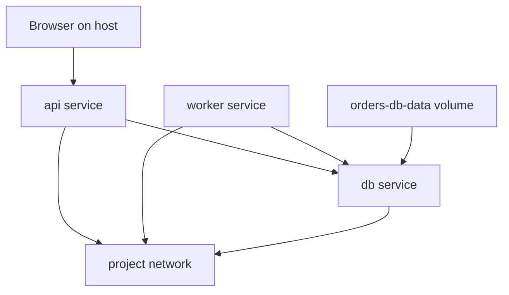

## Table of Contents

1. [Why Compose Exists](#why-compose-exists)
2. [The Mental Model](#the-mental-model)
3. [The Project Boundary](#the-project-boundary)
4. [Services](#services)
5. [The Compose File](#the-compose-file)
6. [What Compose Creates](#what-compose-creates)
7. [Where the Model Misleads](#where-the-model-misleads)
8. [Putting It All Together](#putting-it-all-together)
9. [What's Next](#whats-next)

## Why Compose Exists

Docker Compose is a local application model that turns multiple container run settings into one reviewable graph of services, networks, volumes, ports, and startup rules.

The orders API now has several Docker facts attached to it. The image comes from a Dockerfile. The container needs a database URL. The browser reaches the API through a published host port. The API reaches Postgres through a Docker network. The database needs storage that survives container recreation.

You can keep those facts in separate commands:

```bash
docker network create orders-net
docker volume create orders-db-data
docker run -d --name db --network orders-net --mount source=orders-db-data,target=/var/lib/postgresql/data postgres:18
docker run -d --name api --network orders-net -p 127.0.0.1:8080:3000 -e DATABASE_URL=postgres://orders:orders@db:5432/orders devpolaris/orders-api:local
```

Those commands work, but they hide the application shape in shell history. A teammate cannot review which services belong together. A new worker process means copying flags from the API command and hoping the differences are intentional. A data reset depends on remembering which volume matters. A startup race between the API and database becomes a local habit instead of a visible dependency.

Compose exists because a multi-container application needs a model. The model says which roles exist, which image or build context creates each role, which ports are entry points from the host, which names containers use to find each other, and which filesystems should outlive a container.

## The Mental Model

Read a Compose file as an application graph. A single `docker run` command describes one container. A Compose file describes the connected system that should appear when the project starts.

An application graph is the set of service roles and the connections between them. In a small stack, that graph might be `browser -> api -> db`, plus a volume attached to the database.



The API service has one public edge from the host and one private edge to the database. The worker service may use the same image as the API but run a different command. The database has a storage edge because its data should not disappear with one container. The network is part of the graph because service names such as `db` only make sense inside that shared network.

Once the graph is visible, the YAML becomes easier to classify. Most fields describe one of four things: a service role, a connection between roles, a host entry point, or a state lifetime.

## The Project Boundary

The Compose project boundary is the namespace Compose uses to group generated containers, networks, volumes, and labels for one application instance.


*The project boundary is the namespace that keeps one local application copy from colliding with another.*

Compose groups resources into a project. The project name is normally derived from the directory, though it can be set explicitly. Docker uses that project name to group and label the containers, networks, and volumes that Compose creates.

That boundary matters when two copies of the same app run on one machine. A developer might have `orders` and `orders-review` checked out in different directories. Both files can define an `api` service and a `db` service. Compose keeps them separate by placing them in different projects, so their default networks and generated container names do not collide.

The boundary also explains why the service name is the name applications should use. The actual container name can include the project prefix and a number. The service role is the stable thing inside the model. `db` means "the database role in this Compose project," not "a particular container ID that will live forever."

## Services

A Compose service is a stable application role; Docker implements that role by creating container instances from the service definition.

A service is a role in the application. Docker implements that role by creating one or more containers from the same service definition. The definition says which image to use, how to build it if it comes from local source, which command to run, which environment to pass, which ports to publish, which volumes to mount, and which networks to join.

For the orders stack, the service roles are easier to understand than the container names:

| Service | Role | Runtime boundary |
| --- | --- | --- |
| `api` | HTTP application | Published host port and database URL |
| `db` | PostgreSQL database | Data volume and readiness signal |
| `worker` | Background jobs | Same image as the API, different command |
| `redis` | Cache or queue | Private network name and optional state |

This is the first non-obvious Compose habit: define roles, then let Compose create containers for them. If a container is recreated after a config change, the role remains. If a service is scaled, several containers can implement the same role. If application code hardcodes a generated container name or IP address, it attaches itself to a disposable implementation detail.

## The Compose File

A Compose file is the declarative model for the local application graph.

Declarative means the file describes the result you want Docker to assemble, not every manual command Docker should run. The file says there is an `api` service, a `db` service, a port, an environment value, a volume, and a health check.

Here is a small model for the orders stack:

```yaml
services:
  api:
    build: .
    ports:
      - "127.0.0.1:8080:3000"
    environment:
      NODE_ENV: development
      DATABASE_URL: postgres://orders:orders@db:5432/orders
    depends_on:
      db:
        condition: service_healthy

  db:
    image: postgres:18
    environment:
      POSTGRES_USER: orders
      POSTGRES_PASSWORD: orders
      POSTGRES_DB: orders
    volumes:
      - orders-db-data:/var/lib/postgresql/data
    healthcheck:
      test: ["CMD-SHELL", "pg_isready -U orders -d orders"]
      interval: 5s
      timeout: 5s
      retries: 10

volumes:
  orders-db-data:
```

The file folds earlier Docker concepts into one place. `build: .` points to the image build context. `ports` publishes a host entry point, with the host side bound to loopback and the container side pointing at the API's internal port. `DATABASE_URL` uses `db` because the database is another service on the project network. The database mounts a named volume so its data has a lifetime outside one container. The health check gives Compose a readiness signal that is better than "the container process exists."

This is still local Docker, not a production orchestrator. Compose is not deciding where in a cluster to schedule work, how to roll out a new version safely across many machines, or how to enforce production policy. It is making the local application shape explicit and repeatable.

## What Compose Creates

Compose resources are the concrete Docker objects created from the model: containers, networks, volumes, labels, and port bindings.


*Compose turns the reviewable YAML model into concrete Docker resources with the project identity attached.*

When you run the model, Compose creates Docker resources that correspond to the graph:

| Model entry | Docker resource | Why it exists |
| --- | --- | --- |
| Project | Labels and generated names | Groups this application instance |
| Service | Container configuration | Creates a container role |
| Default network | Docker bridge network | Lets services resolve each other by name |
| Published port | Host forwarding rule | Lets host callers enter one service |
| Named volume | Docker volume | Gives state a project-owned lifetime |

The model and the resources are related, but they are not the same thing. The Compose file is the desired application shape. The Docker resources are the current implementation of that shape. If you manually change a running container, you changed an implementation detail. If you change the Compose file, you changed the model that can be reviewed and recreated.

That distinction saves time during debugging. If the running API container has an environment variable that is not in the Compose file, ask where it came from. If a volume exists but is not declared in the file, ask whether it belongs to this application model or is leftover state from a previous run.

## Where the Model Misleads

Compose feels simple because one file can start the stack. The hidden risk is assuming the file erases Docker's underlying boundaries.

The first trap is treating service startup as application readiness. A database container can be created before the API container and still be busy initializing when the API connects. The service exists, but the dependency is not ready. Later articles will handle readiness more carefully.

The second trap is confusing host names with service names. The host may reach the API at `127.0.0.1:8080`, while the database is reached from inside containers as `db:5432`. Those are different caller viewpoints, even though one Compose file contains both.

The third trap is expecting rebuilds to reset state. Compose can rebuild an image and recreate a container while preserving a named volume. That is normally what you want for local database data. It is surprising when someone wanted a clean database and only changed the image.

The model helps because it puts those boundaries in one place. It does not remove the need to understand them.

## Putting It All Together

The opening problem was not that Docker lacked enough commands. It was that the application shape was spread across commands, shell history, and memory.

Compose solves that by making the graph reviewable:

- Services name the roles in the application.
- The project boundary groups the resources that belong together.
- The default network gives service roles stable names.
- Published ports create deliberate host entry points.
- Named volumes give state a declared lifetime.
- Health checks and dependencies make startup assumptions visible.

The result is a local model that a teammate can read before they run it. That is the main shift: Compose turns "start these containers somehow" into "this is the application we expect Docker to assemble."

## What's Next

The next article zooms into the resources inside that graph. Services, networks, and volumes are where most Compose surprises live, because they decide which process starts, which names resolve, which ports are visible, and which files survive.


*The summary map keeps the Compose model anchored around project, services, network, ports, volumes, and model-versus-runtime state.*

---

**References**

- [Docker Docs: How Compose works](https://docs.docker.com/compose/intro/compose-application-model/) - Official explanation of Compose projects, services, networks, volumes, configs, and secrets.
- [Docker Docs: Compose file reference](https://docs.docker.com/reference/compose-file/) - Official reference for the Compose Specification implemented by Docker Compose.
- [Docker Docs: Define services in Docker Compose](https://docs.docker.com/reference/compose-file/services/) - Official reference for service definitions and service-level runtime settings.
