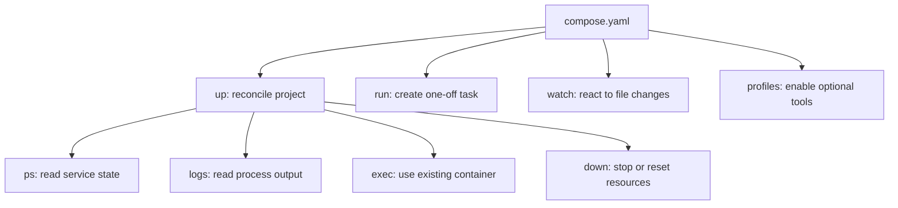

## Table of Contents

1. [The Daily Loop](#the-daily-loop)
2. [Start and Reconcile with Up](#start-and-reconcile-with-up)
3. [Read State with Ps, Logs, and Config](#read-state-with-ps-logs-and-config)
4. [Enter Existing Containers with Exec](#enter-existing-containers-with-exec)
5. [Run One-Off Tasks with Run](#run-one-off-tasks-with-run)
6. [Change Code with Rebuilds, Bind Mounts, and Watch](#change-code-with-rebuilds-bind-mounts-and-watch)
7. [Optional Tools with Profiles](#optional-tools-with-profiles)
8. [Stop, Reset, and Preserve Data](#stop-reset-and-preserve-data)
9. [A Practical Team Workflow](#a-practical-team-workflow)
10. [Putting It All Together](#putting-it-all-together)

## The Daily Loop
<!-- section-summary: Compose workflows are the repeated actions developers use against the same project model while code and local state keep changing. -->

The notes app now has a clear Compose model and a clear resource map. The team knows the `api`, `worker`, `db`, `redis`, and optional tools, and they know which pieces use networks, ports, volumes, environment values, secrets, and health checks.

Daily development adds movement to that picture. Someone starts the stack, watches logs, changes code, runs migrations, opens a shell inside the API container, runs tests in a one-off container, enables an admin tool, and resets local data after a schema experiment.

Those actions touch different lifetimes. `up` reconciles the whole project, `logs` reads process output, `exec` enters an existing container, `run` creates a one-off container, Watch responds to file changes, profiles include optional services, and `down` removes selected project resources.



This article connects the daily commands to the model. Each command has a clear lifetime, and that gives the team a practical way to explain the CLI.

## Start and Reconcile with Up
<!-- section-summary: docker compose up compares the running project with the model, then creates, starts, or recreates service containers as needed. -->

`docker compose up` is the main project startup command. Docker documents it as building, recreating, starting, and attaching to service containers, which matches how developers use it in a local loop.

For the notes app, foreground `up` gives you the most feedback while the stack starts. The terminal shows each service log as Compose creates and starts the project.

```bash
docker compose up
```

Compose reads the model, creates the project network, creates missing volumes, builds images when needed, starts dependencies, starts service containers, and attaches logs from the services in the terminal. That makes foreground `up` good for a first run, a new branch, or a debugging session where startup order matters.

Detached mode starts the same project and returns the terminal. The containers keep running in the background while the developer uses other tools.

```bash
docker compose up -d
```

Detached mode suits normal development after the stack is stable. The services keep running while the developer uses the editor, browser, test runner, or another terminal.

The important idea is **reconciliation**. Compose compares the existing project resources with the Compose model and updates the running services when configuration or images changed.

```bash
docker compose up --build -d
```

That command is common after changing a Dockerfile, dependency file, or build stage. Compose rebuilds images, then recreates service containers that need the new image while preserving named volumes unless another command removes them.

## Read State with Ps, Logs, and Config
<!-- section-summary: ps, logs, and config answer three different questions: what is running, what did the process say, and what model did Compose resolve. -->

After the stack starts, the first workflow is reading evidence. Compose gives you several viewpoints, and each one answers a different question about the same project.

`docker compose ps` shows service state. It gives a fast view of running containers, published ports, and health status.

```bash
docker compose ps
```

This tells the team which services are running, which ports are published, and which services report health status. If `db` is still `starting`, the API may still be waiting on the `service_healthy` condition.

`docker compose logs` shows process output grouped by service. The `-f` option keeps following new lines while the service keeps running.

```bash
docker compose logs -f api
```

Logs answer questions from inside the process. An API log can show a failed database connection, a missing environment value, a bad command, or a server listening on the wrong internal port.

`docker compose config` shows the resolved model. It is useful when variables, file merges, or short syntax make the raw YAML hard to reason about.

```bash
docker compose config
```

This command helps when the YAML and the running result disagree. Compose resolves variables, merges files supplied with `-f`, and expands short syntax, so the output shows the actual model Docker will apply.

For environment interpolation, the environment view can help. It shows the variables Compose used while resolving the model.

```bash
docker compose config --environment
```

That output helps a team find whether a value came from the shell, an `.env` file, or another Compose input. It keeps configuration debugging focused on evidence instead of guesses.

## Enter Existing Containers with Exec
<!-- section-summary: docker compose exec runs a command inside a service container that already exists, so it shows the current runtime viewpoint. -->

`docker compose exec` runs a command inside an existing service container. It uses the container that is already part of the project, so it sees the current filesystem, environment, mounts, and network namespace for that service.

When the API cannot reach Postgres, an engineer can enter the API container. That puts the debugging session in the same network and filesystem context as the running API process.

```bash
docker compose exec api sh
```

From there, the engineer can inspect environment values, check generated files, or use tools available in the image. The key point is that the command runs from the same viewpoint as the running API process.

For a database, `exec` can use the database client inside the database container. That keeps the database private while still giving the developer an interactive SQL session.

```bash
docker compose exec db psql -U notes -d notes
```

That session enters the running `db` container, connects to the local Postgres process inside it, and lets the developer inspect tables without exposing the database port to the host. It uses the existing database container rather than creating a separate task container.

`exec` is also useful for checking what a bind mount did. If the API cannot see a source file, the developer can enter the container and list the path that the service uses.

```bash
docker compose exec api ls -la /workspace
```

This checks the running container rather than the host checkout. That difference matters because bind mounts, image files, generated files, and working directories meet inside the container.

## Run One-Off Tasks with Run
<!-- section-summary: docker compose run creates a fresh one-off container from a service definition, which suits migrations, tests, scripts, and code generation. -->

`docker compose run` creates a new one-off container from a service definition and runs a command in it. It uses the service configuration, including image, environment, networks, and volumes, then overrides the service command for that one task.

The notes team might run a database migration like this. The migration gets the API service environment and the same private network path to `db`.

```bash
docker compose run --rm api npm run migrate
```

That command creates a temporary API-shaped container, runs the migration command, and removes the container afterward because of `--rm`. It uses the same image, environment, and network as the API service, so the migration can reach `db` through the Compose network.

Tests fit the same pattern. The test command can use the app image and project network without replacing the running API service.

```bash
docker compose run --rm api npm test
```

This gives tests the same container setup as the app without replacing the long-running API process. It also keeps the test process lifecycle separate from the service container that is serving browser requests.

The most important `run` behavior is port handling. Docker Compose documents that `run` skips service port publishing by default, which helps avoid collisions with an already-running `api` service.

```bash
docker compose run --rm --service-ports api npm run debug
```

The `--service-ports` option asks Compose to publish the service ports for that one-off container. Teams use that only when the one-off task actually needs host access, such as opening a temporary debug server.

`run` can also skip dependencies. This is useful when the task needs the service image and can skip the database, queue, or other services.

```bash
docker compose run --rm --no-deps api npm run lint
```

That works well for commands that only need the image and source files. Linting usually uses no Postgres or Redis, so `--no-deps` keeps the command fast and avoids starting the full stack.

## Change Code with Rebuilds, Bind Mounts, and Watch
<!-- section-summary: Code-change workflows decide how saved files reach a service: rebuild the image, mount host files, or let Compose Watch sync and rebuild by rule. -->

After startup and task commands, the next daily question is how source changes reach the running service. Compose commonly supports three paths: rebuild the image, bind mount host files, or use Compose Watch.

The rebuild path treats the image as the source of truth for runtime files. When source or dependencies change, the team rebuilds and recreates the service container.

```bash
docker compose up --build api
```

That path feels close to production because the service runs from files baked into the image. It also costs more time for frequent source edits, especially in large Node.js, Python, Java, or Go projects.

The bind-mount path connects host source files directly into the container. The app's development server can then respond to saved files through its own reload mechanism.

```yaml
services:
  api:
    build:
      context: .
      target: dev
    working_dir: /workspace
    volumes:
      - .:/workspace
      - api-node-modules:/workspace/node_modules
    command: npm run dev

volumes:
  api-node-modules:
```

This works well with a development server that watches the filesystem. The developer saves a file on the host, the container sees the change through the mount, and the application reloads through its own development tooling.

Compose Watch gives a third option through the `develop.watch` section. Watch can sync files into the container, rebuild the image, restart the service after syncing, and do those actions based on paths.

```yaml
services:
  api:
    build:
      context: .
      target: dev
    command: npm run dev
    develop:
      watch:
        - action: sync
          path: ./src
          target: /workspace/src
          initial_sync: true
          ignore:
            - node_modules/
        - action: rebuild
          path: package.json
```

```bash
docker compose up --watch
```

In this setup, source changes under `src` sync into the container, and a dependency-file change triggers a rebuild. That gives the team a smaller file-change contract than mounting the entire project directory.

Large teams often pick one recommended path per project and write it into their developer script. The important part is that everyone knows whether a saved file needs a rebuild, a running dev server reload, or a Watch rule.

## Optional Tools with Profiles
<!-- section-summary: Profiles keep optional development services in the same Compose file while starting only the core services by default. -->

**Profiles** let a Compose file include optional services that start only when a profile is active. Services without a `profiles` attribute stay in the default app, while services with a profile join the project only for runs that enable that profile.

The notes team may want Adminer for database browsing and Mailpit for email testing. Those tools help in development, and the team may only need them during a few tasks.

```yaml
services:
  api:
    build: .

  db:
    image: postgres:18

  adminer:
    image: adminer:5
    profiles: ["debug"]
    ports:
      - "127.0.0.1:8081:8080"

  mailpit:
    image: axllent/mailpit:v1.27
    profiles: ["email"]
    ports:
      - "127.0.0.1:8025:8025"
```

A normal startup runs only the unprofiled core services. In this example, that means the API and database can start without Adminer or Mailpit.

```bash
docker compose up -d
```

The debug profile adds Adminer. Compose includes the profile service in this run while keeping the same project model.

```bash
docker compose --profile debug up -d
```

Profiles help keep one project model without forcing every optional service onto every laptop. They also make optional ports visible in the Compose file, so a team can review port choices instead of sharing one-off commands in chat.

## Stop, Reset, and Preserve Data
<!-- section-summary: Shutdown commands affect different resource lifetimes, so teams should separate stopping containers from deleting volumes. -->

The workflow with the most risk is cleanup. Compose can stop containers, remove project containers and networks, and remove volumes when asked, so the team should treat data removal as a deliberate action.

Stopping services leaves the project resources in place. This pauses the running containers without asking Docker to remove the project objects.

```bash
docker compose stop
```

That is useful at the end of the day when a developer wants to free CPU and memory while keeping containers, networks, and volumes ready for the next session. The next startup can reuse the existing project resources.

Removing containers and project networks while preserving named volumes uses `down`. This gives the project a clean container start while keeping database files in named volumes.

```bash
docker compose down
```

Docker documents that `down` removes service containers and project networks by default. Named volumes declared in the Compose file remain unless the command includes the volume-removal option.

Removing named volumes is a data reset. The team should treat this as a deliberate local data deletion.

```bash
docker compose down --volumes
```

That command removes the database volume for the notes app along with project containers and networks. The next `up` creates a fresh database volume, so old rows, local test accounts, and migration experiments disappear.

Sometimes the team wants to reset only the database volume after stopping the stack. The explicit volume command makes the reset target visible.

```bash
docker compose down
docker volume rm notes-dev_db-data
docker compose up -d
```

That workflow keeps the reset scoped to one named volume. It also makes the data deletion visible in terminal history, which helps when someone asks where their local rows went.

## A Practical Team Workflow
<!-- section-summary: A team workflow turns Compose commands into a repeatable path for setup, normal development, one-off tasks, optional tools, and resets. -->

A good Compose workflow gives developers a small number of trusted paths. New teammates should have a first-run path, a normal daily path, a task path, an optional-tool path, and a reset path.

For the notes app, first run usually builds images and starts the whole stack in the foreground. That gives the developer immediate startup feedback.

```bash
docker compose up --build
```

That gives the developer startup logs and health progress. After the first successful run, daily development often moves to detached mode plus focused logs in a separate terminal.

```bash
docker compose up -d
docker compose logs -f api worker
```

One-off commands use `run --rm` so migrations, tests, and code generators use the service definition without becoming long-lived containers. The service role gives them the right image and environment.

```bash
docker compose run --rm api npm run migrate
docker compose run --rm api npm test
```

Runtime inspection uses `exec` because the engineer wants the existing service container. That keeps the command in the same runtime context as the service process.

```bash
docker compose exec api sh
docker compose exec db psql -U notes -d notes
```

Optional tools use profiles. The profile flag adds the extra service for this run without changing the default startup path.

```bash
docker compose --profile debug up -d
```

State resets use two levels. The gentle reset removes containers and networks while preserving data, and the full reset removes volumes as well.

```bash
docker compose down
docker compose down --volumes
```

This kind of workflow becomes team language. When someone says "I ran the full reset," everyone understands that the database volume was removed, and when someone says "I used run for the migration," everyone understands that the main API container stayed separate.

## Putting It All Together
<!-- section-summary: Compose workflows become predictable when every command maps to the project, service, container, file, profile, or volume lifetime it changes. -->

Compose works best when the team connects commands to lifetimes. `up` reconciles the project, `ps` shows service state, `logs` shows process output, `config` shows the resolved model, `exec` enters an existing container, and `run` creates a one-off container for a task.

Code changes need their own agreed path. A project can rebuild images, use bind mounts, or use Compose Watch, and each choice changes how quickly edits reach the running service and how closely local development matches the built image.

Profiles keep optional tools close to the application model without starting them for every run. Cleanup commands stay safe when the team separates stopping services, removing containers and networks, and deleting volumes.

The notes app is small, and the same pattern scales to real teams. Compose gives developers one local project model, and the workflow commands give them careful ways to start it, inspect it, change it, test through it, and reset it without guessing which Docker resource they are touching.

---

**References**

- [docker compose up](https://docs.docker.com/reference/cli/docker/compose/up/) - Documents building, recreating, starting, and attaching to service containers.
- [docker compose ps](https://docs.docker.com/reference/cli/docker/compose/ps/) - Documents listing containers for the Compose project and showing service state.
- [docker compose logs](https://docs.docker.com/reference/cli/docker/compose/logs/) - Documents viewing and following service logs from a Compose project.
- [docker compose config](https://docs.docker.com/reference/cli/docker/compose/config/) - Documents rendering the resolved Compose model after file merging, variable interpolation, and short-syntax expansion.
- [docker compose exec](https://docs.docker.com/reference/cli/docker/compose/exec/) - Documents running commands inside existing Compose service containers.
- [docker compose run](https://docs.docker.com/reference/cli/docker/compose/run/) - Documents one-off service containers, command overrides, port behavior, `--rm`, and `--no-deps`.
- [Use Compose Watch](https://docs.docker.com/compose/how-tos/file-watch/) - Documents `develop.watch`, `sync`, `rebuild`, `sync+restart`, `initial_sync`, and `docker compose up --watch`.
- [Using profiles with Compose](https://docs.docker.com/compose/how-tos/profiles/) - Explains optional services, profile activation, and default behavior for unprofiled services.
- [docker compose down](https://docs.docker.com/reference/cli/docker/compose/down/) - Documents stopping and removing Compose containers and networks, and volume removal with `--volumes`.
- [Docker Compose Quickstart](https://docs.docker.com/compose/gettingstarted/) - Shows practical Compose workflows including `config`, `up`, `logs`, and `exec` while debugging a running stack.
