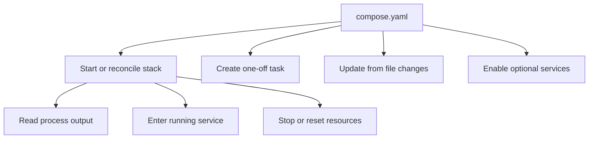

## Table of Contents

1. [Why Workflow Matters](#why-workflow-matters)
2. [The Mental Model](#the-mental-model)
3. [Starting the Stack](#starting-the-stack)
4. [Logs and Process Evidence](#logs-and-process-evidence)
5. [Exec and Run](#exec-and-run)
6. [Changing Code](#changing-code)
7. [Profiles](#profiles)
8. [Resetting Deliberately](#resetting-deliberately)
9. [Where Workflows Break](#where-workflows-break)
10. [Putting It All Together](#putting-it-all-together)
11. [What's Next](#whats-next)

## Why Workflow Matters

The Compose model is correct now. The API, database, network, port, volume, and health check are all in the file. A new teammate runs the stack and gets a working app. Then normal development starts.

They edit source and do not see the change. They run a migration command and accidentally start a second API-shaped container. They use `docker compose down -v` to clean up a port conflict and delete the local database. They add a debug UI to the Compose file, and now every developer starts it even when nobody needs it.

These are workflow problems. The model says what the application is. The workflow says how engineers interact with that model while code changes. Compose is useful when those interactions are deliberate instead of improvised.

## The Mental Model

Compose workflows fall into a few buckets:



The buckets matter because they touch different lifetimes. `up` reconciles the running stack with the model. `exec` enters a container that already exists. `run` creates a new one-off container from a service definition. Watch and bind mounts connect host edits to running services. Profiles decide which optional services are part of this run. Shutdown commands remove some resources and preserve others unless told otherwise.

Once you know which lifetime a command touches, Compose feels less surprising.

## Starting the Stack

`docker compose up` reads the model, builds images when needed, creates missing networks and volumes, creates or recreates service containers when configuration changes, starts the services, and attaches their logs in the foreground. With `--detach`, it leaves the containers running in the background.

The important behavior is reconciliation. Compose compares the running service containers with the model. If the service configuration or image changed after a container was created, `up` can recreate that service container while preserving mounted volumes. That is why a config edit often takes effect through another `up`.

This is also why `up` is usually the safest default for a local project. It keeps the graph together. Starting individual containers with plain `docker start` bypasses the model and can leave the project in a state the Compose file no longer explains.

Foreground `up` is good when you are reading the stack as it starts. Detached `up` is good when the stack is background infrastructure for your editor and tests. The model is the same; only the attachment changes.

## Logs and Process Evidence

Logs are how the running process tells you what happened from its own viewpoint. Compose can aggregate logs from the stack or focus on one service:

```bash
docker compose logs -f api
```

The command matters because service logs are tied to the role in the model. If the API exits because it cannot find `dist/server.js`, the log points at the image, command, or mount path. If it exits because it cannot connect to `localhost:5432`, the log points at environment and network viewpoint. If the database is still initializing, the log may explain why the health check has not passed.

Logs do not prove everything. A missing host port may never appear in the API logs because the request never reached the process. But logs are usually the first evidence after service state because they preserve what the process actually saw.

## Exec and Run

`exec` and `run` are easy to confuse because both can give you a shell or run a command using a service name. They touch different lifetimes.

`docker compose exec api sh` runs a command inside the already-running API service container. It is useful when you want the current process environment, current mounts, current network namespace, and current files. If the question is "what does the running API see," use `exec`.

`docker compose run --rm api npm test` creates a new one-off container from the API service definition, runs a different command, and removes that one-off container afterward. It is useful for migrations, tests, code generation, and scripts that should use the same image, environment, networks, and mounts as the service without replacing the long-running API process.

The distinction explains several surprises. A `run` container is new, so it may not share process-local state with the running service. By default, a `run` command does not publish the service's ports, which avoids collisions with the already-running service. A command passed to `run` overrides the service command for that one container. These are features when you expect them and confusing when you do not.

## Changing Code

There are three common ways source changes reach a Compose service.

The first is rebuild and recreate. Source is copied into the image during the Docker build. When source changes, the image must be rebuilt and the service container recreated. This is closest to a production-like container flow because the running container sees only what the image contains.

The second is a bind mount. The host project directory or a subdirectory is mounted into the container, so the running process sees host edits through the filesystem. This is common for development servers that reload themselves. It is also where mount hiding and ownership problems appear. Mounting the whole project at `/app` can hide files that were created during the image build.

The third is Compose Watch. With the `develop.watch` model, Compose can react to file changes by syncing files into a container, rebuilding the image, restarting the service, or combining sync with restart or execution depending on the action. Watch is useful when a bind mount is too broad or too slow, especially in larger projects.

Each approach answers a different question:

| Approach | Best when | Main gotcha |
| --- | --- | --- |
| Rebuild | You want image-like behavior | Edits do not appear until rebuild and recreate |
| Bind mount | A dev server can reload host files | Mounts can hide image files and expose ownership issues |
| Watch | You want targeted updates from file changes | Rules must match the files that actually drive the service |

The workflow should match the application. A Node API running a dev server might use a bind mount or watch sync. A compiled production-like API might rebuild. A database should usually use a named volume, not a source bind mount.

## Profiles

Profiles let one Compose file include optional services without starting every optional tool by default. A debug database UI, mail catcher, metrics stack, or seed-data tool can live in the model and only start when requested.

```yaml
services:
  api:
    build: .

  db:
    image: postgres:18

  db-admin:
    image: adminer
    profiles: ["debug"]
```

Without the `debug` profile, `api` and `db` can start as the normal stack. With the profile enabled, the optional admin tool joins the run.

The mechanism is simple but the design question is important. Profiles are best for tools that support a workflow without being part of the core application. If the API always needs Redis to start, Redis is probably not optional. If a UI helps inspect the database during one debugging session, a profile keeps it available without making it everyone's default stack.

## Resetting Deliberately

Shutdown commands are storage decisions in disguise.

`docker compose down` removes service containers and the project network. Named volumes remain by default. That is normal for everyday cleanup because local database state often needs to survive container replacement.

`docker compose down -v` also removes named volumes declared in the Compose file and anonymous volumes attached to containers. That is a reset. It is useful when the goal is a clean local database. It is destructive when the goal was only to stop the stack.

This is the workflow version of the storage article. Use the smallest reset that matches the problem. A port collision may need stale containers removed. A schema experiment may need the database volume removed. A source-change issue may need a rebuild. Treating every problem as `down -v` makes local state disposable by accident.

## Where Workflows Break

Workflow bugs usually come from using the right-looking command against the wrong lifetime.

If code edits do not appear, ask whether this service uses rebuild, bind mount, or watch. Rebuilding will not help if a bind mount hides the rebuilt files. Saving a host file will not help if the image-only workflow never mounts that path.

If a one-off command cannot reach the app through its published port, remember that `run` creates a new container and does not publish service ports by default. The command may need service-to-service networking instead of host-style access, or it may need `--service-ports` when the purpose is to expose that one-off container.

If a shell inspection shows different files from the running app, check whether you used `exec` or `run`. `exec` enters the existing service container. `run` creates a new one from the service definition. For "what is broken right now," `exec` is usually the right viewpoint.

If optional tools start for everyone, they may belong behind a profile. If required services are hidden behind a profile, the default stack will be incomplete.

If cleanup deletes too much, compare `down` with `down -v`. The extra flag is the difference between removing containers and removing declared state.

## Putting It All Together

The opening development problems were not separate Compose mysteries:

- Source changes need a chosen update path: rebuild, bind mount, or watch.
- Process inspection needs the running container viewpoint, so `exec` fits better than `run`.
- One-off tasks need fresh containers from the service definition, so `run --rm` fits better than changing the long-running service command.
- Optional tools should be behind profiles when they support a workflow but are not part of the normal stack.
- Local data resets should use `down -v` only when deleting volumes is the intended result.

Compose works best when the file and the workflow agree. The model says what the application is. The workflow says how developers change, inspect, and reset it without losing track of which Docker boundary they touched.

## What's Next

The Docker module now has all the main boundaries: images, runtime settings, networking, storage, Compose resources, and development workflows. The final article uses those boundaries as a debugging map so a vague report like "Docker is broken" can turn into specific evidence.

---

**References**

- [Docker Docs: docker compose up](https://docs.docker.com/reference/cli/docker/compose/up/) - Official reference for starting, recreating, and attaching to Compose service containers.
- [Docker Docs: docker compose exec](https://docs.docker.com/reference/cli/docker/compose/exec/) - Official reference for executing commands inside running Compose service containers.
- [Docker Docs: docker compose run](https://docs.docker.com/reference/cli/docker/compose/run/) - Official reference for one-off service containers and how they differ from running services.
- [Docker Docs: Use Compose Watch](https://docs.docker.com/compose/how-tos/file-watch/) - Official guide to updating services from file changes.
- [Docker Docs: Compose Develop Specification](https://docs.docker.com/reference/compose-file/develop/) - Official reference for the `develop.watch` model and watch actions.
- [Docker Docs: Using profiles with Compose](https://docs.docker.com/compose/how-tos/profiles/) - Official guide to optional services with Compose profiles.
- [Docker Docs: docker compose down](https://docs.docker.com/reference/cli/docker/compose/down/) - Official reference for removing containers, networks, and optionally volumes.
