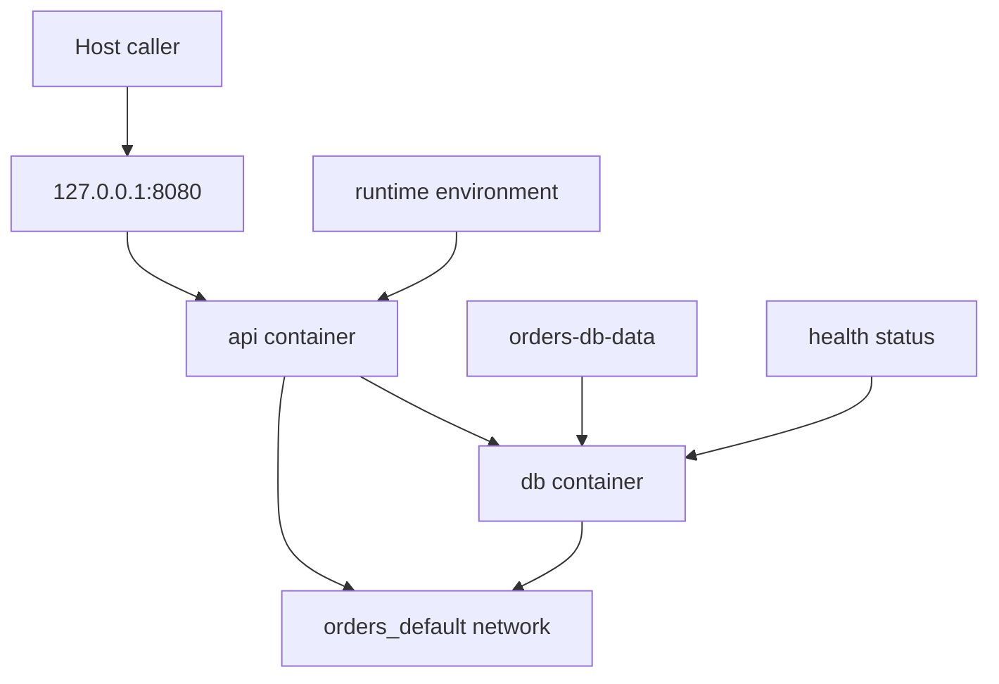

## Table of Contents

1. [Why Resources Matter](#why-resources-matter)
2. [The Mental Model](#the-mental-model)
3. [Service Containers](#service-containers)
4. [Networks and Names](#networks-and-names)
5. [Ports and Caller Viewpoint](#ports-and-caller-viewpoint)
6. [Volumes and State](#volumes-and-state)
7. [Environment and Secrets](#environment-and-secrets)
8. [Health and Readiness](#health-and-readiness)
9. [Where Resources Break](#where-resources-break)
10. [Putting It All Together](#putting-it-all-together)
11. [What's Next](#whats-next)

## Why Resources Matter

Compose resources are the Docker objects that make the application model real: service containers, bridge networks, published ports, volumes, environment values, and health states.

The orders Compose file looks correct. It has an `api` service and a `db` service. `docker compose up` creates both containers. The database says healthy. Then the browser cannot reach the API, or the API tries to connect to `localhost:5432`, or old rows appear after someone thought they had rebuilt everything from scratch.

Those failures are not Compose being random. They are resource boundaries showing through the model.

Compose does not create one blended application process. It creates containers, networks, volumes, labels, and port mappings. Each resource has a job. Each one also has limits. The service name works only on the right network. A published port helps host callers but not peer containers. A named volume survives container recreation. A health check reports whatever the check actually tests.

This article follows those resources because reading Compose well means knowing which resource owns each behavior.

## The Mental Model

The Compose model becomes a running stack by creating resources around service containers.

A resource is a Docker object with a specific job. A container runs a process, a network carries service-to-service traffic, a port rule accepts host traffic, a volume owns data, and a health state records whether a check passed.



The important detail is that every arrow has a viewpoint. The host calls the published port. The API calls the database through the service name on the project network. The database stores files in a volume mounted into its container path. Compose observes readiness through a health command that runs from inside the service container.

The same YAML file describes all of those edges, but the edges do different things.

## Service Containers

A service container is the current runtime instance of a Compose service role.


*A service is easiest to reason about when you separate process settings, network identity, and storage lifetime.*

Example: `api` is the role in the Compose file. `orders-api-1` is one container currently implementing that role. Compose may replace that container after a config change while the `api` role remains the same.

A service definition becomes container configuration. For a simple API, the service might say:

```yaml
services:
  api:
    build: .
    command: npm run dev
    environment:
      PORT: "3000"
      DATABASE_URL: postgres://orders:orders@db:5432/orders
```

`build` tells Compose how to produce the image. `command` overrides or supplies the command the container should run. `environment` passes runtime values into the process. The service is the stable role. The container is the current instance of that role.

This distinction matters when a config change happens. Compose can remove the old container and create a new one with the same service name. Connections to the old container may close. The new container can receive a different IP address. The role is still `api`, and peers should use the role name rather than a container IP.

Service definitions also inherit Dockerfile defaults unless the Compose file overrides them. If the image sets `WORKDIR /app` and `CMD ["node", "dist/server.js"]`, the service can use those defaults. If the Compose file sets `command: npm run dev`, that local development command is the command Docker runs for this service. Debugging starts with the service definition because it is where image defaults and runtime overrides meet.

## Networks and Names

A Compose network is the project-local bridge where service names become DNS names for peer containers.

Compose creates a default network for the project when no custom network is defined. Each service joins that network. Docker DNS registers service names on it, so a container in the project can resolve `api` or `db`.

That is why the API's database URL should usually look like this:

```text
postgres://orders:orders@db:5432/orders
```

The name `db` is not a global host name. It is a service name on the project network. Your laptop shell may not resolve it. A browser on the host should not use it. The API container can use it because it is attached to the same Compose network as the database.

The service name is also more stable than the container IP. Docker can assign a new IP whenever a service container is recreated. Existing connections to the old container may fail and need to reconnect. New lookups should use the service name again.

Custom networks are useful when the graph needs segmentation. A frontend service may attach to a `front-tier` network and a backend service may attach to a `back-tier` network, while the database attaches only to `back-tier`. That extra YAML earns its place when communication paths match the application design.

## Ports and Caller Viewpoint

Published ports are host entry points into a service container; they are not the path peer containers need on the Compose network.


*The same Compose stack has different addresses depending on whether the caller is on the host or inside the project network.*

Published ports are for callers outside the Compose network. This entry:

```yaml
services:
  api:
    ports:
      - "127.0.0.1:8080:3000"
```

means host callers use `127.0.0.1:8080`, and Docker forwards that traffic to port `3000` inside the API container. Peer containers do not need the host port. They use `api:3000` on the project network.

This is one of the most useful Compose debugging facts. If the browser cannot reach the API, inspect the published port and the process bind address. If the API cannot reach Postgres, the published host port is usually irrelevant. The API needs the database service name and container port.

Publishing a database port can be helpful for local GUI tools or migrations from the host. It is also an extra entry point. For everyday service-to-service traffic, keep the database private and let containers use `db:5432`.

## Volumes and State

A Compose volume is a declared state owner for data that should survive service container recreation.

Compose can declare named volumes at the top level and mount them into services:

```yaml
services:
  db:
    image: postgres:18
    volumes:
      - orders-db-data:/var/lib/postgresql/data

volumes:
  orders-db-data:
```

The service-level mount says where the database sees the files. The top-level declaration says this volume is part of the application model. When `docker compose up` creates the stack, Compose can create the volume if it does not already exist. If it already exists, Compose uses it.

That behavior is exactly what local databases need during normal development. Recreate the container, keep the data. It is also why rebuilds can feel stale. Rebuilding the image does not delete the named volume. Running `docker compose down` removes service containers and networks by default, but declared named volumes remain unless you ask Compose to remove them with `-v`.

Bind mounts belong to a different lifetime. A bind mount shows a host path inside the container, often for source-code development:

```yaml
services:
  api:
    volumes:
      - ./src:/app/src
```

That can make edits visible immediately, but it also carries the storage gotchas from the previous article. A mount can hide files that were baked into the image at the same destination path. Host ownership can leak into the container. Compose records the mount; it does not make those filesystem rules disappear.

## Environment and Secrets

Compose environment values are runtime inputs attached to a service container at creation time.

Example: `DATABASE_URL=postgres://orders:orders@db:5432/orders` only works from a container attached to the Compose network where `db` resolves. A host-side database URL might use a published port instead.

Environment values are runtime inputs. They tell the same image which database to use, which mode to start in, and which port the application should listen on.

```yaml
services:
  api:
    environment:
      NODE_ENV: development
      DATABASE_URL: postgres://orders:orders@db:5432/orders
```

The key is to read each value from inside the service's viewpoint. `DATABASE_URL` points at `db` because the API container is on the project network. A host-side URL for the same database might be `localhost:8001` if the database port is published. Those are both valid from different callers.

Sensitive values deserve care. Compose supports secrets as a distinct model concept, and Docker documentation treats secrets separately from ordinary configuration. For local development, teams often use `.env` files or environment interpolation. That is convenient, but it is easy to accidentally commit credentials or assume a variable exists because it is present in one shell. The repeatable model should make required runtime inputs visible without turning real secrets into source-controlled YAML.

## Health and Readiness

Compose readiness is only as strong as the health signal a service definition provides.

Startup order is easy to overread. Creating a database container before creating the API container does not prove the database is ready to accept connections.

The short form of `depends_on` controls service dependency order:

```yaml
depends_on:
  - db
```

The longer form can wait for a health check:

```yaml
depends_on:
  db:
    condition: service_healthy
```

That condition only has meaning if the database service defines a useful health check:

```yaml
services:
  db:
    image: postgres:18
    healthcheck:
      test: ["CMD-SHELL", "pg_isready -U orders -d orders"]
      interval: 5s
      timeout: 5s
      retries: 10
```

Now Compose has evidence that matches the API's need more closely. The database process exists and can answer a Postgres readiness check for the expected user and database. This still does not guarantee every future query will work. It does prevent the common race where "container created" is mistaken for "dependency ready."

Health checks should test the service contract the dependent actually needs. A port-open check may be enough for a simple TCP service. A database-aware check is better when the application needs a working database login.

## Where Resources Break

Most Compose failures become clear once you name the resource boundary.

If the API cannot reach Postgres at `localhost`, the environment value uses the wrong caller viewpoint. Inside the API container, `localhost` means the API container. The database service name is usually `db`.

If the browser cannot reach the API, read the published port. A service can be running correctly inside the project network with no host port at all. Also check that the API process listens on an address Docker-delivered traffic can reach, such as `0.0.0.0` inside the container rather than only loopback.

If data survives after rebuilds, the volume is doing its job. Recreate containers as often as you like; the named volume remains until deliberately removed.

If `depends_on` appears ineffective, check whether it is only expressing creation order or actually waiting on `service_healthy`. Then inspect whether the health check proves the dependency the application needs.

If a service name does not resolve, inspect network membership. Services on different networks cannot find each other by name unless they share a network or an explicit design connects them.

## Putting It All Together

The opening failures were resource questions:

- The browser needed a published host port and an API process listening inside the container.
- The API needed the database service name on the project network, not `localhost`.
- The database needed a named volume because its data should outlive one container.
- Startup needed a health signal instead of dependency creation order alone.
- Runtime configuration had to be read from the container's viewpoint.

Compose is useful because it puts those resource choices in one file. It is still Docker underneath. The model becomes reliable when you can point at the resource that owns each behavior.

## What's Next

The next article turns the model into a daily development loop. Compose can start the stack, rebuild services, run one-off commands, enter running containers, activate optional tools with profiles, and update containers when files change. The trick is knowing which workflow changes the model and which one only pokes at a running service.


*The resource summary organizes Compose around role, network, port, volume, runtime input, and readiness.*

---

**References**

- [Docker Docs: Networking in Compose](https://docs.docker.com/compose/how-tos/networking/) - Official guide to default networks, service discovery, project names, and host versus container ports.
- [Docker Docs: Define and manage volumes in Docker Compose](https://docs.docker.com/reference/compose-file/volumes/) - Official reference for top-level Compose volumes and service access to them.
- [Docker Docs: Define services in Docker Compose](https://docs.docker.com/reference/compose-file/services/) - Official reference for service attributes including `command`, `environment`, `healthcheck`, `networks`, and `volumes`.
- [Docker Docs: Control startup and shutdown order in Compose](https://docs.docker.com/compose/how-tos/startup-order/) - Official guidance on `depends_on`, dependency order, and health-dependent startup.
