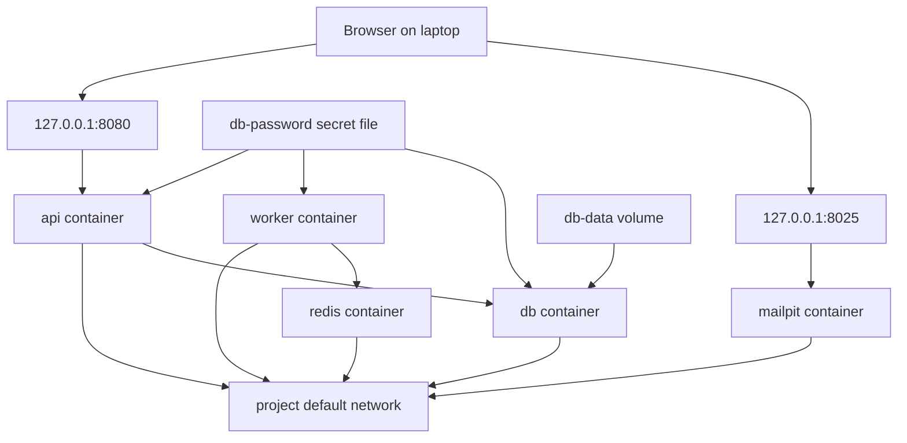

## Table of Contents

1. [The Same App at Runtime](#the-same-app-at-runtime)
2. [Service Containers](#service-containers)
3. [Networks and Service Names](#networks-and-service-names)
4. [Ports and Caller Viewpoint](#ports-and-caller-viewpoint)
5. [Volumes and State](#volumes-and-state)
6. [Bind Mounts and Host Files](#bind-mounts-and-host-files)
7. [Environment, Env Files, and Secrets](#environment-env-files-and-secrets)
8. [Health Checks and Dependency Conditions](#health-checks-and-dependency-conditions)
9. [A Resource Debugging Routine](#a-resource-debugging-routine)
10. [Putting It All Together](#putting-it-all-together)
11. [What's Next](#whats-next)

## The Same App at Runtime
<!-- section-summary: The Compose model becomes real through Docker resources, and each resource owns a different part of the running behavior. -->

In the first article, we treated Compose as the shared application map for the notes app. Now the team has a `compose.yaml` file with `api`, `worker`, `db`, `redis`, and `mailpit`, and everyone can run the same local stack.

The next set of bugs usually comes from the resource layer. The browser cannot reach the API, the API cannot connect to Postgres, old rows appear after a rebuild, or a secret value shows up in the wrong container.

Those problems feel random until we separate the resources. A **container** runs a process, a **network** gives services a private place to find each other, a **published port** lets the host reach one container port, a **volume** stores data beyond one container lifetime, an **environment value** configures a process, a **secret** gives a service sensitive data as a mounted file, and a **health check** reports a readiness signal.

Here is the runtime shape we are about to follow. The diagram keeps the resources separate so each later section has a clear owner.



Each arrow has a different owner. Compose records all of them in one file, and Docker implements them as different resources with different lifetimes and debugging commands.

## Service Containers
<!-- section-summary: A service definition creates the container settings for one stable role, while Docker may replace the actual container instance over time. -->

A **service container** is the current runtime instance of a Compose service. The service is the role in the file, and the container is the running process with a filesystem, network namespace, environment, mounts, and logs.

For the notes app, `api` is the stable service. Docker might create `notes-dev-api-1` today, remove it after the image changes, and create another `notes-dev-api-1` or a differently numbered instance later, while the Compose service remains `api`.

```yaml
services:
  api:
    build:
      context: .
      target: dev
    command: npm run dev
    working_dir: /workspace
    environment:
      PORT: "3000"
      DATABASE_URL: postgres://notes:notes_dev_password@db:5432/notes
```

The service definition collects process settings. `build` describes how Compose gets the image, `command` describes the process to run, `working_dir` sets the directory for that process, and `environment` passes runtime values into it.

This matters during debugging. If the API exits immediately, the first question is usually about the service container: which image did it use, which command did it run, which environment did it receive, and which files did it see at startup.

`docker compose ps` gives a quick service-level view. It is usually the first command people run after startup because it summarizes the project state.

```bash
docker compose ps
```

A healthy-looking table still leaves room for process bugs. The next resource to check depends on the symptom: logs for process output, networks for service discovery, ports for host access, volumes for state, and health checks for readiness.

## Networks and Service Names
<!-- section-summary: Compose networking gives services a private DNS space where service names such as db and redis become the normal addresses. -->

A **Compose network** is the private network Docker creates for service-to-service traffic. When a project uses the default network, each service joins that network and Docker's internal DNS lets containers resolve other services by service name.

That is why the API uses `db` in its database URL. The value describes the private service address from the API container's viewpoint.

```yaml
services:
  api:
    environment:
      DATABASE_URL: postgres://notes:notes_dev_password@db:5432/notes
      REDIS_URL: redis://redis:6379
```

Inside the `api` container, `db` resolves to the database service on the project network. Inside the same container, `localhost` points back to the API container itself, so a database URL with `localhost:5432` sends the API to its own network namespace.

The service name also survives container replacement. Docker can give the next database container a different IP address after recreation, so application code should reconnect through `db` rather than storing a container IP.

Custom networks help when the app has real traffic boundaries. A public web gateway might attach to `front-tier`, while the API, worker, database, and Redis attach to `back-tier`, and the database stays reachable only from services on `back-tier`.

```yaml
services:
  web:
    image: nginx:1.29
    networks:
      - front-tier

  api:
    build: .
    networks:
      - front-tier
      - back-tier

  db:
    image: postgres:18
    networks:
      - back-tier

networks:
  front-tier:
  back-tier:
```

That extra structure helps when the network shape matches the application shape. Most small local stacks use the default network happily, and larger stacks add named networks when they need more specific communication paths.

## Ports and Caller Viewpoint
<!-- section-summary: Published ports are for callers on the host, while service names are for callers inside the Compose network. -->

A **published port** maps a host address and host port to a container port. In the notes app, the API listens on port `3000` inside the container, and Compose publishes it to `127.0.0.1:8080` on the laptop.

```yaml
services:
  api:
    ports:
      - "127.0.0.1:8080:3000"
```

The left side belongs to the host, and the right side belongs to the container. A browser on the laptop uses `http://127.0.0.1:8080`, while another service in the Compose project uses `http://api:3000`.

This caller viewpoint solves many port bugs. The worker container should call `api:3000` if it needs the API over the private network. The browser should call `127.0.0.1:8080` because the browser runs on the host, outside the project network.

Binding to `127.0.0.1` also narrows local exposure. A port mapping like `"8080:3000"` may listen on all host interfaces depending on Docker and host settings, while `"127.0.0.1:8080:3000"` keeps the development API on the loopback interface.

Compose also has `expose`, which declares container ports for service-to-service communication and avoids publishing them to the host. Many teams skip `expose` because services can still communicate over the project network when the app listens on the right port, so its main value is documenting intended internal ports.

```yaml
services:
  redis:
    image: redis:8
    expose:
      - "6379"
```

The practical rule is simple enough for daily work. Host callers use published ports, service containers use service names and container ports, and the Compose file should make those two paths visible.

## Volumes and State
<!-- section-summary: Volumes store data through a Docker-managed lifetime, so important files can survive ordinary container replacement. -->

A **volume** is Docker-managed storage that containers can mount. Compose uses volumes when a service needs data to survive beyond the current container, such as PostgreSQL data files, uploaded test files, or a package cache.

The notes database uses a named volume. The volume name appears in the service mount and in the top-level volume list.

```yaml
services:
  db:
    image: postgres:18
    volumes:
      - db-data:/var/lib/postgresql/data

volumes:
  db-data:
```

The left side, `db-data`, is the volume name in the Compose model. The right side, `/var/lib/postgresql/data`, is the path inside the database container where Postgres stores its files.

This setup gives local development a useful lifetime. Compose can replace the `db` container after an image update, and the database files can remain in the named volume so the developer keeps local rows, migrated schema, and seed data.

The same behavior can surprise people during resets. Rebuilding images and recreating containers affects the container lifetime, while the named volume carries a separate data lifetime. The workflow article will cover the exact commands for resetting the stack while preserving or removing that data intentionally.

In production-style local testing, named volumes give the closest feel to a real database volume. The data lives outside the disposable container process, which matches the way databases usually run with durable storage in real environments.

## Bind Mounts and Host Files
<!-- section-summary: Bind mounts connect a host path into a container, which makes them useful for source code and risky for accidental path hiding. -->

A **bind mount** mounts a file or directory from the host machine into a container. The container reads and writes the host path directly, so source-code edits in your editor can appear inside the running service almost immediately.

For the notes API, a development Compose file might mount the project into `/workspace`. The service process can then read the same source files the developer edits on the host.

```yaml
services:
  api:
    build:
      context: .
      target: dev
    working_dir: /workspace
    volumes:
      - .:/workspace
    command: npm run dev
```

That is great for a development server that reloads on file changes. The editor changes files on the host, the container sees those changed files through the mount, and the development process can reload without a full image rebuild.

Bind mounts also have a sharp edge called mount hiding. If the image build created files under `/workspace`, mounting the host project over `/workspace` makes the container see the host directory at that path instead of the files baked into the image at the same path.

A common Node.js pattern separates source code from dependency folders so the host mount avoids accidentally replacing container-installed dependencies. The source stays on the host, while `node_modules` stays in a Docker-managed volume.

```yaml
services:
  api:
    volumes:
      - .:/workspace
      - api-node-modules:/workspace/node_modules

volumes:
  api-node-modules:
```

This pattern gives the source code a host lifetime and the dependency folder a Docker volume lifetime. It also explains why bind mounts belong in development-focused Compose files more often than production deployment files.

## Environment, Env Files, and Secrets
<!-- section-summary: Environment values configure processes, env files organize repeated values, and secrets mount sensitive values only into services that request them. -->

An **environment variable** is a key-value setting passed into a process. In Compose, the `environment` section sets values inside the service container, so the application can read values like `DATABASE_URL`, `REDIS_URL`, and `SMTP_HOST`.

```yaml
services:
  api:
    environment:
      DATABASE_URL: postgres://notes:notes_dev_password@db:5432/notes
      REDIS_URL: redis://redis:6379
      SMTP_HOST: mailpit
      SMTP_PORT: "1025"
```

A `.env` file near `compose.yaml` has a different job. Compose uses it for variable interpolation in the Compose file, so a team can centralize values such as image tags, host ports, and development usernames.

```bash
NOTES_API_PORT=8080
POSTGRES_PASSWORD=notes_dev_password
```

```yaml
services:
  api:
    ports:
      - "127.0.0.1:${NOTES_API_PORT}:3000"
    environment:
      DATABASE_URL: postgres://notes:${POSTGRES_PASSWORD}@db:5432/notes
```

The `env_file` attribute loads variables into a container environment from one or more files. Teams use it when a service needs many ordinary configuration values and the main Compose file would become noisy.

```yaml
services:
  api:
    env_file:
      - ./config/api.env
```

For sensitive values, Compose also supports **secrets**. A secret is sensitive data such as a password, certificate, token, or API key, and Compose mounts secrets as files under `/run/secrets/<secret_name>` for services that explicitly request them.

```yaml
services:
  api:
    secrets:
      - db-password
    environment:
      DATABASE_PASSWORD_FILE: /run/secrets/db-password

  db:
    image: postgres:18
    secrets:
      - db-password
    environment:
      POSTGRES_PASSWORD_FILE: /run/secrets/db-password

secrets:
  db-password:
    file: ./secrets/db-password.txt
```

Some Docker Official Images, including database images, support `_FILE` environment variable conventions for reading passwords from mounted secret files. Application code can follow the same idea by reading a password file path from an environment variable and then loading the file contents at startup.

## Health Checks and Dependency Conditions
<!-- section-summary: Health checks run inside a service container, and dependency conditions can use those checks during startup. -->

A **health check** is a command Docker runs for a container to decide whether the service reports healthy, unhealthy, or still starting. Compose can define or override this check in the service definition.

For PostgreSQL, the check should test the database from inside the database container. The official image includes `pg_isready`, which gives a direct readiness check for this local stack.

```yaml
services:
  db:
    image: postgres:18
    environment:
      POSTGRES_DB: notes
      POSTGRES_USER: notes
      POSTGRES_PASSWORD: notes_dev_password
    healthcheck:
      test: ["CMD-SHELL", "pg_isready -U $${POSTGRES_USER} -d $${POSTGRES_DB}"]
      interval: 10s
      timeout: 5s
      retries: 5
      start_period: 30s
```

The command returns success when Postgres accepts the check. Docker records that status, and `docker compose ps` can show whether the service is healthy.

`depends_on` can use that health status during startup. The dependent service can then wait for a condition that matches the database check.

```yaml
services:
  api:
    depends_on:
      db:
        condition: service_healthy
      redis:
        condition: service_started
```

This helps the API avoid a common local race where the database process has started while the database still needs time to initialize. The API should still include connection retries, since health checks and startup order only cover one slice of the runtime lifecycle.

In real teams, health checks work best when they test the thing the dependent service truly needs. A web API health check might call a local `/healthz` endpoint, while a database health check might use the database client tool supplied by the image.

## A Resource Debugging Routine
<!-- section-summary: Compose debugging works best when the symptom points to the resource that owns the behavior. -->

When the notes stack fails, a calm debugging routine keeps everyone from changing random YAML. The symptom usually tells you which resource deserves the first look.

For a Compose file that feels wrong, `docker compose config` shows the resolved model. It expands short syntax, merges Compose files supplied with `-f`, and resolves variables, so you can confirm the values Compose will actually apply.

```bash
docker compose config
```

For a service that exits or restarts, logs show the process viewpoint. The API log might show a missing file, a bad command, a failed database connection, or a port that the application tried to bind inside the container.

```bash
docker compose logs -f api
```

For a network problem, an engineer can enter the running container and test the service name from that viewpoint. The exact tool depends on the image, and the important part is that the command runs inside the container that has the problem.

```bash
docker compose exec api sh
```

For state problems, list volumes and inspect the mount path in the service definition. Old database rows after a rebuild usually point at a volume lifetime, while missing source files usually point at a bind mount path.

For readiness problems, check the service health column and then read the health-check command. A green status means the check passed, and it only proves what that command tested.

## Putting It All Together
<!-- section-summary: Services, networks, ports, volumes, environment, secrets, and health checks each own one part of the app's behavior. -->

The notes app now has a cleaner runtime story. `api` and `worker` are service containers, `db` and `redis` are private service names on the project network, `127.0.0.1:8080` and `127.0.0.1:8025` are host entry points, and `db-data` owns the database files.

Environment values give each process addresses and ordinary settings. Secrets mount sensitive values as files into only the services that ask for them, and health checks provide a readiness signal that startup dependencies can use.

When something fails, Compose gives you a resource map with a clear owner for each symptom. Host access belongs to published ports, service-to-service access belongs to networks and DNS names, process behavior belongs to the service container, persistent data belongs to volumes, and readiness belongs to health checks.

## What's Next

Now that the resources are visible, the last Compose piece is daily work. Developers need to start the stack, read logs, run migrations, update code, use optional tools, and reset local state without deleting the wrong thing.

The next article follows those workflows with the same notes app. It will connect `up`, `logs`, `exec`, `run`, Watch, profiles, and reset commands to the resource lifetimes we just separated.

---

**References**

- [Define services in Docker Compose](https://docs.docker.com/reference/compose-file/services/) - Documents service definitions, `ports`, `expose`, `environment`, `env_file`, `healthcheck`, and `depends_on`.
- [Networking in Compose](https://docs.docker.com/compose/how-tos/networking/) - Explains the default project network, service-name discovery, and container replacement behavior.
- [Define and manage networks in Docker Compose](https://docs.docker.com/reference/compose-file/networks/) - Documents top-level networks and custom network configuration.
- [Publishing and exposing ports](https://docs.docker.com/get-started/docker-concepts/running-containers/publishing-ports/) - Explains publishing container ports with Docker and Docker Compose.
- [Port publishing and mapping](https://docs.docker.com/engine/network/port-publishing/) - Documents how Docker maps published container ports to host IP addresses and ports.
- [Define and manage volumes in Docker Compose](https://docs.docker.com/reference/compose-file/volumes/) - Documents top-level Compose volumes and named volume reuse across services.
- [Volumes](https://docs.docker.com/engine/storage/volumes/) - Explains Docker-managed volumes and common uses for persistent container data.
- [Bind mounts](https://docs.docker.com/engine/storage/bind-mounts/) - Explains host-path mounts and the difference between bind mounts and Docker-managed volumes.
- [Set environment variables within your container's environment](https://docs.docker.com/compose/how-tos/environment-variables/set-environment-variables/) - Documents `environment`, `env_file`, and command-line environment overrides.
- [Set, use, and manage variables in a Compose file with interpolation](https://docs.docker.com/compose/how-tos/environment-variables/variable-interpolation/) - Explains `.env` files and variable interpolation for Compose models.
- [Manage secrets securely in Docker Compose](https://docs.docker.com/compose/how-tos/use-secrets/) - Documents Compose secrets, per-service access, and `/run/secrets/<name>` mounts.
- [Control startup and shutdown order in Compose](https://docs.docker.com/compose/how-tos/startup-order/) - Documents dependency order, `depends_on`, and health-check-based startup conditions.
- [docker compose config](https://docs.docker.com/reference/cli/docker/compose/config/) - Documents rendering the resolved Compose model for inspection and debugging.
