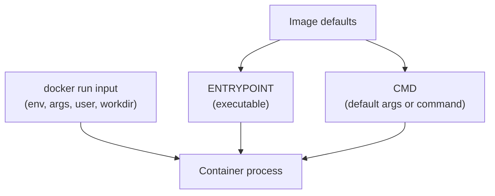

## Table of Contents

1. [Why Startup Defaults Matter](#why-startup-defaults-matter)
2. [The Mental Model](#the-mental-model)
3. [CMD](#cmd)
4. [ENTRYPOINT](#entrypoint)
5. [Runtime Arguments](#runtime-arguments)
6. [Environment](#environment)
7. [Working Directory and User](#working-directory-and-user)
8. [Where Startup Breaks](#where-startup-breaks)
9. [Putting It All Together](#putting-it-all-together)
10. [What's Next](#whats-next)

## Why Startup Defaults Matter

Startup defaults are the image metadata and runtime overrides Docker resolves into the one command that becomes the container's main process.

The orders API image looks simple. It contains application files and a default command. Then three runs behave differently:

```bash
docker run devpolaris/orders-api:local
docker run devpolaris/orders-api:local npm test
docker run --entrypoint sh devpolaris/orders-api:local
```

The first starts the API. The second might run tests. The third opens a shell. No rebuild happened between those commands. Docker changed the process it started by combining image defaults with runtime input.

This is where many Docker mistakes begin. A developer thinks they changed the image, but they only overrode the command for one container. Another developer passes a new argument and accidentally appends it to an entrypoint. Someone bakes a staging database URL into the image because it made a local run pass. The container starts, but the repeatable startup path is now blurred.

## The Mental Model

A Docker image can carry startup defaults. A container run can override some of them. Docker resolves those pieces into one process.

Example: an image might define `ENTRYPOINT ["node"]` and `CMD ["dist/server.js"]`. Running the image plainly starts the server, while running it with `--version` passes that argument to Node instead of replacing the executable.



The clean rule is to put stable behavior in the image and environment-specific behavior in runtime configuration. The image should know how to start the application. The container run should say which environment it is running in, which database it should use, which port is published, and which user or working directory needs an override.

## CMD

`CMD` is the image's default command or default argument list for a container run.

`CMD` provides the default command for a container. A Node API image might end with:

```dockerfile
CMD ["node", "dist/server.js"]
```

When you run the image without an extra command, Docker uses that default:

```bash
docker run devpolaris/orders-api:local
```

If you add a command after the image name, Docker uses the new command instead:

```bash
docker run --rm devpolaris/orders-api:local node --version
```

That override is useful for one-off checks, migrations, tests, and troubleshooting. It is also temporary. The image still has the original `CMD`. Another container created without the override will start the API again.

Only one `CMD` takes effect in a Dockerfile. If a Dockerfile has several, the last one wins. That is not a merge. It is replacement, which is why hidden base-image defaults can surprise you when your final stage does not set the command you expected.

## ENTRYPOINT

`ENTRYPOINT` is the image's configured executable, with `CMD` often acting as its default arguments.


*Startup behavior becomes clearer when you trace image defaults, runtime overrides, and the final process command separately.*

`ENTRYPOINT` describes the executable Docker should treat as the container's main program. `CMD` can then provide default arguments to that executable.

For a purpose-built CLI image, that can be useful:

```dockerfile
ENTRYPOINT ["terraform"]
CMD ["--help"]
```

Now this run:

```bash
docker run hashicorp/terraform -version
```

passes `-version` to the `terraform` entrypoint. The image exposes the Terraform binary as its command interface. That is a good fit for tool images.

For web applications, `ENTRYPOINT` is often a small wrapper script that prepares the environment and then uses `exec` to replace itself with the real server process. The `exec` detail matters because the final server should receive signals as PID 1. If a shell wrapper starts the server as a child and never forwards signals, `docker stop` can become slow or messy.

You can override the entrypoint when you need to bypass it:

```bash
docker run --rm --entrypoint sh devpolaris/orders-api:local
```

That creates a new container whose main command is `sh`. It is not a change to the image.

## Runtime Arguments

Runtime arguments are the words after the image name, and Docker interprets them differently depending on whether the image uses `CMD`, `ENTRYPOINT`, or both.

The practical starting point is to ask whether the image exposes a default command or a fixed executable. The same words after the image name can replace the command in one image and become arguments in another.

The exact interaction depends on whether the image has only `CMD` or both `ENTRYPOINT` and `CMD`.

| Image defaults | Runtime command after image | Result |
| --- | --- | --- |
| `CMD ["node", "dist/server.js"]` | `node --version` | Replaces `CMD` |
| `ENTRYPOINT ["node"]` and `CMD ["dist/server.js"]` | `--version` | Appends as arguments to `ENTRYPOINT` |
| `ENTRYPOINT ["./start.sh"]` | `npm test` | Passes arguments to entrypoint unless entrypoint is overridden |

This is why a command that looks obvious can behave strangely. If the image has an entrypoint, the words after the image name are often arguments, not a full command replacement. When you want a completely different executable, use `--entrypoint`.

The best images make the normal case boring. A web service image should start the service when run plainly. A tool image should behave like the tool. Special commands should be explicit enough that the next person can see whether they are replacing the command or passing arguments.

## Environment

Environment variables are container-start inputs that configure one run without changing the image artifact.

Example: the same `orders-api:local` image can run against a local database with `DATABASE_URL=postgres://orders:orders@db:5432/orders` or against a staging database with a different value. The image stays the same; the container run changes.

Environment variables are runtime input. They let the same image run in different places:

```bash
docker run \
  -e NODE_ENV=development \
  -e DATABASE_URL=postgres://orders:orders@db:5432/orders \
  devpolaris/orders-api:local
```

Those values are part of the container configuration. They do not rebuild the image. They also are not a perfect secret boundary. Environment values can appear in shell history, Compose files, process inspection, application logs, and Docker metadata. They are convenient for local configuration and many platform integrations, but sensitive production secrets need deliberate handling.

There is also a timing boundary. `ARG` in a Dockerfile is build-time input. `ENV` in an image creates an image default. `docker run -e` sets or overrides a value for the container. If changing a value should not require rebuilding the image, it belongs at runtime.

## Working Directory and User

Working directory and user settings define the process's filesystem starting point and Linux identity inside the container.


*The command runs inside a runtime envelope, so environment, directory, and UID can change the same binary behavior.*

The image can define a working directory and user:

```dockerfile
WORKDIR /app
USER node
CMD ["node", "dist/server.js"]
```

The working directory decides where relative paths are resolved. The user decides which numeric uid and gid run the process. Both can be overridden at runtime:

```bash
docker run --workdir /app/scripts --user 1000:1000 devpolaris/orders-api:local node seed.js
```

These settings are not decorative. A wrong working directory can make a relative script path fail even though the file exists. A wrong user can make a mounted directory unwritable. A process running as root can create root-owned files in a bind mount and make the host editor unhappy. The runtime-boundaries article on users and limits goes deeper into that.

## Where Startup Breaks

Startup breaks when the command source is unclear. A container exits with `file not found`, but the missing file is not missing from the image. The container was started with a different working directory or a bind mount hid the path.

It breaks when arguments are passed to an entrypoint by accident. The user expected `npm test` to replace the server command, but the image's entrypoint treated `npm` and `test` as arguments to something else.

It breaks when environment values are put in the wrong layer. A value baked into the image works on one laptop and fails in CI. A value changed inside an `exec` shell makes one running container work and leaves the repeatable run command broken.

It breaks when wrapper scripts do not hand off signals. The app appears to stop only after Docker's grace period because PID 1 is a shell that never forwards the termination signal cleanly.

## Putting It All Together

The startup path has a clear order:

- The image supplies stable defaults: filesystem, `WORKDIR`, `USER`, `ENTRYPOINT`, and `CMD`.
- The run command supplies environment-specific input and optional overrides.
- Extra words after the image replace `CMD` or become entrypoint arguments, depending on the image.
- `--entrypoint` is the explicit escape hatch for a different executable.
- Environment values belong to the container run when they change per environment.

The safest Docker images are predictable. Run them plainly and they do the main job. Override them deliberately and the change is visible in the command that created the container.

## What's Next

The next article covers health checks and restart policies. Once Docker knows how to start a process, the next question is how it decides whether that process is useful and what to do when it exits.


*The startup summary keeps the four practical levers together: command, environment, directory, and user.*

---

**References**

- [Docker Docs: Dockerfile reference](https://docs.docker.com/reference/dockerfile/) - Official reference for `CMD`, `ENTRYPOINT`, `ENV`, `WORKDIR`, `USER`, and health check instructions.
- [Docker Docs: Running containers](https://docs.docker.com/engine/containers/run/) - Official guide to overriding image defaults and supplying runtime options with `docker run`.
- [Docker Docs: docker container run](https://docs.docker.com/reference/cli/docker/container/run/) - CLI reference for command overrides, environment flags, users, working directories, and entrypoints.
