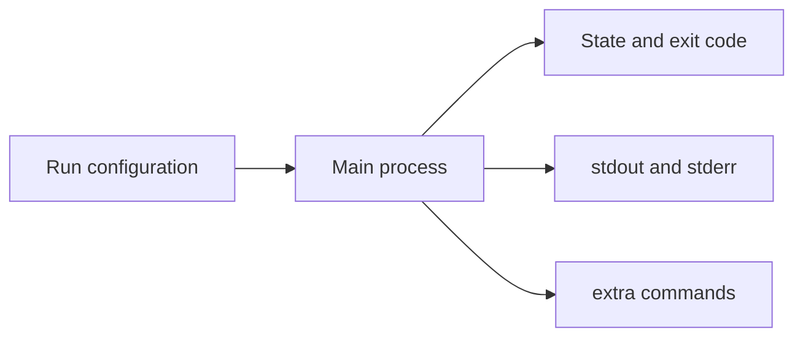

## Table of Contents

1. [Why Evidence Matters](#why-evidence-matters)
2. [The Mental Model](#the-mental-model)
3. [State Comes First](#state-comes-first)
4. [Logs Are Process Output](#logs-are-process-output)
5. [Inspect Shows Configuration](#inspect-shows-configuration)
6. [Exec Enters a Running Container](#exec-enters-a-running-container)
7. [A Small Walkthrough](#a-small-walkthrough)
8. [Where Inspection Breaks](#where-inspection-breaks)
9. [Putting It All Together](#putting-it-all-together)
10. [What's Next](#whats-next)

## Why Evidence Matters

The orders API container exited after startup. Someone immediately tries:

```bash
docker exec -it orders-api sh
```

Docker replies that the container is not running. That sounds like a second failure, but it is actually useful evidence. `exec` can only run a process inside a container that already has a running main process. If the main process exited, the door for `exec` is closed.

The better path is to read what Docker already knows. A container leaves behind state, exit code, logs, configuration, and sometimes a writable layer. Those pieces tell you whether the process failed to start, started and crashed, is healthy but unreachable, or is still running with the wrong settings.

## The Mental Model

Think of a container as a process with a case file. Docker starts the process, watches it, and records evidence around it.



State tells you whether the process is alive. Logs tell you what the process wrote. Configuration tells you what Docker passed to it. `exec` gives you a live viewpoint from inside the same container, but only while the main process is running.

## State Comes First

`docker ps` shows running containers. `docker ps -a` includes stopped containers too:

```text
CONTAINER ID   IMAGE                         COMMAND                  STATUS                      NAMES
9f7a8c2d4d1a   devpolaris/orders-api:local   "node dist/server.js"    Up 30 seconds               orders-api
7e52bfbf8ef2   devpolaris/orders-api:local   "node dist/server.js"    Exited (1) 2 minutes ago    orders-api-bad
```

That `STATUS` column decides the next move. If the container is `Up`, you can inspect live behavior and use `exec`. If it is `Exited`, the main process is gone, so logs and inspect output come before shell access.

The exit code is part of the story. Exit code `0` usually means the command completed successfully. That is normal for a one-off command and wrong for a web server that should stay alive. A non-zero code means the process reported failure. Docker did not decide why. The application, shell, or binary did.

## Logs Are Process Output

Docker logs come from the container's standard output and standard error streams:

```bash
docker logs orders-api
docker logs --tail 50 orders-api
docker logs -f orders-api
```

That is why well-behaved containerized applications write useful startup and error information to stdout and stderr. A log file hidden inside `/var/log/app.log` may be familiar on a VM, but Docker will not automatically surface it through `docker logs`.

A short log can prove exactly where startup stopped:

```text
Booting orders API
DATABASE_URL is not set
```

The important detail is not the command itself. It is the layer that produced the message. Docker created the container and started the process. The application then rejected its runtime environment. Rebuilding the image will not fix that unless the image is supposed to include a different default.

## Inspect Shows Configuration

`docker inspect` returns the container metadata Docker used and recorded. It is long because a container crosses many boundaries: image, command, environment, mounts, network, ports, health, and restart policy.

You rarely need to read every field. The useful habit is to ask which boundary you are testing. If startup failed because an environment variable is missing, inspect environment. If the browser cannot reach the service, inspect port bindings and network settings. If files are missing, inspect mounts.

Example fields often worth checking:

```json
{
  "Config": {
    "Cmd": ["node", "dist/server.js"],
    "Env": ["NODE_ENV=development"]
  },
  "State": {
    "Status": "exited",
    "ExitCode": 1
  },
  "HostConfig": {
    "PortBindings": {
      "3000/tcp": [{"HostIp": "127.0.0.1", "HostPort": "8080"}]
    }
  }
}
```

This output connects the same pieces you saw separately. Docker started `node dist/server.js`, passed one environment value, recorded exit code 1, and had a host port mapping configured. If the process exited before it listened, the port mapping is not the first problem.

## Exec Enters a Running Container

`docker exec` runs an additional command inside an existing running container:

```bash
docker exec -it orders-api sh
```

That shell shares the container's filesystem view, environment, network namespace, and process namespace. It is useful when you need to see from the service's point of view: which files are present, which environment variables exist, which DNS names resolve, and which ports are reachable from inside.

`exec` does not change the image. It also does not recreate the container. If you install a package or edit a file inside an exec shell, the change belongs to that container's writable layer. It may help you prove a cause, but it is not a repeatable fix. Put the real fix into the Dockerfile, Compose file, run command, or application config.

There is also a security angle. A shell inside a container has the permissions of the command you start and the isolation boundaries of that container. It is a debugging tool, not a guarantee that changes are harmless.

## A Small Walkthrough

Suppose the API is unreachable. Start with state:

```bash
docker ps -a --filter name=orders-api
```

If the output says `Exited (1)`, read logs:

```bash
docker logs orders-api
```

The logs say:

```text
Error: connect ECONNREFUSED 127.0.0.1:5432
```

Now the problem has a shape. The API tried to reach a database at `127.0.0.1` from inside the API container. That address points back to the API container itself, not to a database container. You can confirm the runtime setting:

```bash
docker inspect orders-api
```

Look for the environment field that supplied `DATABASE_URL`. The fix belongs in runtime configuration: use the database service name on the shared Docker network, not container-local loopback.

If the container is still `Up`, `exec` can prove the same point from inside:

```bash
docker exec orders-api sh -lc "getent hosts db && nc -vz db 5432"
```

The shell command is not the lesson. The lesson is that every inspection step follows the boundary exposed by the previous evidence.

## Where Inspection Breaks

Inspection breaks when you ask the right tool at the wrong time. `exec` is useless after the main process exits. Logs are sparse when the application writes only to a file or a remote logging driver hides local output. `inspect` is noisy when you do not know which field matters.

Another trap is changing evidence while reading it. Recreating the container may remove the old writable layer and replace the logs you needed. `docker rm -f` is fine for disposable local retries after you understand the failure. It is a poor first move when the stopped container is still the best record of what happened.

Finally, `exec` can create false confidence. You can fix a file by hand inside a running container and watch the app recover, but the next container will not have that edit unless the source of truth changed. Use shell access to learn, then move the fix to repeatable configuration.

## Putting It All Together

The failed shell attempt at the start was not the main clue. The main clue was that the container had exited. From there, the evidence path is:

- Read state before trying to enter the container.
- Read logs as output from the main process.
- Read inspect output as the configuration Docker gave that process.
- Use `exec` only when the container is running and you need the container's viewpoint.
- Treat manual edits inside `exec` as experiments, not durable fixes.

Docker already records a lot of the story. Good debugging means reading it in the order the container experienced it.

## What's Next

State and logs tell you what happened. The next article explains how Docker decides what command to run in the first place, how runtime arguments interact with image defaults, and why environment values belong at container start.

---

**References**

- [Docker Docs: View container logs](https://docs.docker.com/engine/logging/) - Official explanation of how `docker logs` reads stdout and stderr from a container's endpoint command.
- [Docker Docs: docker container exec](https://docs.docker.com/reference/cli/docker/container/exec/) - CLI reference for running commands inside a running container.
- [Docker Docs: docker container inspect](https://docs.docker.com/reference/cli/docker/container/inspect/) - CLI reference for reading low-level container metadata.
