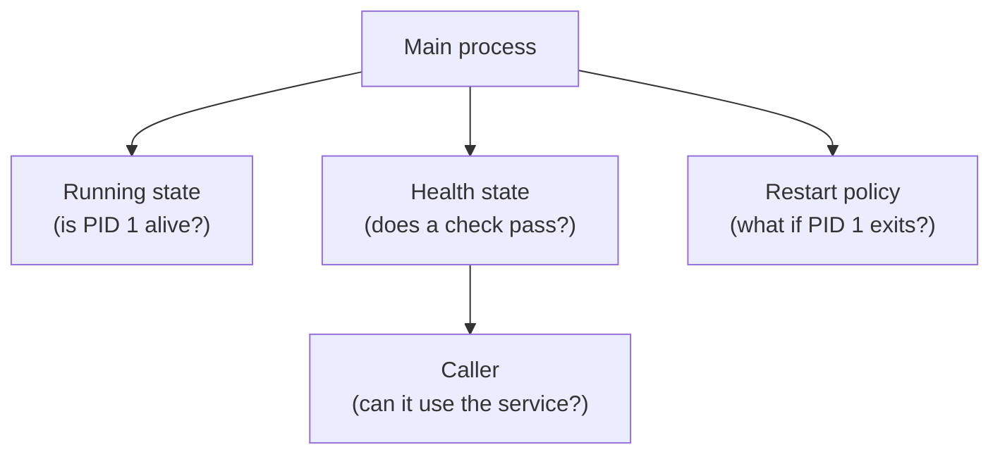

## Table of Contents

1. [Why Running Is Not Enough](#why-running-is-not-enough)
2. [The Mental Model](#the-mental-model)
3. [Health Checks](#health-checks)
4. [Readiness](#readiness)
5. [Restart Policies](#restart-policies)
6. [Compose Startup Order](#compose-startup-order)
7. [Where Health Breaks](#where-health-breaks)
8. [Putting It All Together](#putting-it-all-together)
9. [What's Next](#whats-next)

## Why Running Is Not Enough

The orders API container is `Up`. That sounds good until the browser gets a 503, the API logs say migrations are still running, and the database accepts TCP connections before it can process queries. Docker did what it was asked to do: it started the process. The process being alive does not prove the service is ready.

Another failure has the opposite shape. The API crashes because a required variable is missing. Someone adds `--restart always`. Now the container is always `Restarting`, logs are harder to read, and the original configuration problem is still there.

Health checks and restart policies solve different problems. A health check asks, "is this running process useful right now?" A restart policy asks, "what should Docker do if the main process exits?" Mixing those ideas leads to noisy local stacks that look busy but are not actually healthy.

## The Mental Model

Docker has several state signals around one process.



Running state is necessary but shallow. Health state is an application-specific check. Restart policy is recovery behavior after exit. A service can be running and unhealthy. A service can restart forever and never become healthy. A service can be healthy locally but not ready for a dependent service if the check is too weak.

## Health Checks

A Docker health check is a command run inside the container on a schedule. The command exits with `0` for healthy and non-zero for unhealthy. Docker records the result in the container state.

An image can define a default health check:

```dockerfile
HEALTHCHECK --interval=10s --timeout=3s --retries=3 \
  CMD node healthcheck.js
```

Or a run command can supply one:

```bash
docker run -d \
  --name orders-api \
  --health-cmd "wget -qO- http://127.0.0.1:3000/health || exit 1" \
  --health-interval 10s \
  --health-timeout 3s \
  --health-retries 3 \
  devpolaris/orders-api:local
```

The check runs from inside the container. That means `127.0.0.1:3000` points at the container's own loopback, which is exactly right when the API process listens inside the same container. A host published port is not required for an internal health check.

Good checks are small and meaningful. For a web API, a health endpoint can prove the HTTP server is accepting requests. A deeper readiness endpoint might also prove database connectivity. The check should fail when callers would fail for the same reason, but it should not be so heavy that the check itself becomes load.

## Readiness

Health and readiness overlap, but they are not identical. A process can be running while it warms a cache, applies migrations, or waits for a database. During that time, it may be alive but not ready to serve real traffic.

For local Docker work, readiness usually matters when one service depends on another. The database container can be `running` before it accepts SQL connections. If the API starts immediately and exits on the first failed connection, the stack looks flaky even though both images are fine.

A health check can turn readiness into evidence:

```yaml
services:
  db:
    image: postgres:18
    healthcheck:
      test: ["CMD-SHELL", "pg_isready -U $${POSTGRES_USER} -d $${POSTGRES_DB}"]
      interval: 10s
      timeout: 5s
      retries: 5
      start_period: 30s
```

The `start_period` gives the service time to initialize before early failures count against it. That is different from pretending failures do not matter. It says the service has a known warm-up window.

## Restart Policies

A restart policy tells Docker what to do after the main process exits. Common policies are:

| Policy | Meaning |
| --- | --- |
| `no` | Do not restart automatically |
| `on-failure` | Restart when the process exits with a non-zero code |
| `always` | Restart after exits until the container is removed |
| `unless-stopped` | Restart after exits, but respect a manual stop |

Example:

```bash
docker run -d --restart unless-stopped --name redis redis:8
```

Restart policies are useful for long-running services that should recover from ordinary process failure or daemon restart. They are not a cure for bad configuration. If the process exits because `DATABASE_URL` is missing, automatic restarts only repeat the same failure.

Docker also treats manual stops specially. If you manually stop a container, the restart policy is ignored until the Docker daemon restarts or the container is manually restarted. That prevents a container from fighting the operator who intentionally stopped it.

## Compose Startup Order

Compose can use health checks to order dependent service creation. The important distinction is that Compose naturally knows dependency order, but it does not automatically know readiness. A dependency being started is weaker than a dependency being healthy.

```yaml
services:
  api:
    build: .
    depends_on:
      db:
        condition: service_healthy
    environment:
      DATABASE_URL: postgres://orders:orders@db:5432/orders

  db:
    image: postgres:18
    healthcheck:
      test: ["CMD-SHELL", "pg_isready -U $${POSTGRES_USER} -d $${POSTGRES_DB}"]
      interval: 10s
      retries: 5
      start_period: 30s
      timeout: 10s
```

In this setup, the API is created after the database health check passes. That does not remove the need for retry logic in the application. Networks can flap, databases can restart, and production orchestrators have their own readiness models. It does make local startup behavior match the real dependency more closely.

## Where Health Breaks

Health checks break when they test the wrong boundary. A check that only runs `ps` may prove the process exists while the HTTP server is dead. A check that calls the host published port from inside the container may fail because it used the wrong viewpoint. A check that requires a remote third-party service may make the container unhealthy during an internet blip even though the local process is fine.

Restart policies break learning when they hide the first failure. A fast crash loop can bury the original startup error under repeated logs. During development, it is often better to run once, read the failure, fix the input, and add restart behavior after the service can start cleanly.

Readiness breaks when it becomes a substitute for application resilience. Waiting for Postgres to be healthy at startup helps local Compose, but the API still needs to handle a database restart after it is already running. Startup order is not a permanent guarantee.

## Putting It All Together

The opening container was `Up`, but the service was not useful yet. The fix was not one magic flag. It was separating signals:

- Running means the main process is alive.
- Healthy means a container-local check passed.
- Ready means the service can handle the kind of request its callers need.
- Restart policy decides what Docker does after the main process exits.
- Compose can use health checks to avoid starting dependents too early, but applications still need retry behavior.

Treat health as evidence and restarts as recovery. When they are separated, they make containers easier to reason about instead of noisier.

## What's Next

The next module moves from the container's process behavior to the runtime boundaries around it: network paths, filesystem mounts, users, permissions, and resource limits.

---

**References**

- [Docker Docs: Running containers](https://docs.docker.com/engine/containers/run/) - Official guide to runtime health check flags and container startup options.
- [Docker Docs: Start containers automatically](https://docs.docker.com/engine/containers/start-containers-automatically/) - Official guide to Docker restart policies and their behavior.
- [Docker Docs: Compose startup order](https://docs.docker.com/compose/how-tos/startup-order/) - Official guide to `depends_on`, `service_healthy`, and Compose readiness ordering.
