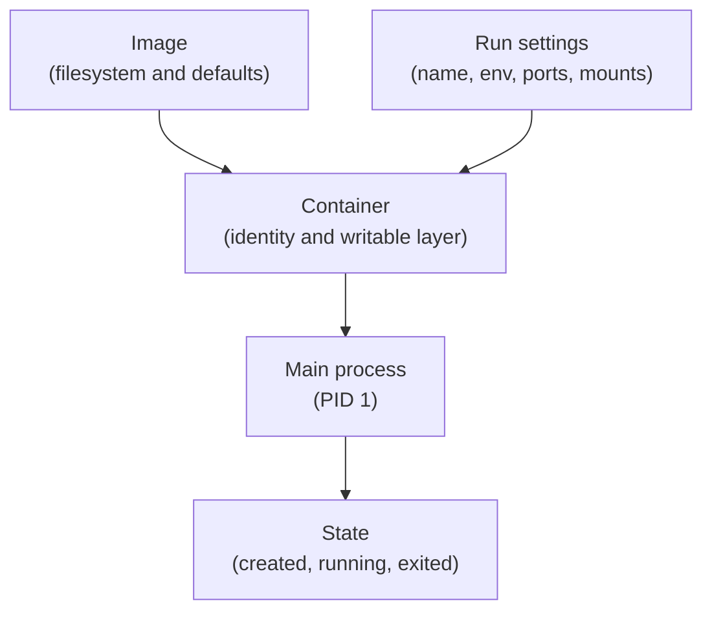

## Table of Contents

1. [Why Runtime Matters](#why-runtime-matters)
2. [The Mental Model](#the-mental-model)
3. [What Docker Creates](#what-docker-creates)
4. [The Main Process](#the-main-process)
5. [Foreground and Detached Runs](#foreground-and-detached-runs)
6. [Names and Evidence](#names-and-evidence)
7. [Cleanup](#cleanup)
8. [Where Runs Break](#where-runs-break)
9. [Putting It All Together](#putting-it-all-together)
10. [What's Next](#whats-next)

## Why Runtime Matters

A running container is one execution of an image with its own process, runtime settings, identity, writable layer, and recorded state.

The previous Docker work produced an image for the orders API. The image contains a filesystem, installed dependencies, metadata, and a default command. It can sit on a laptop or in a registry without doing anything. Then someone runs it and a different set of problems appears.

- The command prints a long id and the terminal prompt comes back, but the app is supposed to be running somewhere.
- The image built successfully, but the container exits after one second.
- The logs say the server is listening on port 3000, but the browser cannot reach it.
- Running the command again fails because the container name already exists.

Those are runtime problems. The image is the packaged starting point. A container is the object Docker creates when it combines that image with runtime settings, prepares a writable layer, attaches isolation boundaries, and starts a process.

Once that transition is clear, the Docker CLI stops reading as disconnected verbs. `docker ps`, `docker logs`, `docker inspect`, `docker stop`, and `docker rm` are different ways to ask what Docker created, what process ran, and what state is still left behind.

## The Mental Model

An image is inert. A container has identity and history. It has a name, id, created time, process state, network settings, environment values, mounts, logs, and a writable layer for changes made while that container exists.

The center of the model is the main process. Docker does not boot a full guest operating system and then hope the right services start. It starts the configured command. If that command keeps running, the container is running. If that command exits, the container exits.

Example: if the image default is `node dist/server.js`, the container stays `Up` while that Node process stays alive. If you override the run with `node --version`, the command prints a version and exits, so the container exits normally.



This is the first Docker runtime boundary. The image describes what the container can start from. The run settings describe how this particular start should behave. The process decides whether the container is alive.

## What Docker Creates

A container record is Docker's runtime object for one created run, including the image reference, configuration, network attachments, logs, and writable layer.


*A container run starts with image metadata, adds runtime flags, and creates a process boundary.*

The record is the thing Docker can inspect later. It tells you which image was used, which command ran, which ports were published, which environment values were passed, and what writable layer belonged to that run.

A plain run might look like this:

```bash
docker run --name orders-api devpolaris/orders-api:local
```

Docker resolves the image reference, reads the image configuration, creates a container record, prepares a writable layer on top of the image layers, applies runtime settings, connects the container to its default network, and starts the image command.

The writable layer is important even when you are not thinking about storage yet. If the process writes `/tmp/startup.log`, edits a cache file, or generates a local artifact, those changes belong to this container. They are not written back into the image. A second container created from the same image starts with its own writable layer.

That explains why a container can be removed without deleting the image. The image is the reusable package. The container is one run of that package with one layer of runtime changes.

## The Main Process

The main process is the process Docker watches to decide whether the container is running or exited.

Docker reports container state by watching the main process. If the orders API starts `node dist/server.js`, that Node process is the life of the container. When it exits, Docker records the exit code.

`docker ps -a` is usually the first useful question after a confusing run:

```text
CONTAINER ID   IMAGE                         COMMAND                  STATUS                    NAMES
9f7a8c2d4d1a   devpolaris/orders-api:local   "node dist/server.js"    Up 12 seconds             orders-api
8a48f0b4f62e   devpolaris/orders-api:local   "node dist/server.js"    Exited (1) 3 minutes ago  orders-api-old
```

`Up` means the main process is still alive. `Exited (1)` means Docker successfully started the command, then the command ended with exit code 1. The difference matters. A failed image build means Docker could not produce the package. An exited container means the package started, but the runtime process did not keep running.

A container can exit immediately for ordinary application reasons: a missing environment variable, a failed database connection during startup, a command that points to a missing file, or a script that completed successfully and had nothing else to do. Docker is not trying to keep an arbitrary command alive unless you configure restart behavior later.

## Foreground and Detached Runs

Foreground and detached runs only change how your terminal attaches to the container's input and output streams.


*Foreground and detached runs change how your terminal attaches to the same basic container process model.*

By default, `docker run` attaches your terminal to the process output. If the process writes to standard output or standard error, you see it. If the process keeps running, your terminal stays occupied. This is useful the first time you run an image because startup failures are visible.

Detached mode changes your terminal relationship, not the container's life:

```bash
docker run -d --name orders-api devpolaris/orders-api:local
```

Docker starts the same kind of container, then returns control to your shell and prints the container id. The process is still running in the background. Its output still exists, but you read it through Docker:

```bash
docker logs orders-api
docker logs -f orders-api
```

The common beginner mistake is to treat a detached run as if it did nothing because the terminal prompt came back. The prompt only means your terminal detached. The evidence moved to `docker ps` and `docker logs`.

## Names and Evidence

Container names are human-readable handles for container records, and those records preserve evidence until you remove them.

Docker gives every container a long id, but names are the human handle. A name belongs to one container at a time:

```bash
docker run --name orders-api devpolaris/orders-api:local
```

If `orders-api` already exists, Docker refuses to create another container with that name. That refusal is useful. A stopped container can still hold the exit code, logs, environment values, port mappings, and writable layer changes that explain what happened. Docker does not assume you are ready to throw that evidence away.

This is why local cleanup is an explicit choice:

```bash
docker stop orders-api
docker rm orders-api
```

`docker stop` asks the main process to exit. `docker rm` removes the stopped container record and its writable layer. The image remains. Named volumes remain too, which becomes important in the storage article.

For disposable development runs, you will often recreate a container from a clean starting point:

```bash
docker rm -f orders-api
docker run -d --name orders-api devpolaris/orders-api:local
```

That is reasonable when the container is only a local process wrapper. It is risky when the container's writable layer quietly contains data you wanted to keep.

## Cleanup

Container cleanup deletes the container record and writable layer, while leaving the reusable image and named volumes in place.

The safe cleanup question is not "can I remove this container?" It is "where does the important state live?" If the container only ran a web API and all durable data lives in a database volume, removing it is routine. If the container is the database and no volume was mounted, removing it removes the database files stored in that container layer.

Example: removing an `orders-api` container usually removes only logs and temporary files. Removing an unmounted `orders-db` container can remove the actual database files if Postgres wrote them into the container layer.

`--rm` is useful for one-off containers because it removes the container when the command exits:

```bash
docker run --rm devpolaris/orders-api:local node --version
```

That command creates a new container, runs `node --version`, prints the output, and removes the container. It does not enter an existing `orders-api` container. It is a fresh run from the image with a different command.

Use `--rm` when the container has no evidence worth keeping after the command completes. Skip it when startup logs, exit status, or filesystem changes may help explain a failure.

## Where Runs Break

A successful image can still produce a failed container because Docker moved from build time to runtime. The failure now belongs to the process and its settings.

If the status is `Exited`, read the logs and exit code before trying to open a shell. There may be no running process to enter.

If the status is `Up` but the app is unreachable, the main process is alive but some boundary around it is wrong. The next likely questions are port publication, bind address, network path, or health.

If the name already exists, decide whether the old container is evidence or clutter. Inspect it when the previous run might explain the problem. Remove it when you want a clean run from known inputs.

If a one-off command behaves differently from the long-running container, remember that it is a different container. It starts from the same image, but it has a different identity, writable layer, environment, mounts, and command unless you pass the same settings.

## Putting It All Together

The opening problems now have a shared shape:

- A detached container can be running even though the terminal prompt returned.
- A container exits when its main process exits, even if the image built correctly.
- A name collision protects the old container's evidence until you remove it.
- A container's writable layer belongs to that container, not to the image.
- Cleanup is safe only when important data lives outside the disposable container layer.

The runtime model is small but powerful: image plus run settings creates a container; the main process drives state; Docker records the evidence. Most Docker commands are just ways to inspect or change one of those pieces.

## What's Next

The next article reads the evidence Docker records after a run: state, logs, exit codes, inspection data, and `exec` access. That is the difference between guessing what a container did and observing what actually happened.


*The summary groups the CLI basics by image, container, process, connectivity, handles, and cleanup.*

---

**References**

- [Docker Docs: Running containers](https://docs.docker.com/engine/containers/run/) - Official guide to `docker run`, detached mode, image defaults, environment, ports, health checks, and runtime options.
- [Docker Docs: docker container run](https://docs.docker.com/reference/cli/docker/container/run/) - CLI reference for container creation flags, naming, `--rm`, and command overrides.
- [Docker Docs: View container logs](https://docs.docker.com/engine/logging/) - Official explanation of container stdout and stderr log behavior.
