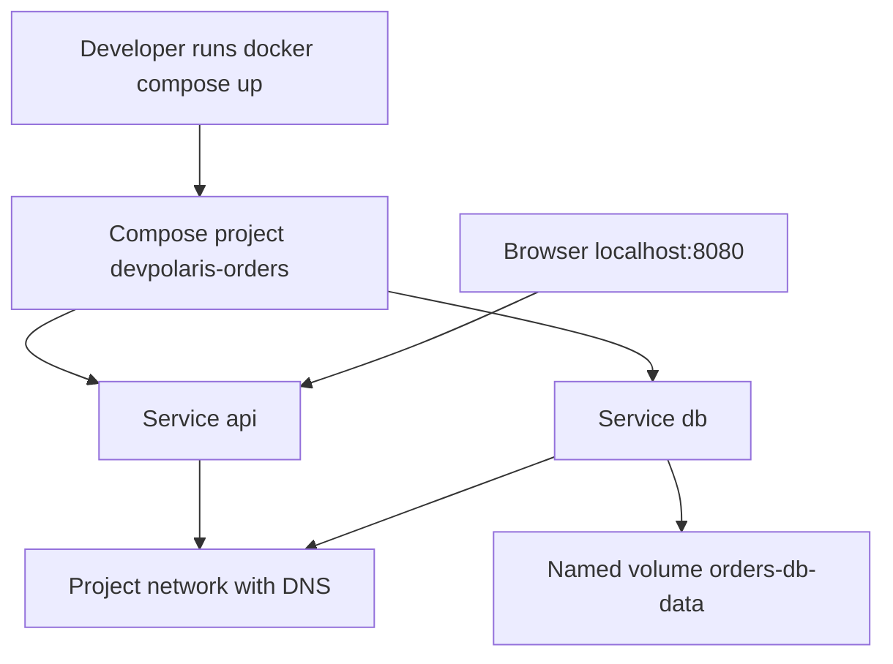

## Table of Contents

1. [Why Compose Exists](#why-compose-exists)
2. [The Compose Application Model](#the-compose-application-model)
3. [A First compose.yaml](#a-first-compose-yaml)
4. [Starting, Stopping, and Rebuilding](#starting-stopping-and-rebuilding)
5. [Environment Files and Secrets Discipline](#environment-files-and-secrets-discipline)
6. [Networks and Volumes in Compose](#networks-and-volumes-in-compose)
7. [Health and Dependency Timing](#health-and-dependency-timing)
8. [Failure Path: The API Starts Before the Database](#failure-path-the-api-starts-before-the-database)
9. [Tradeoffs Before Production](#tradeoffs-before-production)

## Why Compose Exists

A single `docker run` command is fine for one container. The command becomes fragile
when `devpolaris-orders-api` needs PostgreSQL, a Redis cache, a worker process, a shared
network, a named database volume, and several environment variables. People forget
flags. Ports drift. One teammate runs a different database name and spends an afternoon
debugging the wrong problem.

Docker Compose exists so a multi-container application can be described in one YAML file
and started with one command. The file is not only convenience. It is reviewable local
infrastructure. A teammate can see which services exist, which ports are published,
which volumes persist data, and which environment variables the stack expects.

Compose fits before Kubernetes in the roadmap because it teaches the same shape at a
smaller scale: services, networks, volumes, dependencies, and logs. It does not make
your laptop a production orchestrator. It gives a local development stack a clear
operating model.

## The Compose Application Model

Compose describes an application as services. A service is the definition for one kind
of container in the application: the API, the database, the worker, or the cache.
Compose creates containers from those services, connects them to networks, and mounts
volumes when requested.



The browser reaches the API through a published host port. The API reaches the database
through the service name `db` on the Compose network. The database stores files in a
named volume so data survives container replacement.

Those three boundaries are the heart of most Compose files: outside access, private
service discovery, and persistent state.

## A First compose.yaml

A useful first `compose.yaml` for the orders service defines the API and database. The
API builds from the current repository. The database uses an official PostgreSQL image
and stores data in a named volume.

```yaml
services:
  api:
    build:
      context: .
      dockerfile: Dockerfile
    image: devpolaris/orders-api:local
    ports:
      - "127.0.0.1:8080:3000"
    environment:
      PORT: "3000"
      DATABASE_URL: "postgres://orders:orders@db:5432/orders_dev"
      LOG_LEVEL: "debug"
    depends_on:
      - db

  db:
    image: postgres:16
    environment:
      POSTGRES_USER: orders
      POSTGRES_PASSWORD: orders
      POSTGRES_DB: orders_dev
    volumes:
      - orders-db-data:/var/lib/postgresql/data

volumes:
  orders-db-data:
```

The database hostname is `db` because that is the Compose service name. The API does not
use `localhost` for the database because `localhost` inside the API container points
back at the API container.

The port mapping binds the API to host loopback. That is usually enough for local
browser testing and avoids exposing the development API to the rest of the network.

## Starting, Stopping, and Rebuilding

The main loop is `docker compose up`, `docker compose logs`, and `docker compose down`.
Run attached when you want to see logs in the foreground. Run detached when you want the
stack in the background.

```bash
$ docker compose up --build
[+] Building 12.4s (10/10) FINISHED
[+] Running 3/3
 OK Network docker_default        Created
 OK Volume docker_orders-db-data  Created
 OK Container docker-api-1        Created
api-1  | [2026-05-07T12:05:20.114Z] orders-api listening on port 3000
db-1   | 2026-05-07 12:05:20.631 UTC [1] LOG: database system is ready
```

Compose prefixes logs with the service container name, which makes multi-service startup
easier to read. If you only need one service, filter the logs.

```bash
$ docker compose logs -f api
api-1  | request_id=ab72 route=GET /health status=200 duration_ms=4
```

`docker compose down` stops and removes the containers and project network. It does not
remove named volumes unless you add `--volumes`. That default protects database data.

```bash
$ docker compose down
[+] Running 3/3
 OK Container docker-api-1  Removed
 OK Container docker-db-1   Removed
 OK Network docker_default  Removed
```

## Environment Files and Secrets Discipline

Compose can read variables from your shell and from an `.env` file near the Compose
file. That is convenient, but it can hide missing configuration if every laptop has
different local values. Keep development defaults boring and secrets out of Git.

```text
# .env.example
API_PORT=8080
POSTGRES_USER=orders
POSTGRES_DB=orders_dev
```

A Compose file can use defaults so the local stack is easy to start.

```yaml
services:
  api:
    ports:
      - "127.0.0.1:${API_PORT:-8080}:3000"
    environment:
      DATABASE_URL: "postgres://${POSTGRES_USER:-orders}:orders@db:5432/${POSTGRES_DB:-orders_dev}"
```

Do not put production secrets in a local Compose file. Local development passwords such
as `orders` are intentionally low value and scoped to disposable local resources.
Production secrets need a real secret manager or deployment platform mechanism.

If a variable is required, fail early in the application startup. A clear `DATABASE_URL
is required` log line is better than a later database timeout during the first request.

## Networks and Volumes in Compose

Compose creates a default network for the project. Services on that network can use each
other by service name. Most beginner Compose files do not need to declare a network
manually. Declare one when you need a meaningful name, multiple networks, or external
network integration.

Volumes do need top-level declarations when you want named persistent storage.

```yaml
services:
  db:
    image: postgres:16
    volumes:
      - orders-db-data:/var/lib/postgresql/data

volumes:
  orders-db-data:
```

The service-level mount grants `db` access to the volume. The top-level `volumes` block
declares the volume in the Compose model.

```bash
$ docker compose ps
NAME           IMAGE                         SERVICE   STATUS       PORTS
docker-api-1   devpolaris/orders-api:local    api       Up 1 min     127.0.0.1:8080->3000/tcp
docker-db-1    postgres:16                    db        Up 1 min     5432/tcp

$ docker volume ls --filter name=orders-db-data
DRIVER    VOLUME NAME
local     docker_orders-db-data
```

Compose prefixes object names with the project name. That prevents two repositories from
accidentally sharing a volume named `db-data` unless you explicitly configure it.

## Health and Dependency Timing

The `depends_on` key controls startup order. It does not automatically mean the database
is ready to accept connections before the API starts. PostgreSQL may need a few seconds
after the container starts. During that window, the API can fail if it treats the first
database connection attempt as fatal.

A health check lets Compose and humans see readiness more clearly.

```yaml
services:
  db:
    image: postgres:16
    healthcheck:
      test: ["CMD-SHELL", "pg_isready -U orders -d orders_dev"]
      interval: 5s
      timeout: 3s
      retries: 10

  api:
    build: .
    depends_on:
      db:
        condition: service_healthy
```

The application should still handle database connection retries. Health checks improve
coordination, but they are not a substitute for resilient startup code. Networks pause,
databases restart, and local machines sleep.

```text
[2026-05-07T12:22:14.402Z] database not ready, retrying attempt=1 delay_ms=500
[2026-05-07T12:22:14.905Z] database not ready, retrying attempt=2 delay_ms=1000
[2026-05-07T12:22:15.918Z] database connection established
```

## Failure Path: The API Starts Before the Database

A common Compose failure is an API that exits before PostgreSQL is ready. The stack
starts, then `docker compose ps` shows the API stopped.

```bash
$ docker compose ps
NAME           SERVICE   STATUS                      PORTS
docker-api-1   api       Exited (1) 18 seconds ago
docker-db-1    db        Up 20 seconds (healthy)      5432/tcp

$ docker compose logs api
api-1  | [2026-05-07T12:28:45.118Z] booting devpolaris-orders-api
api-1  | [2026-05-07T12:28:45.179Z] fatal: connect ECONNREFUSED 172.21.0.2:5432
```

The database is healthy now, but it was not ready when the API made its first attempt.
Fix the Compose health coordination and add application retry logic. Then recreate the
API.

```bash
$ docker compose up -d --build api
[+] Running 2/2
 OK Container docker-db-1   Healthy
 OK Container docker-api-1  Started
```

If the log says `ENOTFOUND db`, inspect service names and networks. If it says `password
authentication failed`, inspect database environment and whether an old volume still
contains a database initialized with different credentials. The error text decides the
next branch.

## Tradeoffs Before Production

Compose is excellent for local development, integration tests, and small internal demos.
It is not the same as Kubernetes or a managed production platform. Compose can restart
containers, but it does not give you cluster scheduling, rolling updates across nodes,
service meshes, autoscaling, or cloud-native secret management.

The tradeoff is simplicity. A Compose file can teach the whole team how the application
pieces fit together without introducing a cluster. That makes it a strong bridge between
Docker basics and orchestration.

| Use Compose for | Be careful with |
|-----------------|-----------------|
| Local API plus database stacks | Treating local passwords as production patterns |
| Integration tests in CI | Assuming startup order means readiness |
| Reproducible developer onboarding | Publishing unnecessary ports |
| Learning service networking | Depending on laptop-only paths |

When the stack needs multiple machines, rollout strategy, production-grade secret
management, or platform policy, you are leaving Compose territory. By then, the service,
network, and volume model you learned here will make Kubernetes easier to understand.

---

**References**

- [Docker Docs: How Compose works](https://docs.docker.com/compose/intro/compose-application-model/) - Official explanation of services, networks, volumes, configs, and secrets.
- [Docker Docs: Compose file reference](https://docs.docker.com/compose/compose-file/) - Canonical reference for the Compose Specification as implemented by Docker Compose.
- [Docker Docs: Docker Compose CLI reference](https://docs.docker.com/reference/cli/docker/compose/) - Official reference for `docker compose` commands.
