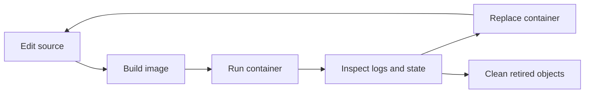

## Table of Contents

1. [The Workflow Map](#the-workflow-map)
2. [Build the Image](#build-the-image)
3. [Run the Container](#run-the-container)
4. [Inspect What Happened](#inspect-what-happened)
5. [Change Code and Replace the Container](#change-code-and-replace-the-container)
6. [Debug Inside the Running Container](#debug-inside-the-running-container)
7. [Keep Data in the Right Place](#keep-data-in-the-right-place)
8. [Push or Pull Through a Registry](#push-or-pull-through-a-registry)
9. [Clean Up Local Docker State](#clean-up-local-docker-state)
10. [Putting It All Together](#putting-it-all-together)
11. [What's Next](#whats-next)

## The Workflow Map
<!-- section-summary: A Docker workflow is the repeated path from source edits to an image, a container, runtime evidence, replacement, and cleanup. -->

In the previous article, we used a small Node service called `inventory-api`. Now we care less about the definition of Docker and more about the loop a developer repeats during a normal day. A **workflow** is that repeatable order of actions: change files, build an image, run a container, inspect what happened, replace stale runtime state, and clean up old objects.

The important shift is that Docker adds an artifact step between source code and the running process. A normal local Node command reads the working tree directly. A Docker container usually runs the files that were copied into the image during the last build, so an edit in `src/` needs a rebuild or a deliberate bind mount before the running process sees it.



That loop explains most beginner Docker confusion. A developer changes a file and refreshes the browser, and the old code still runs because the image still contains the previous files. Another developer starts a second copy and gets a port conflict. Someone deletes an image and Docker refuses because a stopped container still points at it.

We will walk through the loop in order. Each command has one job, and the same `inventory-api` scenario will carry through the whole article.

## Build the Image
<!-- section-summary: The build step turns the Dockerfile and build context into a tagged image artifact. -->

A build is usually the first action in the Docker workflow. A **build** reads a Dockerfile, uses the files available in the build context, runs the Dockerfile instructions, and creates an image. For `inventory-api`, the image is the packaged service Docker can run later.

```bash
docker build -t inventory-api:local .
```

The `-t inventory-api:local` part gives the image a human-friendly tag. The repository name is `inventory-api`, and the tag is `local`. The final `.` tells Docker to use the current directory as the build context, which gives the builder access to files such as `package.json`, `package-lock.json`, `src/`, and `Dockerfile`.

The build context deserves attention because Docker can only copy files that entered that context. If the Dockerfile says `COPY config/default.json ./config/default.json`, that file must exist inside the context. If the context includes a huge `node_modules` folder or local secrets, Docker may send too much data to the builder and may place risky files within reach of `COPY`.

A `.dockerignore` file keeps unwanted files out of the context:

```gitignore
node_modules
.git
.env
coverage
dist
```

Docker also uses a build cache. If the Dockerfile instruction and the relevant input files match a previous build, Docker can reuse the cached layer. This is why many Node Dockerfiles copy `package*.json` and run `npm ci` before copying `src/`: source changes can reuse the slower dependency install layer as long as the package files stay the same.

After a build, the image exists locally:

```bash
docker image ls inventory-api
```

That command gives the team evidence that the artifact exists before they try to run it. The next step creates a container from the image.

## Run the Container
<!-- section-summary: The run step creates a container record, starts the main process, and applies runtime settings such as names, ports, and environment variables. -->

`docker run` turns an image into a container. It creates the container record, prepares the writable layer and network settings, and starts the image's main command. For `inventory-api`, the run step starts the Node process declared by the Dockerfile.

```bash
docker run \
  --name inventory-api \
  -p 8080:3000 \
  -e PORT=3000 \
  inventory-api:local
```

The `--name inventory-api` flag gives the container a stable name for later commands. The `-p 8080:3000` flag publishes host port `8080` to container port `3000`, so the developer can use `http://localhost:8080`. The `-e PORT=3000` flag passes a runtime setting into the process.

By default, this foreground run keeps the terminal attached to the container's output. That can be useful for the first run because the developer sees startup logs immediately. If the API prints `Listening on port 3000`, the host can call it through the published port.

Most local service runs use detached mode after the first check:

```bash
docker run \
  -d \
  --name inventory-api \
  -p 8080:3000 \
  -e PORT=3000 \
  inventory-api:local
```

The `-d` flag starts the container in the background and returns the terminal to the developer. Docker prints a container ID, and the process keeps running. The logs still exist; the developer retrieves them with `docker logs` instead of watching the foreground terminal.

The container name now belongs to that container record. If someone repeats the same `docker run --name inventory-api ...` command while the old container exists, Docker reports a name conflict. If the old container still publishes `8080`, a second container trying to use the same host port also fails because one host port can serve one listener at a time.

Those conflicts lead naturally into inspection. Before replacing anything, the team needs to see what Docker has recorded.

## Inspect What Happened
<!-- section-summary: Inspection commands show live containers, stopped containers, logs, ports, image names, exit codes, and runtime configuration. -->

Inspection commands answer the question "what is Docker running or remembering right now?" Docker keeps records for running containers and stopped containers, and those records explain many local problems. The most common first check is `docker ps`.

```bash
docker ps
```

For the running API, the output might include:

```bash
CONTAINER ID   IMAGE                 STATUS          PORTS                    NAMES
6c51b9ad8a21   inventory-api:local   Up 2 minutes    0.0.0.0:8080->3000/tcp   inventory-api
```

This line tells us the container name, image tag, status, and published port. If the browser fails to reach the service, the `PORTS` column gives the first clue. If the row is missing, the process may have exited.

`docker ps -a` includes stopped containers:

```bash
docker ps -a
```

A crashed API might show `Exited (1)` or another exit code. That status means the main process started and then ended with an error. The next command reads the captured stdout and stderr records:

```bash
docker logs inventory-api
```

The logs might show:

```bash
Error: DATABASE_URL is required
    at startServer (/app/src/server.js:18:11)
```

Now the problem has a concrete shape. The image can start the Node process, and the runtime configuration missed `DATABASE_URL`. The fix belongs in the `docker run` command, a Compose file, or the deployment configuration, depending on the environment.

For deeper questions, `docker inspect` returns the full container metadata as JSON:

```bash
docker inspect inventory-api
```

Teams use `inspect` to check environment variables, mounts, network names, IP addresses, restart policy, image ID, and exact port bindings. The output is large, so most daily debugging uses `ps`, `ps -a`, and `logs` first, then moves to `inspect` after the simple evidence runs out.

After inspection, a common next step is a code change. That brings us to the replacement part of the workflow.

## Change Code and Replace the Container
<!-- section-summary: A source change needs a new image or a development bind mount, and the old container usually needs removal before the new one can take its name and port. -->

Imagine the team changes `src/routes/products.js` so the API returns a new `warehouseStatus` field. The running container still uses the files copied into the previous image build. A clean image-based workflow builds a new image, stops the old container, removes the old container record, and starts a fresh one from the new image.

```bash
docker build -t inventory-api:local .
docker stop inventory-api
docker rm inventory-api
docker run -d --name inventory-api -p 8080:3000 -e PORT=3000 inventory-api:local
```

`docker stop` asks the main process to shut down gracefully. Docker sends `SIGTERM` first and then sends `SIGKILL` after the configured grace period if the process keeps running. For a web API, that graceful window gives the server a chance to stop accepting requests and close active work.

`docker rm` removes the stopped container record and its writable layer. This releases the container name and avoids confusing old state. The next `docker run` creates a new record from the newly built image and can reuse the same name and host port.

For short local test runs, some teams use `--rm` so Docker removes the container automatically after the process exits:

```bash
docker run --rm inventory-api:local npm test
```

That pattern works well for one-off commands because the container does useful work and exits. Long-running services usually keep their container record so developers can inspect logs, status, and exit codes after something fails.

There is also a faster local development path: a bind mount. A bind mount connects the host working tree into the container so the process can see source edits as the developer saves files. That gives quick feedback for dev servers, while the team still needs clean image builds before shipping.

```bash
docker run \
  -d \
  --name inventory-api-dev \
  -p 8080:3000 \
  --mount type=bind,src="$(pwd)",target=/app \
  -w /app \
  node:22-alpine \
  sh -c "npm install && npm run dev"
```

This development command uses the `node:22-alpine` image and mounts the current directory into `/app`. It helps during local coding because the runtime sees host file edits. The release path still goes through `docker build`, because production should run the packaged image that CI tested.

Once a service is running, the next workflow question is how to look inside the exact environment where the process lives.

## Debug Inside the Running Container
<!-- section-summary: `docker exec` starts a second process inside an existing running container for targeted debugging. -->

`docker exec` runs a new command inside a running container. It uses the container's existing filesystem, network, and process context, so it helps answer questions from the application's point of view. If `inventory-api` fails to reach the database, an exec shell can check environment variables and network names from inside the same container boundary.

```bash
docker exec -it inventory-api sh
```

The `-i` flag keeps standard input open, and the `-t` flag allocates a pseudo-terminal. Together they make the shell feel interactive. Inside that shell, the developer can inspect files, print environment variables, or test a connection using tools available in the image.

```bash
printenv DATABASE_URL
ls -la /app
node -e "console.log(process.version)"
```

This kind of debugging has a clear limit. The extra shell runs only while the container's main process is running, and files changed in the shell land in that one container's writable layer. If the developer fixes `/app/src/server.js` by hand inside the shell, the fix vanishes when the container is removed and leaves the image unchanged.

Production teams use exec with care. It can reveal what a process sees, and repeatable fixes belong in source code, Dockerfiles, configuration, or deployment manifests. The shell gives evidence for a proper repair.

That evidence often points to state. Maybe the API returns successful health responses, and the database data disappears after replacement. That means the storage boundary needs attention.

## Keep Data in the Right Place
<!-- section-summary: Container writable layers suit temporary files, volumes suit durable generated data, and bind mounts suit local host-file sharing. -->

Docker gives each container a writable layer, and that layer belongs to the container lifecycle. If the API writes a temporary cache file under `/tmp`, the writable layer handles it. If a database writes actual business data there, deleting the container also removes that write layer.

A **volume** stores data outside the individual container lifecycle. Docker creates and manages the volume on the host, then mounts it into the container at a path. For a local PostgreSQL database used by `inventory-api`, the team can keep database files in a named volume.

```bash
docker volume create inventory-db-data

docker run \
  -d \
  --name inventory-db \
  -e POSTGRES_PASSWORD=secret \
  -v inventory-db-data:/var/lib/postgresql/data \
  postgres:16
```

Now the database container can be replaced while `inventory-db-data` remains available. This is useful for development data, integration test fixtures, and local databases. In production, teams still design storage carefully through managed databases, orchestrator storage classes, backup policy, and restore testing.

A **bind mount** solves host-file sharing instead of durable Docker-managed storage. The development command from the previous section mounted the source repository into `/app`, which made local edits visible inside the container. Docker documents that bind mounts tie a container to a specific host path, so they work best for local development and explicit host-file sharing.

This distinction saves real time. If the API source code needs live reload, a bind mount fits. If the database data needs to survive container replacement, a volume fits. If the image should contain production code, the Dockerfile and image build fit.

After the team has images, containers, volumes, and perhaps bind mounts working locally, the workflow often needs a registry step so another machine can run the same artifact.

## Push or Pull Through a Registry
<!-- section-summary: Registry steps move the image from one machine to another without rebuilding from source on every host. -->

A **registry workflow** stores the image outside the local Docker host. The developer or CI system builds the image, tags it with a registry path, and pushes it. Another machine pulls that image and runs a container from the pulled artifact.

```bash
docker tag inventory-api:local registry.example.com/platform/inventory-api:2026-06-13.1
docker push registry.example.com/platform/inventory-api:2026-06-13.1
```

The tag should carry a meaning the team can trace. Some teams use version numbers such as `1.8.3`, some use Git SHAs, and some use date-based build numbers. The important habit is that staging and production can point back to the image that CI built and tested.

On another Docker host, the runtime side looks like this:

```bash
docker pull registry.example.com/platform/inventory-api:2026-06-13.1
docker run -d --name inventory-api -p 8080:3000 registry.example.com/platform/inventory-api:2026-06-13.1
```

This is the handoff Docker was built to support. The second host can run the service without the source repository or the local build cache. It needs Docker access to the registry and the runtime configuration required by the container.

Registry work creates another kind of local state: older image tags and layers. That brings us to housekeeping.

## Clean Up Local Docker State
<!-- section-summary: Cleanup commands remove retired containers, dangling images, unused networks, build cache, and sometimes volumes, with volume cleanup needing extra care. -->

Docker keeps local objects until someone removes them. Stopped containers keep their writable layers and logs. Rebuilds can leave dangling image layers. Networks and build cache can accumulate during experiments. Volumes can hold useful data long after the container that created them has disappeared.

`docker system df` gives a quick storage summary:

```bash
docker system df
```

For targeted cleanup, Docker has prune commands by object type:

```bash
docker container prune
docker image prune
docker network prune
docker buildx prune
```

`docker container prune` removes stopped containers. `docker image prune` removes dangling images by default, which usually means image layers without a tag and without a container reference. `docker buildx prune` clears build cache for the selected builder.

`docker system prune` combines several cleanup operations:

```bash
docker system prune
```

Docker documents an important volume rule: system prune leaves volumes alone by default, and volume deletion requires explicit volume pruning or `docker system prune --volumes`. That default protects data because a volume may contain a local database, uploaded files, or test records someone still needs.

```bash
docker volume ls
docker volume prune
```

The safe habit is to name valuable volumes and know what they hold. `inventory-db-data` clearly belongs to the local database, while a random anonymous volume from a test run may have no value. Cleanup is part of the workflow because Docker keeps evidence and cache for you, and those helpful leftovers eventually need review.

## Putting It All Together
<!-- section-summary: The complete Docker workflow gives every command a target object and every state change a reason. -->

Let's replay a normal development cycle for `inventory-api`. The developer edits the route, builds a new image, replaces the old container, checks the logs, and keeps durable database data in a named volume. Each command points at a Docker object: image, container, log stream, or volume.

```bash
docker build -t inventory-api:local .
docker stop inventory-api
docker rm inventory-api
docker run -d --name inventory-api -p 8080:3000 -e PORT=3000 inventory-api:local
docker logs inventory-api
```

If the container crashes, `docker ps -a` shows the exit status and `docker logs inventory-api` shows the application output. If the process keeps running and the environment looks wrong, `docker exec -it inventory-api sh` starts a shell inside the running container. If the local Docker host fills up, `docker system df` and targeted prune commands show what can be reclaimed.

The workflow also gives names to common mistakes. Old source code usually points to an image that still needs a rebuild or a container that still needs replacement. A port error usually means an existing container still owns the host port. Missing data after replacement usually means the data lived in the container writable layer instead of a volume.

That is the daily Docker loop: build the artifact, run the process, inspect the evidence, replace stale containers, keep data in the right storage boundary, share images through a registry, and clean up retired local state.

## What's Next

You now have the everyday Docker command flow. The next article goes into the Dockerfile itself, because the quality of the workflow depends heavily on the quality of the image recipe.

We will look at base images, instruction order, cache behavior, `.dockerignore`, build arguments, multi-stage builds, security defaults, and the practical choices that make an image clean and repeatable.

---

**References**

- [Build context](https://docs.docker.com/build/concepts/context/) - Explains local build contexts, which files the builder can access, and how `docker build .` sends the current directory.
- [Using the build cache](https://docs.docker.com/get-started/docker-concepts/building-images/using-the-build-cache/) - Describes how Docker creates layers and reuses cached build results.
- [Building best practices](https://docs.docker.com/build/building/best-practices/) - Covers build cache guidance, base image tags, and Dockerfile build recommendations.
- [docker container run](https://docs.docker.com/reference/cli/docker/container/run/) - Documents `docker run`, detached mode, stopped container restart behavior, and runtime options.
- [Running containers](https://docs.docker.com/engine/containers/run/) - Explains container isolation, filesystems, networking, process trees, foreground and detached behavior, and published ports.
- [docker container logs](https://docs.docker.com/reference/cli/docker/container/logs/) - Documents retrieving stdout and stderr logs from containers.
- [docker container exec](https://docs.docker.com/reference/cli/docker/container/exec/) - Documents running additional commands inside an existing running container.
- [docker container stop](https://docs.docker.com/reference/cli/docker/container/stop/) - Documents the SIGTERM and SIGKILL shutdown sequence and stop timeout options.
- [Volumes](https://docs.docker.com/engine/storage/volumes/) - Explains Docker-managed persistent data stores and volume lifecycle.
- [Bind mounts](https://docs.docker.com/engine/storage/bind-mounts/) - Documents host-path mounts, `--mount` and `-v` syntax, and bind-mount constraints.
- [Docker Hub quickstart](https://docs.docker.com/docker-hub/quickstart/) - Introduces sharing images through Docker Hub and pulling pre-built images.
- [Prune unused Docker objects](https://docs.docker.com/engine/manage-resources/pruning/) - Documents pruning containers, images, volumes, networks, build cache, and system-wide unused objects.
