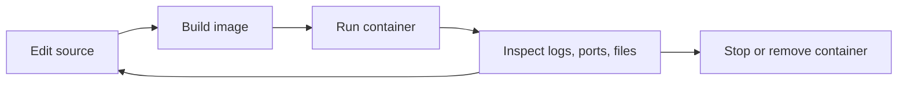

## Table of Contents

1. [The Problem](#the-problem)
2. [The Lifecycle](#the-lifecycle)
3. [Build an Image](#build-an-image)
4. [Run a Container](#run-a-container)
5. [Inspect the Process](#inspect-the-process)
6. [Change and Rebuild](#change-and-rebuild)
7. [Clean Up](#clean-up)
8. [Failure Modes](#failure-modes)
9. [Putting It All Together](#putting-it-all-together)
10. [What's Next](#whats-next)

## The Problem

A new developer joins a project and receives a short setup note:

```bash
docker build -t orders-api .
docker run -p 8080:3000 orders-api
```

The service starts, but the next hour gets confusing. They edit a file and nothing changes. They press `Ctrl+C` and wonder whether the container is gone or only stopped. They run the same image again and hit a port conflict. They try to delete the image and Docker says a container still depends on it. None of these errors is mysterious once the Docker workflow is clear, but they feel random when every command is learned separately.

The workflow has a small number of states. Source files live in your project directory. A build turns those files into an image. A run creates a container from the image and starts its main process. Inspection commands read the running or stopped container. Cleanup removes container records and, when no containers need them, images.

## The Lifecycle

Docker's everyday loop is a lifecycle, not a bag of commands:



The loop matters because Docker does not automatically rebuild an image every time you edit source. If your image copied `src/server.ts` during `docker build`, then the image has the version of the file that existed at build time. Editing the host file later does not rewrite that image. You either rebuild the image or use a development bind mount that intentionally lets the container see host files.

This is the first practical Docker habit: always know which layer you are changing. Are you changing source on the host, the image produced by a build, the runtime settings on a container, or files inside one container's writable layer? The command you need depends on that answer.

## Build an Image

The build step turns the project into an image:

```bash
docker build -t orders-api:local .
```

The tag `orders-api:local` is a human-readable name for the image. The final `.` is the build context, which means Docker can use files from the current directory when the Dockerfile asks for them. The Dockerfile decides what enters the image and which commands run while building.

The output of a build is an image id with one or more names pointing at it. If you run the same tag again after rebuilding, the tag moves to the newer image. Older image layers may still exist locally until Docker can safely remove them.

This distinction explains a common surprise. If a container is already running from the old image, rebuilding the tag does not replace the running process. The container was created from the image id that existed at creation time. To run the new image, you usually stop and remove the old container, then create a new one from the rebuilt tag.

```bash
docker stop orders-api
docker rm orders-api
docker run --name orders-api -p 8080:3000 orders-api:local
```

That may look repetitive, but it is honest about the lifecycle. Rebuild the artifact. Replace the process.

## Run a Container

The run step creates a container and starts its main process:

```bash
docker run --name orders-api -p 8080:3000 orders-api:local
```

The image name comes last. Options before the image configure the new container. `--name` gives the container a stable name so you do not have to copy a generated id. `-p 8080:3000` publishes host port 8080 to container port 3000. The image supplies the default command unless you override it after the image name.

Running in the foreground is useful when you want logs directly in your terminal. Running with `-d` starts the container in the background:

```bash
docker run -d --name orders-api -p 8080:3000 orders-api:local
```

Both modes create a container. The difference is your terminal attachment. In foreground mode, `Ctrl+C` sends a signal to the process. In detached mode, your terminal returns immediately and the process continues until it exits or you stop it.

Port publishing belongs to container creation. If you create a container without `-p`, the application may be listening perfectly inside the container while still unreachable from your browser on the host. If you want a different host port, create a new container with a different publishing rule.

## Inspect the Process

Inspection turns the black box back into a visible process. Start with the list of running containers:

```bash
docker ps
```

A useful row carries four ideas:

```text
CONTAINER ID   IMAGE              COMMAND                  STATUS         PORTS                    NAMES
31a9df2baf01   orders-api:local   "node dist/server.js"    Up 8 seconds   0.0.0.0:8080->3000/tcp   orders-api
```

The image tells you which artifact was used. The command tells you which process Docker started. The status tells you whether the process is still alive. The ports column tells you how host traffic reaches the container.

Logs answer a different question: what did the main process write to stdout and stderr?

```bash
docker logs orders-api
```

If the container exits immediately, `docker ps` will hide it by default. Use `docker ps -a` to include stopped containers, then read the logs. Many "Docker is broken" moments are actually application startup failures that are visible in the stopped container's logs.

To look from inside the running container, use `docker exec`:

```bash
docker exec -it orders-api sh
```

This starts a second process inside the existing container. It is an inspection tool, not the main lifecycle path. If you edit files inside that shell, you are changing one container's writable layer. Those edits do not update the image and will vanish when the container is removed unless they are written to a mounted volume or bind mount.

## Change and Rebuild

The workflow changes depending on whether you are running a production-like image or a development container.

In a production-like loop, the image owns the application files. You edit source on the host, rebuild the image, and replace the container:

```bash
docker build -t orders-api:local .
docker rm -f orders-api
docker run -d --name orders-api -p 8080:3000 orders-api:local
```

This loop verifies that the Dockerfile can reproduce the application from source. It is slower than live reload, but it catches missing build steps and hidden local dependencies early.

In a development loop, you may mount the source directory into the container and run a watcher:

```bash
docker run --name orders-api-dev -p 8080:3000 -v "$PWD":/app orders-api:local npm run dev
```

This changes the boundary. The container now sees host files at `/app`. Edits can show up without rebuilding, but the image no longer fully represents the running filesystem. That is fine for local development when it is deliberate. It is dangerous when the team forgets and assumes a mounted development container proves the image itself is complete.

The non-obvious workflow rule is to use both loops for different questions. Bind mounts answer, "Can I iterate quickly?" Rebuilds answer, "Can this artifact run from a clean image?"

## Clean Up

Docker keeps records because they are useful for inspection and reuse. Stopped containers remain until removed. Images remain until removed or pruned. Volumes remain even after containers go away unless you remove them or explicitly ask Docker to remove anonymous volumes in certain commands.

The order matters. A container depends on the image it was created from. Docker will not remove an image if a container record still references it. Remove the container first:

```bash
docker rm orders-api
docker image rm orders-api:local
```

For local development, the cleanup target is usually stopped containers and unused images, not everything Docker knows about. Aggressive cleanup can delete build cache or volumes that were still useful. Build cache makes rebuilds faster. Volumes may contain database state. Use cleanup commands when you understand which state they remove.

This is another place where the mental model pays off. Source lives in your repository. Images live in Docker's local image store. Containers live as Docker records with writable layers. Volumes live in Docker-managed storage. They are related, but they are not the same object.

## Failure Modes

The most common workflow failures come from mixing lifecycle steps.

A port conflict usually means an old container is still running or another process on the host already owns the host port. The container port can stay the same while the host port changes. If host port 8080 is busy, `-p 8081:3000` may be enough for local testing.

A change that does not show up usually means the running container still uses an old image, or the Dockerfile never copied the changed file into the image, or a bind mount is hiding the image's built files. The fix depends on which filesystem the process is actually reading.

A container that exits immediately is often a main process problem. Read `docker logs`, then check whether the image's default command points to a real file, whether dependencies were installed during the build, and whether required runtime environment variables were supplied.

An image that cannot be removed usually still has at least one container record pointing at it. `docker ps -a` reveals stopped containers. Remove those records before deleting the image.

A command run with `docker exec` that "fixed" the app may only have fixed one container. If the fix belongs in the artifact, put it in the Dockerfile or source and rebuild. Containers are replaceable. Images are the repeatable artifact.

## Putting It All Together

The developer from the opener was not missing a longer command list. They were missing the lifecycle that gives each command a place.

- `docker build` creates or updates the image artifact from the build context and Dockerfile.
- `docker run` creates a container from an image and starts the image's default process unless overridden.
- `docker ps`, `docker logs`, and `docker exec` inspect the process and its boundary.
- Source edits require a rebuild unless a development mount intentionally shares host files.
- Cleanup removes Docker state, but containers, images, build cache, and volumes are different kinds of state.

The workflow becomes predictable when each command answers one question: which object am I operating on right now?

## What's Next

The next module moves from workflow to image construction. The Dockerfile decides what goes into the artifact your workflow builds. To write good Dockerfiles, you need to understand build context, instruction order, image layers, cache behavior, and the way names move through registries.

---

**References**

- [Docker Docs: Run containers](https://docs.docker.com/engine/containers/run/)
- [Docker Docs: docker container run](https://docs.docker.com/reference/cli/docker/container/run/)
- [Docker Docs: Publishing and exposing ports](https://docs.docker.com/get-started/docker-concepts/running-containers/publishing-ports/)
- [Docker Docs: Persisting container data](https://docs.docker.com/get-started/docker-concepts/running-containers/persisting-container-data/)
