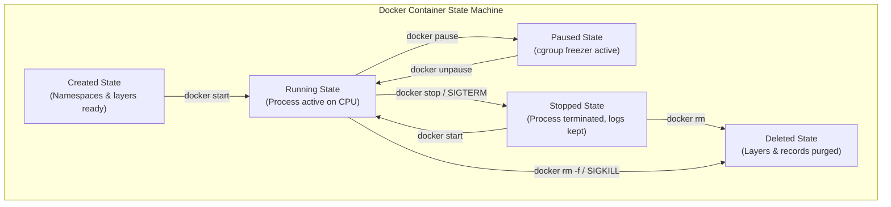

## Table of Contents

1. [The Edit-Build-Run Loop](#the-edit-build-run-loop)
2. [The Container State Machine](#the-container-state-machine)
3. [Building the Image Artifact](#building-the-image-artifact)
4. [Launching and Attaching Processes](#launching-and-attaching-processes)
5. [Inspecting Live and Stopped States](#inspecting-live-and-stopped-states)
6. [Rebuilding and Replacing Processes](#rebuilding-and-replacing-processes)
7. [Housekeeping: Reclaiming Storage](#housekeeping-reclaiming-storage)
8. [Putting It All Together](#putting-it-all-together)
9. [What's Next](#whats-next)

## The Edit-Build-Run Loop

A Docker workflow is the repeatable path from source files to image artifact to container process to inspection and cleanup.


*Docker workflow becomes repeatable when source changes produce image artifacts, and image artifacts produce containers.*

When you integrate Docker into your everyday development routine, you transition from running commands directly on your laptop to operating on a structured software delivery loop. A typical developer setup requires cloning a repository, compiling the code, running a local server, and monitoring the outputs.

Example: after editing `src/routes/orders.ts`, a production-like Docker loop usually means rebuilding `orders-api:local`, removing the old `orders-api` container, and starting a new container from the updated image. If you skip the rebuild or keep the old container, Docker may keep running the previous filesystem.

In a traditional development loop, editing a file yields immediate feedback because the runtime reads your project directory directly. In a containerized loop, this immediate connection is broken.

If you edit a source file on your host machine while a container is running, the container process does not see the modification. The process inside the container is isolated from your live project directory, reading a virtual filesystem that was frozen at the moment you compiled the image.

To see your changes, you must explicitly rebuild the image artifact, destroy the old container, and start a new process from the updated image.

```plain
$ docker build -t app:local .
$ docker run -d --name web-server -p 8080:80 app:local
```

Understanding this lifecycle prevents the common developer confusion of running an outdated container or hitting port binding conflicts when attempting to run multiple container instances. 

Operating in a containerized environment requires mapping each of your terminal commands to a specific step in a process lifecycle. 

## The Container State Machine

A container state machine is Docker's lifecycle record for one process boundary. A container is a dynamic, kernel-supervised process with a strict state machine. The Docker engine manages this state machine, tracking whether the underlying namespaces, cgroups, write layers, and network interfaces are created, active, or terminated.


*A container is a lifecycle record around one process run, not the reusable artifact itself.*

Example: a container in `Created` has a record, writable layer, network settings, and resource rules prepared, but its application process has not started. A container in `Exited (1)` did start its process, then recorded that the process ended with error code 1.



To manage your workflow, you must trace each transition inside this state machine:

* **Created**: The engine parses your command, downloads the requested image, creates the isolated write layer, sets up the virtual network interface, and reserves cgroup limits. The application process has not started yet.
* **Running**: The OCI runtime (`runC`) initializes namespaces, applies cgroup rules, mounts the OverlayFS stack, and boots the main application process. The process is actively consuming host CPU and memory resources.
* **Paused**: The engine uses the cgroup freezer controller to suspend all execution threads inside the container. The process remains in host memory, but the scheduler refuses to grant it CPU execution time until it is unpaused.
* **Stopped**: The main process has terminated (either via exit code 0 on completion, or via crash, or via a stop signal). The virtual network card is detached, and memory allocations are freed. However, the container's write layer and standard I/O log buffers remain intact on the host storage disk.
* **Deleted**: The engine purges the container's metadata records, deletes the write layer directory, and releases all host namespace bindings, freeing all associated disk storage.

If you attempt to modify or delete resources out of order, the state machine will block your action. For example, Docker will refuse to delete an image if an active or stopped container still depends on its read-only filesystem layers. You must destroy the dependent container processes first.

## Building the Image Artifact

An image artifact is the reusable filesystem and metadata package Docker can use to create one or many containers.

The workflow begins by compiling your application files into a reusable image. This step is driven by the `build` command, which reads a Dockerfile build recipe and packages your project directories:

```plain
$ docker build -t orders-api:local .
```

The build command accepts two critical inputs. The final `.` is the build context, which means "send this host directory to the Docker engine as the file set available during the build." The tag `orders-api:local` is a readable name for the image Docker produces, so later commands can refer to the image without copying its long image ID.

* **The Build Context**: Represented by the final `.` in the command, this tells the Docker Client to scan the specified host directory and package its contents into a temporary archive. The client transmits this context archive over a UNIX socket to the background engine daemon. The daemon can only build files that are explicitly sent inside this context.
* **The Image Tag**: Represented by `-t orders-api:local`, this applies a human-readable label to the resulting image. A tag is composed of a repository name (`orders-api`) followed by a version identifier (`local`).

Under the hood, the engine parses the Dockerfile, launches temporary scratch containers to execute build steps, and commits the resulting files into immutable, read-only layers. 

If you run the build command multiple times, the engine compares the context file hashes against its local layer database. If no changes are found, it uses the cached layers, completing the build instantly.

The crucial gotcha is that rebuilding an image does not automatically modify running containers. A running container is bound to the specific image layer hash that existed when the container was created. To update the running application, you must push the updated image through the next phases of the lifecycle state machine.

## Launching and Attaching Processes

`docker run` is the runtime transition that turns an image reference and a set of run options into a container record and a main process.

Once the image artifact is compiled, you use the `run` command to transition it into an active container process on the host:

```plain
$ docker run --name orders-api -p 8080:3000 orders-api:local
```

The run command performs two operations under the hood: it creates the container record from the image, and then it starts the isolated process. 

Your terminal interaction with this running process depends on which attachment flags you choose:

* **Foreground Attachment (Default)**: Your terminal stdout, stderr, and stdin are attached directly to the container process. You can see application logs in real time. Pressing `Ctrl+C` sends a standard `SIGINT` signal to PID 1 inside the container, prompting it to stop.
* **Detached Mode (`-d`)**: The engine starts the container in the background, prints the long container ID to your terminal, and immediately returns control to your shell. The container process continues running privately in the background.

```plain
$ docker run -d --name orders-api -p 8080:3000 orders-api:local
83f1207eab56114a908ce91244cf0c0df4a819b5f903a48e7188b0a9477ef290
```

When running in detached mode, the process's standard output streams are not lost. The container shim intercepts all writes to stdout and stderr and writes them into local host log files managed by Docker's logging driver ring.

If your application server listens on a network port, you must configure port publishing during this run step. The flag `-p 8080:3000` instructs the host kernel to map host port 8080 to container port 3000. 

If you omit this port mapping, the container process runs in its isolated network namespace, remaining completely unreachable from host browsers or external clients.

## Inspecting Live and Stopped States

Docker inspection commands are read-only queries against the runtime evidence Docker recorded for containers and processes.

Operating a containerized system requires checking execution metrics, reading logs, and inspecting filesystem states to ensure the process is behaving correctly. Docker provides a suite of diagnostic commands to make these isolated containers visible:

```plain
$ docker ps
CONTAINER ID   IMAGE              COMMAND                  STATUS         PORTS                    NAMES
83f1207eab56   orders-api:local   "node dist/server.js"    Up 4 minutes   0.0.0.0:8080->3000/tcp   orders-api
```

The default `ps` command lists only active containers. If your container crashes immediately upon startup, it will not appear in this list. You must append the `-a` flag to list all containers, including stopped or crashed ones:

```plain
$ docker ps -a
CONTAINER ID   IMAGE              STATUS                     NAMES
9e2f11a5cb12   orders-api:local   Exited (1) 2 minutes ago   orders-api
```

This status line is a critical troubleshooting indicator. The status `Exited (1)` tells you the main process terminated with error code 1. To inspect why the process failed, you query the captured standard output log buffers:

```plain
$ docker logs orders-api
Error: Config file 'config/prod.json' not found
    at Object.<anonymous> (/app/dist/server.js:14:11)
```

If the container is running and you need to inspect its internal state, you can use the `exec` command to spawn a secondary process inside the container's existing namespaces:

```plain
$ docker exec -it orders-api sh
/app # ls -l
total 12
drwxr-xr-x    2 root     root          4096 May 31 11:00 dist
drwxr-xr-x  156 root     root          4096 May 31 11:00 node_modules
-rw-r--r--    1 root     root           285 May 31 11:00 package.json
```

The flag `-it` allocates a pseudo-TTY and attaches your interactive terminal stdin to the shell process. 

Executing `sh` inside a container is a powerful diagnostic habit. It lets you run ping commands, read configuration directories, and test database connections from within the exact network and mount namespace the application uses. 

However, any modifications you make inside this diagnostic shell exist only inside that specific container's writable layer, and will vanish as soon as the container is destroyed.

## Rebuilding and Replacing Processes

Replacing a container is the update path for image-based development: build a new artifact, stop the old process boundary, and create a new container from the updated image.

Applying a code change requires replacing the running container instance. This replacement loop is a deliberate three-step sequence: compile the new image layer, stop and destroy the old process container to release the host port, and launch a new container from the updated image.

Attempting to run a new container while the old one is active will trigger a port binding collision in the host kernel network stack:

```plain
$ docker run -d --name orders-api -p 8080:3000 orders-api:local
docker: Error response from daemon: driver failed programming external connectivity on endpoint orders-api: Bind for 0.0.0.0:8080 failed: port is already allocated.
```

To prevent this collision and update your workload cleanly, you execute a serial replacement sequence:

```plain
$ docker stop orders-api
$ docker rm orders-api
$ docker run -d --name orders-api -p 8080:3000 orders-api:local
```

The `stop` command sends a `SIGTERM` signal to PID 1 inside the container, granting the process a default 10-second grace window to close active database connections, flush in-memory buffers, and exit cleanly. If the process does not terminate within this window, the daemon issues a `SIGKILL` to force termination.

For local development iteration where speed is critical, you can use a bind mount to bypass the rebuild step. By mounting your local project folder directly into the container's mount namespace, you allow the containerized runtime to read host file changes in real time:

```plain
$ docker run -d --name orders-api -p 8080:3000 -v "$PWD":/app orders-api:local npm run dev
```

This mount changes the boundary. The process still runs inside isolated network and PID namespaces, but it reads the application files directly from your host repository. 

Using mounts enables rapid local iteration, but you must still execute full rebuilds periodically to verify that your Dockerfile can compile the image correctly from a clean, unmounted state before deploying.

## Housekeeping: Reclaiming Storage

Docker housekeeping is ownership-aware deletion of retired runtime objects, cached layers, and local networks.

The useful starting point is to name what you are deleting before deleting it. A stopped API container might only hold old logs. A named database volume might hold a week of local test data. Both consume Docker disk space, but they do not have the same value.

Unlike virtual machines that clean up guest memory on shutdown, Docker persists container write layers, cached image directories, and network records on your host storage disk. Over days of development, these retired assets accumulate, slowly consuming disk space.

Docker provides targeted cleanup commands to safely manage this local state:

* **Container Cleanup**: Removing a stopped container freed its associated write layer. You can purge all stopped container records in one step:
  ```plain
  $ docker container prune
  Total reclaimed space: 1.24 GB
  ```
* **Image Cleanup**: An image tag can only point to one image ID at a time. When you rebuild a tag like `orders-api:local`, the old image ID loses its tag name, becoming a "dangling" image. You can purge these untagged intermediate layers safely:
  ```plain
  $ docker image prune
  Total reclaimed space: 3.42 GB
  ```
* **System Purge**: To reclaim maximum storage, you can run a system sweep to remove all stopped containers, network segments, and dangling images:
  ```plain
  $ docker system prune
  ```

Operating these cleanup sweeps requires strict operational caution. If you append the `-a` flag (all) or prune volumes (`--volumes`), the engine will delete unused tagged images and persistent database volumes.

Always verify which data stores are active before executing destructive prunes.

## Putting It All Together

Operating Docker effectively means tracking how your source repository relates to running host processes. By structuring your daily commands around the container lifecycle, you avoid state conflicts and maintain a clean development environment.

* **Lifecycle Continuity**: A change to your source code is only visible inside a running container after a rebuild or when using a deliberate development bind mount.
* **Process State**: A container transitions through a strict state machine (Created, Running, Paused, Stopped, Deleted) managed by the host kernel cgroups and OCI shims.
* **Process Replacement**: Updating a running server requires stopping and removing the old container to release port bindings before spawning the new instance.
* **Process Attachment**: detached mode (`-d`) routes stdout streams to host log rings, while interactive terminal flags (`-it`) let you spawn diagnostic shells inside the container namespaces.
* **Storage Housekeeping**: Unused layer assets, stopped container write directories, and untagged dangling images accumulate on host disks and must be pruned systematically.

Mapping each command to its target object ensures your development loop remains predictable.

## What's Next

Now that we have mastered the container lifecycle and the local developer loop, our next step is to examine how to declare our filesystem images. The Dockerfile is the repeatable build recipe for the compiled artifact.

In the next chapter, we will study the **Dockerfile** in deep structural detail. We will learn how to write clean, secure instructions, optimize the build context to prevent slow data transfers, and configure `.dockerignore` files to protect sensitive credentials from entering our image layers.


*The workflow summary ties everyday Docker commands back to artifacts, processes, evidence, replacement, and cleanup.*

---

**References**

- [Run containers](https://docs.docker.com/engine/containers/run/) - Official guide on container execution parameters, background mode, and port bindings.
- [docker container run CLI reference](https://docs.docker.com/reference/cli/docker/container/run/) - Comprehensive syntax reference for container startup arguments and environment setup.
- [docker ps CLI reference](https://docs.docker.com/reference/cli/docker/container/ps/) - Details on listing containers, applying status filters, and formatting output properties.
- [Prune unused Docker objects](https://docs.docker.com/config/pruning/) - Operational guidelines for reclaiming host disk space by safely pruning containers, images, and network segments.
- [docker stop CLI reference](https://docs.docker.com/reference/cli/docker/container/stop/) - Technical details on how the daemon manages container shutdown grace periods and UNIX signal transitions.
