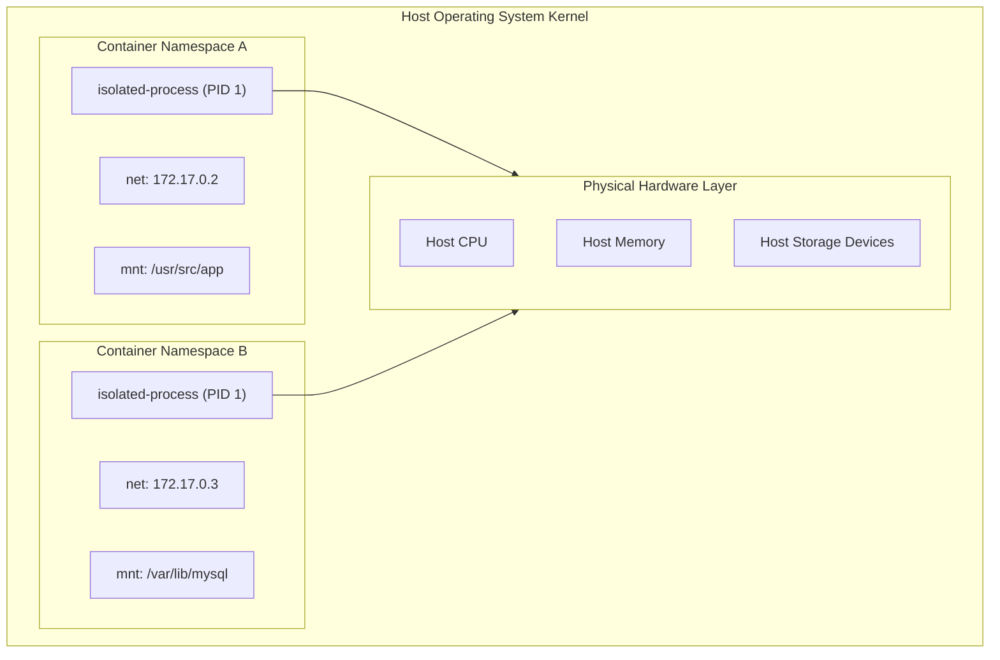
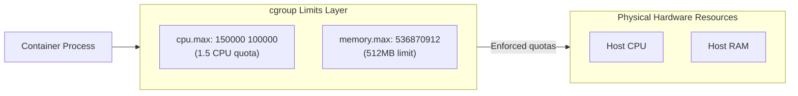
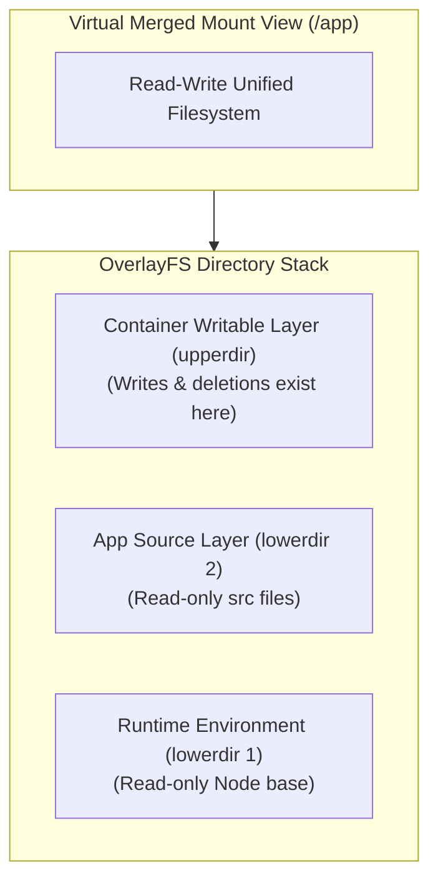

## Table of Contents

1. [Local Processes vs. Container Boundaries](#local-processes-vs-container-boundaries)
2. [The Process Isolation Container](#the-process-isolation-container)
3. [Under the Hood: Linux Namespaces](#under-the-hood-linux-namespaces)
4. [Resource Enforcement: Control Groups](#resource-enforcement-control-groups)
5. [The Client-Daemon Architecture](#the-client-daemon-architecture)
6. [Ephemeral Filesystems: The Layer Stack](#ephemeral-filesystems-the-layer-stack)
7. [Putting It All Together](#putting-it-all-together)
8. [What's Next](#whats-next)

## Local Processes vs. Container Boundaries

Docker is a packaging and runtime system for running an application as an isolated host process with a repeatable filesystem and controlled runtime boundaries.

When you develop a web application on your local laptop, the execution environment is highly permissive. You run a startup command, and the resulting process has full visibility into your laptop's filesystem, network cards, host libraries, and active system configuration. If your code needs a database, you point its client to a port on the local machine, assuming the database service is running and configured correctly.

This direct access is private, fast, and simple for local iteration. However, because the application is leaning on the specific, accidental state of your local machine, this model breaks down when moving to a production environment. 

A development machine might run Node 22 with specific operating system libraries installed. When you deploy the same code, the production server might run Node 20 or lack the exact image-processing libraries your dependencies expect. This environmental drift creates failures that are difficult to reproduce or diagnose from your local machine.

```plain
$ node src/server.js
Error: Cannot find module 'sharp'
    at Function.Module._resolveFilename (internal/modules/cjs/loader.js:880:15)
```

The error is not in the source code itself. The error is in the surrounding host environment, which is missing the required library bindings. 

Docker solves this by packaging the application and its running environment into a single, repeatable artifact called an image. An image is a saved filesystem plus startup metadata. When you start this image, Docker runs the application inside an isolated process boundary called a container.

Example: an API image can include Node 22, native image-processing libraries, compiled `dist/` files, and the default command `node dist/server.js`. A host with Docker can start that image without installing those application pieces directly on the host.

By defining the boundary deliberately, you isolate the process from host-level differences and ensure that it executes identically on every system.

## The Process Isolation Container

A container is a process boundary; a virtual machine is a full-machine boundary. Both isolate workloads, but they place the boundary at different layers.


*Docker does not create a second machine for the app; it narrows one host process with a repeatable filesystem and runtime boundary.*

Example: a VM for a Node API boots its own Linux kernel and operating system services before the API starts. A container for the same API starts the Node process on the host kernel, but with Docker-managed views of files, networking, processes, users, and resources.

To understand what Docker creates when you run an image, you must compare it to a standard virtual machine. Both options draw boundaries around your application to prevent resource interference, but they place the boundary in fundamentally different layers of the system.

A virtual machine draws its boundary around an entire guest operating system. It virtualizes the physical hardware, boots a dedicated guest kernel, loads system initialization scripts, starts background services, and runs your application within that massive OS container. This approach is highly secure and isolated, but it introduces massive resource overhead. A virtual machine requires gigabytes of disk space for the guest OS files, minutes to boot, and continuous memory overhead just to keep the guest kernel and operating system daemons running.

A container draws its boundary directly around a process running on the host system. There is no guest operating system, no virtualized hardware, and no secondary kernel. The application process runs directly on the host operating system's CPU and memory, sharing the host kernel with all other processes. Docker simply instructs the host kernel to apply strict runtime namespaces and resource filters around that specific process tree.

| System Property | Process Container | Virtual Machine |
| --- | --- | --- |
| Operating System | Shares the host kernel directly | Boots a full guest operating system |
| Startup Latency | Milliseconds (starts a normal process) | Minutes (boots guest BIOS and OS) |
| Disk Footprint | Megabytes (app binaries and libraries) | Gigabytes (guest OS kernel and tools) |
| Resource Utilization | Near-zero idle overhead | Constant guest kernel idle CPU and RAM |
| System Boundary | Logical namespace separation | Physical hardware hypervisor partition |

This process-level boundary makes containers highly lightweight. Because they share the host kernel, you can boot hundreds of containers on a single virtual machine node without running out of CPU or memory. 

However, sharing the host kernel means that containers do not provide absolute hardware isolation. If a process inside a container exploits a vulnerability in the shared host kernel, it can break through the logical boundaries and reach host system resources. For standard microservices, this shared model is a powerful efficiency win, but you must configure permissions and user namespaces carefully.

## Under the Hood: Linux Namespaces

A Linux namespace is a kernel scope that gives a process its own view of one system table, such as process IDs, network interfaces, hostnames, users, or mounted filesystems.

Docker does not use virtualization to isolate processes. Instead, the engine calls first-party Linux kernel features called namespaces to control what a process is allowed to see. When a program starts inside a container, the engine utilizes the `clone()` or `unshare()` system calls to launch the process within a set of isolated namespaces.

Example: inside an `orders-api` container, `ps` may show the Node server as PID 1, `hostname` may return `orders-api`, and `ip addr` may show a private container interface. The host still has its own process list, hostname, and network interfaces, but the container process cannot see most of that host view.



A namespace limits the visibility of system-level tables for a process. Under the hood, Linux supports six primary namespaces that Docker applies to every container process:

* **Process ID (PID) Namespace**: Restricts visibility of the system process table. Inside the container, the application process is assigned PID 1, making it look like the root process of the machine. The container process cannot see any processes running on the host or inside other containers, protecting the host system tree.
* **Network (NET) Namespace**: Isolates network resources, including virtual network cards, routing tables, and port bindings. The container process receives its own private loopback interface and virtual ethernet adapters, binding to ports independently of the host's ports.
* **Mount (MNT) Namespace**: Narrows the process's view of the filesystem. The process can only see the filesystem paths mounted from its image, completely hiding the host's root directory and preventing unauthorized read or write access to system files.
* **Interprocess Communication (IPC) Namespace**: Restricts shared memory tables, message queues, and semaphores. This prevents a compromised container process from intercepting memory messages sent between host services.
* **UNIX Timesharing System (UTS) Namespace**: Allows the container to declare its own hostname and domain name independently of the host's system name.
* **User (USER) Namespace**: Maps container user IDs (UIDs) and group IDs (GIDs) to different IDs on the host. This allows a process to run as `root` (UID 0) inside the container while mapping it to an unprivileged user (e.g., UID 10001) on the host, neutralizing the host privilege risk.

If you inspect a container's namespaces from the host terminal, you can trace where these boundaries are declared:

```plain
$ lsns -p 14205
        NS TYPE   NPROCS   COMMON_NAME
4026531835 mnt         1   /usr/src/app
4026531836 uts         1   orders-api
4026531837 ipc         1   
4026531838 pid         1   isolated-process
4026531839 net         1   172.17.0.2
4026531840 user        1   
```

These namespace IDs show that the process running under host PID 14205 has a container-specific system view. To that process, the outside world does not exist. It sees only the files, network interfaces, and process IDs mapped into its specific namespace structures.

## Resource Enforcement: Control Groups

A control group, or cgroup, is the kernel accounting and enforcement unit Docker uses to limit how much CPU, memory, and I/O a container process tree can consume.


*Namespaces, cgroups, and layers solve different parts of the container mental model: visibility, consumption, and filesystem repeatability.*

Namespaces control what a container process is allowed to *see*, but they do not control what that process is allowed to *consume*. Without a resource limit, an isolated process inside a container can consume 100% of the host's CPU and memory, starving other containers and freezing the host system.

Example: you can let `orders-api` see its normal container filesystem and network namespace while still limiting that process tree to `512m` of memory and `1.5` CPUs. The app keeps its container view, but the kernel has a clear ceiling for its resource use.

To prevent this "noisy neighbor" problem, Docker uses a Linux kernel feature called control groups, commonly known as cgroups. A cgroup groups processes together and enforces strict limits on CPU shares, memory allocation, block device I/O throughput, and network traffic.



On a Linux host, cgroup configurations are exposed directly through the virtual filesystem under `/sys/fs/cgroup/`. When you set memory or CPU limits on a container, the Docker engine creates a dedicated sub-directory inside this path and writes the resource quota values directly into the kernel's configuration files.

For example, if you run a container with a 512MB memory limit, the engine creates a directory structure and sets the limit in the memory control files:

```plain
$ cat /sys/fs/cgroup/docker/<container-id>/memory.max
536870912
```

The host kernel's memory management subsystem monitors every allocation request made by the container's process tree. If the application process leaks memory and attempts to allocate more than the configured limit, the kernel rejects the request and invokes the Out-Of-Memory (OOM) killer. The kernel immediately terminates the process inside the container namespace, returning exit code 137 to the Docker engine.

Similarly, CPU limits are enforced using the Completely Fair Scheduler (CFS) period and quota controllers. If you limit a container to 1.5 CPUs, the kernel allocates a period window (typically 100,000 microseconds) and grants the container process a quota window (150,000 microseconds). Once the process consumes its allocated time within that window, the kernel throttle scheduler blocks the process from executing until the next period cycle begins, preventing CPU starvation across the node.

## The Client-Daemon Architecture

Docker's client-daemon architecture splits user commands from privileged host work. The `docker` command you type into your terminal is a client CLI tool. It does not perform any container isolation, image layer storage, or network routing itself. Instead, it translates your commands into REST API calls and forwards them to a background engine process called the Docker Daemon (`dockerd`).

Example: when you run `docker run nginx`, the terminal command does not create namespaces by itself. It sends a request to `dockerd`, and the daemon coordinates image storage, network setup, and the lower-level runtime that starts the process.

```mermaid
flowchart LR
    subgraph UserInterface["Client Tier"]
        Client["Docker Client<br/>(CLI Tool)"]
    end
    subgraph EngineTier["Engine Daemon Tier"]
        Daemon["Docker Daemon<br/>(dockerd)"]
        Socket["UNIX Socket<br/>(/var/run/docker.sock)"]
    end
    subgraph RuntimeTier["Container Runtime Tier"]
        Containerd["containerd<br/>(Supervisor)"]
        Shim["containerd-shim<br/>(Zombie control)"]
        RunC["runC<br/>(OCI Engine)"]
    end

    Client -->|REST API over TCP/UNIX| Socket
    Socket --> Daemon
    Daemon -->|gRPC RPC Calls| Containerd
    Containerd --> Shim
    Shim --> RunC
    RunC -->|Syscalls (clone, setns)| KernelProcess["Isolated Process"]
```

The Docker Daemon acts as the system manager. It listens on a local UNIX socket (`/var/run/docker.sock`) or a configured network port, authenticates clients, verifies schemas, pulls images from registries, and manages local storage volumes and bridge networks.

However, the daemon itself does not directly manage the lifecycle of container processes. Instead, it delegates process execution to specialized lower-level runtime services following Open Container Initiative (OCI) standards:

* **containerd**: A highly stable, industry-standard container supervisor. It manages image distribution, local network namespaces, metadata storage, and supervises active shim instances.
* **containerd-shim**: A tiny, persistent wrapper process spawned for every running container. The shim remains active even if the parent Docker Daemon restarts, ensuring that the container process can write to stdout/stderr and receive signals without depending on a running daemon process.
* **runC**: The reference OCI-compliant runtime binary. It performs the direct, low-level operating system work of creating namespaces, applying cgroup quotas, and executing the container's entrypoint, then exits immediately after launching the application process.

This architecture has important operational gotchas for development workflows. If you develop on macOS or Windows, the host operating system does not support native Linux namespaces or cgroups. 

To bridge this gap, Docker Desktop boots a lightweight Linux utility virtual machine (typically running on a hypervisor like HyperKit or WSL2) to act as the true container host. The Docker Client on your laptop sends commands across a TCP port or named pipe to the Docker Daemon running *inside* that virtual machine.

This virtualization layer is invisible during simple runs, but it introduces three gotchas:
* **Bind Mount Performance**: Mounting host laptop directories into containers requires continuous filesystem translation between macOS/Windows and the Linux VM, which can slow down I/O-heavy applications like database compilation.
* **Localhost Port Resolution**: Port mapping must be routed from your laptop's interface, through the VM's network bridge, and into the container namespace, occasionally masking network latency or masking firewall drops.
* **Resource Allocations**: The cgroup memory and CPU limits enforce boundaries within the Linux VM's allocated pool, not your laptop's total hardware pool. If the VM is restricted to 4GB of RAM, a container with a 6GB limit will trigger an immediate OOM crash.

## Ephemeral Filesystems: The Layer Stack

Docker's layer stack is the filesystem assembly model that lets many containers share the same read-only image files while keeping each container's runtime writes separate.

Every container process requires a root filesystem containing libraries, execution binaries, and application files. To keep disk usage low and startup times fast, Docker uses an ephemeral layer stack managed by the OverlayFS storage driver.

Example: ten containers can run from the same `node:22-alpine` base layers. Each one shares the read-only Node and Alpine files, but each container gets its own small writable layer for files it creates at runtime.

An image is composed of one or more read-only layers. Each layer represents the difference introduced by a specific instruction in the build recipe (such as copying source code or running a package install). These layers are cryptographically verified by their SHA256 content hash and are stored as immutable, read-only tarballs in the Docker engine's local storage engine.



When you start a container from an image, the engine does not duplicate these read-only layers. Instead, it mounts them as a read-only stack (`lowerdir`) and creates a thin, empty read-write directory (`upperdir`) on top. The OverlayFS driver merges these layers into a single virtual mount directory (`merged`), which becomes the root directory of the container's mount namespace.

This layer stack employs a copy-on-write (COW) optimization to handle filesystem edits:
* **Read Operations**: If the container process reads a file (e.g., a node library), the OverlayFS driver searches the layers from top to bottom. It serves the file directly from the first read-only layer where it exists, introducing zero copy overhead.
* **Write Operations**: If the container process attempts to modify a file that exists in the read-only image layers, the OverlayFS driver intercepts the system call. It copies the file from the read-only layer up to the writable container layer (`upperdir`) first, and then applies the write operation there. The original file in the image layer remains unchanged, protecting future containers.
* **Deletions**: If the process deletes a file from the image layers, OverlayFS writes a special "whiteout" character record in the writable layer, hiding the file from the virtual merged view without modifying the immutable base image.

The writable layer is bound strictly to the lifetime of the container. If you delete the container, its writable layer is permanently purged, and all generated logs, session tokens, or transaction files vanish. 

To persist data across container replacements, you must declare explicit storage mount boundaries, which later chapters cover in detail.

## Putting It All Together

Return to the API that behaved differently across developers' laptops. Docker standardizes this environment by shifting the boundary from virtual machines down to isolated operating system processes.

* **Process Isolation**: Containers share the host kernel, eliminating the heavy disk, CPU, and memory overhead of guest operating systems.
* **Namespaces**: Create process-specific system views across PIDs, networks, mount paths, and user roles.
* **Control Groups**: Enforce strict CPU quotas and memory limits, protecting the host system from resource starvation and noisy-neighbor processes.
* **Engine Architecture**: Separates the client CLI from the Docker Daemon, which delegates OCI lifecycle execution to `containerd` and `runC` across host VM boundaries.
* **Layer Stacks**: Combine read-only image tarballs with a thin, copy-on-write container layer via OverlayFS to ensure instant startup speeds and lightweight footprints.

By utilizing these process isolation blocks, you make the runtime environment visible, repeatable, and secure.

## What's Next

Now that we have established the mental model of how Docker isolates a process on a host system, our next step is to examine the daily developer loop. We need to translate this theoretical boundary model into active operational commands.

In the next chapter, we will follow a small application through the active **Docker Workflow**. We will examine the lifecycle commands used to build images, run containers in foreground and background modes, inspect logs, spawn diagnostic shells, and clean up retired resources without losing local development state.


*The summary ties Docker back to three durable ideas: image artifact, process boundary, and host engine.*

---

**References**

- [Docker overview](https://docs.docker.com/get-started/docker-overview/) - Official architecture overview covering client, daemon, registries, and runtime objects.
- [Namespaces - Linux manual page](https://man7.org/linux/man-pages/man7/namespaces.7.html) - Technical manual detailing namespace types, API system calls, and isolation flags.
- [Control Groups - Linux manual page](https://man7.org/linux/man-pages/man7/cgroups.7.html) - Technical documentation covering cgroups, resource limits, controllers, and virtual filesystems.
- [Overlay Filesystem](https://www.kernel.org/doc/html/latest/filesystems/overlayfs.html) - Official Linux kernel documentation on OverlayFS stacked directory mounts and copy-on-write behavior.
- [OCI Runtime Specification](https://github.com/opencontainers/runtime-spec) - The Open Container Initiative standards defining runtime configurations, filesystem layouts, and execution steps.
