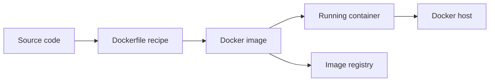
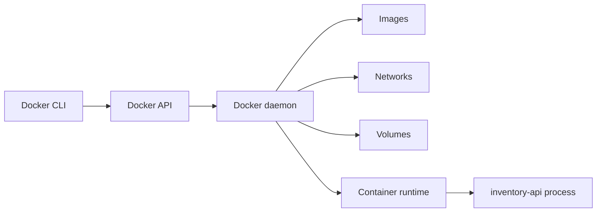
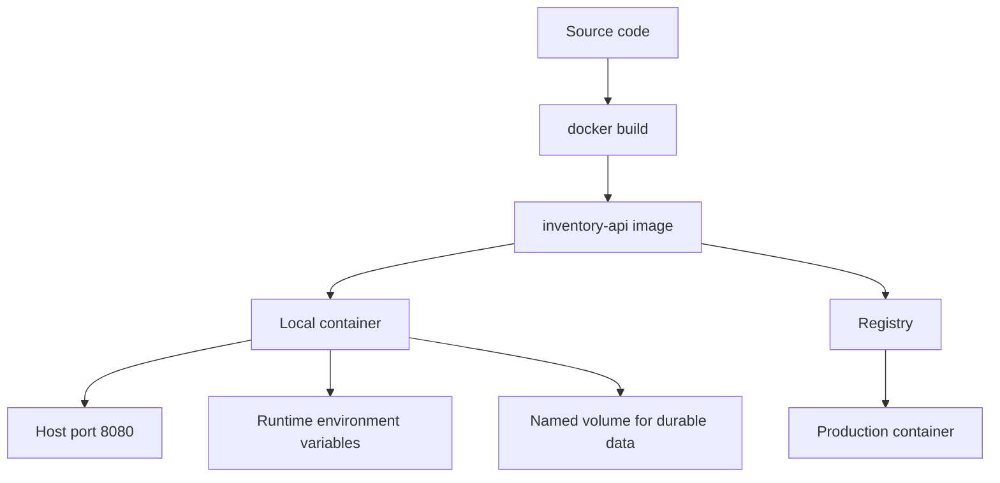

## Table of Contents

1. [The Path We Will Follow](#the-path-we-will-follow)
2. [The Problem Docker Solves](#the-problem-docker-solves)
3. [Images](#images)
4. [Containers](#containers)
5. [Docker Engine](#docker-engine)
6. [Registries](#registries)
7. [Files, Ports, Environment, and Volumes](#files-ports-environment-and-volumes)
8. [Containers and Virtual Machines](#containers-and-virtual-machines)
9. [Putting It All Together](#putting-it-all-together)
10. [What's Next](#whats-next)

## The Path We Will Follow
<!-- section-summary: This section follows one application from source code to image to running container. -->

Let's follow a small Node service called `inventory-api`. It reads product records from a database and exposes an HTTP endpoint on port `3000`. On a developer laptop, the team can run it with `npm start`, and the exact result depends on the Node version, installed packages, native libraries, environment variables, and database settings on that laptop.

Docker gives this team a way to package the application and its runtime setup into a reusable **image**, then start that image as a **container** on any machine that runs Docker. The image answers "what files and startup command should this app use?" The container answers "what is running right now?"



We will walk through the pieces in that order. First we will name the environment problem Docker solves, then we will look at images, containers, the Docker Engine, registries, runtime settings, and the difference between containers and virtual machines.

## The Problem Docker Solves
<!-- section-summary: Docker packages the app and its runtime environment so teams avoid depending on accidental laptop setup. -->

A **runtime environment** is everything an application needs around the code to start correctly. For `inventory-api`, that means Node, npm packages, compiled files, operating system libraries, a startup command, a port, and settings such as `DATABASE_URL`. If one developer has Node 22 and another has Node 20, the same source code can behave differently before anyone reaches production.

This shows up in ordinary team work. A new engineer clones the repository, installs dependencies, and sees a native package fail because their laptop lacks a Linux library. A CI job uses a clean machine and fails because a local `.env` file is missing there. A production host has the right source code and an older runtime, so the server starts and then crashes on the first request.

Docker addresses that by moving more of the environment into a repeatable artifact. The team writes down the operating system base, runtime, package install steps, copied files, exposed port, and startup command. Docker turns that recipe into an image, and every container created from that image receives the same application filesystem and default command.

For the inventory team, the practical value is simple. A developer can build `inventory-api:local`, CI can build the same service, and production can pull a reviewed image from a registry. The app still needs real configuration and real dependencies, and the basic runtime now follows the setup captured in the image.

Now that we know the problem, the first Docker object to understand is the image.

## Images
<!-- section-summary: An image is the packaged application filesystem and startup metadata that Docker can run many times. -->

A **Docker image** is a read-only package of files and metadata. It usually contains a base operating system filesystem, language runtime, application dependencies, application code, and default startup instructions. You can think of it as the saved application bundle Docker uses to create containers.

The common way to create an image is with a **Dockerfile**. A Dockerfile is a plain file of build instructions. Each instruction adds or configures part of the image, and Docker can reuse previous build results through its build cache when the relevant instruction and input files stay the same.

Here is a small Dockerfile for `inventory-api`:

```dockerfile
FROM node:22-alpine
WORKDIR /app
COPY package*.json ./
RUN npm ci --omit=dev
COPY src ./src
EXPOSE 3000
CMD ["node", "src/server.js"]
```

The `FROM` line chooses the base image. In this case, the team starts from Node 22 on Alpine Linux because the service needs Node and a small Linux userland. The `WORKDIR` line chooses the default folder for later commands. The `COPY` and `RUN` lines place dependency files in the image and install production packages.

The final `COPY` brings the source code into the image. `EXPOSE 3000` documents the port the application expects to listen on inside the container. `CMD ["node", "src/server.js"]` gives Docker the default command to run when someone creates a container from this image.

When the team builds the image, they give it a tag:

```bash
docker build -t inventory-api:local .
```

The tag `inventory-api:local` gives humans a name for the image. The final `.` sends the current directory as the **build context**, which means the builder can use files from that directory during `COPY` and `ADD` instructions. Large build contexts slow down builds and can accidentally include secrets, so teams usually add a `.dockerignore` file to keep folders such as `node_modules`, `.git`, and local credentials out of the build input.

Images use **layers** under the hood. A layer records the filesystem change from one build step, such as installing packages or copying source code. Docker stores those layers by content and can share them across images, which speeds up rebuilds and downloads across services that share the same base.

An image by itself simply sits in Docker's local image store. The next step turns that package into a running process.

## Containers
<!-- section-summary: A container is a running process created from an image with its own filesystem, network, and process view. -->

A **container** is a running instance of an image. Docker creates a container record, gives it a writable layer on top of the image, sets up network and process isolation, and starts the image's default command. For `inventory-api`, the main container process is `node src/server.js`.

The first local run might look like this:

```bash
docker run --name inventory-api -p 8080:3000 -e PORT=3000 inventory-api:local
```

This command creates and starts a container named `inventory-api` from the image tag `inventory-api:local`. The `-e PORT=3000` flag passes an environment variable into the container. The `-p 8080:3000` flag publishes host port `8080` to container port `3000`, so a browser on the host can call `http://localhost:8080` while the application listens on `3000` inside its container.

Inside the container, the application sees a filesystem assembled from the image plus its own writable layer. It also sees a container-specific process tree and network interface. Docker's official run documentation describes this as an isolated process with its own filesystem, networking, and process tree separate from the host.

That writable layer matters during debugging. If a developer opens a shell in the running container and creates `/tmp/debug.json`, that file belongs to that container's writable layer. A new container from the same image receives the original image files again, while persistent data needs a volume or another storage boundary.

Containers give the image a live process, and a privileged host component must create that process and manage its lifecycle. That component is the Docker Engine.

## Docker Engine
<!-- section-summary: Docker Engine connects the CLI, API, daemon, image store, networks, volumes, and container runtime work. -->

**Docker Engine** is the client-server system that creates and runs Docker containers. The `docker` command in your terminal is the client. It sends API requests to the Docker daemon, usually called `dockerd`, and the daemon manages Docker objects such as images, containers, networks, and volumes.

This split is important because the terminal command itself does very little host-level work. When someone types `docker run`, the client sends a request. The daemon checks the image, prepares storage and networking, coordinates the lower-level runtime, and tracks the container's state.



On Linux servers, the Docker Engine usually runs directly on the host operating system. On Docker Desktop for macOS and Windows, Docker runs the Engine inside a lightweight Linux virtual machine and routes filesystem and network operations between that VM and the native host. This is why the same `docker run -p 8080:3000` command can still make a container available through `localhost` on a Mac or Windows laptop.

The daemon also keeps local state. It stores pulled images, built images, stopped container records, networks, volumes, and build cache. That local state makes Docker fast during development, and it also explains why old containers and images can consume disk space until the team cleans them up.

So far, everything lives on one machine. Real teams also need a place to share images between laptops, CI, staging, and production.

## Registries
<!-- section-summary: A registry stores image repositories so teams can pull the same reviewed artifact in different environments. -->

A **container registry** stores and distributes images. Docker Hub is Docker's public registry service, and many teams also use private registries such as Amazon ECR, Google Artifact Registry, Azure Container Registry, GitHub Container Registry, or a private Docker Hub organization. The registry gives the team a shared place to publish the exact image that passed review.

An image name can include a registry host, organization or namespace, repository, and tag:

```bash
registry.example.com/platform/inventory-api:2026-06-13.1
```

The repository is `platform/inventory-api`, and the tag is `2026-06-13.1`. A production pipeline can push that image after tests pass. A deployment system can pull that same tag on a server or Kubernetes cluster and create containers from it.

```bash
docker tag inventory-api:local registry.example.com/platform/inventory-api:2026-06-13.1
docker push registry.example.com/platform/inventory-api:2026-06-13.1
docker pull registry.example.com/platform/inventory-api:2026-06-13.1
```

Tags make images readable, and teams should treat important release tags with care. Docker documents that tags can move when publishers update them, so production teams often use clear version tags, immutable registry policies, or image digests for release tracking. A digest points to image content by hash, which gives deployment records a stronger link to the exact bytes that ran.

The image now has a build path and a sharing path. The next practical question is how the container talks to the outside world and keeps data that should survive replacement.

## Files, Ports, Environment, and Volumes
<!-- section-summary: Runtime settings decide what a container can read, where it listens, which config it receives, and where durable data lives. -->

Every container has a few daily knobs that developers touch all the time: files, ports, environment variables, and mounts. These settings decide how the packaged process connects to the real machine around it. The `inventory-api` image can be identical in development and production, while each environment passes different database URLs, ports, and storage choices.

**Files** come from the image layers and the container's writable layer. Image files give the app its packaged runtime and source code. The writable layer catches runtime changes such as temporary files, generated uploads, or package caches created after startup.

**Ports** connect a container's private network namespace to the host. If the API listens on `3000` inside the container, `-p 8080:3000` lets host traffic reach it on `8080`. Docker Desktop adds an extra routing step through its Linux VM, and the developer still uses the host port from the browser.

**Environment variables** pass runtime configuration into the process. The image can contain the application code, while each environment passes settings such as `DATABASE_URL`, `LOG_LEVEL`, and `PORT`. This keeps one image reusable across development, staging, and production.

```bash
docker run \
  --name inventory-api \
  -p 8080:3000 \
  -e PORT=3000 \
  -e DATABASE_URL=postgres://inventory:secret@db:5432/inventory \
  inventory-api:local
```

**Volumes** store data outside the container's writable layer. A named volume belongs to Docker and can survive after the container using it has been removed. This matters for stateful tools such as a local PostgreSQL database, because the volume protects data during routine container deletion and recreation.

```bash
docker volume create inventory-db-data

docker run \
  --name inventory-db \
  -e POSTGRES_PASSWORD=secret \
  -v inventory-db-data:/var/lib/postgresql/data \
  postgres:16
```

Bind mounts solve a different development problem. A **bind mount** connects a specific host path into a container, which lets a local development container read files from the working tree as the developer edits them. Teams use bind mounts for fast local feedback, then still run clean image builds to prove the Dockerfile can package the app without depending on the live host folder.

These runtime settings make containers useful day to day. They also lead to the classic comparison: how does this differ from using a virtual machine?

## Containers and Virtual Machines
<!-- section-summary: Containers package processes on a shared host kernel, while virtual machines package whole guest operating systems. -->

A **virtual machine** includes virtual hardware, a guest operating system, its own kernel, system services, and the application. A **container** shares the host kernel and runs the application as an isolated process with Docker-managed filesystem, network, and process boundaries. Both approaches isolate workloads, and they place the boundary at different layers.

For `inventory-api`, a VM approach might create an Ubuntu VM, install Node, copy the app, configure systemd, open a port, and keep that guest OS patched. A container approach builds an image with Node and app files, then starts a process from that image on a host already running Docker. The container usually starts faster and uses less idle memory because it skips the guest OS boot path.

| Topic | Container | Virtual machine |
| --- | --- | --- |
| Runtime boundary | Process on a Docker host | Whole guest machine |
| Kernel | Shares the host kernel | Uses a guest kernel |
| Startup feel | Starts like an application process | Boots an operating system |
| Package content | App files, runtime, libraries, metadata | Guest OS plus app setup |
| Common use | Services, jobs, dev environments, CI steps | Strong OS separation, legacy hosts, mixed kernels |

The shared-kernel design gives containers their speed and density. It also means security still needs attention. Teams reduce risk by using trusted base images, keeping hosts patched, running processes as non-root where possible, limiting capabilities, scanning images, and giving containers only the mounts and network access they need.

This comparison gives a useful boundary for Docker. Docker packages and runs application processes in repeatable containers. VM platforms package entire machines. Many production systems use both: a cloud VM or node runs the Docker Engine, and Docker runs multiple containers on that node.

## Putting It All Together
<!-- section-summary: Docker connects a build artifact, runtime process, host engine, registry, and storage boundary into one deployment path. -->

Let's replay the inventory API from the top. The team writes a Dockerfile that installs Node dependencies, copies source files, exposes port `3000`, and declares `node src/server.js` as the startup command. Docker builds that recipe into the image `inventory-api:local`.

The developer starts a container from the image and publishes container port `3000` to host port `8080`. The process runs with its own filesystem and network view, receives configuration through environment variables, and writes temporary files into the container writable layer. Durable database files live in a named volume instead of the application container.

When the image passes tests, the pipeline tags it with a release name and pushes it to a registry. Staging and production pull the same image and create new containers from it. This gives the team a repeatable path from source code to a running service.

The important pieces fit together like this:



Docker's core idea is practical: define the application package once, then run containers from that package wherever the Docker host can support it. The details matter because they all serve that path from code to image to container.

## What's Next

You now have the vocabulary for Docker's main objects: images, containers, the Docker Engine, registries, ports, environment variables, volumes, and the VM comparison. The next article turns those nouns into daily commands.

We will follow the same `inventory-api` through the everyday Docker workflow: build, run, inspect, stop, remove, rebuild, replace, debug, and clean up local state.

---

**References**

- [Docker overview](https://docs.docker.com/get-started/docker-overview/) - Official overview of Docker's purpose, architecture, images, containers, registries, Docker Desktop, and the client-daemon model.
- [Docker Engine](https://docs.docker.com/engine/) - Describes the Docker CLI, Docker APIs, Docker daemon, and Docker objects such as images, containers, networks, and volumes.
- [Running containers](https://docs.docker.com/engine/containers/run/) - Explains containers as isolated processes with their own filesystem, networking, and process tree.
- [Docker Desktop networking](https://docs.docker.com/desktop/features/networking/) - Documents how Docker Desktop runs the Engine inside a lightweight Linux VM and routes ports and file operations.
- [Storage drivers](https://docs.docker.com/engine/storage/drivers/) - Explains image layers, writable container layers, and copy-on-write behavior.
- [Volumes](https://docs.docker.com/engine/storage/volumes/) - Defines Docker-managed persistent data stores and their lifecycle outside an individual container.
- [Bind mounts](https://docs.docker.com/engine/storage/bind-mounts/) - Documents host-path mounts, syntax, constraints, and Docker Desktop behavior.
- [Build context](https://docs.docker.com/build/concepts/context/) - Explains which files the builder can access during image builds.
- [Docker Hub quickstart](https://docs.docker.com/docker-hub/quickstart/) - Introduces Docker Hub as a registry for finding, building on, and sharing images.
- [Building best practices](https://docs.docker.com/build/building/best-practices/) - Covers build cache, base image tag behavior, and image build guidance.
