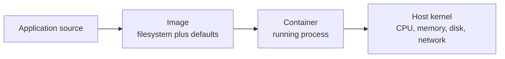

## Table of Contents

1. [The Problem](#the-problem)
2. [The Mental Model](#the-mental-model)
3. [Containers and VMs](#containers-and-vms)
4. [Images](#images)
5. [Containers](#containers)
6. [The Docker Engine](#the-docker-engine)
7. [Where Isolation Ends](#where-isolation-ends)
8. [Seeing the Boundary](#seeing-the-boundary)
9. [Failure Modes](#failure-modes)
10. [Putting It All Together](#putting-it-all-together)
11. [What's Next](#whats-next)

## The Problem

An API works on one developer laptop and fails everywhere else. The code is the same, but the machine around it is not. One person has Node 22, another has Node 20, CI has an older package manager, and the staging host is missing an operating-system library used by an image processing dependency. The service itself is small. The environment required to run it is the part nobody can see clearly.

The same pattern appears in several forms:

- A teammate clones the repository, runs the setup commands, and gets a dependency error that nobody else sees.
- CI passes the unit tests but fails when the application starts because a system package is missing.
- A staging host has an old build output directory, so the process starts code that is not the code that was reviewed.

Docker solves this by making the application environment an explicit artifact. Instead of asking every machine to recreate the right runtime by hand, Docker lets the team build an image that contains the application files, dependencies, runtime, and default startup command. A container is what happens when that image is started as a process on a host.

That distinction matters. Docker gives the deployment command a packaging and runtime model. The image answers, "What filesystem and defaults should this app have?" The container answers, "What isolated process is running from that image right now?"

## The Mental Model

Start with a normal process. When you run `node dist/server.js` on your laptop, the process sees your laptop's filesystem, network interfaces, environment variables, process table, users, and installed libraries. Some of those details are intentional. Many are accidental. Your application can pass locally because it is leaning on something your machine happens to have.

Docker puts a boundary around that process. Inside the boundary, the process sees a filesystem assembled from the image, a network namespace chosen by Docker, environment values passed at creation time, and a process tree that looks mostly like its own small machine. Outside the boundary, the host still owns the real kernel, CPU, memory, disk, and network hardware.



This is the central Docker model. You build an image from source and a Dockerfile. You create containers from that image. The host runs those containers using operating-system isolation features.

That host relationship is the reason Docker gets compared to virtual machines. Both create boundaries around work, but they put the boundary in a different place.

## Containers and VMs

Docker is often introduced next to virtual machines because both give teams a boundary around work. The boundary sits in a different place.

A virtual machine draws the boundary around a whole guest operating system. It has virtual hardware, a guest kernel, OS services, users, packages, and the application. That shape is useful when the workload expects to own the machine: system services, kernel settings, a Windows or Linux OS contract, or several processes that are managed together.

A container draws the boundary around a process and the filesystem view it needs. The process can see its image files, environment variables, network namespace, users, and mounts, but the host kernel still does the real operating-system work. That shape is useful when the workload is one application service with clear runtime inputs and durable state somewhere else.

| Boundary question | Container | Virtual machine |
| --- | --- | --- |
| Kernel | Shares the host kernel | Has a guest kernel |
| Startup | Starts a process after Docker prepares isolation | Boots an OS before services start |
| Resource shape | Lightweight per service instance | Machine-shaped and heavier |
| Workload fit | API, worker, CI job, short-lived task | Legacy server, OS service bundle, kernel-specific workload |
| Main risk | Weak runtime settings can expose host resources | More OS patching, bootstrapping, and machine drift |

For the orders API, a container is the natural unit. The service needs Node, application files, environment variables, a port, logs, and an external database. It does not need its own kernel or a full init system.

That does not mean VMs disappear. Many production container platforms run containers on VMs. Kubernetes worker nodes are often virtual machines, and each node runs many containers. The VM gives the platform a machine boundary for capacity, patching, network placement, and node identity. Docker gives the application a smaller boundary for packaging and replacement.

## Images

An image is the packaged environment. It contains the files, binaries, libraries, and configuration needed to start a container. For a Node API, that may include a Linux base filesystem, the Node runtime, dependency files, compiled application code, and metadata such as the default command.

Images are read-only templates. Running the image does not edit the image. Docker creates a container with a writable layer on top, starts the configured process, and keeps the original image available for future containers. This means ten containers can start from the same image without each one owning a separate full copy of the base filesystem.

An image usually comes from a Dockerfile:

```dockerfile
FROM node:22-alpine
WORKDIR /app
COPY package*.json ./
RUN npm ci
COPY . .
CMD ["node", "server.js"]
```

The Dockerfile is a build recipe. It says which base image to start from, which files to copy, which commands to run while building, and which command should run later by default. The image is the result of following that recipe.

The non-obvious part is that image contents are supposed to be boring. An image should not depend on a developer's untracked local file, hidden package cache, or shell history. If the Dockerfile and build context cannot reproduce the image on a clean machine, the image has only moved the environment problem into a new place.

## Containers

A container is a running instance of an image. If the image is the packaged filesystem and defaults, the container is the actual process using them.

When Docker starts a container, it chooses an image, creates a writable container layer, applies runtime settings, and starts the main process. That process is special inside the container because it is the container's reason to exist. If the process exits, the container stops. Docker is not booting a full server and then running your app as one service among many. It is starting the configured process directly.

This explains why container state can surprise new users. If a process writes a file inside the container and then the container is removed, that write disappears with the container's writable layer. The image remains unchanged. Persistent data needs an explicit storage boundary, such as a Docker volume or bind mount, which later articles cover in detail.

Containers also have runtime configuration that is separate from the image. A single image can run with different environment variables, different port publishing rules, different names, and different mounts:

```bash
docker run --name orders-api -p 8080:3000 -e NODE_ENV=production orders-api:local
```

The image may say the app listens on port 3000 inside the container. The run command decides that host port 8080 should forward to it. The image may set a default environment value. The run command can override it for a specific environment. This split keeps the artifact stable while allowing each runtime environment to supply local facts.

## The Docker Engine

Docker has a client and a server-side engine. The `docker` command you type is the client. It sends requests to the Docker daemon or engine. The engine builds images, pulls images, creates containers, attaches networks, mounts storage, and asks the underlying container runtime to start processes.

That separation explains why a Docker command can fail even when the command syntax is correct. If the engine is not running, the client has nobody to talk to. If the engine runs inside Docker Desktop's Linux VM on macOS or Windows, the filesystem and networking boundary includes that VM. A bind mount from your laptop still works, but it is being mediated through Docker Desktop rather than directly through a native Linux host.

The engine also owns local image and container state. When you run `docker images`, you are not listing files in your project directory. You are asking the engine which image records it has stored locally. When you run `docker ps`, you are asking which containers the engine is tracking. Removing a source directory does not remove an image, and deleting an image does not delete your source code.

## Where Isolation Ends

Docker isolation is useful because it gives the process a controlled view of the system, but the boundary is not absolute. Containers share the host kernel. A container can consume host CPU and memory. Published ports become reachable through the host network. Bind mounts expose host files into the container. Privileged containers or broad capabilities weaken the boundary further.

The practical lesson is to treat a container as an isolated process, not as a security force field. If you mount your project directory into a container, the container can change those files according to the mount permissions. If you publish a database port on all interfaces, other machines may be able to reach it. If you run as root inside the container and mount sensitive host paths, the blast radius grows.

The most useful Docker setups make boundaries explicit:

| Boundary | What Docker controls | What you still decide |
| --- | --- | --- |
| Filesystem | Image layers and container writable layer | Volumes, bind mounts, secrets, generated files |
| Network | Container network namespace | Published ports, network attachment, listening addresses |
| Process | Container process tree | Entrypoint, command, restart policy, signal handling |
| Resources | Runtime limits when configured | CPU and memory budgets, noisy-neighbor risk |

The boundary is a tool. It keeps accidental machine differences away from the application, but it still needs careful choices.

## Seeing the Boundary

A short inspection can make the model visible. Suppose an image starts a web server:

```bash
docker run --name demo -d -p 8080:3000 orders-api:local
docker ps
```

The `docker ps` output ties together the moving parts:

```text
CONTAINER ID   IMAGE              COMMAND                  STATUS        PORTS
7a3c1f0d91b2   orders-api:local   "node dist/server.js"    Up 4 seconds  0.0.0.0:8080->3000/tcp
```

The image column names the template. The command column shows the main process Docker started from the image defaults. The port mapping shows that host port 8080 forwards to container port 3000. None of those fields alone is Docker. Together, they show the artifact, process, and host boundary.

If the process exits, `docker ps` no longer shows it by default because the container is stopped. `docker ps -a` still shows the container record, which lets you inspect logs or restart it. That difference is a common first debugging clue: "I cannot reach the app" may mean the port is wrong, but it may also mean the main process already exited.

## Failure Modes

Docker removes many environment differences, but it introduces a few failure modes that follow directly from the model.

The first is confusing image build time with container run time. `RUN npm ci` happens while building the image. `CMD ["node", "dist/server.js"]` happens when a container starts. If a database is unavailable during `docker build`, the build should usually not care. If the app cannot reach the database during `docker run`, the runtime configuration or network is the place to look.

The second is assuming container files persist because they look like normal files. A container can write to its own filesystem, but that writable layer belongs to that container. Remove the container, and those writes go with it unless they were written through a volume or bind mount.

The third is treating `EXPOSE` as port publishing. `EXPOSE 3000` records that the image expects a service on port 3000. It does not make `localhost:3000` work on the host. Publishing happens when the container is created, usually with `-p HOST_PORT:CONTAINER_PORT`.

The fourth is forgetting that Docker Desktop adds another host boundary on macOS and Windows. The Linux container still needs a Linux kernel. Docker Desktop provides that through a VM, so path sharing, network behavior, and file watching can differ from native Linux.

## Putting It All Together

Return to the API that behaved differently across machines. Docker gives the team a smaller set of moving parts to reason about.

- The image packages the runtime, dependencies, application files, and default command.
- The container starts one isolated process from that image.
- Containers share the host kernel, while virtual machines carry a guest operating system and kernel.
- Runtime settings supply local facts such as environment variables, port publishing, and storage mounts.
- The Docker engine stores image and container state separately from the project directory.
- Isolation removes accidental machine differences, but the host kernel, mounted files, published ports, and resource limits still matter.

The starting question has grown from "how do we run a command?" into "how do we make the runtime environment visible and repeatable?" Docker's answer is image first, container second, runtime settings last.

## What's Next

The next article follows the daily Docker workflow. Once the image and container model is clear, commands such as `build`, `run`, `logs`, `exec`, `stop`, and `rm` stop feeling like a memorized list. They become operations on a small lifecycle: create an artifact, start a process, inspect it, change the code, and repeat.

---

**References**

- [Docker Docs: Docker overview](https://docs.docker.com/get-started/docker-overview/)
- [Docker Docs: What is an image?](https://docs.docker.com/get-started/docker-concepts/the-basics/what-is-an-image/)
- [Docker Docs: What is a container?](https://docs.docker.com/get-started/docker-concepts/the-basics/what-is-a-container/)
- [Docker Docs: Run containers](https://docs.docker.com/engine/containers/run/)
