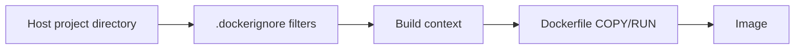

## Table of Contents

1. [The Problem](#the-problem)
2. [The Visibility Boundary](#the-visibility-boundary)
3. [What the Dot Means](#what-the-dot-means)
4. [.dockerignore](#dockerignore)
5. [Context Shape](#context-shape)
6. [Remote Builders](#remote-builders)
7. [Failure Modes](#failure-modes)
8. [Putting It All Together](#putting-it-all-together)
9. [What's Next](#whats-next)

## The Problem

A Docker build works locally but fails in CI. Locally, the image starts because `dist/` already exists from a previous build. In CI, the directory is missing. Another service has the opposite problem: the image works in CI but accidentally contains a `.env` file from a developer laptop. A third build is simply slow because Docker transfers hundreds of megabytes of `node_modules`, coverage reports, and Git history before the first real instruction can run.

All three problems come from the same place: the build context. The context is the set of files Docker is allowed to use during a build. The Dockerfile does not read your whole machine. It reads from this boundary.

Once you see the context as a boundary, `.dockerignore` becomes a design tool. It decides which local files are invisible to the builder before `COPY` ever runs.

## The Visibility Boundary

When you run a build, Docker sends a context to the builder. With a local directory context, that context is usually a directory tree from your machine after ignore rules are applied. The Dockerfile can copy files from that tree. It cannot copy random siblings or parent directories just because they exist nearby.



The important sequence is that ignore filtering happens before Dockerfile copy instructions. If `.dockerignore` excludes `.env`, then `COPY . .` will not copy `.env` because the builder never received it as part of the usable context. If `.dockerignore` excludes `dist`, then the Dockerfile must produce `dist` during the build or the runtime command will fail later.

That boundary is also why context mistakes can be security problems. A Dockerfile with `COPY . .` is only as disciplined as the context it receives. If the context includes local secrets, old artifacts, private keys, or large dependency directories, the build can accidentally include or cache them.

## What the Dot Means

In this command, the final dot is the build context:

```bash
docker build -t orders-api:local .
```

It means "use the current directory as the context." The Dockerfile is commonly inside that directory, so the command feels natural. But the dot is not punctuation. It is an input path.

Given this project:

```text
orders-api/
  Dockerfile
  package.json
  package-lock.json
  src/
    server.ts
  dist/
  node_modules/
  .env
```

the context can include everything under `orders-api/` unless `.dockerignore` removes it. The Dockerfile can then say:

```dockerfile
COPY package*.json ./
COPY src ./src
```

Those paths are resolved inside the context, not from whatever directory the Docker daemon happens to use internally.

A different context changes what the Dockerfile can see:

```bash
docker build -f docker/Dockerfile .
docker build -f docker/Dockerfile docker
```

The first command uses the repository root as context and a Dockerfile from `docker/`. The second command uses the `docker/` directory itself as context. The Dockerfile path and the context path are related, but they are not the same thing.

## .dockerignore

`.dockerignore` lives at the root of the build context. Docker reads it before sending files to the builder. A practical Node service might start with:

```dockerignore
node_modules
dist
coverage
.git
.env
*.log
```

Each line says something about the build contract.

Ignoring `node_modules` says dependencies must be installed inside the image build. That prevents the image from inheriting host-specific dependency binaries. Ignoring `dist` says the build output must be produced by the Dockerfile, not borrowed from the developer's last local build. Ignoring `.env` says secrets and local configuration are runtime inputs, not image contents. Ignoring `.git` usually reduces context size and avoids shipping repository history.

Docker supports glob-like patterns, comments, and negation rules. For most application images, the simple practice is enough: exclude generated output, local dependencies, secrets, logs, and tool caches unless a specific build step has a clear reason to need them.

The non-obvious part is that ignoring the Dockerfile or `.dockerignore` does not make them unavailable to the builder for build control. Docker may still send them because the build needs them, but they cannot be copied into the image with `COPY` or bind-mounted from the context.

## Context Shape

The best context is usually the smallest directory that still contains the files needed to build the image. If a monorepo contains five services, using the repository root as context for every service may send far more files than one service needs. It can also make cache behavior noisy because unrelated files become visible to the build.

There are tradeoffs. A service may need shared package files at the repository root. A frontend may need workspace lockfiles. A Dockerfile may need a shared base config. The context should include those real inputs, but no more by accident.

For monorepos, a common pattern is to keep the context at the repository root when the package manager needs workspace files, then make `.dockerignore` aggressively exclude unrelated packages and generated directories. Another pattern is to use named contexts for separate inputs. Named contexts let a build refer to more than one source tree deliberately instead of smuggling extra files through an oversized default context.

The key is intentionality. If the build needs a file, make that dependency visible in the context design and the Dockerfile. If the build does not need a file, keep it out so it cannot slow the build, change cache keys, or leak into image layers.

## Remote Builders

The context boundary becomes even more important with remote builders. The build may run in a Docker Desktop VM, a remote BuildKit builder, or a CI environment. In those cases, files must be transferred to where the build runs.

If the context is huge, the transfer is slow before the first Dockerfile instruction runs. If the context assumes local-only files, CI will not have them. If the context includes secrets, those secrets may be sent to a remote builder where they do not belong.

This is why the build output often shows a context transfer step:

```text
=> [internal] load .dockerignore
=> [internal] load build context
=> => transferring context: 13.16MB
```

That size is evidence. A tiny service transferring hundreds of megabytes is usually telling you that ignore rules are missing or the context is too broad.

## Failure Modes

Context failures have distinct symptoms.

If `COPY package*.json ./` fails, the package files may not be inside the selected context. Check the final path in `docker build` as well as the Dockerfile location.

If `COPY . .` brings in files that should never be in an image, `.dockerignore` is too permissive. Keep secrets and local machine artifacts out of the context rather than copying and deleting them later.

If CI builds differently from laptops, the Dockerfile may be depending on generated files that exist locally but are absent from a clean checkout. Ignoring generated output makes this failure appear early, which is useful. The Dockerfile should produce the output it needs.

If builds are slow before any `RUN` instruction, context transfer is a likely cause. Look at the transfer size, then remove local dependencies, caches, coverage, logs, and unrelated directories from the context.

If a Dockerfile-specific ignore file exists, it can override the root `.dockerignore` for that Dockerfile. That is useful for multiple Dockerfiles, but it also means two builds from the same repository can see different files. Treat that as a feature that needs clear ownership.

## Putting It All Together

The build context decides what the builder can see. The Dockerfile decides what to copy and how to transform it. `.dockerignore` narrows the context before the build starts.

- The final argument to `docker build` is the context path.
- `COPY` reads from the context, not from the whole host filesystem.
- `.dockerignore` removes files before they become build inputs.
- Generated files should be excluded when the image should build them itself.
- Secrets should stay out of the context instead of being removed later.
- Context transfer size is a practical signal that the boundary may be too wide.

The opener's three failures all reduce to the same question: did the build see the right files, and only the right files?

## What's Next

The next article follows what Docker stores after each Dockerfile step. Once the context boundary is clean, image layers and cache explain why rebuilds are fast, why some edits invalidate too much work, and why deleting a file later does not erase its earlier layer history.

---

**References**

- [Docker Docs: Build context](https://docs.docker.com/build/concepts/context/)
- [Docker Docs: Dockerfile overview](https://docs.docker.com/build/concepts/dockerfile/)
- [Docker Docs: Dockerfile reference](https://docs.docker.com/reference/dockerfile/)
