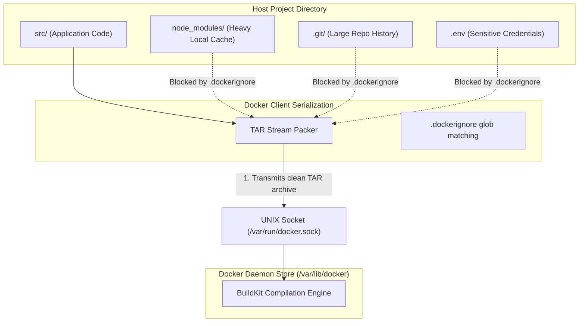
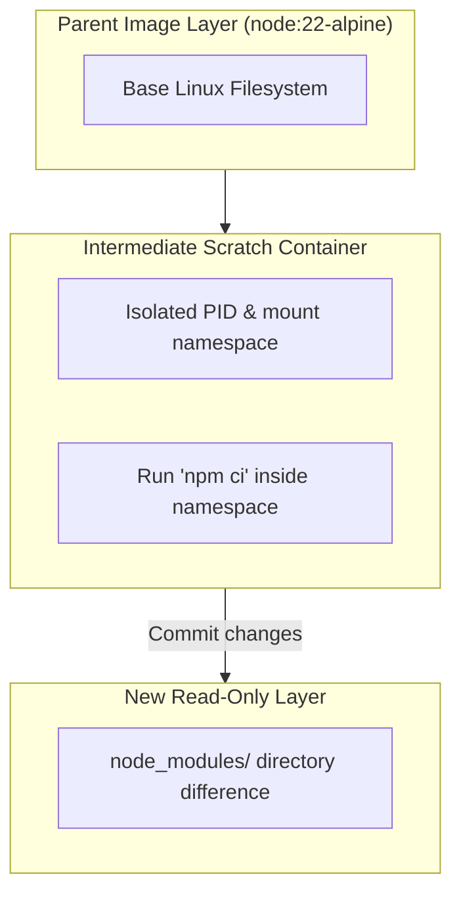

## Table of Contents

1. [The Bloated Image Problem](#the-bloated-image-problem)
2. [The Build Context TAR Pipeline](#the-build-context-tar-pipeline)
3. [Filtering the Context: The `.dockerignore` File](#filtering-the-context-the-dockerignore-file)
4. [Anatomy of a Dockerfile Recipe](#anatomy-of-a-dockerfile-recipe)
5. [Under the Hood: How Instructions Execute](#under-the-hood-how-instructions-execute)
6. [Core Instructions: Operations and Tradeoffs](#core-instructions-operations-and-tradeoffs)
7. [Putting It All Together](#putting-it-all-together)
8. [What's Next](#whats-next)

## The Bloated Image Problem

A Dockerfile is the ordered build recipe that turns a filtered project directory into an image filesystem and image metadata.

When you write a build recipe for your application, you are designing a repeatable, clean virtual filesystem. A common beginner habit is to treat the build as a simple command that copies the local repository folder directly into an image.

Example: a Node API image may only need `package.json`, `package-lock.json`, `src/`, and a few runtime config defaults. It should not receive your local `.env`, `.git` history, editor settings, or the `node_modules` folder from your laptop.

If your local folder contains heavy binary dependencies, local database dumps, compiler caches, or sensitive private SSH keys, copying the folder directly creates two critical engineering hazards:

* **Massive Image Footprints**: An image can easily bloat to several gigabytes because it inherits hundreds of megabytes of local developer garbage that the application process does not require at runtime.
* **Security Leaks**: Sensitive developer credentials, private environmental configurations, or local system tools are baked permanently into the immutable image layers, exposing them to anyone who pulls the image from a registry.

Suppose you compile a basic API image without filtering. The build console output reveals the scale of the transfer before a single line of code is executed:

```plain
Sending build context to Docker daemon  4.12GB
Step 1/6 : FROM node:22-alpine
...
```

The four-gigabyte transfer is not the compiled image. The transfer is the raw build context being packaged from your host laptop and sent to the Docker engine. 

To build secure, fast, and repeatable images, you must isolate the build pipeline. You do this by configuring `.dockerignore` filters to screen out host garbage, and using structured Dockerfile instructions to declare the assembly steps.

## The Build Context TAR Pipeline

The build context is the host-side file set the Docker client packages and sends to the build engine before any Dockerfile instruction can read files.


*The build context is filtered and transferred before Dockerfile instructions can read files from it.*

A TAR archive is a single bundled file stream that can contain many files and directories. Docker uses that stream so the client can hand the build engine a fixed snapshot of the files available for this build.

To optimize your image build speed, you must understand how the Docker Client and the Docker Daemon interact during a build run. When you execute the build command, the first parameter is the build context directory, typically represented by a single dot:

```plain
$ docker build -t app:local .
```

The dot represents the source directory on your host laptop. When the command starts, the Docker Client does not compile the files in place. Instead, it serializes the entire context directory into a single, uncompressed TAR archive stream.



The client transmits this TAR archive over the local UNIX socket (`/var/run/docker.sock`) or a network socket to the background Docker Daemon. The daemon extracts this archive into a temporary working directory within its local storage path. 

When your Dockerfile calls a `COPY` instruction, the daemon retrieves the files from this temporary context directory, not from your laptop's live filesystem.

This serialization explains why massive host directories stall the build. If your host folder contains a 2GB `node_modules` folder, a 1GB `.git` history, or heavy test data files, the Docker Client spends minutes packing these files into a TAR stream, writing them across the socket, and forcing the daemon to extract them. 

This slowdown occurs even if your Dockerfile never references those folders. The transfer bottleneck exists because the entire context is sent before the Dockerfile is parsed.

## Filtering the Context: The `.dockerignore` File

A `.dockerignore` file is the pre-transfer filter that removes local-only files from the build context before Docker serializes it into the TAR stream.

Example: if `.dockerignore` excludes `.env`, `node_modules`, and `.git`, those files never enter the archive Docker sends to the build engine. The Dockerfile cannot accidentally copy them because they are not present in the build context.

You solve the transfer bottleneck by placing a `.dockerignore` file in the root directory of your build context. Before the Docker Client packs the context into a TAR stream, it parses the `.dockerignore` rules and excludes matching files from the archive.

A secure, production-ready `.dockerignore` template blocks local dependencies, repository history, secrets, and IDE configurations:

```plain
# Version control
.git
.gitignore

# Local dependencies
node_modules
npm-debug.log

# Build outputs and cache
dist
.npm
.cache

# Sensitive secrets
.env
*.pem
id_rsa

# IDE and system garbage
.DS_Store
.vscode
.idea
```

The `.dockerignore` file supports standard glob matching patterns:
* **`node_modules`**: Excludes the specified folder at the root level of the context.
* **`**/*.pem`**: Excludes any file ending with `.pem` inside the root folder or any of its nested subdirectories.
* **`!src/main.js`**: An exclamation mark acts as an exception rule. It ensures that the specified file is included, even if a broader pattern would otherwise exclude it.

By applying this filter, you reduce the build context from gigabytes to megabytes, accelerating the transfer over the socket and ensuring that sensitive local keys cannot be accidentally baked into the image.

## Anatomy of a Dockerfile Recipe

A Dockerfile instruction is one ordered build operation that either changes image metadata or creates a new filesystem layer.

Example: `WORKDIR /usr/src/app` changes metadata for later build steps, while `COPY src/ ./src` adds files to the image filesystem. Docker reads the instructions in order, so each line becomes part of the build history.

Once the filtered build context is received by the daemon, the compilation engine reads the `Dockerfile` to build the filesystem layers. A Dockerfile is a declarative text document containing ordered instructions that build an image step-by-step:

```dockerfile
FROM node:22-alpine
WORKDIR /usr/src/app
COPY package*.json ./
RUN npm ci
COPY src/ ./src
EXPOSE 3000
CMD ["node", "src/server.js"]
```

Each instruction in this recipe serves a specific role in the compilation pipeline:
* **`FROM node:22-alpine`**: Declares the parent base image. This imports a minimal Alpine Linux distribution pre-configured with the Node 22 runtime environment.
* **`WORKDIR /usr/src/app`**: Establishes the active working directory for all subsequent instructions.
* **`COPY package*.json ./`**: Copies package descriptor files from the clean build context into the container's active working directory.
* **`RUN npm ci`**: Spawns a shell and installs the exact application dependencies declared in the lockfile.
* **`COPY src/ ./src`**: Copies the application source files from the context.
* **`EXPOSE 3000`**: Documents that the application listens on network port 3000 inside the namespace.
* **`CMD ["node", "src/server.js"]`**: Configures the default execution command that runs when a container starts.

The order of these instructions is not accidental. By copying package manifests and installing dependencies *before* copying the application source files, you exploit Docker's cache validation rules to accelerate future builds.

## Under the Hood: How Instructions Execute

The instruction execution loop uses temporary build containers to run each filesystem-changing step and commit only the resulting file differences.


*Each instruction either stores metadata or contributes a filesystem difference to the image history.*

A temporary build container is a short-lived isolated filesystem view used only while Docker executes one build instruction. It lets Docker run a command such as `npm ci`, capture the files that changed, and then save those changes as a layer.

To write high-quality Dockerfiles, you must trace how the build engine executes these instructions under the hood. When the daemon processes a build instruction (such as a `RUN` command), it does not edit the existing filesystem. 

Instead, it launches an isolated, temporary container to execute the change:



The engine's compilation workflow follows a distinct three-step loop for every instruction:
1. **Spawn**: The engine creates an intermediate scratch container namespace, mounting the filesystem state compiled by the previous instruction as its base.
2. **Execute**: It runs the instruction's command (e.g., compiling code or creating directories) inside this isolated build container.
3. **Commit**: The engine stops the scratch container, captures the write directory differences (the file modifications or additions created during execution), commits these differences as a new read-only image layer, and destroys the scratch container record.

This intermediate container model explains why environment variables must be declared using the `ENV` instruction rather than simple shell exports. 

If you run `RUN export DB_HOST=db.internal`, the variable is set in the environment memory of that temporary scratch container. As soon as the instruction exits, the container is destroyed, and the variable is lost. 

To persist runtime variables in the image metadata, you must use the `ENV` instruction, which writes the variables directly into the permanent image manifest JSON file.

## Core Instructions: Operations and Tradeoffs

Core Dockerfile instructions are the build-language operations that move files, set process defaults, and write metadata into the image.

Writing professional Dockerfiles requires choosing the correct instruction for each file operation and understanding their systems-level tradeoffs.

### 1. File Transfer: `COPY` vs. `ADD`
`COPY` is the normal file transfer instruction. It moves files from the filtered build context into the image. `ADD` can also transfer files, but it has extra behaviors such as archive extraction and remote URL fetching.

Example: use `COPY package*.json ./` when you want package manifests from the local context. Use `ADD archive.tar.gz /app` only when you deliberately want Docker to unpack that local archive into the image.

Both instructions transfer files into the image filesystem, but they support different source types:
* **`COPY`**: Transfers local files or folders from the verified build context directory. It is simple, explicit, and highly secure. Use `COPY` for almost all standard file transfers.
* **`ADD`**: Supports remote URL download paths and automatic archive extraction. If you specify a local compressed tarball (e.g., `ADD archive.tar.gz /app`), the engine automatically extracts the archive files into the target path.

The tradeoff is that `ADD` remote URL fetches do not validate cache signatures efficiently and can download unverified binaries. 

For safety, use `COPY` for local files. If you need to download remote packages, use `RUN wget` or `RUN curl` within a shell step so you can clean up intermediate tarballs in the same layer.

### 2. Startup Paths: `CMD` vs. `ENTRYPOINT`
`CMD` is the default command or default arguments for the container. `ENTRYPOINT` is the executable Docker should always start unless the operator explicitly overrides it.

Example: a web API might use `CMD ["node", "dist/server.js"]` so a developer can replace it with `node --version` during a one-off run. A tool image might use `ENTRYPOINT ["terraform"]` so runtime arguments behave like Terraform CLI arguments.

Both instructions configure the process that starts when the container boots, but they handle overrides differently:
* **`CMD`**: Declares the default command and arguments. If a user runs `docker run app:local npm run test`, the argument `npm run test` completely overrides the default `CMD` array.
* **`ENTRYPOINT`**: Declares the immutable executable binary. If you configure `ENTRYPOINT ["/app/bin/start"]`, the container will always execute that binary. Any arguments passed during `docker run` are appended to the entrypoint array rather than overriding it.

### 3. Directory Management: `WORKDIR`
`WORKDIR` is the persistent directory setting for later Dockerfile instructions and for the default runtime command.

Example: after `WORKDIR /app`, a later `COPY package*.json ./` copies files into `/app`, and `CMD ["node", "dist/server.js"]` runs from `/app` unless another setting overrides it.

It is tempting to write manual path loops like `RUN mkdir /app && cd /app` in your scripts. However, the intermediate container loop destroys shell-local directory changes between steps.

The next instruction will revert to the image root. 

Always use `WORKDIR /app`. If the target directory does not exist, the engine automatically creates it, applying the standard default parent system file permissions (typically `0755` for root paths) to ensure the application process can access it.

### 4. Diagnostic Documentation: `EXPOSE`
`EXPOSE` is image metadata that documents the port the containerized process is expected to listen on.

Example: `EXPOSE 3000` tells readers and tools that the app listens on container port 3000. It does not create a host port such as `localhost:3000`.

The `EXPOSE 3000` instruction writes metadata into the image manifest noting that the container listens on port 3000.

It does not publish or bind ports on the host. 

Think of `EXPOSE` as a diagnostic documentation note for developers. The actual port binding is decided exclusively at runtime using the `docker run -p` command.

## Putting It All Together

Writing clean image recipes means moving from direct, permissive copies to deliberate, filtered boundaries. By structuring your Dockerfiles around context boundaries and the intermediate container model, you ensure your builds remain fast and reproducible.

* **Build Context**: Represents the host directory packaged as a TAR stream and transmitted to the daemon over socket interfaces.
* **Filter Ignoration**: The `.dockerignore` file screens out host garbage, local dependencies, and secrets before serialization, protecting image size and credential privacy.
* **Intermediate Assembly**: The build engine spawns isolated scratch containers to execute instructions, committing the filesystem differences as read-only image layers.
* **Explicit Transfers**: `COPY` provides secure, explicit context file transfers, while `ADD` handles tar archive auto-extraction and remote URL downloads.
* **Directory State**: `WORKDIR` declares a persistent, kernel-created working directory, preventing directory state loss across intermediate steps.
* **Diagnostic Metadata**: `ENV` writes permanent runtime variables to the image manifest, whereas `EXPOSE` documents port requirements without creating active host bindings.

Understanding the assembly pipeline guarantees that your compiled artifacts remain clean and minimal.

## What's Next

Now that we have mastered Dockerfile instructions and build context optimization, our next step is to examine how image layers are stored and cached. To build images efficiently, you must understand how Docker stacks these layers and how to structure instructions to prevent cache invalidation.

In the next chapter, we will dive deep into **Image Layers and Cache**. We will study the OverlayFS storage driver in active system detail, trace how cache invalidation propagates down the instruction stack, and leverage multi-stage builds to minimize production image footprints.


*The Dockerfile summary keeps the build pipeline focused on context, filtering, layers, and startup metadata.*

---

**References**

- [Dockerfile reference](https://docs.docker.com/reference/dockerfile/) - Comprehensive official reference covering Dockerfile syntax, instruction sets, and build parameters.
- [Optimize builds with .dockerignore](https://docs.docker.com/build/building/context/#dockerignore-files) - Official guide on .dockerignore file patterns, glob matching syntax, and context exclusion rules.
- [Docker build context](https://docs.docker.com/build/building/context/) - Technical details on client-daemon context TAR serialization and Socket transport channels.
- [OCI Image Format Specification](https://github.com/opencontainers/image-spec) - Industry standards defining OCI image manifests, layer stacks, and descriptor arrays.
- [Best practices for writing Dockerfiles](https://docs.docker.com/develop/develop-images/dockerfile_best-practices/) - Guidelines for writing efficient, clean, and secure Dockerfiles with optimized caching layers.
