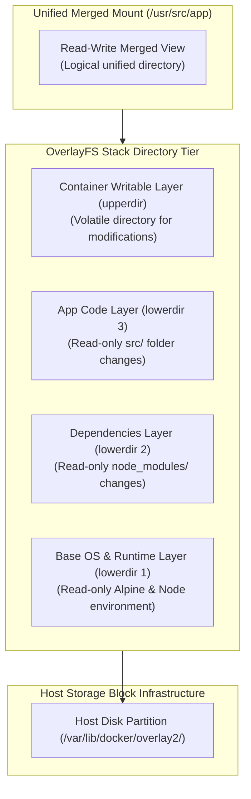
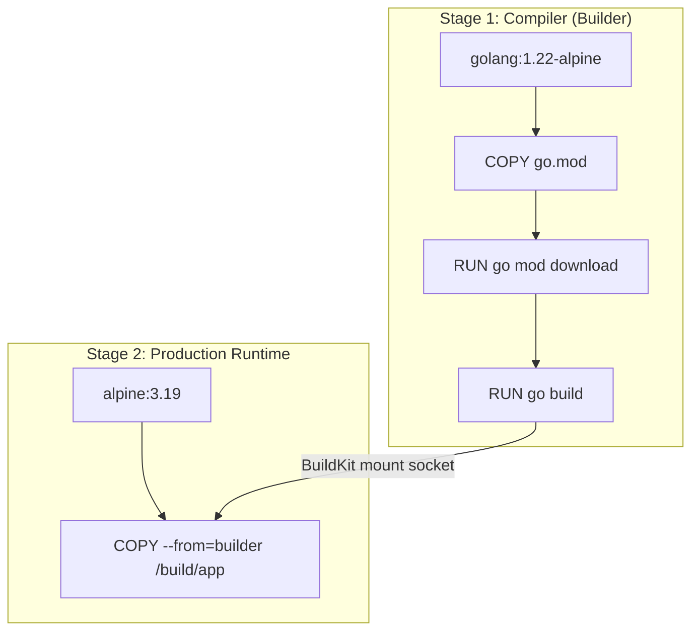

## Table of Contents

1. [The Cache Invalidation Bottleneck](#the-cache-invalidation-bottleneck)
2. [OverlayFS Stack Mechanics](#overlayfs-stack-mechanics)
3. [The Caching Rules Engine](#the-caching-rules-engine)
4. [Optimizing the Instruction Stack](#optimizing-the-instruction-stack)
5. [The Power of Multi-Stage Builds](#the-power-of-multi-stage-builds)
6. [Under the Hood: The `--from` Mount Pipeline](#under-the-hood-the---from-mount-pipeline)
7. [Putting It All Together](#putting-it-all-together)
8. [What's Next](#whats-next)

## The Cache Invalidation Bottleneck

When you compile a software application locally, compilation tools typically use incremental building to speed up the loop. If you modify a single line of application source code, the compiler rebuilds only the affected file, reusing previously compiled package caches and library binaries. 

In a containerized build, this incremental process is governed by a layer-caching engine.

If you write a Dockerfile without considering how layers are cached, a single code modification can invalidate the entire build cache. When the cache is broken, the engine is forced to execute every subsequent step from scratch: downloading heavy package manifests, compiling dependency trees, and recreating filesystems. 

This turns a minor one-second hotfix into a slow, ten-minute compilation cycle that stalls your pipeline.

```plain
$ docker build -t app:local .
...
[4/6] RUN npm ci
# Cache is invalid. Resolving 450 packages from registry...
# Time elapsed: 4 minutes, 12 seconds
```

The delay does not occur because the package registry is slow or the host CPU is limited. The delay occurs because a change in the application source files was evaluated before the dependency install instruction, destroying the cache.

To prevent this bottleneck, you must design your Dockerfiles around layer caching rules. This requires understanding how the OverlayFS storage driver mounts read-only layers under the hood, and how to structure instructions to maximize cache reuse.

## OverlayFS Stack Mechanics

An image is not a single, unified block of disk storage. An image is a logical collection of independent, read-only directory layers. When the build engine compiles an image, each instruction that modifies the filesystem (such as `RUN` or `COPY`) creates a new layer containing only the specific files added or modified during that step.

To present these stacked directories as a single, cohesive filesystem to a running container, the Docker engine uses the OverlayFS storage driver.



OverlayFS merges the layer folders dynamically using a directory stack mount configuration. The driver maps these folders to four primary paths:

* **`lowerdir`**: The stacked, read-only image layers. The base OS layer sits at the bottom, with subsequent instruction layers stacked sequentially on top of it.
* **`upperdir`**: The container's private, writable directory. All runtime modifications, file writes, and deletions are captured strictly in this folder.
* **`merged`**: The virtual mount point where the kernel merges the `lowerdir` and `upperdir` views, presenting a unified directory view to the container process.
* **`workdir`**: A private engine-internal scratch space used to coordinate atomic copy-on-write operations.

When a container process executes an inode lookup or reads a file, the OverlayFS driver intercepts the system call and scans the `lowerdir` folders from top to bottom. As soon as it locates the requested file, it serves it directly, bypassing unnecessary lookups in the lower layers. 

If the process writes to a file, the driver copies the file up to the `upperdir` first, protecting the immutable image layers.

During a build run, each committed layer is assigned a unique cryptographic hash and packed as a read-only tarball stored inside `/var/lib/docker/overlay2/`. Because these layers are immutable and read-only, they can be shared across multiple running containers. 

Ten containers running the same image use the exact same `lowerdir` stack, creating ten tiny, empty `upperdir` folders to capture their private writes.

## The Caching Rules Engine

When you execute a new build run, the engine checks if it can reuse existing image layers instead of executing instructions from scratch. This evaluation is driven by the caching rules engine, which runs different validation checks depending on the instruction type:

* **Metadata-Only Instructions**: Instructions like `ENV`, `WORKDIR`, `USER`, or `EXPOSE` modify only the image manifest JSON file, not the filesystem. The engine validates the cache simply by comparing the string arguments. If the arguments match the previous build record, the cache is preserved.
* **System Execution Instructions (`RUN`)**: For commands like `RUN apt-get update` or `RUN compile.sh`, the engine does not inspect the system files to verify if the outcome would be identical. Instead, it performs a simple string comparison on the command text. If the command string matches the cached step, the engine assumes the outcome is identical and reuses the cached layer.
* **File Transfer Instructions (`COPY` and `ADD`)**: For file transfers, a string check is insufficient. If a developer edits a file without changing the `COPY` instruction string, the command remains identical, but the file content has changed. To validate `COPY` and `ADD` steps, the engine calculates a cryptographically secure hash (typically SHA256) of every source file inside the build context. It then compares these hashes against the manifest of the cached layer. If a single file hash differs, the cache is invalidated.

The crucial cache invalidation rule is that **cache invalidation is a cascading down-stack failure**. 

As soon as a single build step fails the cache validation check, the engine permanently discards the cache for that instruction and **every subsequent instruction in the Dockerfile**. Even if the downstream commands are identical and have not changed, the engine is forced to execute them in new intermediate scratch containers to maintain filesystem consistency.

## Optimizing the Instruction Stack

To exploit these caching rules and build fast, reproducible images, you must order your Dockerfile instructions from the **most stable** to the **most volatile**.

A common anti-pattern is to copy the entire repository directory before running package installation scripts:

```dockerfile
# CACHE ANTI-PATTERN
FROM node:22-alpine
WORKDIR /app
COPY . .
RUN npm ci
CMD ["node", "src/server.js"]
```

In this anti-pattern, any change to your application source files (such as editing a line in `src/server.js`) invalidates the `COPY . .` layer. Because cache invalidation cascades downward, the engine is forced to run `RUN npm ci` from scratch, wasting minutes downloading packages that have not changed.

You optimize the stack by isolating package manifests from application source files:

```dockerfile
# CACHE OPTIMIZED
FROM node:22-alpine
WORKDIR /app
COPY package*.json ./
RUN npm ci
COPY . .
CMD ["node", "src/server.js"]
```

By separating the file transfers, you establish a stable dependency tier:
1. **Manifest Transfer**: You copy *only* the package manifest descriptor files (`package.json`, `package-lock.json`). These files change only when you add or upgrade a dependency.
2. **Dependency Resolution**: The engine executes `RUN npm ci`. Because the manifests are stable, this step reads from the cache on almost every build, completing instantly.
3. **Source Transfer**: You copy the volatile application source files (`COPY . .`). Changes here invalidate the cache only for this final transfer layer, bypassing the slow package installation entirely.

Applying this structure ensures that everyday developer builds compile in milliseconds, using cached layers for everything except the immediate code modifications.

## The Power of Multi-Stage Builds

Optimizing caching layers accelerates build runs, but it does not solve the image bloat problem. A professional build environment requires compiler tools, header files, and dependency caches to compile application binaries. 

If you leave these build tools inside the final image, the production artifact remains massive and carries an unnecessary security footprint.

Multi-stage builds solve this by allowing you to define multiple `FROM` instructions within a single Dockerfile. Each `FROM` starts a brand new, isolated build stage with its own parent base image. 

You can run heavy build tools in an initial compiler stage, and then copy *only* the compiled runtime binaries into a clean, minimal final stage, discarding the heavy compilers.

Consider a Go compilation pipeline:

```dockerfile
# Stage 1: The Compiler (Builder)
FROM golang:1.22-alpine AS builder
WORKDIR /build
COPY go.mod go.sum ./
RUN go mod download
COPY . .
RUN CGO_ENABLED=0 GOOS=linux go build -o app .

# Stage 2: The Minimal Production Runtime
FROM alpine:3.19
WORKDIR /app
COPY --from=builder /build/app .
CMD ["./app"]
```

By separating the build into two distinct stages, you achieve a massive reduction in size:
* **The Builder Stage**: Uses `golang:1.22-alpine` containing the Go compiler, package manager, and development tools. The temporary layers created here consume over 800MB of disk space.
* **The Runtime Stage**: Starts from `alpine:3.19`, which is a secure, minimal distribution consuming only 5MB of disk space. The only file copied into this stage is the statically compiled binary (`app`) from the builder stage.

The resulting production image consumes less than 20MB of disk space, boots instantly, and contains absolutely no compiler tools, source code files, or shell histories that could be exploited by an attacker.

## Under the Hood: The `--from` Mount Pipeline

To use multi-stage builds effectively, you must understand how the BuildKit compilation engine executes the `COPY --from` pipeline under the hood. 

The compiler stage (`builder`) and the runtime stage (`alpine`) do not run as a simple sequential script. Instead, the BuildKit engine analyzes the build instructions and constructs an in-memory Directed Acyclic Graph (DAG) of the target dependencies.



This graph enables two significant systems optimizations:

* **Concurrent Execution**: If the stages do not share immediate inputs, the BuildKit engine can compile them concurrently. The engine can download the base runtime image (`alpine:3.19`) in parallel while the builder stage is compiling the Go binary, accelerating the total pipeline run.
* **Dead-Stage Elimination**: If you define an optional debug or testing stage that is not referenced by the final stage's `COPY --from` instruction, the BuildKit engine detects that the stage is a dead-end branch in the graph. The engine will bypass the dead stage entirely, saving CPU cycles and build time.

When the engine executes `COPY --from=builder /build/app /app/`, it does not copy files through the host laptop filesystem. Instead, it mounts the completed builder filesystem container as a read-only volume socket directly into the runtime scratch container. 

The OCI engine transfers the binary file across this internal namespace boundary, ensuring that no compilation assets leak into the final runtime layer.

## Putting It All Together

Designing efficient container images requires mastering caching boundaries and multi-stage layout topologies. By structuring your compilation steps around Layer and Stage rules, you minimize pipeline latencies and keep production assets lightweight.

* **Layer Accumulation**: Each file-modifying build instruction commits differences as a read-only directory layer stored inside `/var/lib/docker/overlay2/`.
* **OverlayFS Assembly**: The host kernel merges read-only layers (`lowerdir`) and the container writable layer (`upperdir`) into a virtual mount view (`merged`), enabling layer sharing and instant boots.
* **Cache Cascades**: Cache validation checks rely on string comparisons for `RUN` steps and SHA256 file hashes for `COPY` steps. Any validation failure triggers a down-stack cascade.
* **Stack Optimization**: Ordering instructions from stable manifest transfers to volatile source updates isolates high-frequency code modifications from slow dependency downloads.
* **Stage Separation**: Multi-stage builds use separate `FROM` declarations to run heavy build tools in temporary layers, discarding compilers on completion.
* **DAG Resolution**: BuildKit analyzes `COPY --from` references to build in-memory dependency graphs, enabling parallel stage execution and dead-stage elimination.

Structuring your recipes around these caching limits guarantees your deployment artifacts remain lean and secure.

## What's Next

Now that we have optimized our local image layers, caches, and compiler pipelines, our next step is to examine how these artifacts are distributed. We need to push our completed production images to external registries and verify their authenticity.

In the next chapter, we will study **Tags, Digests, and Registries** in deep architectural detail. We will compare mutable tag labels to immutable content-addressable SHA256 digests, trace the HTTP token authentication handshakes used by registries, and explore how multi-platform manifests allow a single tag to pull ARM64 vs AMD64 binaries.

---

**References**

- [OverlayFS storage driver](https://docs.docker.com/storage/storagedriver/overlayfs-driver/) - Technical deep-dive on OverlayFS layer mechanics, COW operations, and directory structure.
- [Optimize build cache](https://docs.docker.com/build/cache/) - Official BuildKit cache validation guidelines, instruction cache checking, and cache invalidation rules.
- [Multi-stage builds](https://docs.docker.com/build/building/multi-stage/) - Guide on designing multi-stage Dockerfiles, naming build stages, and copying files across build boundaries.
- [BuildKit engine architecture](https://docs.docker.com/build/buildkit/) - Technical overview of BuildKit's DAG solver, concurrent stage execution, and execution pipelines.
- [docker image inspect CLI reference](https://docs.docker.com/reference/cli/docker/image/inspect/) - Information on inspecting image layers, parent manifests, and local storage metadata.
