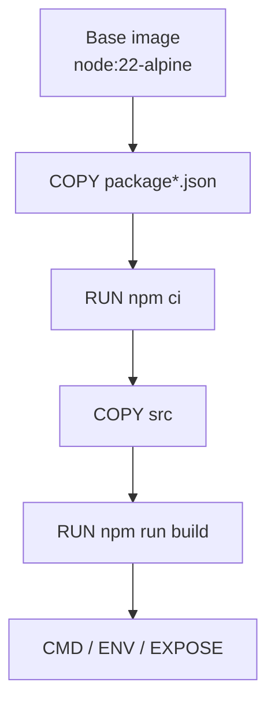

## Table of Contents

1. [The Problem](#the-problem)
2. [The Layer Model](#the-layer-model)
3. [How Cache Works](#how-cache-works)
4. [Instruction Order](#instruction-order)
5. [Hidden Layer History](#hidden-layer-history)
6. [When Freshness Matters](#when-freshness-matters)
7. [Failure Modes](#failure-modes)
8. [Putting It All Together](#putting-it-all-together)
9. [What's Next](#whats-next)

## The Problem

A developer changes one route handler and waits while Docker reinstalls every dependency. Another developer rebuilds the same image and Docker says everything is cached, even though a package repository changed since yesterday. A security review finds a secret in image history even though the Dockerfile deleted the file before the final command.

These are layer and cache problems. Docker does not rebuild an image as one opaque archive. It walks the Dockerfile in order, creates filesystem changes, records layers, and reuses prior results when it can. That makes builds fast, but it also means the Dockerfile's order and history matter.

If you can read the image as a stack of changes, the behavior stops feeling random. Slow rebuilds, stale package indexes, and hidden old files all come from the same mechanism.

## The Layer Model

An image is built from layers. A filesystem-changing instruction such as `COPY` or `RUN` creates a new layer on top of the previous state. Metadata instructions such as `CMD` or `EXPOSE` change image configuration and may appear in history, but they do not add application files in the same way.



When Docker starts a container, it presents the stacked layers as one filesystem and adds a writable container layer on top. The image layers remain read-only. The container can write files, but those writes belong to that container unless a volume or bind mount sends them elsewhere.

Layers are one reason images can be shared efficiently. Two images based on the same base image can reuse the same base layers locally. A rebuild can reuse dependency layers when dependency inputs have not changed. A registry can push and pull layers rather than always moving a full image as one blob.

## How Cache Works

Build cache is layer reuse. For each Dockerfile instruction, the builder asks whether it already has an equivalent result from the same prior state. If it does, it can reuse that result. If it does not, it runs the instruction and records a new result. Once a step misses cache, later steps normally need to be evaluated again because their starting filesystem may have changed.

For `COPY` and `ADD`, Docker considers the files involved in the instruction. If those files change, the cache for that step should miss. For many `RUN` instructions, Docker mainly compares the command string and the previous state. It does not inspect the live internet or package repository behind the command every time.

That explains this surprise:

```dockerfile
RUN apk add --no-cache curl
```

If the previous state and command match a cached result, Docker may reuse it even if the package repository has newer packages today. Cache is a speed mechanism, not a freshness guarantee. When freshness matters, you intentionally change an earlier input, use `--no-cache`, update the base image, or structure the build so the relevant step is re-executed.

## Instruction Order

Instruction order decides how much work one edit invalidates. This Dockerfile makes dependency installation depend on every file in the context:

```dockerfile
COPY . .
RUN npm ci
RUN npm run build
```

If `src/routes.ts` changes, the `COPY . .` result changes. The next step starts from a different filesystem, so dependency installation may rerun even though `package-lock.json` did not change.

A better order separates stable inputs from noisy inputs:

```dockerfile
COPY package*.json ./
RUN npm ci

COPY tsconfig.json ./
COPY src ./src
RUN npm run build
```

Now a source edit invalidates the source copy and build output. The dependency layer can remain cached when the package manifests are unchanged. The Dockerfile draws dependency boundaries for the cache.

This is why `.dockerignore` and layers belong together. If the context includes `node_modules`, logs, coverage, or generated files, `COPY . .` can change for reasons that have nothing to do with the application artifact. A noisy context creates noisy cache behavior.

## Hidden Layer History

Layers record changes over time. The final filesystem is what the container sees after all layers are applied, but the image can still contain data in earlier layers.

This Dockerfile is unsafe:

```dockerfile
COPY .env .env
RUN npm run build
RUN rm .env
```

The final container filesystem may not show `.env`, but an earlier layer copied it. The bytes can remain in image history or cached layers. The safe approach is to keep `.env` out of the build context, pass runtime secrets at container creation, or use BuildKit secrets for build-only credentials.

The same idea affects image size. If one `RUN` instruction downloads temporary files and a later `RUN` deletes them, the final filesystem may look clean while the earlier layer still contributes bytes. Cleanup should happen in the same instruction that creates temporary files when layer size matters:

```dockerfile
RUN apk add --no-cache build-base \
    && npm ci \
    && apk del build-base
```

Multi-stage builds are often cleaner than long cleanup chains. Put compilers and build tools in one stage, then copy only the compiled output into the runtime stage.

## When Freshness Matters

Cache is helpful when it reuses work that is still valid. It is harmful when it hides work that should be repeated.

Base images are the most important example. A tag such as `node:22-alpine` can point to a newer image over time. Rebuilding does not always mean Docker has refreshed that base. Depending on the builder and command flags, you may need to pull or request a fresh base image to pick up security patches.

Package indexes are another example. A cached `RUN apt-get update` can reuse old package metadata. Many Dockerfiles combine update and install in one instruction so the package index and install happen together when that step runs:

```dockerfile
RUN apt-get update \
    && apt-get install -y --no-install-recommends ca-certificates \
    && rm -rf /var/lib/apt/lists/*
```

For application dependencies, lockfiles are the freshness boundary. If `package-lock.json` changes, dependency installation should rerun. If only application source changes, dependency installation should usually stay cached.

Use cache by making it line up with real dependencies.

## Failure Modes

Layer and cache failures leave recognizable clues.

If rebuilds are slow after tiny source edits, a broad `COPY . .` probably appears before expensive dependency steps. Split stable manifests from source files and keep the context quiet.

If a build uses stale operating-system packages, a cached `RUN` step or stale base image may be involved. Force a fresh build path when patch freshness matters, and make base image updates part of regular maintenance.

If an image is larger than expected, inspect the history. Temporary files may have been created in one layer and deleted in a later layer, or build tools may still be present in the final stage.

If a secret was ever copied into a layer, deleting it later is not enough. Treat the image as history, with the final filesystem as one view of that history.

If a cache miss seems unexplained, look at the exact instruction and its inputs. `COPY` depends on files from the context. `ARG` values can affect later cache use. Earlier misses change the starting point for everything after them.

## Putting It All Together

Docker's build speed comes from remembering layers. That memory is powerful when the Dockerfile gives it clean boundaries.

- Image layers are stacked filesystem changes plus image configuration.
- Cache reuses a prior instruction result when the prior state and relevant inputs still match.
- Once a step misses cache, later steps usually need new results.
- Stable inputs should appear before noisy inputs.
- Final filesystem cleanup does not erase earlier layer history.
- Cache should speed up a correct build, not become the reason the build is correct.

The opener's slow rebuild, stale package result, and secret history were not separate Docker quirks. They were consequences of layers doing exactly what layers do.

## What's Next

The next article follows image names after the build finishes. Tags, digests, and registries decide which exact image a machine pulls and runs. That is where local image understanding turns into a team and deployment artifact.

---

**References**

- [Docker Docs: Docker build cache](https://docs.docker.com/build/cache/)
- [Docker Docs: Build cache invalidation](https://docs.docker.com/build/cache/invalidation/)
- [Docker Docs: Dockerfile reference](https://docs.docker.com/reference/dockerfile/)
- [Docker Docs: Multi-stage builds](https://docs.docker.com/build/building/multi-stage/)
