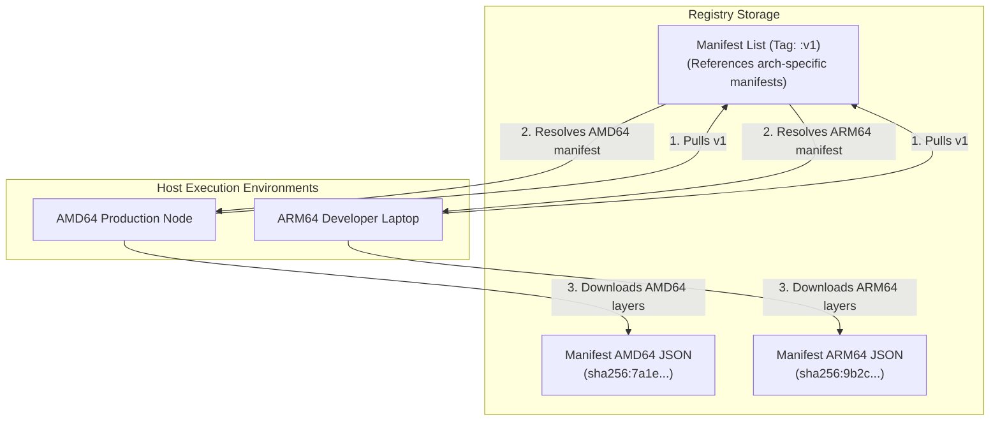

## Table of Contents

1. [The Mutable Tag Hazard](#the-mutable-tag-hazard)
2. [Anatomy of an OCI Image Manifest](#anatomy-of-an-oci-image-manifest)
3. [Immutable Content-Addressable Digests](#immutable-content-addressable-digests)
4. [Under the Hood: Registry JWT Authentication](#under-the-hood-registry-jwt-authentication)
5. [Multi-Architecture Manifest Lists](#multi-architecture-manifest-lists)
6. [Secure Delivery Workflows](#secure-delivery-workflows)
7. [Putting It All Together](#putting-it-all-together)
8. [What's Next](#whats-next)

## The Mutable Tag Hazard

When you distribute compiled container images to production servers, you rely on image registries to act as the central distribution vault. A typical deployment workflow requires tagging an image with a human-readable name, pushing it to a registry, and asking your production orchestrator to pull that name during a rollout.

In a naive deployment pipeline, developers often tag their images with mutable labels like `:latest`, `:production`, or `:v1`.

Because these tags are mutable, they can be overwritten at any time. If a pipeline pushes a hotfix tagged `:v1` over an existing `:v1` image, the registry silently moves the tag pointer to the new image ID. 

When a production orchestrator scales up your workload or replaces a crashed node, it pulls the tag `:v1` again. 

If some nodes pull before the update and others pull after, your active fleet runs two completely different versions of the code under the exact same tag name.

```plain
$ docker pull registry.hub.docker.com/org/app:v1
# Digest: sha256:8f3c... (Downloaded updated application version)
# Older servers run sha256:2d1a... under the identical "v1" label
```

This tag mutation creates silent, untraceable production drift that bypasses version control. The error is not in the orchestrator. The error is relying on mutable name labels to identify immutable binary layers.

To run securely in production, you must transition from mutable tags to content-addressable digests, and understand the under-the-hood HTTP manifest exchanges that govern image distribution.

## Anatomy of an OCI Image Manifest

An image in a registry is not stored as a single, compiled file. Instead, the Open Container Initiative (OCI) Image Specification v1 defines an image as a collection of independent, content-addressed files linked together by an OCI Image Manifest JSON file.

When you pull or push an image, the Docker Client first pulls this manifest JSON file to understand the image structure.

```json
{
  "schemaVersion": 2,
  "mediaType": "application/vnd.oci.image.manifest.v1+json",
  "config": {
    "mediaType": "application/vnd.oci.image.config.v1+json",
    "size": 7023,
    "digest": "sha256:b1d83ab90e11cda908ce91244cf0c0df4a819b5f903a48e7188b0a9477ef290"
  },
  "layers": [
    {
      "mediaType": "application/vnd.oci.image.layer.v1.tar+gzip",
      "size": 3267104,
      "digest": "sha256:8f3c1f0d91b2c1da908ce91244cf0c0df4a819b5f903a48e7188b0a9477ef290"
    },
    {
      "mediaType": "application/vnd.oci.image.layer.v1.tar+gzip",
      "size": 154082,
      "digest": "sha256:2d1a58e283b74f75a1058b6e0c77e4e2cda908ce91244cf0c0df4a819b5f903"
    }
  ]
}
```

The manifest JSON details the exact composition of the artifact:
* **`schemaVersion`**: Dictates the OCI schema version (typically version 2).
* **`config`**: Points to the Image Configuration JSON file. This configuration file contains the metadata manifest, including the image environment variables (`ENV`), export ports (`EXPOSE`), the entrypoint array, user configurations, and the layer order timeline.
* **`layers`**: An ordered array of descriptor objects. Each layer descriptor specifies the compression type (`mediaType`), the file size in bytes, and a cryptographically secure hash (`digest`) of that layer's compressed tarball.

When the local engine pulls an image, it downloads the manifest, compares the layer digests against its local `/var/lib/docker/overlay2/` database, downloads only the missing layer tarballs from the registry, and merges them to assemble the filesystem.

## Immutable Content-Addressable Digests

To eliminate mutable tag drift, you can reference an image using its content-addressable digest instead of its tag name.

A digest is a cryptographically secure SHA256 hash calculated over the exact byte content of the OCI Image Manifest JSON file itself. The digest is represented as `sha256:` followed by the hex string of the hash.

Because the digest is derived directly from the manifest content, it is mathematically immutable:
* **Layer Immutability**: If a developer modifies a single byte in any of the application source files, the compiled layer's hash changes.
* **Manifest Immutability**: The updated layer hash changes the layers array inside the OCI manifest JSON.
* **Digest Immutability**: The modified manifest JSON yields a completely different SHA256 digest hash.

When you deploy a workload using the digest notation, the orchestrator guarantees that every single server pulls the exact same byte-for-byte filesystem:

```bash
docker run -d \
  --name production-api \
  registry.hub.docker.com/org/app@sha256:b1d83ab90e11cda908ce91244cf0c0df4a819b5f903a48e7188b0a9477ef290
```

Even if an administrator pushes a breaking update to the `:v1` tag in the registry, the digest reference `org/app@sha256:b1d8...` remains bound permanently to the specific manifest hash, bypassing tag mutation entirely. 

Using digests is the single most effective operational habit to guarantee reproducible container orchestration rollouts.

## Under the Hood: Registry JWT Authentication

When the Docker Daemon pushes or pulls an image from a private registry, it does not send raw credentials with every layer upload request. Instead, OCI-compliant registries use a multi-step token authentication handshake mediated by JSON Web Tokens (JWT).

```mermaid
flowchart TD
    subgraph ClientDaemon["Local Host Tier"]
        Daemon["Docker Daemon (dockerd)"]
    end
    subgraph RegistryTier["Registry Infrastructure"]
        AuthServer["Registry Auth Service<br/>(Token Issuer)"]
        RegistryStorage["Registry Storage Service<br/>(Blobs & Manifests)"]
    end

    Daemon -->|1. HTTP GET /v2/org/app/manifests/v1| RegistryStorage
    RegistryStorage -->|2. HTTP 401 Unauthorized<br/>(Provides auth challenge header)| Daemon
    Daemon -->|3. HTTP GET with credentials| AuthServer
    AuthServer -->|4. Validates & issues signed JWT| Daemon
    Daemon -->|5. HTTP GET with Bearer JWT| RegistryStorage
    RegistryStorage -->|6. Validates signature & streams manifest| Daemon
```

The authentication handshake follows a strict HTTP transaction loop:

1. **The Challenge**: The Docker Daemon initiates a pull by sending an HTTP GET request to the registry storage endpoint (e.g., `/v2/org/app/manifests/v1`). Because the image is private, the registry storage service rejects the request, returning an HTTP `401 Unauthorized` response along with a challenge header identifying the auth service domain and scope requirements.
2. **The Handshake**: The daemon reads the challenge header, formats a new request containing your local authentication credentials (configured via `docker login`), and sends it to the specified Registry Auth Service.
3. **The Token**: The Auth Service validates your credentials, checks if your account has read or write permissions for the requested image path, compiles a signed JSON Web Token (JWT) containing your access claims (scopes), and returns it to the daemon.
4. **The Transfer**: The daemon resubmits the original HTTP GET request to the registry storage service, adding the Bearer JWT token to the authorization header. The storage service verifies the token's cryptographic signature, parses the scope claims, and streams the OCI manifest.

This token-based workflow keeps your credentials secure. The local engine only transmits your password once during the token request, using short-lived Bearer tokens to coordinate the high-bandwidth layer downloads.

## Multi-Architecture Manifest Lists

In a modern cloud environment, development laptops and production servers often run on different CPU architectures. A developer might write code on an ARM64 Apple Silicon laptop, while the production Kubernetes cluster runs on AMD64 Intel/AMD server blades.

Because compiled binaries must match the host CPU architecture, running an ARM64 image on an AMD64 server will trigger an immediate execution failure:

```plain
$ docker run app:local
exec format error
```

To solve this multi-architecture compatibility bottleneck, OCI registries support a special metadata wrapper called a Manifest List (or index).



A Manifest List is a top-level index file that groups architecture-specific image manifests together under a single tag name. The index JSON contains references to the separate manifest hashes, mapping each one to its target hardware specifications:

```json
{
  "schemaVersion": 2,
  "mediaType": "application/vnd.oci.image.index.v1+json",
  "manifests": [
    {
      "mediaType": "application/vnd.oci.image.manifest.v1+json",
      "size": 714,
      "digest": "sha256:7a1e58e283b74f75a1058b6e0c77e4e2cda908ce91244cf0c0df4a819b5f903",
      "platform": {
        "architecture": "amd64",
        "os": "linux"
      }
    },
    {
      "mediaType": "application/vnd.oci.image.manifest.v1+json",
      "size": 714,
      "digest": "sha256:9b2c1f0d91b2c1da908ce91244cf0c0df4a819b5f903a48e7188b0a9477ef290",
      "platform": {
        "architecture": "arm64",
        "os": "linux"
      }
    }
  ]
}
```

When a host pulls an image tag, the local daemon requests the Manifest List first. It parses the list, matches the host's native OS and CPU architecture against the platform records, and pulls only the corresponding architecture-specific manifest. 

This enables developers to build multi-platform images that run identically on their local laptops and public cloud clusters using the exact same tag name.

## Secure Delivery Workflows

To maintain a secure, reviewable delivery pipeline, you must establish strict registry operational habits:

* **Lock Down Tags in Production**: Never use mutable tags like `:latest` or `:production` inside deployment configurations. Use content-addressable digests (`org/app@sha256:...`) to ensure absolute immutability.
* **Integrate Manifest Scanning**: Enable automated vulnerability scanning inside your private registry. Configure the registry to automatically reject push requests for images that carry critical CVEs (Common Vulnerabilities and Exposures).
* **Sign Images Cryptographically**: Use tools like Cosign to cryptographically sign image manifests during the build pipeline. Configure production hosts to verify these signatures before pulling, ensuring that only verified, signed artifacts can run inside your network.

By applying these security boundaries, you protect your registries from untrusted layers and ensure that your production deployments remain highly predictable.

## Putting It All Together

Distributing container images safely means moving from mutable tags to immutable, content-addressed OCI manifest architectures. By locking down tag structures and understanding registry auth flows, you secure your distribution pipeline.

* **Tag Mutation**: Mutable labels like `:latest` introduce silent production drift, which you eliminate by deploying via content-addressable digests.
* **OCI Manifests**: JSON descriptor files that define an image, linking configuration manifests to an ordered array of read-only compressed layer digests.
* **Cryptographic Digests**: SHA256 hashes calculated over the manifest JSON that guarantee absolute byte-for-byte immutability across rollout nodes.
* **JWT Handshakes**: Registries authenticate daemon pulls via a secure challenge-token transaction loop, issuing short-lived signed Bearer tokens for layer downloads.
* **Manifest Lists**: OCI-compliant indices that group architecture-specific manifests under a single tag, allowing hosts to resolve matching ARM64 vs AMD64 layers dynamically.
* **Secure pipelines**: Hardening pipelines requires deploying by digests, enabling registry vulnerability scanning, and verifying image signatures before container execution.

Hardening your distribution channels guarantees that the compiled artifact you tested is exactly the binary that runs in production.

## What's Next

Now that we have successfully navigated the entire Docker Foundations and Image compilation stack (Wave 1), we are ready to move into Wave 2, which focuses on container execution parameters and runtime boundaries.

In the next chapter, we will study **Running Containers**. We will explore container entrypoints and commands, examine how environment variable arrays are loaded into process memory, and analyze how to configure Unix signal handling so our processes exit cleanly on host request.

---

**References**

- [OCI Image Specification](https://github.com/opencontainers/image-spec) - Industry standard specifications defining OCI image manifests, indexes, and layout layers.
- [Docker Registry token authentication](https://docs.docker.com/registry/spec/auth/token/) - Deep-dive on HTTP challenge handshakes and registry JWT token specifications.
- [Multi-platform images](https://docs.docker.com/build/building/multi-platform/) - Guide on compiling multi-architecture manifests and using buildkit manifest lists.
- [Vulnerability scanning in Docker Hub](https://docs.docker.com/docker-hub/vulnerability-scanning/) - Best practices for registry vulnerability scanning and OCI manifest auditing.
- [docker trust CLI reference](https://docs.docker.com/reference/cli/docker/trust/) - Information on image signing, content trust configurations, and signature verification.
