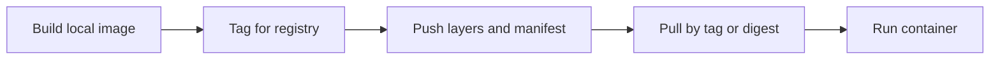

## Table of Contents

1. [The Problem](#the-problem)
2. [Image Names](#image-names)
3. [Tags](#tags)
4. [Digests](#digests)
5. [Registries](#registries)
6. [Pull and Push](#pull-and-push)
7. [Failure Modes](#failure-modes)
8. [Putting It All Together](#putting-it-all-together)
9. [What's Next](#whats-next)

## The Problem

Two machines run `orders-api:latest` and get different behavior. A developer rebuilt the image locally, but staging still runs yesterday's version. CI pushed a tag named `main`, then a later job pushed the same tag again. A rollback tries to use `v1.4.2`, but nobody is sure whether that tag still points to the original image.

Docker images need identity. A local image id is enough on one machine, but teams need names that can move through CI, registries, staging, and production. Tags and digests solve different parts of that problem.

A tag is a human-readable pointer. A digest is a content-based identifier. A registry is the server that stores and distributes image layers and manifests. Confusing those roles is how "same tag" turns into "different artifact."

## Image Names

A full image reference can include a registry host, namespace, repository, tag, and digest. In everyday use it often looks small:

```text
nginx
orders-api:local
ghcr.io/acme/orders-api:2026-05-19
docker.io/library/nginx:1.27
```

Docker fills in defaults when pieces are omitted. For Docker Hub, `nginx` means `docker.io/library/nginx:latest`. The `library` namespace is where Docker Official Images live. The `latest` tag is used when no tag is specified.

That default is convenient for tutorials and risky for production habits. It hides two decisions: which registry should be used, and which tag should be pulled. A deployment should usually make those decisions visible.

The repository name is the long-lived place where related image versions live. Tags and digests identify specific references inside that repository.

## Tags

A tag is a named pointer to an image manifest. When you build locally, this command applies a tag:

```bash
docker build -t ghcr.io/acme/orders-api:dev .
```

The tag `dev` is meaningful to people. It might mean "the current developer build" or "the latest build from a branch." Docker does not enforce that meaning. A later build can move the same tag to a different image.

This mutability is useful. `main`, `dev`, and `latest` are convenient moving labels. They let humans and automation refer to the current image for a stream of work. The danger is treating a moving label as proof of exact identity.

Version tags are better for releases:

```text
ghcr.io/acme/orders-api:1.4.2
ghcr.io/acme/orders-api:2026-05-19.3
ghcr.io/acme/orders-api:git-8f3a91c
```

Even then, a registry may allow tags to be overwritten unless policy prevents it. A tag can be stable by convention, protected by registry settings, or mutable by accident. The name alone does not guarantee immutability.

## Digests

A digest identifies image content by hash. It appears after `@sha256:`:

```text
ghcr.io/acme/orders-api@sha256:4f2a...
```

When you pull by digest, you are asking for the artifact whose manifest matches that digest. If the content changes, the digest changes. This is the exactness tags do not provide.

Digests matter in deployment and supply-chain work because they let you answer a precise question: which artifact did this environment run? A tag may tell you the intended release. A digest tells you the resolved image content.

Tags and digests can be used together:

```text
ghcr.io/acme/orders-api:1.4.2@sha256:4f2a...
```

That reads as "the `1.4.2` name, resolved to this exact digest." Tools often record both because humans want the release name and machines want exact identity.

## Registries

A registry stores image manifests and layers. Docker Hub is the default public registry for many Docker commands. Teams also use private registries such as GitHub Container Registry, Amazon ECR, Google Artifact Registry, Azure Container Registry, or self-hosted registries.

When you push an image, Docker uploads the layers the registry does not already have and writes or updates the manifest and tag reference. When another machine pulls the image, Docker downloads the manifest, checks which layers it already has locally, and pulls the missing ones.

A registry also sits inside the artifact's trust boundary. It controls authentication, authorization, tag policies, retention, vulnerability scanning integrations, and sometimes signature or provenance features. A local image named `orders-api:local` is not automatically available to CI or staging. It becomes shareable when it is tagged for a registry and pushed.

## Pull and Push

The image movement path is ordinary once identity is clear:



A local build might produce `orders-api:local`. Before another machine can pull it, the image needs a registry-qualified name:

```bash
docker image tag orders-api:local ghcr.io/acme/orders-api:git-8f3a91c
docker push ghcr.io/acme/orders-api:git-8f3a91c
```

After that, a deployment machine can pull the image by tag:

```bash
docker pull ghcr.io/acme/orders-api:git-8f3a91c
```

For exact deployment records, the resolved digest should be captured. A CI system can build, push, read the digest, and pass that digest to deployment. Then rollback can use the exact artifact instead of hoping a tag still points where it did before.

## Failure Modes

Image identity failures usually come from relying on a name that is less precise than the situation requires.

If two machines run different code from the same tag, one machine may have an old local image, or the tag may have moved in the registry. Pulling refreshes the local reference, but only a digest proves exact content.

If staging did not update after a rebuild, the image may have been rebuilt locally but never pushed, pushed under a different tag, or deployed from a cached tag. Local Docker state and registry state are separate.

If `latest` caused a surprise, remember that `latest` is only a tag name. It does not mean newest by timestamp, safest, or production-ready. It means "the image currently referenced by the tag named latest."

If a rollback fails to recover the old behavior, the rollback may have used a mutable tag that was overwritten. Immutable release tags or digest-based deploy records make rollback a concrete artifact choice.

If a pull works on one machine and fails on another, check the registry host and namespace first. `orders-api:dev` and `ghcr.io/acme/orders-api:dev` are different references. One may be local-only while the other points at a registry.

## Putting It All Together

The Docker image story does not end when the build succeeds. The team still needs to name, share, and identify the artifact.

- An image reference can include registry, namespace, repository, tag, and digest.
- Tags are human-readable pointers and may move unless policy prevents it.
- Digests identify exact image content.
- Registries store manifests and layers so other machines can pull them.
- Push moves a local image into a registry-qualified repository.
- Deployments should record the resolved digest when exact reproducibility matters.

The opener's `latest` confusion was an identity problem. Docker ran the images it was asked to run. The team had not been precise enough about which artifact each environment should use.

## What's Next

The next Docker topics move from image construction to runtime behavior: networking, storage, Compose, and debugging. Images define the artifact. Containers reveal how that artifact behaves when ports, files, processes, and multiple services interact on a real host.

---

**References**

- [Docker Docs: Build, tag, and publish an image](https://docs.docker.com/get-started/docker-concepts/building-images/build-tag-and-publish-an-image/)
- [Docker Docs: docker image tag](https://docs.docker.com/reference/cli/docker/image/tag/)
- [Docker Docs: Docker registries](https://docs.docker.com/get-started/docker-overview/#docker-registries)
- [Docker Docs: Docker image pull](https://docs.docker.com/reference/cli/docker/image/pull/)
