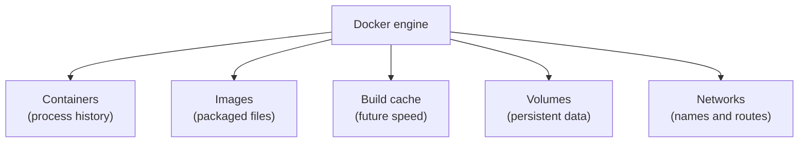

## Table of Contents

1. [Why Cleanup Needs Ownership](#why-cleanup-needs-ownership)
2. [The Mental Model](#the-mental-model)
3. [Read Disk Use First](#read-disk-use-first)
4. [Stopped Containers](#stopped-containers)
5. [Images and Build Cache](#images-and-build-cache)
6. [Volumes and Data](#volumes-and-data)
7. [Compose Cleanup](#compose-cleanup)
8. [Prune Safely](#prune-safely)
9. [Putting It All Together](#putting-it-all-together)
10. [What's Next](#whats-next)

## Why Cleanup Needs Ownership

A Docker development machine fills up slowly. At first the cause is invisible. Builds still work, `docker compose up` still starts the stack, and the project directory is not very large. Then one day a build fails with `no space left on device`, or Docker Desktop says the disk image is full, or CI spends minutes pulling and rebuilding images that should already be cached.

The tempting fix is a big cleanup command:

```bash
docker system prune -a --volumes
```

That command may free a lot of space. It may also remove data a stopped project still needed. Cleanup is safe when you know which Docker object owns the bytes and whether that owner represents disposable state or real data.

Docker keeps old objects because they are useful evidence. A stopped container has logs and a writable layer. An unused image may be the last known-good build. Build cache makes the next build faster. A volume may hold the database you used all week. The cleanup question is not "can Docker delete unused things?" It is "which unused things are safe to lose?"

## The Mental Model

Docker stores several kinds of objects. They share disk space, but they do not mean the same thing.



A container is a runtime object. If it is stopped, it no longer runs a process, but Docker can still keep its writable layer, logs, name, exit code, and configuration.

An image is a packaged filesystem and default configuration. Images can be shared by many containers. Deleting an image does not delete a running container's current filesystem, but Docker cannot start a new container from that image until it is pulled or built again.

Build cache is saved build work. It can include intermediate layers that have no tag. Removing it usually does not delete application data, but it can make the next build slower.

A volume is different. A volume exists to outlive containers. If a Postgres service stores data in a named volume, removing the container is ordinary. Removing the volume is deleting the database files.

## Read Disk Use First

Start with evidence:

```bash
docker system df
```

Typical output looks like this:

```text
TYPE            TOTAL     ACTIVE    SIZE      RECLAIMABLE
Images          18        5         8.7GB     5.1GB (58%)
Containers      12        2         1.4GB     1.1GB (78%)
Local Volumes   7         3         12.6GB    4.2GB (33%)
Build Cache     64        0         6.8GB     6.8GB
```

Treat this output as an ownership table. Images, containers, volumes, and build cache are separate cleanup decisions. A large reclaimable number under images usually means old builds. A large number under containers means stopped containers or container writable layers. A large number under volumes deserves caution because volumes are where databases, queues, and uploaded files often live during development.

The `ACTIVE` column also matters. Active does not mean important, and inactive does not mean disposable. It means Docker can see a current relationship. A stopped project can leave useful volumes behind, and an active container can be running from an image you are about to rebuild.

## Stopped Containers

Stopped containers accumulate when you run short-lived commands, failed experiments, one-off migrations, or old Compose services. They are useful while you need logs, exit codes, or the exact configuration that failed:

```bash
docker ps -a
```

Example:

```text
CONTAINER ID   IMAGE                       STATUS                      NAMES
9ab3d20f1b21   devpolaris/orders-api:dev   Exited (1) 3 hours ago      orders-api-test
6ce0129bb71a   postgres:18                 Exited (0) 2 days ago       old-orders-db
```

If you already used the logs and no longer need the container as evidence, remove it directly:

```bash
docker rm orders-api-test
```

To remove all stopped containers, use:

```bash
docker container prune
```

The important boundary is the container's writable layer. Files written outside a volume live in that layer. Removing the container removes those files. Files written to a named volume remain, unless you remove the volume separately.

## Images and Build Cache

Images pile up because tags move and builds create new layer graphs. A local tag such as `orders-api:dev` may point to the latest local build, while older image objects remain because old containers, caches, or dangling layer references still point at them.

List images before deleting them:

```bash
docker image ls
```

An untagged image often appears as `<none>`. That usually means no human-readable tag points at it anymore. Docker calls this a dangling image. It may be safe to remove when no container needs it:

```bash
docker image prune
```

Adding `-a` broadens the scope:

```bash
docker image prune -a
```

That removes unused images, not merely dangling ones. It can remove older tagged images if no container references them. That is fine for disposable local builds, but it can force a later pull or rebuild.

Build cache has a different tradeoff. Removing it frees space and slows the next build because Docker has less saved work:

```bash
docker builder prune
```

When a build cache is huge, pruning it is often the cleanest first move. It rarely holds application data, and the next build can recreate it. The cost is time and network traffic.

## Volumes and Data

Volumes deserve their own pass because they are designed to survive container removal. A Compose database volume might look unused after `docker compose down`, but it may contain the exact data you expect to see when the stack comes back.

List volumes:

```bash
docker volume ls
```

Inspect a suspicious volume:

```bash
docker volume inspect orders_db_data
```

Volume names often include the Compose project name. A volume called `orders_db_data` likely belongs to an `orders` stack and a `db` service. That name is a clue, not proof. If the data matters, back it up or attach it to a temporary container before deleting it.

Remove a known disposable volume directly:

```bash
docker volume rm orders_tmp_data
```

Pruning volumes removes unused local volumes:

```bash
docker volume prune
```

Unused means no container currently uses the volume. It does not mean the data is unimportant. A stopped project can have unused volumes that should be kept for the next run.

## Compose Cleanup

Compose gives cleanup a project boundary. When you run:

```bash
docker compose down
```

Compose stops and removes the containers for services in the file and removes the project networks it created. Named volumes are kept by default, which is usually what you want for a local database.

To remove the project's declared volumes too:

```bash
docker compose down -v
```

That is a reset, not a routine stop. The next `up` can create fresh volumes, and a database image may initialize an empty database. Use it when the project state is disposable or intentionally being rebuilt.

Compose can also leave orphan containers when services are renamed or removed from the file. This command removes containers that belonged to the old project shape but no longer appear in the current Compose model:

```bash
docker compose down --remove-orphans
```

That flag is useful after refactors because stale service containers can keep ports, names, or network entries that confuse the current stack.

## Prune Safely

The broad cleanup command is:

```bash
docker system prune
```

By default, it removes stopped containers, unused networks, dangling images, and unused build cache. It does not prune volumes unless you ask for that with `--volumes`. Adding `-a` also removes unused images beyond dangling images.

A safer cleanup rhythm is:

1. Run `docker system df`.
2. Remove project-scoped Compose stacks with `docker compose down`.
3. Remove stale stopped containers with `docker container prune`.
4. Prune build cache when builds are filling the disk.
5. Prune images when old image artifacts are the main source of space.
6. Touch volumes last, after identifying which project owns them.

Filters can narrow cleanup by age or labels. Labels are especially useful on shared hosts because they let you mark which objects belong to a project, CI job, or disposable environment before pruning.

The safest cleanup command is rarely the shortest command. It is the one whose blast radius you can explain before you press enter.

## Putting It All Together

The disk-full problem at the start is now more specific.

If `docker system df` shows build cache as the biggest reclaimable owner, prune cache first and expect the next build to take longer.

If stopped containers are large, read the logs you still need, then remove the stopped containers or run `docker container prune`.

If images are the problem, decide whether old tagged images are useful rollback artifacts or disposable local builds before using `docker image prune -a`.

If volumes are large, slow down. Volumes are where useful state often lives. Inspect names, project ownership, and whether the data should survive the next `up`.

If a Compose project needs a clean slate, `docker compose down -v` expresses that reset at the project boundary. It is clearer than a global volume prune because it says which project is losing data.

Cleanup is Docker maintenance with ownership attached. Once the owner is clear, prune commands become predictable tools instead of scary incantations.

## What's Next

The next article uses the same ownership map for debugging. When a Docker stack fails, the first question is similar: which boundary owns the symptom? The answer might be the image, the command, the process, the network path, the storage path, the health check, or the Compose graph.

---

**References**

- [Docker Docs: Prune unused Docker objects](https://docs.docker.com/engine/manage-resources/pruning/)
- [Docker Docs: docker system df](https://docs.docker.com/reference/cli/docker/system/df/)
- [Docker Docs: docker system prune](https://docs.docker.com/reference/cli/docker/system/prune/)
- [Docker Docs: docker image prune](https://docs.docker.com/reference/cli/docker/image/prune/)
- [Docker Docs: docker compose down](https://docs.docker.com/reference/cli/docker/compose/down/)
