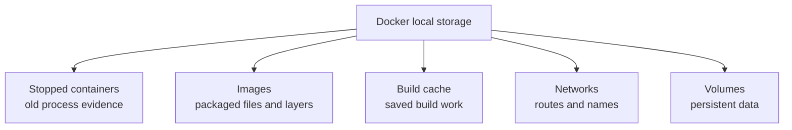

## Table of Contents

1. [What You Are Cleaning Up](#what-you-are-cleaning-up)
2. [Read Docker Disk Usage](#read-docker-disk-usage)
3. [Stopped Containers](#stopped-containers)
4. [Unused Images](#unused-images)
5. [Build Cache](#build-cache)
6. [Volumes and Real Data](#volumes-and-real-data)
7. [Compose Project Cleanup](#compose-project-cleanup)
8. [Filters, Labels, and Team Safety](#filters-labels-and-team-safety)
9. [A Safe Cleanup Routine](#a-safe-cleanup-routine)
10. [Putting It All Together](#putting-it-all-together)
11. [What's Next](#whats-next)

## What You Are Cleaning Up
<!-- section-summary: Docker cleanup works best when every byte has an owner: container history, image layers, build cache, networks, or volumes. -->

Docker cleanup means removing local Docker objects that your machine no longer needs. The first surprise is that Docker stores several kinds of objects, and each one tells a different story. A stopped container can hold logs from a failed run. An image can hold the exact files you used to start a service yesterday. Build cache can save minutes on the next build. A volume can hold a database.

Imagine a small team building a support-ticket app. The local stack has a Node API, a background worker, Postgres, and Redis. After a few weeks of rebuilding images, running migrations, testing branches, and switching Compose files, Docker Desktop reports that its disk image is almost full. The app still matters, the test data may still matter, and the failed containers may still have useful logs.

The cleanup job connects five ideas in order. **Disk usage** tells you where the space lives. **Stopped containers** hold old process evidence. **Images** hold reusable packaged files. **Build cache** holds saved build work. **Volumes** hold persistent service data. Once those pieces make sense, commands such as `docker system prune` become targeted tools instead of a risky panic button.

Here is the simple shape to keep in your head while we go:



That diagram matters because each object has a different cleanup risk. Removing a failed API container may only remove logs and the container writable layer. Removing an old image may only force Docker to rebuild or pull it later. Removing the Postgres volume may delete the database files your team used all week.

## Read Docker Disk Usage
<!-- section-summary: `docker system df` gives the first ownership report so cleanup choices target the right Docker object type. -->

The first useful command here is `docker system df`. It asks the Docker daemon how much local disk space Docker uses across images, containers, local volumes, and build cache. It gives you the map for the conversation, while your team still decides which data can disappear.

For the support-ticket app laptop, the first report might look like this:

```bash
docker system df
```

```
TYPE            TOTAL     ACTIVE    SIZE      RECLAIMABLE
Images          24        7         12.3GB    8.4GB (68%)
Containers      19        4         2.1GB     1.7GB (80%)
Local Volumes   9         4         18.6GB    6.2GB (33%)
Build Cache     72        0         7.9GB     7.9GB
```

The **TYPE** column gives the owner. The **SIZE** column tells you how large that owner is. The **RECLAIMABLE** column tells you how much Docker believes it can remove because current Docker objects do not actively reference it. Reclaimable space still needs human judgment, especially for volumes.

The **ACTIVE** column can surprise beginners. Active means Docker sees a current relationship, such as a container using an image or a container referencing a volume. Treat active as relationship metadata, separate from importance. A named database volume from last week's branch can show up as inactive after the containers disappear, even though a developer still cares about that data.

The verbose form gives names and relationships:

```bash
docker system df -v
```

That output can show which images have containers, which volumes have links, and how much shared image layer data Docker counts. Shared image layers explain why deleting one image may free less space than its displayed size. Docker images reuse layers, so one layer can belong to several tags.

After this report, the cleanup path has a first branch. Large stopped containers point to container cleanup. Large image numbers point to old images. Large build cache points to builder cleanup. Large volume numbers ask for care because data may live there.

## Stopped Containers
<!-- section-summary: Stopped containers hold old runtime evidence, and pruning them removes their writable layers and logs. -->

A **container** is the runtime object Docker creates from an image plus settings such as command, environment, ports, mounts, and network. A stopped container has finished running its process, and Docker can still keep its exit code, logs, name, configuration, and writable layer.

That writable layer needs a clear definition. Every container gets a thin writeable filesystem layer on top of the read-only image layers. If your API writes `/tmp/report.json` inside the container and that path is not a mounted volume or bind mount, the file lives in the container writable layer. Removing the container removes that file.

For the support-ticket app, stopped containers might come from failed API starts, one-off migration runs, and old branch experiments:

```bash
docker ps -a --filter "status=exited"
```

```
CONTAINER ID   IMAGE                         STATUS                      NAMES
a85f212a3b42   support-api:dev               Exited (1) 2 hours ago      support-api-migration
cb820c407d91   support-worker:dev            Exited (0) 3 days ago       support-worker-test
71e26c3b9b12   postgres:18                   Exited (0) 9 days ago       support-db-old
```

Those rows answer a useful question: "Does anyone still need this process history?" If the migration container failed and the logs still matter, keep it until the team reads them. If the worker test finished successfully three days ago and the result already lives in CI, that container can go.

A direct removal keeps the action small:

```bash
docker rm support-worker-test
```

For a wider cleanup, Docker has a targeted prune command:

```bash
docker container prune
```

`docker container prune` removes all stopped containers. Filters can make that safer for daily work. For example, a team can remove stopped containers created more than twenty-four hours ago and leave recent failures in place for debugging:

```bash
docker container prune --filter "until=24h"
```

This section connects to images because containers can keep images alive. If an old stopped container still references an image, Docker may treat that image as used. Removing the stopped container can make old images eligible for image cleanup.

## Unused Images
<!-- section-summary: Image cleanup removes packaged files and layers, which saves space but may require a future pull or rebuild. -->

An **image** is the packaged filesystem and default startup configuration for containers. It contains layers, metadata, and usually a tag such as `support-api:dev` or `postgres:18`. Docker can start many containers from the same image, and those containers can keep using their existing files even if you later remove another tag.

Images grow during normal work. Every rebuild of `support-api:dev` can create new layers. Every branch can produce a slightly different image. Some images lose their tag and become **dangling images**, which usually appear as `<none>`. Other images still have tags but have no containers using them.

The basic image list shows what your laptop has:

```bash
docker image ls
```

```
REPOSITORY        TAG       IMAGE ID       CREATED        SIZE
support-api       dev       1a2b3c4d5e6f   2 hours ago    840MB
support-api       old       8f7e6d5c4b3a   6 days ago     810MB
<none>            <none>    22cafe990011   7 days ago     790MB
postgres          18        963a7b245f11   3 weeks ago    451MB
```

Docker gives you two main image cleanup levels. The smaller one removes dangling images:

```bash
docker image prune
```

The broader one removes unused images, which means images without at least one container associated with them:

```bash
docker image prune -a
```

The `-a` flag deserves respect. If your team removes an unused `support-api:old` image, Docker can rebuild it from the Dockerfile or pull it from a registry later, as long as the source still exists. If the image came from an old experiment with no Dockerfile, no registry tag, and no backup, that image may have been the only copy.

Time filters help reduce risk during active development. A branch you built ten minutes ago can stay. Old images from last week can go:

```bash
docker image prune -a --filter "until=168h"
```

Images connect to build cache because a build can leave behind intermediate work that no tag shows. After image cleanup, the next report may still show a large build cache number. That cache has its own cleanup tool.

## Build Cache
<!-- section-summary: Build cache is saved build work, so pruning it usually costs time on the next build rather than deleting application data. -->

**Build cache** is Docker's saved work from previous builds. When a Dockerfile installs packages, copies dependency files, or compiles code, Docker can reuse previous layers if the inputs did not change. This reuse is why a second build can finish much faster than the first.

For the support-ticket API, the Dockerfile may copy `package.json`, run `npm ci`, copy the source, and run `npm run build`. If only one source file changes, Docker can often reuse the dependency install layer. If your machine deletes that cache, the next build can still succeed, but it may download packages and rebuild more work.

Build cache has a different risk profile from volumes. It usually represents time, bandwidth, and convenience rather than unique business data. That makes it a good cleanup target on developer machines and CI runners, especially after a project changes base images or dependency installation steps.

The targeted cache command is:

```bash
docker builder prune
```

The broader form removes all unused build cache, not just dangling cache records:

```bash
docker builder prune -a
```

For routine cleanup, the `--keep-storage` flag gives the builder a budget. This asks Docker to prune cache while trying to keep a chosen amount of cache storage:

```bash
docker builder prune --keep-storage 5GB
```

Build cache connects to volumes through a simple production habit. Teams often treat cache as replaceable and data as protected. A CI runner can prune builder cache aggressively after jobs. A developer laptop with a local Postgres volume needs a separate decision before any volume cleanup.

## Volumes and Real Data
<!-- section-summary: Volumes exist to outlive containers, so volume cleanup needs a data decision before any prune command runs. -->

A **Docker volume** is persistent storage managed by Docker. Containers mount it at a path, and Docker stores the contents on the Docker host. Volumes exist outside the lifecycle of a single container, so removing a container does not remove a named volume by default.

This is exactly why volumes are useful. In the support-ticket app, Postgres stores its database files in a volume named `support_pgdata`. The API container can disappear, the database container can restart, and the data can remain. That is the feature.

The same feature creates cleanup risk. A volume with no running container can still hold useful data. Maybe a developer stopped the stack before a weekend. Maybe a Compose project changed names and left the old volume behind. Maybe a migration test created a copy of production-like data for investigation.

The volume list is the first check:

```bash
docker volume ls
```

```
DRIVER    VOLUME NAME
local     support_pgdata
local     support_redisdata
local     7c1bdcc7a5b2f8b2cbe1a114a986a2b1f2a7
```

Named volumes usually reveal intent. Anonymous volumes use generated names and often come from container options that did not specify a stable volume name. Anonymous volumes still need review, and named volumes usually deserve more caution.

Inspection gives labels and mount metadata:

```bash
docker volume inspect support_pgdata
```

Before a risky cleanup, a small backup command can copy the volume contents into the current directory:

```bash
docker run --rm \
  -v support_pgdata:/from:ro \
  -v "$PWD":/backup \
  alpine \
  sh -c "tar -czf /backup/support_pgdata.tgz -C /from ."
```

That command mounts the database volume read-only at `/from`, mounts the current host directory at `/backup`, and creates a compressed archive. Database-specific backup tools still matter for clean database backups. This file archive gives you a last local copy before deleting a development volume.

The default volume prune command removes unused local anonymous volumes:

```bash
docker volume prune
```

Docker also supports a broader volume prune with `--all`, which can remove unused named volumes as well:

```bash
docker volume prune --all
```

That broader command belongs in a deliberate reset during a planned data wipe. Volumes lead naturally into Compose because Compose creates the containers, networks, and named volumes for a project. The cleanup decision often belongs to the whole project, not one object at a time.

## Compose Project Cleanup
<!-- section-summary: Compose cleanup removes project containers and networks by default, while image and volume removal require explicit flags. -->

**Docker Compose** manages a multi-container application from a Compose file. For the support-ticket app, Compose describes the API, worker, Postgres, Redis, project network, ports, environment variables, and volumes. Cleanup through Compose can remove the project objects together.

The everyday project cleanup command is:

```bash
docker compose down
```

Docker documents that `docker compose down` stops containers and removes the service containers and project networks by default. It can also remove volumes and images created by `up` when you add flags. This default matters because it lets a developer reset containers and networks without deleting named database volumes.

A project reset for containers and networks can use:

```bash
docker compose down --remove-orphans
```

`--remove-orphans` helps after the Compose file changed. If the old file had a `mailhog` service and the new file removed it, the old container can remain as an orphan. Removing orphans keeps the project directory from collecting containers for services that no longer exist in the current file.

Image cleanup through Compose has a separate flag:

```bash
docker compose down --rmi local
```

That removes images used by services when those images do not have a custom tag. Teams use this when a local Compose project builds throwaway images and the next `up --build` can recreate them.

Volume cleanup through Compose uses `-v` or `--volumes`:

```bash
docker compose down -v
```

That flag removes named volumes declared in the Compose file and anonymous volumes attached to containers. In the support-ticket app, that can delete `support_pgdata` if the Compose file declares it. This command is perfect for an intentional "fresh database from zero" reset. It is a bad surprise if someone wanted to keep local tickets, users, or migration test data.

Compose gives you a good habit: use project-level cleanup for project-level objects, and save the `-v` flag for the moments when the data reset is the point of the work.

## Filters, Labels, and Team Safety
<!-- section-summary: Filters and labels turn prune commands from broad cleanup into scoped maintenance that fits team workflows. -->

Prune commands can accept filters. A **filter** narrows which objects Docker considers for removal. The common shape is `key=value`, such as `until=24h` or `label=cleanup=true`. Docker's exact filter support differs by command, so the command reference matters before you automate anything.

Time filters fit developer laptops well. A team can keep recent failures available for debugging and remove older stopped containers:

```bash
docker container prune --filter "until=48h"
```

Labels fit shared workflows. A **label** is metadata attached to a Docker object, written as a key and optional value. Compose and Docker both use labels heavily for ownership metadata. Your team can also add labels to make cleanup intent explicit.

For one-off containers, a label can mark disposable work:

```bash
docker run --label cleanup=dev --name api-smoke-test support-api:dev npm test
```

Then the cleanup command can target that label:

```bash
docker container prune --filter "label=cleanup=dev"
```

Volumes deserve stronger habits. A team can name important volumes clearly, back them up before deletion, and label generated scratch volumes. Those habits make deletion deliberate and reviewable.

Automation should keep the narrowest useful scope. A CI runner can clean build cache after every job because the runner can recreate it. A shared staging host should use a written cleanup rule, backups, and owner labels. A developer laptop can keep a short routine that checks `docker system df`, prunes stopped containers, prunes old unused images, and leaves named volumes alone unless the developer chooses a data reset.

## A Safe Cleanup Routine
<!-- section-summary: A practical cleanup routine starts with evidence, removes low-risk objects first, and treats volume deletion as a separate reset. -->

Here is the routine I teach juniors on Docker-heavy projects. It works because it moves from low-risk cleanup to higher-risk cleanup, and it pauses before data deletion.

Step 1 captures the report before anything disappears:

```bash
docker system df
docker system df -v
```

Step 2 removes old stopped containers after recent debugging windows have passed:

```bash
docker container prune --filter "until=24h"
```

Step 3 removes old unused images that your team can rebuild or pull again:

```bash
docker image prune -a --filter "until=168h"
```

Step 4 trims build cache with a budget:

```bash
docker builder prune --keep-storage 5GB
```

Step 5 cleans the current Compose project without deleting volumes:

```bash
docker compose down --remove-orphans
```

Then, and only when the team wants a real data reset, use the volume path:

```bash
docker compose down -v
```

For a more careful local database reset, the team can back up first:

```bash
docker run --rm \
  -v support_pgdata:/from:ro \
  -v "$PWD":/backup \
  alpine \
  sh -c "tar -czf /backup/support_pgdata-before-reset.tgz -C /from ."

docker compose down -v
```

This routine also gives you a good incident response habit. If Docker reports a full disk during a production-like staging exercise, the team can check where the space lives before deleting. If build cache owns the bytes, prune cache. If stopped containers own the bytes, keep the last few failures and prune older ones. If volumes own the bytes, stop and name the data owner.

## Putting It All Together
<!-- section-summary: Safe Docker cleanup means matching each prune command to the object lifetime it removes. -->

The support-ticket app started with a full Docker disk image and a scary broad command. After reading Docker's object types, the cleanup decision is more precise.

| Object type | What it usually means | First command to inspect | Targeted cleanup |
|---|---|---|---|
| **Stopped containers** | Old process evidence, logs, exit codes, writable layers | `docker ps -a` | `docker container prune --filter "until=24h"` |
| **Images** | Packaged files and reusable layers | `docker image ls` | `docker image prune` or `docker image prune -a` |
| **Build cache** | Saved build work for future speed | `docker system df -v` | `docker builder prune --keep-storage 5GB` |
| **Networks** | Local routes and service names | `docker network ls` | `docker system prune` or `docker compose down` |
| **Volumes** | Persistent data, often databases or uploads | `docker volume ls` and `docker volume inspect` | `docker volume prune` or `docker compose down -v` after a data decision |

The safest rule is simple enough for daily work: **cleanup follows ownership**. Container history, image layers, build cache, networks, and volumes have different meanings. Docker gives prune commands for all of them, but the human job is choosing the right owner first.

Broad cleanup has a place. `docker system prune` removes unused containers, networks, dangling images, and build cache. `docker system prune -a` expands image cleanup to all unused images. `docker system prune --volumes` adds anonymous volumes. Those commands are useful after you know the stack can recreate what they remove.

The higher the chance that an object contains unique data, the slower the cleanup should be. Build cache can usually disappear. Old images can usually come back from a Dockerfile or registry. Stopped containers can hold useful failure evidence. Volumes can hold the thing your app was built to protect.

## What's Next

Cleanup teaches a useful Docker habit: find the owner before you act. The next article uses the same habit for failures. Instead of asking which object owns disk space, we will ask which Docker boundary owns a symptom: state, logs, image files, command, environment, network, storage, health, or Compose configuration.

---

**References**

- [docker system df](https://docs.docker.com/reference/cli/docker/system/df/) - Official Docker CLI reference for showing disk usage by Docker object type.
- [docker system prune](https://docs.docker.com/reference/cli/docker/system/prune/) - Official Docker CLI reference for removing unused containers, networks, images, build cache, and optional volumes.
- [docker container prune](https://docs.docker.com/reference/cli/docker/container/prune/) - Official Docker CLI reference for removing stopped containers and using prune filters.
- [docker image prune](https://docs.docker.com/reference/cli/docker/image/prune/) - Official Docker CLI reference for dangling image cleanup and broader unused image cleanup with `--all`.
- [docker builder prune](https://docs.docker.com/reference/cli/docker/builder/prune/) - Official Docker CLI reference for removing build cache and using `--keep-storage`.
- [Docker volumes](https://docs.docker.com/engine/storage/volumes/) - Official Docker storage guide covering volume lifecycle, named and anonymous volumes, persistence, and backup patterns.
- [docker volume prune](https://docs.docker.com/reference/cli/docker/volume/prune/) - Official Docker CLI reference for unused local volume cleanup and `--all`.
- [docker compose down](https://docs.docker.com/reference/cli/docker/compose/down/) - Official Docker Compose reference for removing project containers, networks, optional images, and optional volumes.
